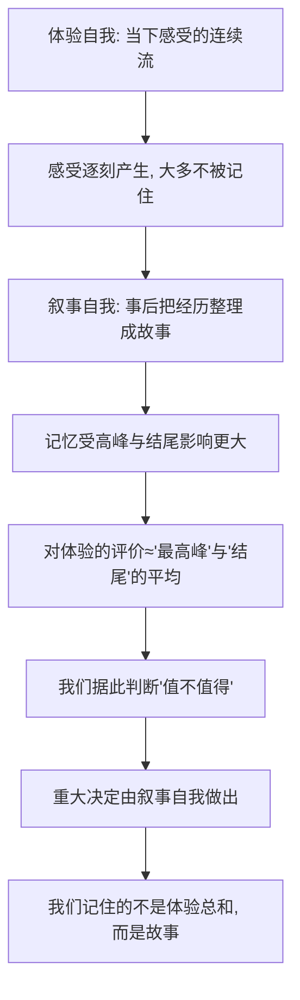

# 09｜你脑子里有几个“你”？

> 我们常说自己有一个统一的自我，可"自我"真的是一个整体吗？

---

## 一、先说结论

赫拉利给出的回答是：**不是。"自我"至少可以分成两个。**

一个是**体验自我**：它活在当下，负责此刻的痛、痒、饿、累、欢喜，是一段不断流动的感受。它不记忆，也不打算，只经历。

另一个是**叙事自我**：它不住在当下，而住在故事里。它把你的过去、现在和未来串成一条线，给这段经历起名字、定意义、下判断。

麻烦在于：**做重大决定时，往往是叙事自我在替我们做主。** 而它依据的并不是你一生体验的总和，而是一个被讲述出来的、有开头有高潮有结尾的故事。所以，我们记住的，常常不是我们真正经历的。

---

## 二、我们先理解一个问题

先问一个很朴素的问题：

> 你上一次旅行，到底"怎么样"？

你大概能立刻回答：挺好、一般、有点累、很值。这个回答来得很快，也很有底气。

但请再想细一点：你说的"挺好"，是在说**那几天里每一刻的平均感受**吗？还是说，你想起的是某一个画面、某一个瞬间，然后据此给出了结论？

这里藏着一个奇怪的事实：我们对自己人生的评价，几乎都不是对**体验总和**的结算，而是对**某几个片段**的复述。而我们通常没有察觉这个替换。

于是问题来了：如果负责评价的是"讲故事的那个我"，那么——**究竟是谁在过我的人生，又是谁在替我打分？**

---

## 三、作者到底提出了什么观点？

赫拉利在《未来简史》里，把现代生命科学关于"自我"的一个发现讲了出来：**"自我"不是一个单一的、统一的东西。**

他特别做了那个关键的区分：

- **体验自我**：由一连串当下的感受组成。它没有记忆，不会回顾，只在每一刻存在。严格说，它甚至不构成"一个人"，而更像一条感受的河流。
- **叙事自我**：它把时间串起来，把我做过的事、受过的苦、期待的未来，编织成一个连贯的故事。它负责回答"我是谁""我过得怎么样""这值不值得"。

赫拉利指出，这两者经常**不一致**，而我们对人生的判断，几乎总是由叙事自我做出的。

他还提到，脑科学的一些观察支持"自我并非单一中心"这个方向——比如左右脑在特定情况下会表现出各自处理信息、甚至各自"解释"行为的倾向；又比如，我们内部常常同时有互相冲突的欲望，谁也没能当上唯一的"我"。

结论是：**统一的自我，更像叙事自我的作品，而不是大脑的真实结构。**

---

## 四、把这个观点翻译成人话

可以把人想象成一家**只有一个人的公司**，但这个"人"其实分两班岗。

**体验自我是前台**。它负责实时接待：这一口咖啡烫不烫，这段路好不好走，今天下午烦不烦。它每一刻都在忙，但它**下班就忘**。它没有档案，没有总结，也不关心"这趟出差值不值"。

**叙事自我是宣传部**。它不上前台，但它掌管档案和对外口径。出差回来，它写一份报告："这次行程紧张但收获很大，尤其是第三天的那个傍晚，非常值得。"

问题就出在这里：**年终考核看的，是宣传部写的报告。**

于是，一段旅程可能大部分时间都在赶路、排队、跟人吵架，但只要有那么一两个高光时刻，叙事自我就会把它总结成"很棒的一次旅行"。反过来，一次整体还算顺利的行程，如果结尾出了岔子——丢了行李、航班取消——叙事自我可能就把它记成"简直糟透了"。

**不是体验变了，是故事的结尾变了。**

---

## 五、为什么会这样？

下面这条链，是赫拉利这个观点背后的心理学支撑。需要说明，"峰终定律"这类发现来自心理学研究，是对**记忆规律**的描述，不是对全部人生体验的概括。

关键在 **D → E** 这一步。

一些心理学研究发现，人对一段体验的**事后记忆**，对"最强烈的那个瞬间"和"结束时的感受"特别敏感，而对**持续时间的长短**相对不敏感。也就是说，一段长体验和一段短体验，只要高峰和结尾相似，人们给出的评价可能很接近。

这个规律如果成立，就意味着：**体验自我辛辛苦苦经历的每一秒，在记忆里被大幅压缩了。** 真正进入评价公式的，只是少数几个点。

这就是为什么赫拉利说，我们活在一个被叙事自我改写过的版本里。它不是故意骗人，它只是**按故事的逻辑工作**——故事需要高潮和结局，不需要平铺直叙的全部时间。

---

## 六、举一个现实生活中的例子

**一场旅行留下的记忆。**

假设你和朋友出去玩五天，行程大致是这样：

| 时间 | 真实体验 |
|---|---|
| 第一天 | 赶飞机，累，找酒店绕了很久 |
| 第二天 | 上午排队两小时，下午下雨，心情一般 |
| 第三天 | 傍晚看到一片特别好的景色，几个人在那儿聊了很久，很放松 |
| 第四天 | 逛市场，普通，买了点东西 |
| 第五天 | 回程，航班延误，半夜才到家，又困又烦 |

现在问自己：这趟旅行怎么样？

大多数人的答案不会是"五天里大概两天半是无聊或烦躁的"。答案更可能是：**"挺好的，就是最后一天太折腾。"**

请注意这句话的结构：它抓了一个**高峰**（第三天傍晚），抓了一个**结尾**（航班延误），然后给出了整体评价。第二天排队的两个小时、第四天平淡的下午，几乎没进入这个结论。

但如果真的按小时去算，你会发现**"挺好"这个词覆盖的时间，可能并不占多数**。是叙事自我把五天的流水账，剪成了一部三幕剧：铺垫、高潮、不完美的结局。看完这部电影，你得出"值不值"的结论。

这个例子最有意思的地方在于：**下次你愿不愿意再去旅行，取决于这部三幕剧，而不是那五天的实际感受。** 你被自己讲的故事说服了。

---

## 七、回到书中重新理解

现在回看赫拉利的论述，会明白他为什么把"自我"拆成两半。

他要说的其实是一件很反直觉的事：**我们最熟悉、最信任的那个"我"，是叙事自我。**

- 它让"我"显得连贯：昨天的我、今天的我、计划中的我，都是同一个人。
- 它让"意义"成为可能：只有被讲述，经历才变成故事，故事才有价值判断。
- 但它也让"我"变得**不太可靠**：因为它会给经历化妆、剪辑、加旁白。

赫拉利真正的锋芒在这里：如果做重大决定的是叙事自我，那"我想要什么"这个问题，回答的其实是一个**故事里的主角**，而不是那个经历了全部时刻的**体验流**。这两者可能想要完全不同的东西。

所以他说，痛苦和快乐属于体验自我，而**意义**属于叙事自我。我们对人生的规划、后悔、期待，几乎都是叙事的产物。

---

## 八、这个观点背后还有什么？

有几个隐含前提，值得单独拎出来。

**第一，它假定"体验自我"是一个可被谈论的东西。** 但麻烦在于，体验自我只在当下存在，没人能替它开口——你一旦开始评价它，就已经是叙事自我在说话了。所以严格说，"体验自我到底满不满意"这个问题，**几乎无法被直接回答**，只能被推断。

**第二，它把"分裂"当作常态，而非病态。** 我们通常认为"人格分裂"是心理异常。但赫拉利这里说的分裂，是**正常人**的结构：内心有互相冲突的欲望，有前后不一致的评价，这本身并不算病。

**第三，它有脑科学的影子，但主体是心理学。** 左右脑分工等现象，被用来说明"统一中心"未必存在；但主要的证据来自记忆与决策的心理学研究。这一点要分清楚，不要把不同层次的证据混成一句"科学家证明了人没有自我"。

**第四，它服务于全书的走向。** 只有先让"自我"不再是铁板一块，后面"算法可以比整体自我更懂某一部分的你""多个自我各有偏好，该听谁的"才说得通。这一篇是第三部分通向第四部分的关键一环。

---

## 九、这个观点有问题吗？

有问题。相关研究有影响，但边界和争议同样明显。

**第一，"峰终定律"类发现的适用范围有争议。** 一些研究提示高峰和结尾对记忆评价影响很大，但并非所有情境都如此。当体验中有强烈的负面事件、或体验本身很复杂时，规律可能变形；也有人质疑这类结论被通俗化传播后，被讲得过于绝对。关于这些研究该如何推广，学界存在不同意见。

**第二，从"记忆有偏差"推不出"体验自我才是真实的"。** 记忆会压缩、会改写，这不等于"经历本身"就是唯一的真相。一个人长期的生活质量、慢性痛苦、慢慢积累的满足感，很多恰恰要通过回顾才能被认识到。把叙事自我说得太低，可能会丢掉这些东西。

**第三，"两个自我"是一种方便的分层，不是精确的解剖。** 现实中的心理过程远比两分法复杂：可能有多个相互竞争的动机系统、多种时间尺度上的自我表征。把它整理成"几个你"，是好用的讲解模型，但要小心当成事实本身。

**第四，它对"意义"的处理偏工具化。** 赫拉利的语气容易让人以为"故事只是编出来的，所以不真实"。但一些哲学家和心理学家会反驳：**故事不是对体验的拙劣复述，它本身就是人组织生活、产生意义的方式。** 没有叙事，人根本没法形成长期目标。

**所以更准确的说法是**：赫拉利提出的是一个很有冲击力的视角——**统一的自我更像叙事作品；而我们做决定时依据的，是被讲述过的经历**；但"体验 vs 叙事"是一个启发性模型，相关心理学证据有边界，把它推到"自我是假象"是过头的。

---

## 十、今天再看这个观点

以下部分是基于赫拉利思想的现代延伸，不是作者原话。

赫拉利讲的是心理学层面的两个自我，而今天有一个更现实的分身：**你的"叙事自我"正在被平台外包。**

社交媒体本质上是一个"叙事自我"的加油站。它鼓励你挑选高峰、包装结局、发布一个更连贯更体面的版本。久而久之，你对自己人生的印象，可能越来越接近你在网上讲述的那个版本。

同时，算法也在替你做"叙事判断"。它根据你的行为数据推断"你会喜欢什么""你是什么样的人"，然后把这些判断推回给你。你的偏好被记录、被总结、被预测，而这一切**绕过了你对自己故事的自主讲述**。

于是那个老问题换了个面貌出现：当"我是谁"越来越由外部系统来叙述，"叙事自我"还是不是**你自己**的作品？这已经不只是心理学，而是每天发生的事。

---

## 十一、这一篇真正应该记住什么？

1. **赫拉利把"自我"分成体验自我和叙事自我。** 前者是当下感受的流动，后者负责事后讲述、整合故事、下判断。

2. **做重大决定的，往往是叙事自我。** 我们依据的不是体验的总和，而是被讲述出来的那个版本。

3. **记忆会偏爱高峰与结尾。** 一些心理学研究提示，我们对体验的评价，对最强烈瞬间和结束感受更敏感，对时长相对不敏感。

4. **这是启发模型，不是精确解剖。** 相关心理学发现存在争议和适用边界，不能简单推成"自我是假象"。

5. **意义本身就依赖叙事。** 故事不是对经历的拙劣复述，它也是人组织生活、形成长期目标的真实方式。

---

## 十二、留一个问题

> 如果对自己人生的判断，来自那个讲故事的"我"，
> 那么当算法也能替你讲述、甚至讲得更好时，
> "我的故事"和"我被讲述的故事"，还分得清吗？

---

**下一篇**：拆到这里，一个更大的问题浮了出来。我们把"聪明"和"有感受"当成一回事，但赫拉利说，这可能是现代思想里最容易被忽略的一点——一个系统可以极其智能，却完全没有意识。如果这两者真的能分开，那么"机器会不会有感受"这个问题，可能会被整个问错。

下一篇我们就来拆开这个问题——**智能和意识是两回事吗？**
