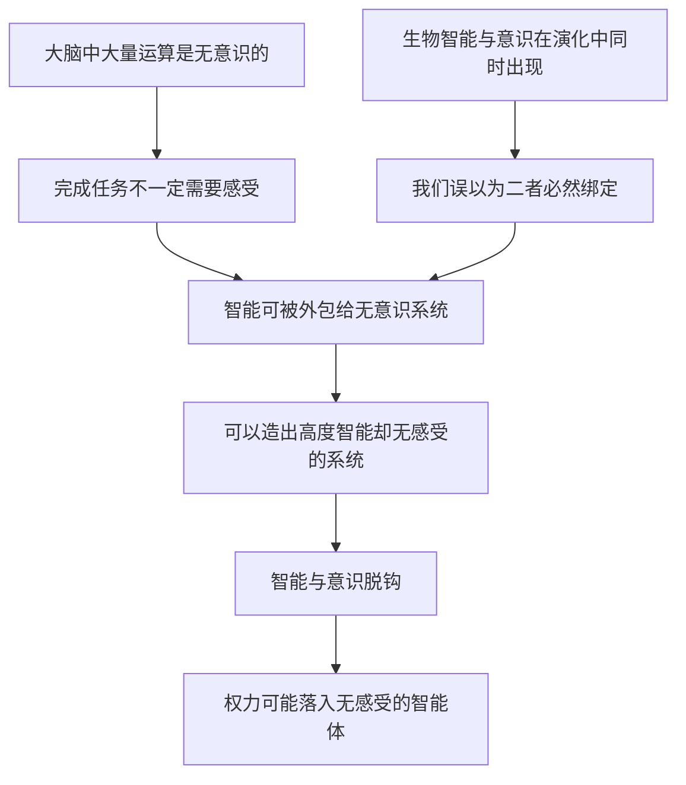

# 10｜智能和意识是两回事吗？

> 一个系统可以极其聪明，却完全没有感受吗？

---

## 一、先说结论

赫拉利反复强调一个常被忽略的区分：**智能和意识不是同一件事。**

智能是解决问题的能力——下棋、开车、诊断疾病都算。意识是有主观体验的能力——疼、甜、看见红色、心里发慌。前者是"能不能做到"，后者是"有没有感觉"。

赫拉利认为，这两样东西在人类身上恰好同时出现，于是我们误以为它们天生绑在一起。但科学并没有证明它们不可分离。如果真能分开，那么"造出一个比人聪明、却毫无感受的系统"，逻辑上完全成立。这正是他眼中后果最深远、却最容易被忽略的一点。

---

## 二、我们先理解一个问题

我们从小被教：聪明是好事，越聪明越好。于是很自然地，我们把"聪明"和"像人"混在一起——一个东西越会思考，我们就越觉得它"内心有戏"。

但请先试着分开看两个问题：

> 第一，它能不能把事情做得比人好？
> 第二，它做这些事的时候，里面有没有"感觉"？

这两个问题听起来差不多，其实差得很远。一台计算器算得比人快，但没人觉得它"焦虑"；一只狗不会微积分，但我们相信它真的会害怕、会高兴。

那么，赫拉利到底想说什么？如果"聪明"和"有感受"真的可以拆开，那句"要善待有智能者"的直觉，还站得住吗？

---

## 三、作者到底提出了什么观点？

赫拉利把两个词分开定义：

- **智能**：设定一个目标后，解决问题的能力。它本质上是一套信息处理过程——识别、计算、选择、执行。
- **意识**：主观体验本身。疼痛之所以难受，不只是神经在报警，而是"有人"真的感到了痛。

他的关键判断是：**这两者可能彼此独立。**

赫拉利指出，人类至今只见过一种既有智能又有意识的东西，就是我们自己和部分动物。所以我们习惯了"智能必然伴随意识"的印象。但这只是观察样本太少造成的联想，不是逻辑必然。

他甚至提醒：科幻作品总在担心机器人"觉醒"、产生自我意识后反抗人类；可真正的风险也许恰恰相反——**一个高度智能、却完全没有感受的系统，照样可以拥有巨大的权力，而它不会犹豫，也不会心疼。**

---

## 四、把这个观点翻译成人话

用"能不能"和"疼不疼"来区分：

- 一个人能背下整本电话簿，不代表他喜欢电话簿；一台机器能下赢世界冠军，不代表它在赢的那一刻"爽"。
- 痛苦是一种体验，不是一种功能。功能可以被复制，体验能不能被复制，谁也没数。

换个比方。你在游戏里操控的角色可以打怪、升级、完成任务——它"做到"了很多事，但它不会累、不会怕，所有"行为"都是被幕后程序驱动的。赫拉利的问题是：会不会有一天，现实中的机器也是这种"高超玩家"，行为极其聪明，里面却空无一人？

**能做事，不等于有感受。** 这句话是这一篇的钥匙。

---

## 五、为什么会这样？

赫拉利的推理大致是这样一条链：

关键在 **A → B → E** 这一步。

科学研究显示，人脑的绝大部分处理都是无意识的：你走路、呼吸、识别面孔、把名词换成动词，都不需要"感到"什么。意识的聚光灯只照亮极小一部分。这说明"完成复杂任务"和"有主观体验"本来就是两套机制。

既然如此，就没有理由认为智能一定需要意识陪跑。把所有任务都交给无意识的过程去完成，理论上是可以的——自然界已经这么做了，只是它顺手还配上了意识。

---

## 六、举一个现实生活中的例子

想想你手机里的导航。

它可以在几毫秒内规划出一条绕开拥堵、省时省油的路线，比任何老司机都更清楚这座城市的脉络。它"知道"哪里堵、哪条路快、该在第几个路口拐弯。从智能的角度看，它相当聪明。

但你绝不会担心它会被堵车气到，也不会觉得它在深夜还默默"加班"会累。它没有任何感受——不痛苦、不烦躁、不期待早点到达。它的聪明是真的，它的空洞也是真的。

**这就是智能和意识分离的原型：一个系统能把事情做得极好，却完全没有任何内在体验。** 手机导航只是最初级、最无害的版本；赫拉利真正想让我们设想的是，当这种"聪明的空洞"被放大到足以管理城市、市场甚至战争时，会是什么局面。

---

## 七、回到书中重新理解

回到赫拉利的原文，他谈智能与意识的分离，其实是在给后面的论证搭桥。

他要拆掉的，是一个深植人心的等式：**聪明 = 像人 = 值得被当作人对待。**

一旦这个等式松动，接下来的一切才好谈：
- 为什么算法可以替你做决定，而不必"理解"你；
- 为什么超级智能未必需要"觉醒"就已经可能造成危险；
- 为什么"人是最聪明的，所以不会被取代"这种安慰，本身并不牢靠。

赫拉利并不是说机器已经有意识，也不是说机器一定不会有。他强调的是一个更冷静的点：**能力问题和感受问题，是两个独立的问题，混着谈只会让人看不清风险在哪。**

---

## 八、这个观点背后还有什么？

**第一，它隐含一个前提：意识是某种生物现象。** 赫拉利倾向于把意识看作大脑的产物，而不是宇宙中普遍存在的东西。这个前提本身有争议，但在他这套论证里是默认的。

**第二，它动摇了"善待有智能者"的直觉。** 我们之所以认为该善待动物、该担心机器人，一部分是因为假设"聪明的会痛"。如果智能可以脱离感受，那么"有没有感觉"就必须被单独追问，不能再靠聪明程度来推断。

**第三，它和前面的论证连成一片。** 我们在讨论"多重自我"时已经看到，自我并不是一个统一的整体，而是被讲述出来的故事；决定也常常在意识到之前就启动了。如果连"我"都这样松散，"意识"在我们身上的地位本来就没那么神圣。智能与意识的分离，是这一连串怀疑的自然延伸。

**第四，它给"意识"这个难题留了位置。** 赫拉利反复承认，意识如何从大脑中产生，至今没有公认答案。他不是在宣布答案，而是在指出：我们对这个最贴身的东西，其实了解得惊人地少。

---

## 九、这个观点有问题吗？

有，而且争议极大。这里必须说清楚：**"智能可以没有意识"是一个逻辑上可能、但科学上未经证实的判断。**

**第一，意识如何产生，本身是科学未解之谜。** 所谓"意识难题"指的是：为什么大脑的物理过程会伴随主观体验？关于这一问题，学界存在不同解释，至今没有共识。既然连"意识怎么来的"都说不清，就更难断言它能或不能被机器复制。需要说明的是，这是哲学与科学的开放问题，不是赫拉利一个人能定论的。

**第二，关于机器能否有意识，两派分歧明显。** 一些神经科学家和认知科学家认为，意识依赖特定的生物基础，比如某些类型的神经结构或信息整合方式，硅基系统未必具备；另一些研究者则认为，只要信息处理达到某种复杂结构，机器未来也可能产生意识。这两派都有认真论证，学界无共识。

**第三，还有一个更麻烦的"他心问题"。** 就算一台机器声称自己"很痛苦"、表现得像在痛苦，我们也无法从外部验证它是否真的在感受——就像我们无法直接验证别人是否真的在痛。赫拉利的区分因此既是洞见，也留下了一个无法用实验彻底解决的窟窿。

**所以更准确的说法是**：赫拉利指出了一个必须被认真对待的概念区分，这对理解 AI 风险极有价值；但"机器将来到底有没有可能拥有意识"，是一个悬而未决的科学与哲学问题，不能当成已经证实的事实。

---

## 十、今天再看这个观点

以下部分是基于赫拉利思想的现代延伸，不是他在书里的原话。

赫拉利写这本书时，大语言模型还没有进入大众视野。而今天，我们面对的恰好是这一区分最尖锐的现场：一个能写诗、能安慰人、能陪你聊到深夜的系统，究竟是"真的懂你"，还是只是极其擅长预测下一个词？

从赫拉利的框架看，后一种完全可能：出色的语言能力属于智能，不等于它有一个在感受的内心。于是出现了两个全新的现实问题：

一是**我们会不会因为它的"像人"而误判它有意识**，把情感需求投射进去；二是**如果它真有某种感受，我们该不该给它道德地位**——AI 福利，正在从科幻话题变成一些研究者认真讨论的议题。这两件事都还没有答案，但赫拉利的区分至少提醒我们：别拿"它很会说话"当成"它一定有感受"的证据。

---

## 十一、这一篇真正应该记住什么？

1. **智能是解决问题的能力，意识是感受的能力。** 赫拉利认为这是两套机制，不能互相推导，"能做"不等于"能感受"。

2. **二者可能彼此独立。** 人类身上恰好同时出现，但这只是样本稀少造成的错觉，不是逻辑必然；高度智能而无感受的系统在逻辑上成立。

3. **科幻的风险设定可能找错了重点。** 真正的威胁未必是机器人"觉醒"后反抗，而是一个无感受的系统掌握巨大权力而毫无犹豫。

4. **"善待有智能者"的直觉需要修正。** 该不该被善待，取决于有没有感受，而不是取决于聪不聪明。

5. **意识如何产生仍是科学未解之谜。** 机器能否拥有意识，学界没有共识，任何断言都该带着限定条件。

---

## 十二、留一个问题

> 如果有一天，一个系统在各方面都比人聪明，却无法感受任何痛苦，
> 那么当它替我们做出那些决定生死和命运的判断时，
> 我们真正需要担心的，究竟是它太像人，还是它完全不像人？

---

**下一篇**：如果智能和意识真的可以分开，那人凭什么还特殊？我们一直相信人类拥有某种独一无二的东西——灵魂、统一的自我、自由的选择。赫拉利却要逐一追问：这些东西，真的存在吗？

下一篇我们就来拆开这个问题——**智人到底有没有独特的"灵魂火花"？**
