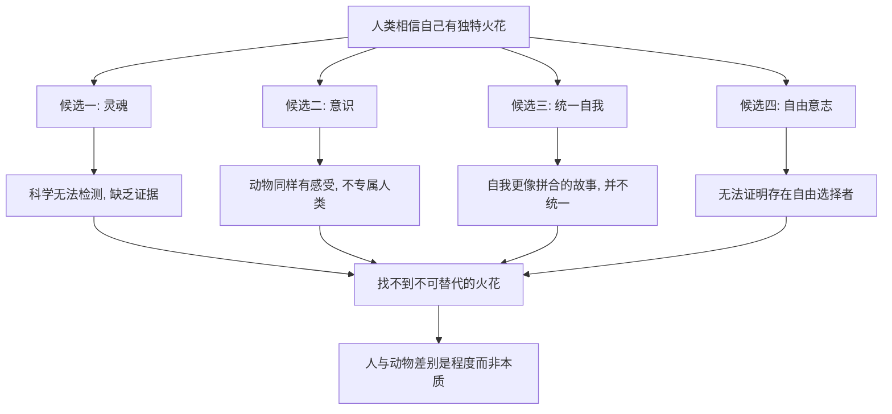

# 11｜智人到底有没有独特的“灵魂火花”？

> 人类一直相信自己是万物之灵，有什么独特的东西，这个信念还成立吗？

---

## 一、先说结论

赫拉利的答案偏冷：他逐一检视"让我们特殊"的几个候选者——灵魂、意识的统一性、自由意志——发现没有一个能提供科学上不可替代的"神圣火花"。

他认为，人与动物的差别更像是一个程度问题，而不是本质问题。人类确实在很多方面远远走在前面，但"远远领先"和"本质不同"是两回事。相差多少是量的问题，是否属于同一个类别才是质的问题。

这个判断让人不舒服，却为后面那些更刺耳的推论埋下伏笔：如果人并没有什么独一无二的内核，那么"人能不能被算法替代"就不再是一个天然有答案的问题。

---

## 二、我们先理解一个问题

人类几乎每一种文化都相信：人是特别的。有人说是神按自己的样子造了我们；有人说我们独有理性、道德、语言、灵魂。这套信念撑起了"人的尊严"和"人权"——因为人人身上都有某种神圣的东西，所以不能被随意对待。

问题在于：如果把这些"特殊之处"一条条拿去做检验，会发生什么？

我们凭什么如此确信，自己不是"聪明一点的动物"而已？是真找到了那道本质的鸿沟，还是只是不愿意往下看？

---

## 三、作者到底提出了什么观点？

赫拉利在书中讨论"人类的火花"（the human spark）。他说，人们普遍相信人身上有一种动物完全没有的独特本质，正是这道鸿沟把人和其他生命分开。

然后他开始逐一拆解那些常见的候选者：

- **灵魂**：科学至今没有发现灵魂存在的证据，也没有办法检测它。它更像一个信仰概念，而不是一个可验证的实体。
- **意识或主观体验**：动物同样有感受。疼痛、恐惧、亲密，并不专属于人类，所以它不能充当"人独有"的凭证。
- **统一而连续的自我**：我们在讨论多重自我时已经看到，自我更像事后拼合出来的故事，并不真的统一，也难以充当那个稳定的内核。
- **自由意志**：科学同样难以证明，存在一个不受因果决定的自由选择者。

把这些候选者一个个划掉之后，赫拉利的结论是：**没有找到那个火花。** 人不是从动物界突然"跃升"出来的另一种存在，而是沿着同一条演化道路走得更远的那一支。

---

## 四、把这个观点翻译成人话

我们习惯用"只有人才会……"来给自己定位：只有人才会使用工具、有感情、讲道德、懂死亡。但这张清单其实一直在缩水。

- 使用工具：乌鸦、黑猩猩都会；
- 有情绪：哺乳动物普遍有；
- 有社会规则与互助：许多群居动物都有；
- 有某种自我意识：部分灵长类和大象、海豚也表现出类似迹象。

这不是说人和动物没差别，而是说差别往往表现为"程度"和"组合方式"，而不是一道非黑即白的边界。人像是把很多能力都调到了高配，还额外叠加了语言和文化，于是看起来像另一个物种；但拆开每一项，都能在动物身上找到雏形。

**把"高出一大截"误读成"本质不同"，这是赫拉利想让我们警惕的那个思维习惯。**

---

## 五、为什么会这样？

他的推理可以画成这样：

关键在最后一步 **J → K**。

要注意，赫拉利并不是先有结论、再去拆证据。他的顺序是反过来的：科学先一点点揭示了意识的生物机制、自我建构的过程、决策的神经基础，然后人们才发现，原来那些"只有人才有"的东西，很多都能在别处找到影子。**火花不是被人主动否认的，而是在解释力不断扩大的过程中，慢慢失去了立足之地。**

---

## 六、举一个现实生活中的例子

看看养宠物这件事。养狗的人几乎都相信，自己家的狗有情绪：主人回家时它兴奋得转圈，被大声呵斥时它会缩到角落，雷雨天它会害怕发抖，生病时它会没精神。它显然会痛、会快乐、会有依赖和恐惧。

于是问题就变得很具体了：**如果狗真的会痛、会快乐，那人的特别之处到底在哪里？**

常见的回答是"只有人会思考死亡""只有人有道德""只有人有语言"。可这些回答要么在动物身上也能找到雏形，要么依赖一个无法验证的东西——比如"只有人才有灵魂"。而一旦你接受了"狗真的有感受"这个日常事实，人与动物之间那道号称绝对的界线，就已经不再那么绝对了。赫拉利想指出的正是这一点：我们并不需要一个"神圣火花"才能承认动物和人的相似，但我们也很难再靠这个火花来宣布人独一无二。

---

## 七、回到书中重新理解

回到书里，"人类的火花"这一讨论的作用，其实是为更后面的问题清场。

只要人们相信"人身上有某种不可替代的东西"，那么无论技术多强，都有一句现成的安慰：机器再厉害，也不可能有那个东西，所以人永远有存在的独特价值。

赫拉利把这句话的保险栓拆掉了。他要说的是：**在"有没有某种神圣本质"这个问题上，科学给不出支持人类独特的证据。** 所以，人类真正的价值，不能靠"天生特殊"来保证，而要靠别的方式——制度、文化、伦理、选择——去主动争取。

这也解释了《未来简史》为什么从讨论自我和意识，一路走向讨论算法和"无用阶级"：如果人没有什么不可替代的内核，那么"人是否被需要"就变成了一个纯粹的现实问题，而不是一个自动成立的权利。

---

## 八、这个观点背后还有什么？

**第一，它有一个方法论前提：能被科学检验的，才叫科学证据。** 灵魂、神圣火花这类概念，恰恰无法被检验。赫拉利据此说"没有证据"，这是科学内部的合理立场，但它不自动等于"不存在"。

**第二，它暴露了"人的尊严"对实证的依赖。** 如果尊严建立在"人有一个神圣内核"上，那么这个信念一旦被科学削弱，尊严本身就会摇晃。这是一个很大的哲学风险。

**第三，它和前面的论证形成合围。** 自由意志、统一自我、智能与意识，这三篇讨论最终都指向同一个结论：人身上并没有一个稳固、独特、不可替代的中心。

**第四，它留下了动物伦理这扇门。** 如果人与动物是连续谱，那么人类对动物的态度就理应被重新审视。赫拉利本人也多次强调，工业化养殖是这个连续性结论最尴尬的现实注脚。

---

## 九、这个观点有问题吗？

有。赫拉利的结论在科学内部有支持，但在哲学和伦理上远非定论。

**第一，宗教和许多哲学家坚持人的独特尊严。** 他们不一定主张"灵魂"能被科学检测，而是认为人的道德地位是一个规范问题，不是事实问题。康德传统强调，人是道德主体、能为自己立法，因此应被当作目的而非手段——这套论证并不依赖神经科学是否找到"火花"。关于人的独特性，学界与思想界存在不同解释。

**第二，"无法用科学证明"不等于"不该作为伦理基础"。** 人权、尊严、平等这些概念，本身也不是科学实验的产物，而是人类共同作出的价值承诺。即便它们不能实证，也可能作为社会伦理的基石继续成立。

**第三，有一些生物学家和认知科学家强调，人类确实存在"飞跃"。** 累积性文化、复杂的递归语言、大规模陌生人协作，这些能力的组合在其他动物身上难以见到。他们承认这是连续谱上的领先，但也认为这种领先足以造成质的差异。所以"程度 vs 本质"的争论本身，就没有一边倒的答案。

**第四，赫拉利的表述带有倾向性。** 他把"找不到证据"讲得像是"已经证明没有"，这在修辞上很有力，但在严谨性上会被批评为把"证据不足"当成了"结论成立"。

**所以更准确的说法是**：赫拉利成功拆掉了"用科学证据证明人类特殊"这条路，但"人类是否拥有独特尊严"是一个价值与哲学问题，科学既不能完全证实，也不能完全否定。

---

## 十、今天再看这个观点

以下部分是基于赫拉利思想的现代延伸，不是他在书里的原话。

赫拉利写的是人与动物的连续谱，而这套思路今天正被延伸到两个新战场。

一是**动物意识与动物福利**。近年来，一些研究者开始认真讨论哪些动物可能拥有主观体验，相关立法也开始把"动物是有感受的生命"写进条文。这背后正是赫拉利的逻辑：如果界限是程度问题，那么按界线一刀切地对待生命，就未必合理。

二是**机器的道德地位**。如果"火花"不是人类独有，那么凭什么它一定不会出现在别的东西身上？这就把前面智能与意识的问题，逼到了伦理层面：一个系统如果能感受，它算不算道德共同体的一员？这些问题今天还没有答案，但它们之所以会被问出来，恰恰是因为"人类天然特殊"这个前提已经不再稳固。

---

## 十一、这一篇真正应该记住什么？

1. **赫拉利找不到"人类的火花"。** 他逐一检视灵魂、意识、统一自我、自由意志，发现没有一个能证明人是本质独特的。

2. **人与动物的差别更像程度而非本质。** 很多"只有人才会"的能力，在动物身上都能找到雏形，差别常表现为高低和组合。

3. **这不是说人要自轻，而是说独特不是天生的。** 人的价值如果建立在"神圣内核"上会很脆弱，需要靠制度、文化和选择去维系。

4. **科学能推翻"用证据证明特殊"，但不能裁决"尊严是否成立"。** 后者是价值问题，不是实验问题。

5. **这条连续性结论直接通向动物伦理与机器伦理。** 如果界限模糊，那么该被如何对待，就成了必须重新讨论的现实问题。

---

## 十二、留一个问题

> 如果人类并不拥有一个神圣而不可替代的内核，
> 那么我们对彼此、对动物、对未来的机器所负的责任，
> 究竟是因为对方"特殊"，还是因为我们自己选择去承担？

---

**下一篇**：如果人的"火花"站不住脚，那么一个不依赖火花、只依赖数据的东西，为什么可能比人更了解人自己？赫拉利说，答案藏在算法对行为数据的掌握里。

下一篇我们就来拆开这个问题——**算法为什么可能比你自己更了解你？**
