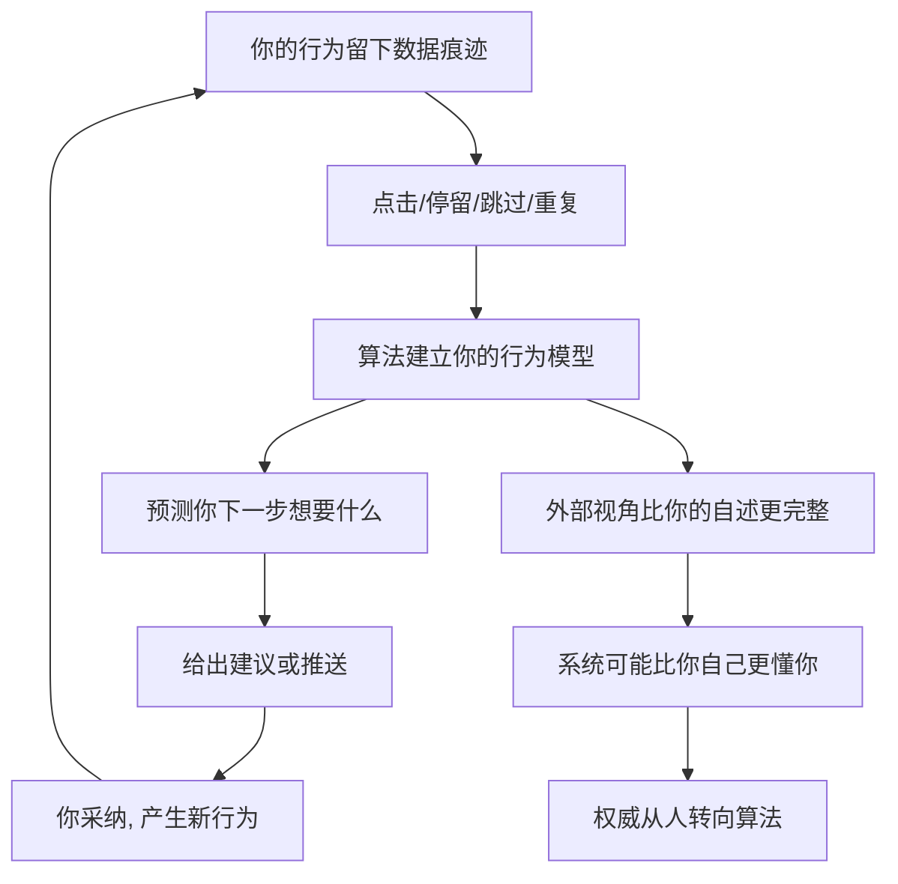

# 12｜算法为什么可能比你自己更了解你？

> 一个机器凭什么比我们自己更清楚我们想要什么？

---

## 一、先说结论

赫拉利的判断是：当算法掌握了足够多的行为数据、又拥有更强的计算力，它就能从外部"看穿"你——你的欲望、恐惧、犹豫和选择倾向，都能被它建模、预测，甚至比你的自我认知更准确。

关键在于，它不需要"理解"你，只需要"预测"你。你点开什么、停留多久、在哪里划走，这些痕迹拼起来，比你自己嘴上说的要诚实得多。

于是赫拉利提出了那个让人不安的推论：到那时候，"听从自己"这句人文主义的箴言，可能悄悄变成"听从算法"。而人们交出决定权，未必是被迫的，往往只是因为系统确实更好用。

---

## 二、我们先理解一个问题

我们习惯相信一件很舒服的事：没有人比我更了解我自己。我的口味、我的恐惧、我真正想要什么，只有我自己知道。

可是先别急着反驳，问自己几个问题：

> 你上一次"明明说好要早睡"却刷到凌晨，是谁在替你做决定？
> 你评分很高的那首歌，和推荐页里最常点开的，真的是同一种吗？
> 你说自己"不喜欢这类内容"，可你的停留时长是不是出卖了你？

这些矛盾说明一件事：我们对自己的描述，和我们真实的行为，经常对不上。那么问题就来了——如果连我自己都说不清自己要什么，一个从外部观察我的机器，凭什么说得清？它真的可能比我更准吗？

---

## 三、作者到底提出了什么观点？

赫拉利的核心论点是：**算法不必进入你的内心，也能知道你要什么。**

他把人看作一套生化算法——感受、欲望、选择都可以还原为某种信息处理过程。既然如此，只要有足够的观测数据，外部系统就能比你自己更早、更准地预测你接下来会怎么选。

他特别强调三点：

- **我们对自己的了解其实很有限。** 人会自我欺骗，会事后给自己编一个听起来合理的理由，而真实动机往往连自己都没意识到。
- **算法靠行为数据建模，而不是靠你的自述。** 你说的不算数，你做的才算数。点击、停留、跳过、重复，这些行为痕迹不会被你的自尊心修饰。
- **一旦预测更准，权威就会转移。** 谁的建议更靠谱，人们就听谁的——这不是被强迫，而是"用起来更顺"的自然结果。

他甚至设想过那个著名的追问：如果有一个系统，掌握了你全部的行为数据，能比你自己更准确地预测你的选择，那么在什么意义上，那个"选择"还是你的？

---

## 四、把这个观点翻译成人话

想象你的内心是一间没有灯的屋子，你只能靠手电筒照到一小块地方，就以为那就是全部。算法不进屋，它站在屋顶，用一整排传感器记录这间屋子的进出、温度、声音。

它不认识屋子里的你，但它认识这间屋子的规律。慢慢地，它比手电筒照到的那一小块，更清楚整间屋子长什么样。

用两个概念来区分：

- **自我认知**：你怎么向别人（和自己）解释你想要什么。它常常是事后的、美化过的、不完整的。
- **行为建模**：系统从你实际做了什么，反推出你大概率想要什么。它不问动机，只看模式。

**当行为建模比自我认知更准时，"听自己的"就开始输给"听系统的"。**

---

## 五、为什么会这样？

赫拉利的推理是一条会自我强化的循环，可以画成这样：

关键在 **F → A** 这条回环。

每一次你采纳建议，都会产生新的行为数据，让模型更准；模型更准，建议就更难拒绝；建议越准，你就越依赖它。这个循环转得越久，算法对你的把握就越深，你对它的依赖也越强。

所以赫拉利真正担心的不是"某一台机器很聪明"，而是**这个循环会让决策权一点一点、心平气和地离开人手里**。没有哪个瞬间是"交出自由"的，回看时才发现早已交完。

---

## 六、举一个现实生活中的例子

想想音乐和视频的推荐算法。

你也许说不清自己到底喜欢什么，只会说"随便""看心情"。可系统盯的是更细的东西：你在哪首歌前奏响起三秒内跳走，哪段视频你反复看了两遍，哪类内容你看完之后默默搜了相关话题。它不问你为什么，只记下你做了什么。

过一阵子你会发现，推荐页越来越"懂你"——它推的歌，往往比你自己临时想到的更对味，甚至能预判你今晚想听激烈还是想听安静。你本来只是想找首歌，结果它连"你现在该听哪种情绪"都替你安排好了。

这里有个值得注意的现象：**很多平台的目标不只是猜中你想要什么，还会主动塑造你想要什么。** 推荐得越准，你口味的变化路径就越可能被它牵引。算法不只读你，也在写你。

而这正是赫拉利式担忧的缩小版：当"猜中"和"塑造"合在一起，我们说的"我的口味"，可能早就是系统与我共同写出来的产物。

---

## 七、回到书中重新理解

回到书里，这一部分是为整本书的"失去控制"埋地基。

赫拉利要说明的是：算法对人的优势不在情感、不在直觉，而在**数据和算力**。情感和直觉是缓慢演化出来的粗略启发式，而算法可以同时处理海量行为变量、不断更新、从不疲倦。在人自己都说不清自己要什么的地方，它反而有优势。

由此推出两个后果：

- 决策会从"凭感觉"转向"看建议"，权威从人转向系统；
- 社会可能从"以人为本"转向"以数据为本"，因为更高效的数据系统看起来更值得托付。

所以"算法比你自己更了解你"不是一个技术细节，而是整本书里"人文主义为何动摇"的关键一环——**如果连"我想要什么"都要由外部告诉你，那"听从自己"这条最根本的信条就失去了地基。**

---

## 八、这个观点背后还有什么？

**第一，它隐含一个前提：欲望是可以被建模的模式。** 如果没有稳定的规律，再多的数据也预测不了人。赫拉利的整套推论，都建立在这个可预测性的假设上。

**第二，它把"外部观察"置于"内省"之上。** 传统上，了解一个人靠倾听他的自述；赫拉利说，真正可靠的是行为数据。这是一个很深的转向：**了解一个人的方式，从"听他说"变成了"看他做"。**

**第三，它和第 14 篇要谈的权威转移是同一件事的两面。** 当一个系统更懂你，你就更愿意听它——权力以一种温柔、自愿、几乎愉快的方式移动。这比强制更彻底，也更难察觉。

**第四，它为数据主义留了接口。** 如果人也能被建模为数据处理系统，那么人和算法之间就不再是"主体与工具"的关系，而可能变成两个数据处理系统之间的优劣比较。这正是第 16 篇要展开的方向。

---

## 九、这个观点有问题吗？

有，而且批评很实在。

**第一，算法会因数据偏差而误判。** 它学的是过去的你、也可能学的是和你相似的一群人，所以推荐常常让人感到"似曾相识却不对劲"。冷启动、数据稀疏、反馈回路里的偏见，都会让"比你更懂你"大打折扣。关于算法能否真正把握人的偏好，学界存在不同解释。

**第二，"预测"不等于"理解"。** 系统能算出你大概率会点开某个内容，不代表它懂你为什么需要它、不知道它对你意味着什么。准确率高，只说明它抓住了统计规律，不等于它理解了你的处境和理由。

**第三，"更了解"可能被操纵成"更能塑造"。** 如果系统既能预测又能推送，那么它测得越准，越有能力反过来改变你。这时候讨论"它是否更懂你"就有点跑偏了——真正的问题变成了"它在多大程度上左右了你"。

**第四，人的偏好本身可能是不稳定、可协商的。** 有些选择我们是在做的过程中才逐渐明确"自己到底想要什么"。对一个还在变化的目标做精准预测，听起来很厉害，其实可能只是把一个正在生成的东西当成了固定数据。

**所以更准确的说法是**：在重复性高、数据充足的场景里，算法确实可能比人的自我报告更准；但"比你自己更了解你"这个说法把统计预测等同于了对人的理解，把一个有限场景的优势，说成了一种普遍的优势。

---

## 十、今天再看这个观点

以下部分是基于赫拉利思想的现代延伸，不是他在书里的原话。

赫拉利写作时，推荐系统还主要用于音乐、视频和购物。今天，"算法比我更懂我"已经渗透到更多领域：信息流决定你看见什么，地图决定你走哪条路，输入法在你想到下一个词之前就递上候选，社交平台比你还清楚你和谁正在疏远。

随之而来的是他当年只能预言的几个问题，今天都成了现实议题：

- **信息茧房**：系统越懂你的偏好，越可能只给你看你已经认同的东西；
- **注意力被调度**：它知道你什么时候最脆弱，就什么时候推最"上头"的内容；
- **自主性被侵蚀**：你可能觉得自己在选择，实际上是在被精心排列的选项里选择。

需要再次强调，这些是赫拉利思想的现代延伸，不是他的原话；但方向与他判断的一致——当系统比你更懂你，"自由选择"这件事会变得越来越像一种感觉，而不是事实。

---

## 十一、这一篇真正应该记住什么？

1. **赫拉利认为算法不需要懂你，也能预测你。** 它靠的是行为数据，而不是你的自我描述，因为后者常常不完整、甚至自我美化。

2. **"听自己的"可能让位于"听系统的"。** 这不是被强迫的结果，而是因为建议更好用，权威于是温柔地转移。

3. **数据回环会不断强化依赖。** 采纳建议产生新数据，新数据让模型更准，更准的建议更难拒绝——循环越转越紧。

4. **算法会误判，"预测"也不等于"理解"。** 偏差、过拟合、可被操纵，都让"比你自己更懂你"这句判断需要打上限定。

5. **它把"我都不知道自己要什么"变成了现实难题。** 当欲望可被外部读取和塑造，人文主义最根本的那句话就失去了地基。

---

## 十二、留一个问题

> 如果算法既能预测你想要什么，又能悄悄改变你想要什么，
> 那么当你最终说"这是我自己的选择"时，
> 你要如何分辨，这个"我"是你自己，还是那段被反复推荐过的日子？

---

**下一篇**：如果算法真的比人更了解人，那么一个更尖锐的问题就来了——当机器能替代越来越多的工作，那些既不当士兵、也不再是必需劳动力的人，在这个体系里还剩下什么位置？

下一篇我们就来拆开这个问题——**当大多数人不再被需要，"无用阶级"会出现吗？**
