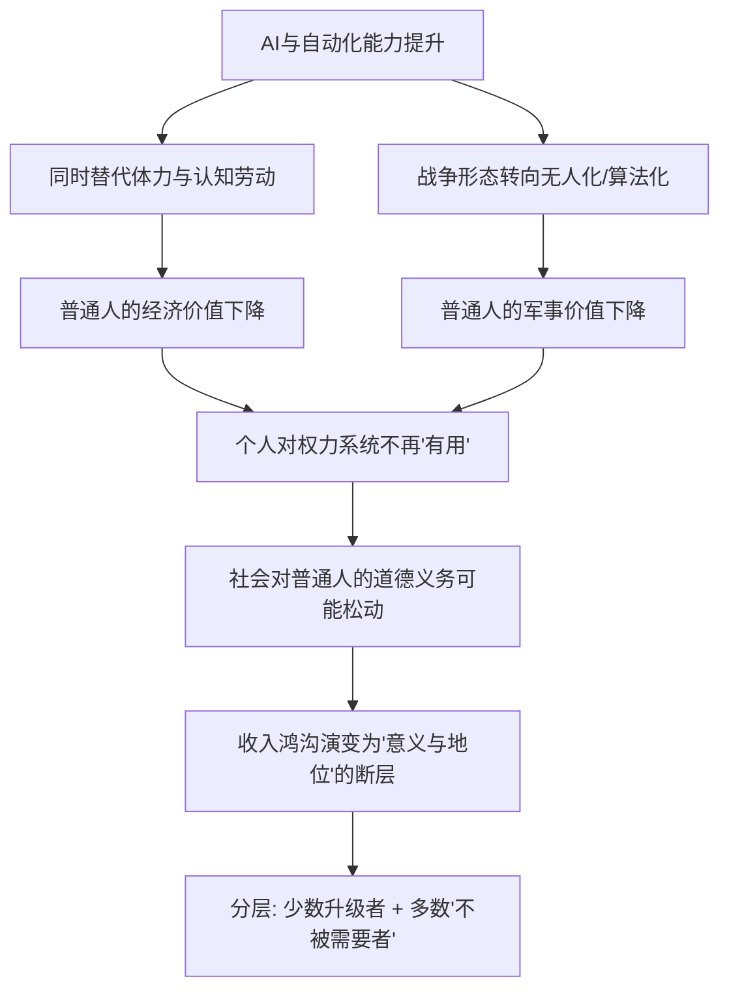

# 13｜当大多数人不再被需要，“无用阶级”会出现吗？

> 如果机器能替代越来越多的工作，那些失去经济与军事价值的人会怎样？

---

## 一、先说结论

赫拉利提出了一个刺耳的判断：未来可能出现一个"无用阶级"（useless class）。

注意，他用的不是"失业者"。失业意味着市场暂时不需要你，经济好转还能被重新雇用；失业是一个可以翻转的状态。而"无用"更绝望：它说的是，在整套经济体系和军事体系里，你这个人不再具备任何被需要的功能——不是你懒、不是你没技能，而是**没有人需要一个"你"来干活或打仗了**。

赫拉利认为，这是人类历史上第一次可能出现"多数人对系统而言没有用途"的局面。而过去几千年，无论多穷多卑微的人，至少还有两项价值：当劳动力，以及当士兵。

---

## 二、我们先理解一个问题

先做一个思想实验。假设你生活在中世纪，是一个一无所有的农民：不识字、没有特殊技能，连身体都不太属于自己。但即便如此，你对领主、对整个社会仍有铁打的价值——**你可以被拉去当兵，也可以被拉去种地。你的身体就是你的资本。**

再往后看，工业革命来了。机器抢走了大量手工业者的饭碗，可最终，工厂、铁路、汽车等新产业把人重新吸收了：失业的织布工变成流水线工人。于是人类形成一种经验：**技术会摧毁旧工作，但也会创造新工作。** 这句话在过去两百年里基本成立。

问题就来了：如果这一次不一样呢？如果机器不只替代体力，还能替代脑力？如果新工作产生的速度赶不上旧工作消失的速度？赫拉利真正想问的是：**当一个人的身体和头脑都不再值钱，他还剩下什么位置？**

---

## 三、作者到底提出了什么观点？

赫拉利认为，21 世纪的技术变革有一个前所未有的特点：它可能同时替代**体力劳动**和**认知劳动**。

过去的机器只是"更强壮的手"，它能搬东西、能织布，却不会开车、不会诊断、不会写报告。人被赶出农田和车间后，还能躲进办公室。可当人工智能开始写文案、做诊断、开汽车、分析合同，这个"避难所"也塌了。

他由此提出三层判断：

第一，经济价值可能大面积消失。当算法比人更便宜、更准确、更不知疲倦，市场对"普通人的劳动"的需求可能持续萎缩。

第二，军事价值也在消失。过去，国家安全最终依赖大量士兵，普通人因此对统治者有"兜底价值"。但未来的战争可能由无人机、机器人、网络攻击主导——战场上"大量血肉之躯"的必要性正在下降。

第三，也是最尖锐的一点：**当一个人既不能生产、也不能打仗，他对权力系统就没有利用价值。** 历史上统治者之所以要照顾穷人、要搞福利、要讲"人人平等"，一部分原因恰恰是穷人对国家有用——你是未来的士兵和劳动力。赫拉利担心，一旦这个前提被抽掉，社会对普通人的道德义务也可能随之松动。

---

## 四、把这个观点翻译成人话

用一句话说：**失业只是"暂时没你的位置"，无用阶级是"根本没有位置"。**

打个比方。员工被裁员，这叫失业，他还能去别的公司，甚至找到更好的工作。但假如整个市场都改用不需要人的方式运作，那他不是"暂时失业"，而是"被系统删除了需求"。

再换个角度。过去的社会像一个农场，穷人虽苦、虽被剥削，但农场主需要牛马干活，所以再怎么狠，也得给牛马喂草、替它们挡雨。如果农场全面机械化，不再需要牛马，那么哪怕最善良的农场主也不会再为它们准备草料——不是因为他变坏了，而是因为**牛马在他的账本上消失了**。

赫拉利的核心担忧正在这里：问题不一定出在"人心变坏"，而可能出在"需求消失"。当一个人不再提供任何功能，社会对他的关怀可能从"义务"退化成"慈善"——给不给，全看心情和余粮。

而且不只是钱的问题。赫拉利反复强调，比贫穷更危险的是**失去意义**。工作是现代人价值感的主要来源之一，"我是干什么的"往往决定了"我是谁"。当"干什么"消失，人可能不只是穷，而是整个自我认同的地基被抽走。

---

## 五、为什么会这样？

赫拉利的推理链可以概括如下：

关键在于 **F → G** 这一步。

过去的平等，一部分是"利益计算"的产物，而非纯粹的道德进步：因为国家需要每个人的劳动和生命，所以必须给每个人基本保障和尊严。赫拉利的意思是，如果这个利益基础被技术抽掉，平等就可能不再是"必须"，而变成"可选"。

到那时，社会可能不再分裂成"有产者"和"无产者"（那是财富差距），而是分裂成**"有用的少数"和"不被需要的多数"**。这是更难跨越的鸿沟，因为跨越它需要的不只是钱，而是"重新变得被需要"。

---

## 六、举一个现实生活中的例子

看自动驾驶对网约车和出租车司机的影响。

网约车和出租车司机是一个门槛不高、吸纳了大量劳动力的职业，主要靠"会开车、熟悉路况、能与人沟通"。对很多没有大学文凭或中途转行的人来说，这是重要的谋生方式。

自动驾驶正在冲击这份工作。一些研究估计，一旦自动驾驶达到足够安全且成本更低，这类驾驶岗位可能被大规模替代——注意，这是一些研究估计，具体替代的速度和规模至今仍有争议。但方向是清楚的：开出租、开网约车，恰恰是"看起来机器最容易学会"的那类工作。

这个例子正好落在赫拉利所说的"危险交叉点"上：

- 它既需要体力（长时间驾驶），也需要认知（判断路况、与乘客沟通），不是单纯的体力活；
- 它吸纳的人多，且很多司机没有太多可转移的技能；
- 一旦被替代，司机不是"换个行业"就完事。转做骑手、快递、保安当然可以，但如果这些岗位也逐步自动化，退路会一条条变窄。

更值得注意的是心理层面：一个开了十几年车的老司机，开车不仅是收入，也是"我靠本事吃饭"的尊严。当方向盘被交出去，他失去的不只是工资单，还有"我还是个有用的人"这种确认。这正是赫拉利警告的：**"不被需要"的伤害，很多时候比"没有钱"更深。**

---

## 七、回到书中重新理解

赫拉利特意把"无用阶级"和"失业者""贫困阶级"区分开来。他说，历次技术革命留下的经验是：旧岗位消失时，新岗位会出现，人会被重新吸收。但这条经验有一个隐藏前提——**新岗位仍然需要人来当。** 而这次的问题是，机器开始能胜任许多原本"只有人能做"的工作。

他进一步指出，这不只是劳动市场问题，而是一个**政治和道德前提**问题。现代社会的全民教育、社会保障、福利国家、乃至"人人平等"的意识形态，都植根于一个假设：每一个健康成年人都能通过劳动为社会做贡献，因此社会有义务善待他。如果这个假设松动，这套制度的地基也就松动了。

赫拉利并不是说这种未来一定会到来，而是说：人类第一次需要认真面对"技术可能不再需要大量人"这个可能性，而不是靠"新工作会自动出现"的信念把它糊过去。

---

## 八、这个观点背后还有什么？

第一，它预设了**人的价值等于"经济与军事用途"**。这本身也在提醒我们：当社会只按"功能"衡量人，人一旦失去功能就会被抛弃。

第二，**"有用/无用"的判定权掌握在谁手里？** 谁来判断一个人"没有用"？是市场、是算法、还是政治权力？赫拉利没有充分回答，但这才是最危险的部分：判定权一旦集中，就可能被滥用。

第三，它与全书的算法主线相连。上一篇讲算法越来越懂你，这里要补充的是：算法不只是懂你，它还可能在**评估**你——评估你的产出、你的可替代性。当人可以被量化打分，"无用"就可能从模糊的社会感受，变成精确的系统判定。

---

## 九、这个观点有问题吗？

必须说清楚：**"无用阶级"是一个有冲击力的警示，而不是学界共识。**

**第一，反对意见最强的是经济学家。** 许多经济学家认为，技术会摧毁旧工作，也会创造新工作，长期看创造的往往更多。历史上"机器抢走饭碗"的恐慌反复出现，从织布机到 ATM，几乎每一次都没有成真。

**第二，"这次可能不同"的一方也无法被轻易否定。** 支持赫拉利的观点是：过去机器替代的主要是体力，而这次 AI 正在替代认知劳动——写代码、做诊断、写法律文书。如果被替代的是"脑子"而不是"手"，那么"转行去坐办公室"这条历史上最有效的退路，可能第一次被堵死。双方的分歧不在事实层面谁撒谎，而在对未来的推断不同。

**第三，就业数据必须谨慎使用。** 一些研究估计，未来一二十年可能有相当比例的岗位受自动化影响，但这些预测彼此差异极大，而且"岗位受影响"不等于"人被裁掉"，更不等于"人永远失业"。

**第四，这个概念本身可能过度简化。** 它把人粗暴地分成"有用"和"无用"，忽略了大量中间状态：半就业、零工、志愿劳动、照料家人等无法被 GDP 衡量的价值。一个在家照顾老人孩子的人，在市场上"没有产出"，但他显然不是"无用"。

**所以更准确的说法是**：赫拉利提出了一个真实而尖锐的问题——技术有可能第一次长期压低大量普通人的市场价值；但"无用阶级"这个结论带有强烈的推测性和道德冲击意图，不能当成已经发生的现实。

---

## 十、今天再看这个观点

以下部分是基于赫拉利思想的现代延伸，不是他的原话。

赫拉利写作时，生成式 AI 还没有今天这样普及。今天再看，"无用阶级"的议题变得更具体：AI 开始写代码、做客服、生成设计、撰写报告，白领第一次真切感受到"被替代"的寒意。但同样出现了一些他没强调的现象。

一是**新岗位也在出现**。提示工程、数据标注、模型评估等职业，某种程度上印证了"技术创造新工作"的老经验，提醒我们不必急着宣布"人没用了"。

二是**"无用"可能不是失业，而是价值被重新分级**。真正可能发生的，不是大批人突然失业，而是大量人的技能迅速贬值、收入长期停滞。这是一种更缓慢、更隐蔽的"被不需要"。

三是**制度的作用被证明很关键**。同样的技术冲击，在不同制度下结果可能完全不同：有没有再分配、终身教育和基本保障，会决定"技术性失业"是暂时阵痛，还是固化为永久阶级。技术不是命运，制度才是分流器。

赫拉利的价值，或许不在于他预测得准不准，而在于他逼我们提前思考一个不习惯的问题：**如果有一天社会真的不需要你工作，你凭什么还被当作一个完整的人对待？**

---

## 十一、这一篇真正应该记住什么？

1. **"无用阶级"不是失业者。** 失业是可以翻转的状态，而赫拉利指的是在经济与军事体系里都"不再被需要"的群体，性质更接近被系统删除。

2. **历史上普通人至少有劳动与当兵两项价值。** 正因如此，统治者才必须善待他们——平等的背后，其实也藏着"有用"的利益计算。

3. **这次的威胁在于体力和脑力可能同时被替代。** 过去"转行去坐办公室"的退路，第一次可能不再安全。

4. **"不被需要"的伤害不只是没钱**，更是意义、尊严和社会认同的坍塌，这一点常被经济讨论忽略。

5. **这不是定论，而是警示。** 许多经济学家相信技术会创造新工作；技术本身不决定结局，制度选择才是关键变量。

---

## 十二、留一个问题

> 如果有一天，社会真的不再需要大多数人工作，
> 那么"一个人凭什么值得被善待"这个问题，
> 我们打算用市场来回答，还是用别的什么东西来回答？

---

**下一篇**：如果说"无用阶级"讨论的是人在经济与军事上失去价值，那么还有一个更深的问题：连"该听谁的"这件事，也可能不再由人来决定。当算法在健康和生活的关键决定上给出比人更准的建议，我们会不会心甘情愿地把权力交出去？

下一篇我们就来拆开这个问题——**权威为什么要从人转向算法？**
