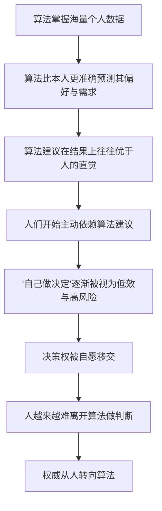

# 14｜权威为什么要从人转向算法？

> 为什么"谁说了算"这个问题的答案，可能从人类手里溜走？

---

## 一、先说结论

赫拉利提出一个耐人寻味的判断：权威正在从人手里，悄悄转移到算法手里。

关键在于，他认为这个过程**不是被强迫的，而是自愿的**。没有人拿枪逼你把决定交出去，相反，是你自己一步一步交出去的——因为算法给出的建议确实更准、更快、更省心。

这带来一个反直觉的结论：**权力的转移，可以以一种"温柔"的方式完成。** 不需要政变、不需要暴力、甚至不需要你不情愿。只要你足够看重效率，只要你愿意承认"它比我想得更周全"，转移就会自动发生。赫拉利担心的正是这一点：正因为它太好用、太舒服，一旦交出去，就几乎不可能再要回来。

---

## 二、我们先理解一个问题

先问一个朴素的问题：**"我说了算"这件事，到底靠什么支撑？**

表面上，"我说了算"是因为我是自己的主人。但深想一层，一个人能当权威，是因为他给出的判断**足够可靠**。病人听医生的，因为医生懂医术；乘客信机长，因为机长会开飞机。权威从来不是天生的，它来自"你相信我比别人更懂"。

那么，如果在某一件事上，有一个东西比你自己更懂你呢？比如健康：你凭感觉判断"应该没事"，可算法看过你十年的体检、睡眠、心率数据后，说"这个指标的趋势不太对，建议去医院查一下"。事后证明它是对的。

这时候，"该听谁的"就出现了一个微妙的倾斜。你没有输给强制，你只是输给了**准确率**。赫拉利真正想问的是：如果这种事在越来越多的领域发生——健康、投资、择偶、职业选择——那么"我的人生由我决定"这句话，还剩下多少分量？

---

## 三、作者到底提出了什么观点？

赫拉利的论述有一个清晰的历史框架：人类历史上已有过两次关于"权威来源"的大转移，第三次可能正在到来。

第一阶段，**权威来自神**。规则由神定，国王是神的代理人，经典就是法律，人只能服从。

第二阶段，**权威来自人**。经过启蒙运动、宗教改革、民主革命，权威慢慢从神那里搬到人这里。人文主义宣告：意义和价值来自人的感受，人是自己的最高权威。"听从你的内心"成了现代人的信条。

第三阶段，赫拉利预言可能到来的，是**权威来自算法**。当外部算法能比你的内心更准确地预测你的感受、判断你的利益，人就会把原本属于自己的决定权一点点让渡出去。

他强调，转移的动力不是暴力，而是**效率和便利**。算法做决定更准、更快、更少受情绪干扰。于是"自由选择"在很多人那里会从"我的权利"变成"我的负担"——自己选意味着承担选错的痛苦，交出去就轻松多了。

---

## 四、把这个观点翻译成人话

用一句大白话：**权力转移最隐蔽的方式，不是"我要夺走你的决定权"，而是"我帮你做决定做得太好了"。**

打个比方。你有一个朋友，以前你遇事都自己拿主意，偶尔征求他意见。后来你发现，他每次的建议都比你想得更周全：买哪部手机、换哪份工作、要不要做这个手术，听他的基本不会错。渐渐地，你遇到事就直接问他，自己连想都懒得想。

你没有失去自由——你随时可以不听他的。但事实上，你已经不再自己判断了。这就是"温柔的转移"：**自由还在你手里，只是你已经不打算用了。**

过去的权威是"你**必须**听我的"，靠的是强制；未来的权威可能是"你**想**听我的"，靠的是好用。后者更可怕的地方在于，你根本不会觉得自己被剥夺了什么，反而会觉得自己占了便宜——毕竟谁不想要一个永远不出错的顾问呢？

---

## 五、为什么会这样？

赫拉利的推理可以拆成一条链：

关键在于 **C → E** 这一步。

只要算法在结果上持续胜出，"自己做决定"就会从一种权利，变成一种**风险行为**。而人对风险的容忍度是有限的：当你发现"自己选"经常带来后悔，而"听算法"经常带来正确，你会自然而然地选择那个更稳的选项。

这不是道德堕落，而是理性的省力行为。赫拉利的洞察就在这里：**权威的转移，不一定需要你相信算法"更高贵"，只需要你相信它"更好用"。** 好用，就足够完成一次权力的和平交接。

---

## 六、举一个现实生活中的例子

看网上问诊和健康 App 的兴起。

以前，一个人身体不舒服，流程大致是：自己感觉不对——去医院挂号——医生问诊、检查——给出诊断。整个过程里，"判断"是医生和病人共同参与的，病人自己的描述和直觉也占很大分量。

现在，越来越多人第一步不是去医院，而是打开健康 App 或网上问诊平台。你输入症状：头晕、心慌、睡不着、最近压力大。系统立刻给出几种可能、建议你做哪些检查、提醒你哪些是危险信号，甚至直接告诉你"建议尽快就诊"或"目前不必太担心"。

这个过程中发生了什么？

第一，算法确实帮了忙。它能在几秒钟内给出初步判断，省去排队和焦虑，尤其在医疗资源紧张、看病贵的地方，这是实实在在的便利。

第二，也是赫拉利关注的点：**你开始把"我该不该担心自己的身体"交给一个不是医生的系统回答。** 你不舒服时，不再先问"我自己感觉怎样"，而是先问"App 怎么说"——它说没事你就安心，说有问题你就紧张。

第三，更进一步。当这些 App 掌握了你长期的心率、睡眠、运动、饮食数据，它们给出的不只是"这次怎么了"，还可能是"你未来有什么风险""要不要去做那个检查"。它逐渐从工具变成顾问，再变成权威。

要强调的是：这本身未必是坏事，很多场景里算法确实提高了医疗的效率和可及性。但赫拉利的提醒是——**当你习惯了遇事先问它，"谁在替我判断我的身体"这个问题的答案，已经在悄悄改变。**

---

## 七、回到书中重新理解

赫拉利把它放在"智人失去控制"这一部分，不是在讲技术问题，而是在讲一个**权力问题**：谁掌握信息、谁给出判断、谁被信任，谁就掌握了权威。历史上，这个位置从祭司转到国王，从国王转到议会和人民；现在，赫拉利认为它可能再转一次，转到算法。

他还特别强调，这个过程与"自由意志"的哲学问题不同。就算你坚信自己有自由意志，你仍然可能把决定交给算法——因为这不是理论问题，而是日常的成本收益问题：当自己决定更累、更慢、更容易错，你凭什么不交给它？

赫拉利由此推出一个更深的忧虑：人文主义把"人自己决定"视为最高价值，但如果人自愿把决定权让渡出去，这个核心信条就变成了一句空话。**问题不在于算法夺权，而在于人类主动退位。**

---

## 八、这个观点背后还有什么？

第一，它预设了**准确率是决定权威归属的最终标准**。但权威真的只靠准确率吗？医生还提供安慰、陪伴、责任承担，这些未必能被准确率概括。把权威简化为"谁预测得更准"，本身就是一种很现代、很功利的假设。

第二，**便利是转移的润滑剂**。这个观点揭示了现代社会一个深层机制：很多权利的丧失，不是因为被剥夺，而是因为被优化。外卖方便，所以不做饭；导航方便，所以不认路；算法方便，所以不自己判断。**每一样都让你过得更好，加在一起却可能是能力的整体退化。**

第三，**它意味着不可逆性**。当一个人长期不自己判断，判断力会退化；当一个社会习惯了算法决策，它可能连"如何在没有算法时做决定"都忘了。放弃能力比放弃权利更难恢复。

第四，它与全书的"数据"主题相连。算法能成为权威，前提是它掌握了你足够多的数据。所以这个观点背后，其实站着一个更大的东西：**数据的集中，就是权力的集中。**

---

## 九、这个观点有问题吗？

必须说明：**"权威转移"是一个有洞察力的框架，但它对未来的描绘带有推测性，学界并不一致认同。**

**第一，算法取代人在很多领域远没有他说的那么顺。** 医疗、法律、投资领域的算法决策仍面临黑箱、数据偏差、责任归属等难题。算法误判找谁负责？**"责任真空"是它最大的现实障碍之一。**

**第二，歧视问题。** 如果训练数据本身带有偏见，算法会把它放大并系统化。一个历史上被不平等对待的群体，可能被算法判为"高风险"，从而被拒绝贷款、保险或工作。这不是"更准确"，而是"更高效的偏见"。

**第三，不可解释性。** 很多深层模型的决策过程连设计者都难以解释。当一个决定说不清理由，它就无法被质疑、被纠正，这与"权威应当可问责"的现代原则存在根本冲突。

**第四，赫拉利可能低估了人的主体性。** 有学者认为，人不会简单地把决定权交出去，而可能发展出"人机协作"模式——算法给建议，人保留最终判断；也可能出现群体性的警惕和制度约束。关于这一问题，学界存在不同解释。

**第五，他可能把"使用工具"和"让渡权威"混为一谈。** 用导航不代表放弃认路，用搜索不代表放弃思考。工具依赖与权威转移之间，有一条模糊但真实的分界线。

**所以更准确的说法是**：赫拉利敏锐地指出了权威可能转移的方向和机制（好用导致自愿让渡），但他把一个正在发生的趋势，描述成了一条近乎必然的道路；实际会走到哪一步，取决于技术能力、制度设计和人的警惕，远不是已经注定的。

---

## 十、今天再看这个观点

以下部分是基于赫拉利思想的现代延伸，不是他的原话。

赫拉利写作时，推荐算法还主要集中在购物和内容分发上；今天，算法已深入生活的更多层面：求职筛选、贷款审批、翻译、写作、编程、情感陪伴，甚至心理疏导。他所说的"权威转移"，正以更快的速度、更广的范围发生。

一是**转移的形态比赫拉利说的更微妙**。多数人并非全交，而是"分层交权"：小事全交（看什么、买什么），中事半交（职业建议、医疗参考），大事保留（要不要辞职）。真正的问题也许是：**这条线会不会不断向上移动？**

二是**"便利"的代价变得更清晰**。省心体现为个性化信息流、自动推荐、AI 帮忙决策；但"自主判断"这门能力，像肌肉一样用进废退。

三是**制度层面的回应开始出现**。算法透明、可解释性、数据权利、人工复核等议题正成为各国监管讨论的内容。这说明"转移"不是不可阻挡的物理规律，而是可以用制度调节的社会过程。

赫拉利真正留下的问题，也许不是"算法会不会掌权"，而是：**当我们有机会问"这件事我想不想交给它"时，我们会不会记得问？**

---

## 十一、这一篇真正应该记住什么？

1. **权威的来源经历过两次转移，第三次可能正在发生。** 从神到人，再从人到算法，每一次转移都重塑了"谁说了算"的答案。

2. **转移的关键动力是"好用"，不是"强制"。** 算法不需要夺权，只要在准确率和便利性上持续胜出，人就会自愿把决定交出去。

3. **这种转移是隐蔽而不可逆的。** 你不会觉得自己被剥夺了自由，反而觉得自己占了便宜；但一旦习惯了被替你做决定，判断力会退化，很难再收回。

4. **算法决策有真实的软肋**：责任真空、系统性歧视、不可解释性，都会挑战"它可以当权威"这一前提。

5. **这不是必然，而是可以调节的过程。** 人并非只能被动接受，制度、透明度和警觉性会决定这条路走多远。

---

## 十二、留一个问题

> 如果算法只是建议，而决定权还在你手里，
> 那么当一个又一个"小决定"被交出去之后，
> 剩下的那个"大决定"，你还有能力自己做吗？

---

**下一篇**：如果说算法接管的是一个个具体决定，那么它冲击的就远不只是个人生活，而是一整套政治哲学的地基。现代政治最引以为傲的自由主义，建立在"个体是可靠的意义与决策中心"这一假设之上——如果这个假设被动摇，自由主义还站得住吗？

下一篇我们就来拆开这个问题——**自由主义为什么会陷入危机？**
