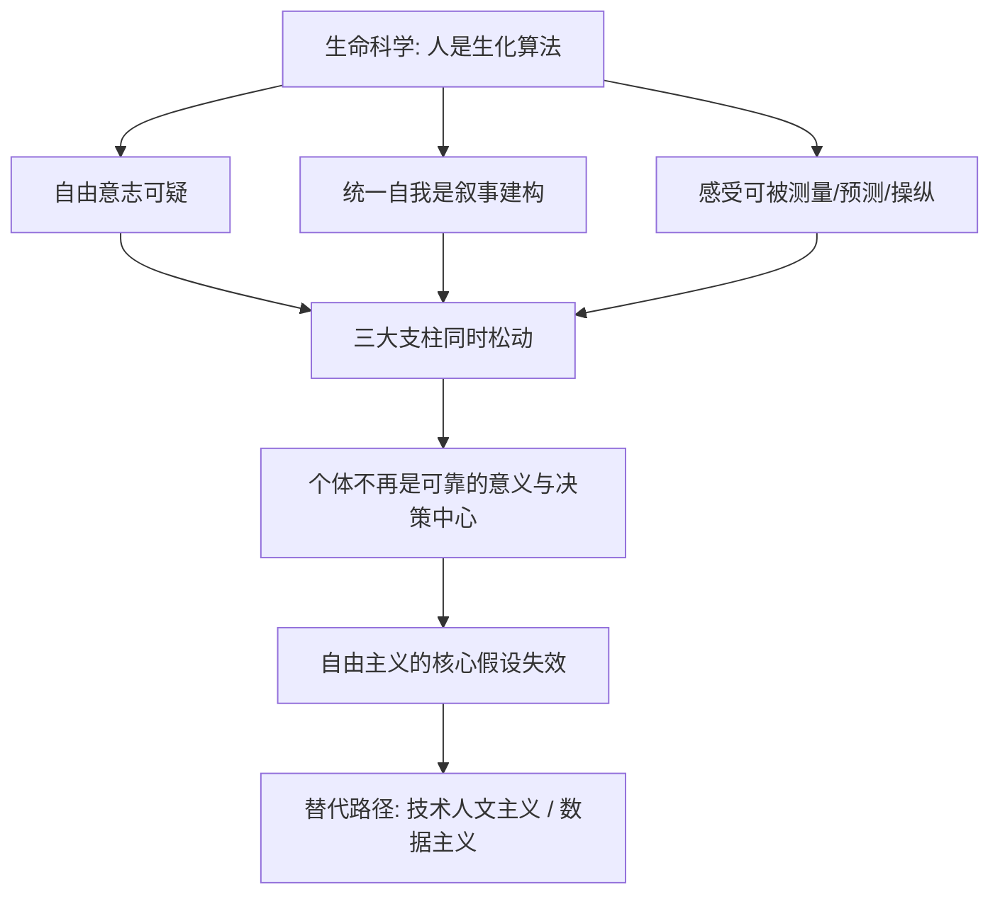

# 15｜自由主义为什么会陷入危机？

> 二十世纪最成功的政治哲学——自由主义，为什么可能撑不过二十一世纪？

---

## 一、先说结论

赫拉利提出了一个让很多人不安的判断：自由主义——这个在二十世纪大获全胜的政治哲学——可能撑不过二十一世纪。

他的理由不是"自由主义不好"，恰恰相反，是世界变了。

自由主义之所以成立，靠的是三个支柱：**自由意志、个体、感受**。它假设：每个人都是一个独立的、能自由感受和理性选择的个体；"我自己的感受"和"我自己的选择"是最高权威，任何政府、教会、传统都不能替我做主。

可赫拉利认为，生命科学正在说"自由意志可能只是幻觉"，人工智能正在说"算法比你更懂你"。这两句话合起来，正好从地基上掏空了自由主义的三根柱子：**当个体不再是可靠的意义与决策中心，建立在其上的整套政治哲学也就一起摇晃了。**

---

## 二、我们先理解一个问题

先问一个最基础的问题：**民主制度凭什么成立？**

选举的逻辑很朴素：每个人都有能力判断什么对自己好，所以让每个人投票，汇总起来就是集体的最佳选择。市场经济的逻辑也一样：每个人最清楚自己要什么，让每个人自由交易，结果就是资源配置最优。人权的逻辑还是这样：每个人的感受和尊严不可侵犯。

民主、市场、人权——这三套东西看起来各不相同，却共享同一个前提：

> **个体是一个可靠的、自主的判断者。**

问题是，如果这个前提不成立呢？如果一个人的"选择"其实是被基因、神经回路决定的，甚至被外部信息反复操纵；如果算法比他自己更清楚他要什么；那么"尊重每个人的选择"还剩下什么意义？

赫拉利想问的正是这个：**自由主义不是被敌人打败的，而是可能被科学和算法从内部拆掉的。**

---

## 三、作者到底提出了什么观点？

赫拉利的论证可以分成三层。

**第一，自由主义有三大支柱。**

一是**自由意志**：人能够自由做选择，选择来自"我"而不是外部决定。
二是**个体**：每个人都是独立、有内在价值的主体，"我"是意义的基本单位。
三是**感受**：判断好坏最终依据个人主观体验，而只有当事人自己最清楚。

三者互相支撑，构成"以人为本"的世界观。

**第二，自由主义为什么能在二十世纪胜出。**

赫拉利指出，二十世纪是三大意识形态的竞争：法西斯主义、共产主义、自由主义。自由主义最终胜出，原因不完全是它更道德，而是实践表现更好——更繁荣、更创新、更有活力。冷战结束时，很多人相信"历史已经终结"。赫拉利认为，那是辉煌的顶点，也是危机的起点。

**第三，科学和算法正在同时掏空这三根柱子。**

自由意志：脑科学研究显示，许多决定在被意识察觉之前就已由神经活动启动，这至少让"自由意志"变得可疑。

个体：生命科学把人拆解成基因、激素、神经元，那个统一的、神圣的"自我"，更像一个事后讲述的故事。

感受：如果感受只是生化反应，它就可以被测量、预测，甚至被制造和操纵。算法一旦能预测你的感受，你就不再是"感受的唯一权威"。

赫拉利由此得出结论：**自由主义的三根柱子，正在被同一个科学进程一起松动。** 他还预告了两条可能的替代路径——"技术人文主义"（继续以人为中心，但用科技升级人）和"数据主义"（让数据系统接管决策，人从中心退场）。

---

## 四、把这个观点翻译成人话

用一句话说：**自由主义要求"尊重每个人的选择"，但如果"选择"本身不自由、甚至不是他自己的，那要尊重的是什么？**

打个比方。一家公司规定重大决策由全体员工投票，因为"每个人最清楚自己部门的情况"，几十年都运行良好。可后来发现，员工投票前都看过同一个被精心设计的推送，情绪被牵着走，而投出来的结果和一台预测模型的预测高度一致——模型早就知道他们会怎么投。

那么问题来了：这套"民主决策"还成立吗？投票还在继续，但"每个人的独立判断"这个前提，可能已经空了。

赫拉利的担忧正是这个：**制度还在，但支撑它的信念基础塌了。** 你可能还拥有投票权和自由，但如果那个"自由"是被预测和被塑造的，它就成了一句空壳。

---

## 五、为什么会这样？

赫拉利的推理可以拆成一条链：

关键在于 **E → F** 这一步。

注意，这不是说"自由主义犯了大错"，而是说它的**前提**被挑战了。自由主义的整套制度——选举、人权、市场——都是为"有能力自主选择的个体"设计的。如果个体可以被算法看穿、被信息操纵、被生化机制决定，这套制度就像一把为普通锁设计的钥匙，却要开一把形状已变的锁。

这也解释了为什么赫拉利认为危机是"结构性的"：**不是自由主义变坏了，而是它所依赖的人的形象变了。**

---

## 六、举一个现实生活中的例子

看选举与信息茧房、社交媒体上的舆论操纵。

自由民主政治的核心场景是选举：公民自由地获取信息、形成观点、投出选票。这套机制成立的前提，是每个公民能相对独立地判断。而社交媒体的运作方式，正在挑战这个前提。

第一，**个性化推送制造信息茧房**。平台不断推荐你"想看"的内容，久而久之，你看到的世界是为你量身定制的。你以为自己在了解世界，实际看到的是被算法筛选过的版本；不同的人被推送到截然不同的事实版本，公共讨论的共同基础被削弱。

第二，**情绪可以被精准动员**。各类研究表明，带有愤怒、恐惧、对立的内容更容易传播。追求点击的算法可能无意中放大极端情绪，把选民推向更对立的立场。这不是某个人的阴谋，而是机制的倾向。

第三，也是赫拉利最关心的：**选择依然存在，但它的自主性存疑。** 选民仍然自己去投票，没人取消他的选票；但他接收的信息、被激发的情绪、被强化的偏见，可能早已被一套不是为他利益服务的系统塑造过了。

这个例子说明：自由主义的危机未必表现为"选举被取消"，而可能是"选举还在，但选民的独立判断已被侵蚀"。**制度的形式没变，实质的基础正在被挖空。**

---

## 七、回到书中重新理解

赫拉利的逻辑是：

> 自由主义建立在一种关于"人是什么"的假设上。
> 一旦生命科学和人工智能改变了这个假设，自由主义就会遇到它建立以来最深的挑战。

他还指出，这个挑战和过去的意识形态竞争完全不同。过去自由主义的对手是法西斯、共产主义——那是"另一种制度"，可以用实践成效来回应。而这一次，挑战它的是**关于人的科学事实**。你很难用"我们运行得更好"来回应"你的前提是错的"。

他因此认为，自由主义的出路要么是重大调整，要么是被新世界观取代，都不轻松。

---

## 八、这个观点背后还有什么？

第一，它依赖一个隐含判断：**政治制度的根基，确实依赖于关于人性的科学假设。** 这可以被质疑——很多政治学者认为，自由制度可以相对独立于这类哲学假设而运作，靠的是习惯、制度和相互制衡。

第二，**它揭示了"软性操纵"的政治后果。** 过去的专制靠压制信息，未来的威胁可能靠**淹没**信息：不禁止你思考，而是让你思考不了；不剥夺你的选择，而是替你预设好选项。这与自由主义的假定正面冲突。

第三，**它把问题定位在"人"这一端，而不是"制度"这一端。** 这是赫拉利最独特也最有争议的一步：他不认为制度出了毛病，而认为我们关于人的定义需要重写。

第四，它与全书"数据主义"的预言相连。自由主义危机不是终点，而是过渡：如果个体不再是可靠的中心，中心可能让给数据系统。

---

## 九、这个观点有问题吗？

必须明确：**"自由主义危机"是一种深刻的诊断，但绝不是学界共识，它的结论带有强烈的推测成分。**

**第一，许多政治学者认为自由主义仍有强大的韧性和自我修正能力。** 它在历史上多次面对挑战并调整自己——从普选权的扩大到福利国家的建立，都是从危机中长出来的新形态。这些学者认为，算法和信息操纵带来的问题，恰恰可以用自由制度自身的手段（监管、立法、公共教育）应对，而不是必然导致解体。

**第二，"危机"可能被夸大，也可能被误读为"必然解体"。** 赫拉利的论证是"如果前提不成立，则整套体系动摇"，但现实中，制度并不完全依赖哲学前提。很多人并不真的相信抽象的自由意志，却依然支持自由制度，因为它带来的好处是具体的。**前提与制度之间，可能比赫拉利设想的更有弹性。**

**第三，相关科学结论远未定论。** "决定在意识察觉之前启动"这一发现，被一些哲学家视为自由意志的证伪，也被另一些认为只涉及无意识的准备过程。算法也一样：它擅长预测重复性行为，但在人生重大、价值冲突的抉择上是否真比人懂人，仍缺乏有力证据。关于这两个问题，学界都存在不同解释。

**第四，赫拉利自己也没有给出替代方案。** 他指出了危机，却没说明该往哪走。批评者认为，"诊断有力、处方缺席"容易制造焦虑，却不利于解决问题。

**所以更准确的说法是**：赫拉利指出了一个真实而根本的挑战——自由主义的哲学假设正在被新的科学和技术环境所动摇；但"一定会陷入危机、乃至解体"是一个远未证实的推断，自由制度可能通过调整来回应挑战，历史未必会沿着他画的线走。

---

## 十、今天再看这个观点

以下部分是基于赫拉利思想的现代延伸，不是他的原话。

赫拉利写作时，社交媒体对政治的影响刚刚显现；今天，它已成为全球政治最突出的现象之一：假信息、深度伪造、算法推送、情绪极化、信息战，几乎每一项都在验证他对"自主判断被侵蚀"的担忧。也出现了他没强调的新变化。

一是**"后真相"问题**。当人们对事实本身失去共识，公共讨论就不再是关于"怎么办"的争论，而变成"你信什么版本"的对立。这比"信息茧房"更进一步：不是各自待在茧房里，而是连共同事实都消失了。

二是**生成式 AI 让"操纵"门槛骤降**。伪造的声音、图像和视频变得廉价且逼真，个人对信息的辨别能力被推到极限。"独立的个体判断者"面临比赫拉利写作时更严峻的考验。

三是**对自由主义的回应也开始成形**。一些国家推进算法透明、平台责任、数据保护、反深度伪造立法。这说明自由主义未必只能被动挨打，它可能正在长出新的免疫机制。

---

## 十一、这一篇真正应该记住什么？

1. **自由主义建立在三个假设之上：自由意志、个体、感受。** 它要求"尊重每个人的选择"，前提是每个人确实是能自主选择的个体。

2. **它在二十世纪胜出，靠的不只是道德，更是实践成效。** 冷战结束让很多人相信自由主义是历史的终点，赫拉利却认为那正是危机的起点。

3. **生命科学和算法正在同时掏空它的地基。** 如果选择是被决定的、自我是虚构的、感受可被操纵，那么"以人为本"的权威来源就出现松动。

4. **赫拉利的诊断是"结构性"的，不是"道德性"的。** 他不是说自由主义变坏了，而是说它依赖的人的形象变了。

5. **但"危机"不等于"必然解体"。** 许多学者认为自由制度有自我修正能力；赫拉利指出的是真实挑战，而非写好的结局。

---

## 十二、留一个问题

> 如果一个人的选择越来越多地被预测、被塑造、被推动，
> 那么"尊重他的选择"这句话，
> 到底是自由的最后堡垒，还是它最后的空转？

---

**下一篇**：当个体的自主判断不再可靠，人类会去寻找一个新的意义中心。赫拉利认为，这个正在浮现的候选者，可能不是人，也不是神，而是**数据本身**——一种把"信息流"当作宇宙本质的新信念。它可能像人文主义取代宗教那样，成为下一代主导的"宗教"。

下一篇我们就来拆开这个问题——**什么是"数据主义"？**
