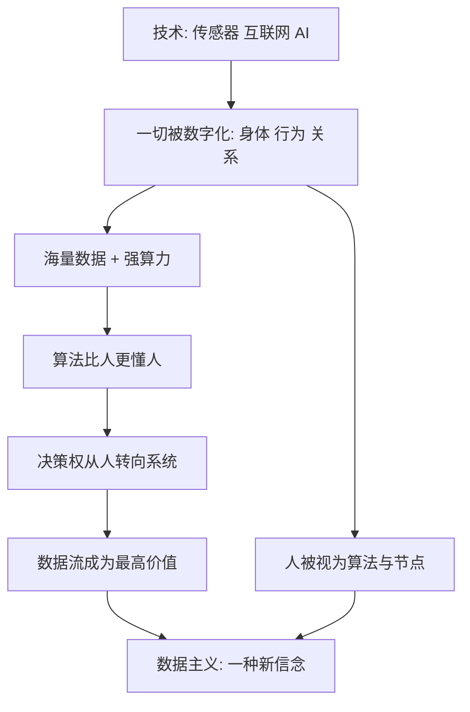

# 16｜什么是“数据主义”？

> 赫拉利提出的"数据主义"，到底是一种什么样的新信念？

---

## 一、先说结论

赫拉利认为，在自由主义之后，可能出现一种全新的世界观——"数据主义"。它只有两条核心信条：宇宙本质上是一股数据流；任何事物、包括人的价值，取决于它对数据处理的贡献。如果这两条成立，人就不再是意义与权威的中心，而只是巨大信息网络中的一个节点。更耐人寻味的是，数据主义不像传统宗教那样要求你跪拜，它已经藏在搜索引擎、社交平台和智能设备里，悄悄运转了很多年。

---

## 二、我们先理解一个问题

我们习惯把"宗教"想成教堂、经书和神明。但赫拉利在书里用了一个宽得多的定义：凡是能同时提供**意义、权威和伦理规则**的系统，都可以算一种宗教。按这个标准，自由主义也可以算宗教——它告诉你人生的意义是"做自己"，权威来自"你的感受"，伦理是"尊重他人的选择"。

那么真正的问题就来了：

> 有没有一种信念，既不需要神，也不把"人"当中心，却仍然能给人提供意义、权威和伦理？

赫拉利给出的候选者，就是数据主义。它最奇怪的地方在于：它不是从天上掉下来的新教义，而是从我们每天都在用的工具里，自己长出来的。

---

## 三、作者到底提出了什么观点？

赫拉利在全书接近尾声时提出"数据主义"（Dataism），并把它归纳为两个核心命题。

**命题一：宇宙由数据流组成。**
从星系到细胞，从免疫系统到人的情绪，一切都可以被理解为信息的采集、传递和处理。生物体是算法，社会是网络，历史是数据的流动与重组。

**命题二：价值等于对数据处理的贡献。**
一个事物的价值，不取决于它是否神圣、是否善良、是否让人快乐，而取决于它能为这个信息流贡献多少、处理得多高效。

由这两条往下推，会得到一个不太舒服的结论：**人类不是宇宙的目的，而是数据处理系统中的一个环节。** 人的价值，在于我们是一台能感知、记录并处理信息的算法。当出现更高效的处理者，人这台机器的相对地位自然会下降。

赫拉利还指出，数据主义之所以可能"升格"为宗教，是因为它恰好补上了宗教的三个功能：

| 功能 | 传统宗教 | 人文主义 | 数据主义 |
|---|---|---|---|
| 意义 | 来自神的旨意 | 来自人的感受 | 来自数据流本身 |
| 权威 | 神职人员 | 个体的选择 | 能处理最多信息的算法 |
| 伦理 | 遵守神的律法 | 尊重他人自由 | 促进信息的流动与连接 |

在数据主义的伦理里，**增加信息流量、让更多事物相连，是善；阻断信息流动，是恶。**

---

## 四、把这个观点翻译成人话

数据主义可以浓缩成一句提问方式的改变：

> 别问"你感觉怎么样"，问"你能贡献多少数据、你处理得有多快"。

三种世界观的差别，可以这么记：

- **宗教**：意义来自神，所以听神的。
- **人文主义**：意义来自人的感受，所以听自己的内心。
- **数据主义**：意义来自数据流的增长，所以听算法。

生活里的场景其实很具体。你戴着智能手环，它不停地记录心率、睡眠和步数；你打开地图、搜索、点赞、导航，每一次动作都在向系统汇报。系统并不在乎你今天开不开心，它只关心数据有没有被采集、流动和优化。这不是有人刻意设计的阴谋，而是这些技术天然的方向——越多人用、越多人贡献，它就越强。

---

## 五、为什么会这样？

赫拉利的推理链条可以这样画：

关键在于 **A → B** 和 **E → F** 这两步。

第一步是"可量化"：只有当身体、情绪、行为都能被转成数字，数据处理才有原料。第二步是"让权"：当算法在医疗、导航、投资、择偶上给出更准的建议，人们会心甘情愿地把决定交给它——不是被强迫，而是因为"它更好用"。

于是价值的天平悄悄倾斜：**从"你有多真实的情感"，变成"你能为系统贡献多少有效数据"。** 这条路径不激烈、不戏剧化，它只需要一件东西——你越来越离不开那些好用的工具。

---

## 六、举一个现实生活中的例子

想想那些你从没付过钱的 App。

地图、邮箱、短视频、社交软件，绝大多数都是"免费"的。可一家公司要生存，总得靠什么赚钱。这些服务背后的商业模式，通常是广告——而广告真正出售的，不是广告位，而是**"预测用户行为的能力"**。预测靠什么？靠你日积月累贡献的数据：你在哪里停留、看了多久、点了什么、和谁聊天。

所以更准确的说法是：你并没有免费使用它，而是**用数据付了费**。你付出了你的位置、你的偏好、你的社交关系、你的注意力轨迹。

这个循环对系统而言还特别"漂亮"：你越用它，它越懂你；它越懂你，你越离不开它；你越离不开它，你贡献的数据就越多，它就更强。在这个循环里，真正被交易的核心不是人，而是数据流。这正是数据主义在现实中的运作方式：**价值不来自"你这个人"，而来自"你产生的信息"。**

---

## 七、回到书中重新理解

赫拉利提数据主义，其实同时做了两件事：一是**描述**，二是**预言**。

在描述层面，他讲的是一件正在发生的事：人类正把世界全面数字化，把身体、行为、情感、关系都转化成可计算的数据。这不是比喻，而是已经在运行的工程。

在预言层面，他做了一个推测：这种数字化会催生一种全新的信念，把"数据流的最大化"当作最高目标，并有可能像人文主义当年取代宗教那样，取代人文主义。

他还点出一个特别关键的传播机制：**数据主义不靠传教士，靠产品。** 宗教要靠说服，意识形态要靠动员，而数据主义只需要不断做出更好用的东西。人们不是被说服才交出数据，而是为了便利、效率和舒适自愿交出。这是它最温和、也最难抗拒的地方。

---

## 八、这个观点背后还有什么？

**第一，它有一个很强的隐含前提：一切信息都能被量化。** 如果真的存在无法被转化成数据的体验，那么数据主义的"宇宙即数据流"就不完整。这是它最脆弱的一环。

**第二，它暗暗假设"处理能力越强，就越有资格做决定"。** 这是一个价值判断，不是技术事实。算力强不等于判断对，更不等于有资格替别人做选择。

**第三，它是人文主义的一面镜子。** 两者都从神手里夺走了权威；区别是人文主义把权威交给人，数据主义又把人拿掉，交给系统。所以数据主义不是凭空出现，而是人文主义逻辑推到极致的产物。

**第四，它和书里其他判断是一套的。** 只有当"智能与意识可以分离""算法比人更懂人""权威正在转移"这些前提都成立，数据主义才站得住。它是全书很多线索汇合的地方——当一个社会不再相信个体感受是可靠的意义来源，数据主义就有了登场的空间。

---

## 九、这个观点有问题吗？

有问题，而且争议不小。要特别区分两件事：**赫拉利是在描述一个趋势，还是在推荐一种信条。**

**第一，描述还是规范，学界看法不同。** 有些研究者认为，"数据主义"更像一个用来概括数字化的犀利标签，未必真的构成一种信仰；也有人认为它确实正在成为一套隐形的价值体系。赫拉利本人也承认这只是一个"可能"，而非既成事实。关于这一问题，学界存在不同解释。

**第二，隐私问题最直接。** 如果价值来自数据，那么采集越多越好，这与个人对私密空间的需求天然冲突。数据主义在逻辑上并不为"隐私"留位置。

**第三，偏见会被放大。** 数据来自过去，而过去本身带着偏见。用历史数据训练出的系统，可能把旧的不公固化、甚至自动化。数据看起来客观，其实只是把人的判断藏进了统计里。

**第四，权力会更集中。** 谁掌握数据和处理能力，谁就掌握预测和影响他人的能力。数据主义表面上人人都在贡献，实际上优势高度不对称。

**第五，把一切还原为数据，可能是一种过度简化。** 人有大量体验——痛苦、爱、羞耻、敬畏——未必能被完整量化。把它们当成"待处理的信息"，可能在概念上就漏掉了最重要的部分。

所以更准确的说法是：数据主义作为一个**观察数字时代的透镜**很有冲击力，但它是否真能成为一种被普遍信奉的"新宗教"，仍是开放的。

---

## 十、今天再看这个观点

以下部分是数据主义思想的现代延伸，不是赫拉利的原话。

赫拉利写作时，数据主义最强的证据是搜索引擎和社交平台。今天，这条线索延伸得更远：推荐算法决定你看到什么，信用评分影响你能借到多少钱，大模型的训练又引发了对"谁拥有数据、谁贡献数据、谁从中获利"的激烈争论。

值得区分的是：赫拉利书中的数据主义，核心是"价值等于对数据处理的贡献"这一哲学命题；而今天常被讨论的，是更具体的技术与商业问题——数据确权、算法透明、平台垄断。前者是世界观，后者是治理议题。把两者混为一谈，容易既高估了理论的确定性，也低估了现实的可塑性。

---

## 十一、这一篇真正应该记住什么？

1. **数据主义有两条核心命题。** 宇宙由数据流组成；事物的价值等于它对数据处理的贡献。人因此从中心降格为信息网络中的一个节点。

2. **它能成为宗教，因为它补齐了意义、权威与伦理。** 意义来自数据流，权威交给算法，善恶取决于是否促进信息流动。

3. **它靠产品传播，不靠说服。** 人们为便利自愿交出数据，这才是它最难抵抗的地方。

4. **它已经在你日常里运行。** 免费应用让你用数据付费，搜索引擎与智能设备持续采集，循环一旦形成便自我强化。

5. **争议集中在"描述还是信条"。** 它可以是一个理解数字时代的有力框架，但是否真会成为被信仰的"新宗教"，学界并无共识。

---

## 十二、留一个问题

> 如果数据主义的唯一标准是"能否促进信息流动"，
> 那么一个不产生数据、却让很多人感到幸福的安静人生，
> 在它眼里还算不算"有价值"？

---

**下一篇**：如果说数据主义可能成为下一代信念，那么它和现代世界的主流信仰——人文主义——到底是并存，还是替代？赫拉利说，这里其实分出了两条完全不同的路。

下一篇我们就来拆开这个问题——**数据主义会取代人文主义吗？**
