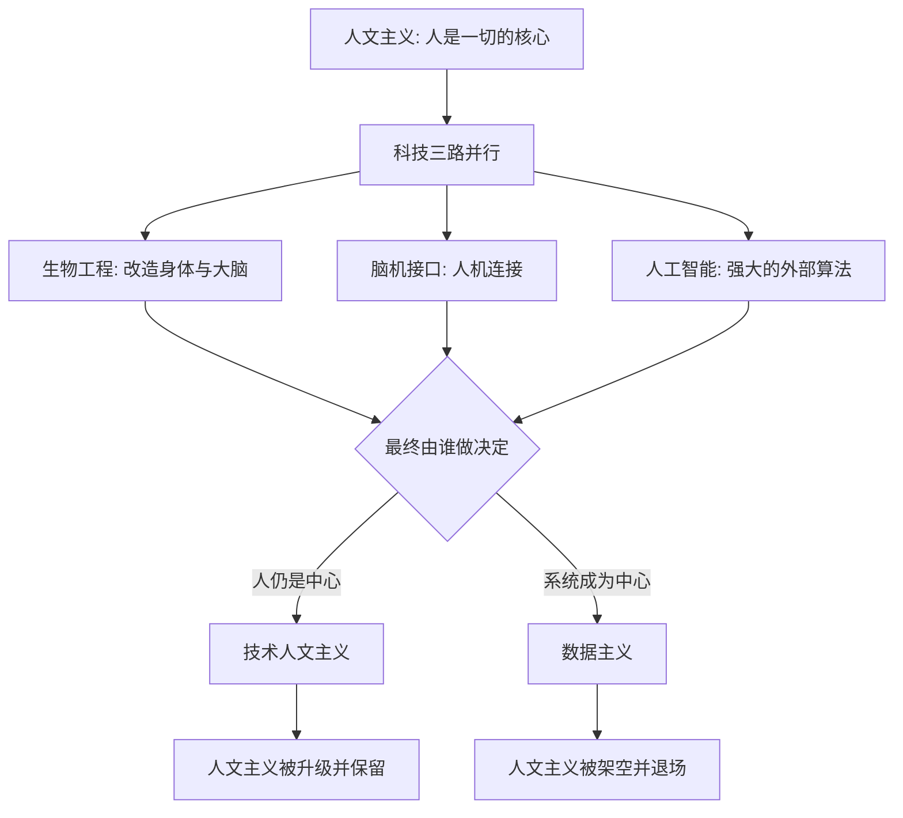

# 17｜数据主义会取代人文主义吗？

> 如果数据主义真的兴起，人文主义会被怎样替代？

---

## 一、先说结论

赫拉利没有给出一个斩钉截铁的答案，而是画出一个分叉。第一种可能是"技术人文主义"：用科技升级人类，但人依然是世界的中心，自由、感受、选择仍然说了算。第二种可能是"数据主义"：把决策交给更高效的数据系统，人从中心退场，成为系统的一个数据来源。两者的分叉点只有一个——**人是否仍然是中心**。前者是人文主义的升级版，后者则可能把人文主义送进历史。

---

## 二、我们先理解一个问题

过去两三百年，现代世界的主流信念是人文主义：人生的意义要自己找，权威来自自己的感受，政治和经济都应围绕"人"来组织。它取代了宗教，成了默认的底层操作系统。

于是问题不再是"数据主义好不好"，而是一个更冷静的追问：

> 如果数据主义真的来了，人文主义会怎么退场？
> 它是被正面击败，还是被慢慢架空——直到人们发现，做决定的已经不是自己？

这个问法很重要，因为历史上信念的更替，很少靠一场决战。

---

## 三、作者到底提出了什么观点？

赫拉利在书的结尾提出两条可能的路径。

**路径一：技术人文主义。**
它仍然以人为中心，只是主张用科技把人"升级"：通过生物工程、脑机接口、人工智能辅助，让人更聪明、更健康、更长寿。在这一路里，人的感受和选择仍然是最高权威，科技只是工具。也就是说，**技术人文主义本质上是人文主义的延续，而不是它的对立面。**

**路径二：数据主义。**
它主张把决策权交给能处理最多信息的系统。因为算法在越来越多的领域比人更准，人们会自愿把选择让出去。在这一路里，人不再是意义与决策的中心，而是数据流中的一个节点。人文主义赖以立足的"个体是可靠的意义来源"这一前提，随之失效。

赫拉利指出，两条路的**分叉点**很清晰：**最终由谁做决定——是人，还是系统。** 只要答案还是"人"，哪怕人已经装上了各种科技外挂，那仍是技术人文主义；一旦答案变成"系统"，人文主义就名存实亡。

---

## 四、把这个观点翻译成人话

可以把未来想象成两个版本。

**版本 A：你还是你，只是更强。**
你戴上某种设备，记忆力变好、判断更准、身体更健康。你做决定时可以调用海量信息，但最后还是你拍板。这像给一个人装上了外挂——权威仍然在"你"这里。

**版本 B：系统替你做决定，因为它更准。**
你不再需要纠结，因为系统会告诉你该吃什么、该投资什么、该和谁在一起。起初你还会复核，后来你懒得复核，因为你发现它确实比你准。渐渐地，你从"决策者"变成"数据源"——先是司机变成了乘客，最后连乘客都算不上，只是路上的一段路况信息。

两个版本的技术基础可能完全相同，差别只在于**最终按钮在谁手里**。

---

## 五、为什么会这样？

关键在于 **C 这个分叉**。

赫拉利的推理是：科技本身不决定方向，**"谁拥有最终决定权"才决定方向**。而麻烦在于，通往两条路的动机是同一个——追求更高的效率和更好的结果。人们为了效率把决策交给算法，一开始只是"辅助"，但只要算法持续更准，"辅助"就会自然地滑向"主导"。这个滑坡不是谁强加的，而是由"更好用"三个字驱动的。

---

## 六、举一个现实生活中的例子

看看 AI 助手是怎么一点点接管写作与部分决策的。

第一阶段：你写东西时会问它——"帮我把这段话改通顺"。它只是工具。
第二阶段：你干脆让它先起草，自己再改。它开始承担主要工作。
第三阶段：你发现它写得比你快，索性直接采用它的版本，只做小幅调整。
第四阶段：你连"要不要写、怎么写、写给谁"都先问它。

每一步都很合理，每一步都让你更省事。但把四步连起来看，你会注意到一个微妙的变化：**决策链条的中心，从"人"慢慢挪到了"系统"**。起初是你主导、AI 辅助；后来是 AI 建议、你确认；再后来是 AI 决定、你接受。

这就是赫拉利说的两条路在现实里的样子：如果最后仍然是你拍板，这是技术人文主义；如果最后你只是点了"同意"，那其实已经是数据主义的雏形。

---

## 七、回到书中重新理解

赫拉利提醒我们：**信念的更替通常不是一场决战，而是一次缓慢的搬家。**

人文主义取代宗教，用了几百年。人们不是某天突然宣布"我不信神了"，而是生活的重心一点点从"神要我做什么"变成"我想要什么"。数据主义若真的崛起，也很可能以同样的方式发生——不是推翻，而是渗入；不是对抗，而是替代。

他也不认为这是必然。赫拉利的态度是：**技术与资本正在同时推动两条路，而人类尚未想清楚自己要哪一条。** 他之所以把两条路并列，不是为了预言，而是为了让我们看见这个分叉的存在——因为一旦看不见，选择权就已经不在自己手里了。

---

## 八、这个观点背后还有什么？

**第一，技术人文主义可能是通往数据主义的桥。** 越是依赖科技升级自己，就越容易把判断外包给系统。想用科技"变强"的动机，和最后"让系统做决定"的结果，可能是同一条路的两端。

**第二，这是权威的第三次搬家。** 权威从神到人，再从人到算法。每一次搬家，都不是因为旧权威被证明是假的，而是因为新权威"更好用"。

**第三，"人是否中心"其实是一个价值问题，不是技术问题。** 技术只会让"把决定交出去"变得可能，要不要交，取决于我们怎么看"人的价值来自哪里"。

**第四，它与自由主义的困境直接相连。** 当个体的感受和选择不再是可靠的意义来源，建在这个前提上的整套制度就会跟着松动——这正是数据主义能趁虚而入的地方。

---

## 九、这个观点有问题吗？

有问题。这里要特别提醒：**"取代"是赫拉利提出的一种尖锐框架，不是学界共识。**

**第一，很多学者认为二者未必是替代关系，更可能是长期混合与共存。** 现实更可能是一段很长的连续谱：算法承担大量分析和建议，人保留关键否决权；某些领域由系统主导，另一些领域仍由人主导。把它说成"二选一"，可能过于整齐。

**第二，"技术人文主义"内部其实有张力。** 它的目标是保住"人是中心"，用的方法却是拆解人——把人还原成可改造的生物机制。用这样的手段去维护人的神圣地位，逻辑上并不轻松。

**第三，赫拉利的二分法可能低估了制度和政治的作用。** 谁做决定，不只取决于技术能力，还取决于法律、监管、所有权和社会博弈。技术给出可能性，制度决定哪种可能性被实现。

**第四，他的判断里含有一个未言明的价值倾向：** 他似乎默认"把决定交出去"就等于"人失去尊严"。但也可以有另一种看法——人把繁琐决策交出去，从而腾出精力做更想做的事，未必就是沦陷。

所以更准确的说法是：赫拉利提供了一个**极有帮助的问题框架**——注意决策的中心正在哪里移动；但"数据主义取代人文主义"更像一个需要长期观察的过程，而不是一个可以盖章的结局。

---

## 十、今天再看这个观点

以下部分是这一框架的现代延伸，不是赫拉利的原话。

赫拉利写作时，AI 助手还只是雏形。今天，从写代码、写文案、做诊断辅助到生成报告，AI 参与决策的深度已经远超当年。这让人机关系出现了新的现实问题：哪些决定可以交给系统，哪些必须由人保留？系统给出建议时，人是否还具备理解和复核它的能力？如果一个人长期不做判断，他的判断力会退化吗？

值得注意的是，"技术人文主义"这个说法在今天常被用于主张"以人为中心地发展 AI"——这已经是一种规范和治理层面的诉求，超出了赫拉利原本的描述性用法。把它当成一个需要持续回答的问题，而不是一个已经选好的答案，或许更接近赫拉利的本意。

---

## 十一、这一篇真正应该记住什么？

1. **赫拉利画出两条路。** 技术人文主义用科技升级人，但仍以人为中心；数据主义让系统接管决策，人从中心退场。

2. **分叉点只有一个：最终谁拍板。** 技术基础可以相同，差别在于决定权在人手里还是在系统手里。

3. **替代往往不是决战，而是搬家。** 人文主义取代宗教用了几百年，数据主义的渗透也可能缓慢而不显眼。

4. **技术人文主义可能是通往数据主义的桥。** 越依赖升级与辅助，越容易把判断权交出去。

5. **"取代"是框架，不是定论。** 很多学者认为更可能是长期混合共存，结局取决于制度与政治，而非技术单方面决定。

---

## 十二、留一个问题

> 如果某一天，算法并非在所有方面都比你强，却在关键决定上"总是更准"，
> 那么坚持"由我自己决定"，究竟是一种尊严，还是一种固执？

---

**下一篇**：两条路也好，共存也好，赫拉利并没有停在抽象的争论上——他其实为人类列出了几种相当具体的未来剧本，而每一种都会分出赢家和被抛下的人。

下一篇我们就来拆开这个问题——**人类的未来可能有哪几种剧本？**
