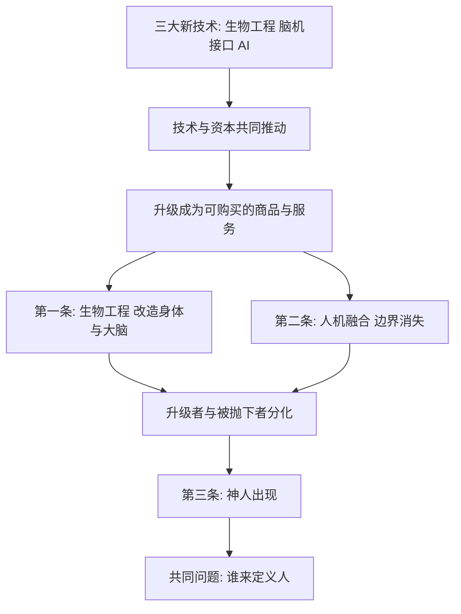

# 18｜人类的未来可能有哪几种剧本？

> 综合全书，赫拉利为人类准备了哪几条可能的未来路径？

---

## 一、先说结论

赫拉利大致给出了三种未来剧本。第一是生物工程，也就是"技术人文主义"：直接改造身体与大脑，让人更强、更久、更聪明，但人仍然是主角。第二是半机械人与算法的融合：假肢、植入设备甚至脑机接口让人的边界模糊，"人"和"机器"不再分得清。第三是"神人"（Homo Deus）出现：少数人升级为近乎神一样的存在，与普通人拉开物种级的差距。三条路可以叠加，而它们最终指向同一个问题——**谁来定义"人"。**

---

## 二、我们先理解一个问题

我们习惯把"未来"想成一幅单一的画面：要么科技造福所有人，要么机器人统治世界。但这种想象太省事了，它跳过了真正的难题。

赫拉利做的不是预言，而是**列出几种可能的方向，让它们互相竞争、也互相叠加**。所以真正值得问的是：

> 这些剧本各自长什么样？它们的差别到底在哪？
> 更重要的是——每一种里，谁受益，谁被抛下？

把这几个问题想清楚，你才会发现"未来会更好还是更坏"这个问法本身就不够用。

---

## 三、作者到底提出了什么观点？

赫拉利在书中勾勒出三条技术路径。

**第一条：生物工程。**
不改变人的"材料"，只改造人的"参数"。通过基因编辑、药物、激素调节、义肢与神经调控，让身体和大脑变得更强。在这条路上，人仍然是主体，技术的角色是"把人升级得更好"。这也就是"技术人文主义"的核心。

**第二条：半机械人与算法融合。**
把机器的部分接入人体，或把人的意识接入网络。假肢、人工耳蜗、可穿戴外骨骼，已经是这条路的早期形态；脑机接口是它更激进的方向。终点是**人机边界消失**——当你的记忆可以外挂、你的决策可以联网，什么算"你"，就成了一个真问题。

**第三条："神人"出现。**
如果前两条路持续走下去，并集中到少数人身上，就可能出现赫拉利所说的 Homo Deus：拥有创造、改造、延长生命等"神一般能力"的新人类。它不一定是全新物种，但足以和普通人拉开物种级的差距。

需要强调的是，**这三条路不是互斥的，而是很可能交织在一起**：一个人可以既做了基因改造，又装了脑机接口，最终进入"神人"的行列。它们共享同一批技术和同一批资本。

---

## 四、把这个观点翻译成人话

可以把三条路想成三种"升级自己"的方案：

- **改血肉**：从内部改造你——修基因、调激素、优化大脑。你还是你，只是性能更好。
- **接外挂**：从外部连接你——装上义肢、植入芯片、随时联网。你和机器的分界线变模糊。
- **换物种**：以上都做到极致，出现一种和普通人类不在同一量级的存在。这就是"神人"。

打个不严谨的比方：第一条像给一台电脑换更好的零件；第二条像把它接上云端；第三条像它变成了另一类设备，和原来的机器已经没法比。

---

## 五、为什么会这样？

三条路同时出现，是因为它们背后有同一组推手。

逻辑链条是这样走的：

技术先提供**可能性**（能改造、能连接、能增强）；市场再提供**动力**（有人愿意为变强买单）；资本提供**资源**（投资、研发、规模化）。三者一合，升级就从"能不能"变成"买不买得起"。

而一旦升级可以购买，它就不会均匀地发生。能买到的人先走一步，买不到的人原地不动——分化就这样产生。这也是为什么三条路最终都会汇到同一个问题：**当一部分人已经和另一部分人不在同一个量级，"人"这个概念的边界由谁来划？**

---

## 六、举一个现实生活中的例子

科幻作品里的"赛博格"（Cyborg），就是把第二条路推到极致的思想实验。

赛博格是"半机械人"的经典形象：一部分血肉，一部分机械。从《攻壳机动队》到《黑客帝国》，这类作品反复追问的其实都是同一个问题——**当人脑可以直接联网，究竟是谁在控制谁？**

《黑客帝国》走得更远：人的身体被当成系统的电池，意识活在模拟世界里，人以为自己在自由选择，其实一切都在程序之中。这个设定之所以让人不安，不是因为它预言了未来，而是因为它把赫拉利的第二条路径——人机融合——推到了逻辑的尽头，逼我们看清楚那个终点可能意味着什么。

科幻不是预言，它更像一面放大镜。它的价值在于：**把趋势推到极端，让我们提前看见自己可能不愿意承认的方向。**

---

## 七、回到书中重新理解

赫拉利不是科幻作家，他列出这三条路，是要做趋势推演，而不是讲故事。

在这三条路里，成熟度差别很大。**生物工程最接近现实**：基因治疗、药物增强、智能义肢都已有实际应用。**半机械人次之**：假肢、人工耳蜗、可穿戴设备已经存在，脑机接口处在早期阶段。**"神人"最遥远，也最危险**：它不是一个已经启动的项目，而是前两条路走到极致、并且成果高度集中时，可能出现的结果。

他真正想说的，不是"哪个会实现"，而是：**这些路都已经在技术的可能性范围内，真正决定走向的，是社会的选择，而不是技术本身。**

---

## 八、这个观点背后还有什么？

**第一，每一条路都藏着"谁受益、谁被抛下"。** 生物工程让买得起的人更健康；人机融合让能接入的人更强大；神人则让升级者与普通人彻底分层。技术从不平均，它总是先奖励有资源的人。

**第二，共同主题是"人的定义权"。** 三条路都在问：什么才算人？装了芯片还算人吗？改造了基因还算人吗？当一部分人和另一部分人差距过大，谁有资格说"我们都是人"？

**第三，驱动力是市场，不完全是科学好奇。** 前沿技术的方向，很大程度由投资回报决定。这意味着"未来长什么样"，首先取决于资本觉得什么有利可图。

**第四，三条路可以叠加，这比单条路更值得警惕。** 单看每一条都还好，叠在一起就可能是"改造过的人 + 联网的人 + 大量普通人"共存的复杂图景。

---

## 九、这个观点有问题吗？

有问题。这里要特别提醒：**赫拉利列出的是思想实验与趋势推演，不是预言，不应被当作必然。**

**第一，技术瓶颈可能比想象中更难突破。** 生物工程改造复杂性状（比如智力）远比改造单个基因困难，脑机接口在稳定性和安全性上仍有巨大障碍。把这些当成"迟早能实现"，是一种乐观的假设。

**第二，社会和政治可以改写结局。** 技术给出可能性，制度决定哪些被允许。生殖系基因编辑在不少国家已被立法限制，这说明**技术路径会被人为地打开或关闭**，而不是自动往前走。

**第三，这套叙事有被科幻化的倾向。** 用"神人""物种"这类词很有冲击力，但也可能把渐进的、平庸的技术变化，包装成戏剧性的物种跃迁，从而高估了断裂感。

**第四，它可能低估了普惠路径。** 同样的技术也可能通过公共医疗、教育普及走向大众，而不是只属于少数人。分化的起点相同，结局未必唯一。

所以更准确的说法是：赫拉利提供了一张**思考未来的坐标图**——它帮你看清技术方向的多种可能；但把它当成"人类命运的三选一"，就把它读窄了。

---

## 十、今天再看这个观点

以下部分是这三条路径的现代延伸，不是赫拉利的原话。

赫拉利写作时，基因编辑、脑机接口都还处在实验室的早期。今天，基因治疗已经开始用于特定疾病，可穿戴外骨骼进入了康复场景，脑机接口出现了面向医疗的临床试验，AI 更是在认知层面充当了"外挂"。三条路的雏形都比当年更清晰了。

但要区分：赫拉利书中的三条路，是一种宏观的哲学推演，核心是"人与技术的边界"；而今天的现实进展，更多是分散的、局部的、受监管约束的技术突破。把每一次进展都读成"神人正在到来"，会既高估速度，也忽略制度在其中的作用。

---

## 十一、这一篇真正应该记住什么？

1. **赫拉利给了三条路。** 生物工程改造人，人机融合模糊边界，神人出现拉开物种级差距。

2. **三条路可以叠加，不是三选一。** 它们共享同一批技术和资本，可能同时发生、互相增强。

3. **每条路都涉及"谁受益、谁被抛下"。** 技术从不平均分配，先走一步的往往是有资源的人。

4. **共同主题是"谁来定义人"。** 边界模糊之后，划线的权力本身就成了最关键的资源。

5. **这是思想实验，不是预言。** 技术瓶颈、社会制度和政治博弈都可能改写结局，结局并非注定。

---

## 十二、留一个问题

> 如果未来真的同时存在"改造过的人""联网的人"和"没升级的人"，
> 那么"人人平等"这句话，是会被重新定义，还是会被悄悄作废？

---

**下一篇**：在三条路里，最让人不安、也最容易被误读的，是那个被叫作"神人"的终点。它真的意味着智人像尼安德特人一样被取代吗？赫拉利的答案，可能和我们想象的完全不同。

下一篇我们就来拆开这个问题——**"神人"会取代智人吗？**
