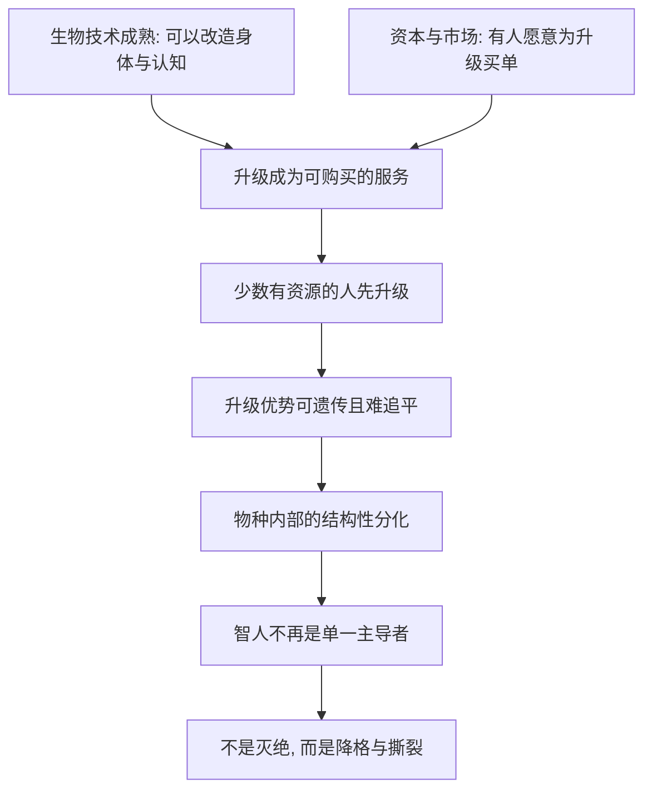

# 19｜“神人”会取代智人吗？

> 赫拉利所说的 Homo Deus（神人）究竟意味着什么？它会终结智人吗？

---

## 一、先说结论

Homo Deus，字面意思是"神人"，指的是通过科技获得神一般能力的新人类——能改造生命、延长寿命、甚至重塑自身。但赫拉利并不认为智人会像尼安德特人那样被"消灭"。他更担心的是另一种结局：智人不会灭绝，而是被**分化**和**降格**。一部分人升级为新的主导者，另一部分人失去被需要的价值。这不是物种灭绝，而是**同一个物种内部的撕裂**。

---

## 二、我们先理解一个问题

提到"神人取代智人"，很多人的第一反应是科幻灾难：机器人或者超人类把普通人消灭掉。但这个理解可能偏了。

赫拉利真正想问的不是"会不会打仗"，而是：

> 如果一小部分人真的能把自己升级成另一种存在，
> 剩下的大多数人，还算不算"人类历史的主角"？

这个问题比"灭绝"更微妙，也更难回答。因为灭绝至少有一个清晰的结局，而"分化"没有——它只是一天天悄悄发生，等你察觉时，世界已经分成了两个层级。

---

## 三、作者到底提出了什么观点？

**第一，Homo Deus 是什么。**
赫拉利用这个词，指的是"像神一样的人"。这里的"神"，不是宗教信仰里的神，而是指人获得了过去只有神才拥有的能力：创造生命、改造身体、超越死亡的边界。它不是某个已经诞生的新物种，而是一个**方向**——人类用科技不断逼近"神一般的能力"。

**第二，与《人类简史》的关键对照。**
在《人类简史》里，智人取代尼安德特人，是一种**物种间的取代**：竞争、排挤，最终尼安德特人消失。但赫拉利指出，这一次的剧本可能不同——**不是取代，而是分化**。

原因在于：升级不是全体人类同步进行的，而是逐个人、逐个家庭、逐个阶层发生的。做得到的人先走一步，做不到的人留在原地。结果是，同一个物种内部出现了生物层面、认知层面都差距巨大的群体。

**第三，升级的伦理与政治后果。**
如果差距只是财富，还可以通过再分配、教育、努力去追平；但如果差距被写进身体——比如通过基因或神经改造——那它就可能是**不可逆、可遗传**的。这时，"人生而平等"就不再只是一个分配问题，而成了一个生物学事实层面的挑战。

**第四，它和"无用阶级"的关系。**
如果说"无用阶级"讲的是多数人在**经济与军事**上失去价值，那么"神人"讲的是更远的一层：一部分人在**物种层面**被拉开距离。前者是"你不再被需要"，后者是"我们已经不是同一种人了"。前者是地位的滑落，后者是定义权的转移。

---

## 四、把这个观点翻译成人话

可以用体育来感受这种差距的性质。

今天的运动员差距，主要来自天赋和训练。再强的天赋，也要靠后天的努力；再穷的孩子，理论上也有机会靠训练追上来。差距是存在，但它是"可追"的。

现在想象另一种差距：如果某些能力可以直接被"买"——不是靠训练，而是靠改造——那么差距就不再是"后天的"，而是"天生的"。一个人再努力，也追不上别人的起点，因为别人的起点已经到了你无法抵达的地方。

赫拉利担心的是：**"起跑线"可能会变成"基因线"。** 当升级可以被购买，社会分层就从"钱多钱少"升级为"是不是同一种存在"。

---

## 五、为什么会这样？

这条路径需要两个条件同时成立，缺一不可。

关键在于 **C → E** 这一步。

如果升级只是一次性的、不可遗传的、人人都能获得的，那它就只是"更好的医疗"。真正让赫拉利警觉的是：升级可能**昂贵、稀缺、且能传给下一代**。一旦这三者叠加，先升级的人和后升级的人之间的差距就会代际累积，越拉越大。

到那时，问题就不再是"谁更富裕"，而是"谁还算是人类文明的一部分"。

---

## 六、举一个现实生活中的例子

看看今天富人孩子的教育军备竞赛，你就能看到这条路径的雏形。

私人补习、一对一辅导、海外夏令营、竞赛集训、昂贵的艺术与体育训练——这些投入本质上都是"用钱买优势"。它带来的差距已经很明显：有些孩子在起跑时就掌握了别人很难获得的资源。

但要注意，**今天的教育竞赛还只是"后天资源"的竞争**。差距可逆、有限，一个普通家庭的孩子仍有机会靠天赋和努力缩小它。真正让赫拉利担忧的是下一步：如果技术允许直接改善认知、情绪或体质，那么这场竞赛就可能从"教育资源之争"升级为"生物学优势之争"。

那时，优势不再写在简历里，而是写在身体里。它无法靠补课追平，还会遗传给下一代。这不是说今天已经在发生基因改造，而是说——**这条路径的终点，正是赫拉利所说的"分化"。**

---

## 七、回到书中重新理解

赫拉利的原始论述，重点既不在于"新物种诞生"，也不在于"人类被消灭"，而在于一句更冷静的判断：**旧物种会分裂。**

他真正担心的是，未来的历史可能不再是"人类的历史"，而是"少数升级者的历史"。剩下的大多数人不是被杀掉，而是被排除在叙事之外——他们继续活着，却不再参与定义世界。

这也解释了为什么他用"神"这个字：神之所以是神，不只是因为力量大，而是因为**神不必向任何人交代**。当一部分人拥有了不必向其余人交代的能力，他们就完成了从"同类"到"另一个层级"的跨越。

---

## 八、这个观点背后还有什么？

**第一，演化的驱动力可能从自然选择变成市场选择。** 过去，什么特征被保留由环境和生存决定；现在，什么特征被"升级"由购买力和市场需求决定。这是一次根本性的转向。

**第二，谁定义"更好"？** 技术本身没有目标，市场有。问题是，当"更好"由付得起钱的人来定义，被升级的就不只是能力，还有价值观本身。

**第三，它对政治秩序是直接挑战。** 民主、人权、法律面前人人平等，全都建立在"人作为同类是平等"的假设上。如果这个假设在生物学层面被打破，整套制度都要重新找地基。

**第四，它把问题从"分配"推向了"定义"。** 无用阶级问的是"你分到多少"，神人问的是"你算不算一类人"。后者更难通过政策修补，因为政策假设大家至少还是同类。

---

## 九、这个观点有问题吗？

有问题。这里要特别提醒：**这仍是高度推测性的判断，技术、社会与政治都可能改写结局。**

**第一，技术难度可能被低估。** 智力、寿命这类性状受大量基因和环境共同影响，远不是编辑一个基因就能搞定的。把"神人"当成迟早会出现的产品，是一种很强的假设，而非已知事实。

**第二，制度可以叫停。** 生殖系基因编辑在许多国家已被严格限制，这说明**人类有能力主动关掉某些路径**。技术提供可能，社会决定是否放行。

**第三，"神人"更像一个修辞，而不是生物学分类。** 它把复杂、渐进、可能平庸的技术演进，压缩成一个戏剧性的词。这个词很有冲击力，但也可能夸大了断裂感。

**第四，也可能出现相反的方向。** 如果相关技术足够便宜并普及，它反而可能提升整体健康水平，而不是制造分层。起点相同，结局可以有多种。

**第五，赫拉利似乎默认了"升级必然导致分裂"。** 但历史上也有技术最终普惠的例子。分化的风险是真实的，但它是不是必然，仍是开放的。

所以更准确的说法是：赫拉利的判断是一记**清醒的警钟**——提醒我们注意升级机会的不均等；但它描述的是一个需要持续观察的可能，而不是一个已经写好的结局。

---

## 十、今天再看这个观点

以下部分是这一判断的现代延伸，不是赫拉利的原话。

赫拉利写作时，基因编辑还局限在少数实验。今天，基因治疗开始用于特定疾病，认知增强药物被讨论，脑机接口进入临床试验，AI 甚至能充当每个人的私人导师。这些进展让"升级"听起来不再遥远。

但要严格区分：赫拉利书中的"神人"，是一个哲学层面的方向推演，核心是"物种内部的撕裂"；而今天的现实，更多是分散的、受监管的医疗与教育技术发展。把它们直接等同于"神人正在诞生"，会误读这一概念的用意——赫拉利想让我们警惕的是不均等，而不是宣布新物种登场。

---

## 十一、这一篇真正应该记住什么？

1. **Homo Deus 是"像神一样的人"。** 它不是宗教意义上的神，而是通过科技逼近"神一般能力"的人类方向。

2. **这次可能不是取代，而是分化。** 智人不会像尼安德特人那样被消灭，更可能在内部被撕裂成不同层级。

3. **危险来自"可购买、可遗传、难追平"的升级。** 当优势写进身体，社会分层就从财富问题变成生物学问题。

4. **它把问题从"分配"推到"定义"。** 无用阶级问"你分到多少"，神人问"你算不算同类"。

5. **这是推测，不是预言。** 技术难度、监管制度和社会选择都可能改写结局，结局并非注定。

---

## 十二、留一个问题

> 如果"变得更强"的能力可以由父母为子女购买，
> 那么当一代人长大后，我们还能不能理直气壮地说：
> "每个人生来都是平等的"？

---

**下一篇**：所有这些问题——算法、升级、分化——最后都会落回一个人身上。当系统比你更懂你，当"做什么"越来越由建议决定，一个普通的个体，还剩下哪些真正属于自己的选择？

下一篇我们就来拆开这个问题——**如果算法比我们更了解自己，我们还能选择什么？**
