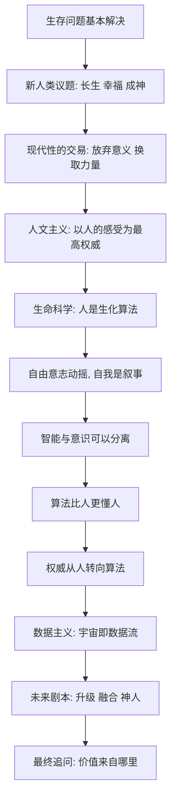

# 20｜如果算法比我们更了解自己，我们还能选择什么？

> 在一个算法无处不在的未来，人类个体还剩下哪些真正的选择？

---

## 一、先说结论

赫拉利在全书最后没有给出乐观或悲观的答案，而是留下一组追问：当"做什么"越来越多由系统建议，"想成为谁"还能不能由自己决定？他认为，人类唯一的出路也许不是比算法更强，而是重新想清楚一件事——**价值到底来自数据处理，还是来自那些无法被计算的东西。** 这不是一个可以用技术解决的问题，而是一个需要每个个体自己回答的问题。它也是整本书留给读者的终极问题。

---

## 二、我们先理解一个问题

前面我们一路推下来：算法越来越懂你，权威从人手里慢慢溜走，数据主义可能成为下一代信念，未来还可能分出好几条路。

但所有这些宏大的判断，最后都要落在一个非常具体的场景上：

> 假设你明天打开手机，系统告诉你今天该做什么、该见谁、该买什么，而且它给出的建议确实比你自己想的更好。
> 那么，"我自己想做什么"，还剩下多少分量？

这个问题没有标准答案。但它的重要性在于：**它不再问人类整体会怎样，而是问你一个人会怎样。** 赫拉利把宏大叙事推到最后，其实是想让读者面对这个无法外包的问题。

---

## 三、作者到底提出了什么观点？

赫拉利并不预测结局。他做的是区分两种不同的"选择"。

**第一种是优化型选择。** 给定一个目标，怎么最高效地达成它。比如怎么最快到达某个地点、怎么最大化收益、怎么提高效率。这类问题，算法几乎肯定比人强，因为它们本质上是计算。

**第二种是意义型选择。** 我到底想要什么目标？我想成为什么样的人？什么才算值得？这类问题，算法无法替你回答，因为它无法替你决定"目标本身"。

赫拉利的观察是：**系统越来越擅长前者，却始终无法替你处理后者。** 所以真正的问题不是"人会不会被算法打败"，而是——**人还愿不愿意、还能不能提出自己的问题。** 只要人还在定义目标，算法就只是工具；一旦人懒得定义目标，只接受系统给的目标，那就不需要谁来取代，人自己就退位了。

---

## 四、把这个观点翻译成人话

用导航来理解最清楚。

导航可以告诉你：哪条路最快、哪个时段不堵、怎么绕开事故。在"怎么走得更快"这件事上，它远胜于人。

但导航永远无法告诉你：**你到底该不该去那个地方。** 它不知道你为什么要出发，不知道这趟行程对你意味着什么，也不知道如果改变目的地，你的人生会不会更好。

算法能优化手段，不能决定目的。赫拉利想说的正是：**当手段越来越聪明，目的的问题反而变得更显眼，也更无人代劳。** 而现代人最常犯的错误，就是把"更高效地做"当成了"知道自己在做什么"。

---

## 五、为什么会这样？

整本书的推理，其实是一条不断收窄的线。把它画出来，就能看清最后这个问题是怎么被逼出来的。

这条线是层层递进的：

人类先解决了生存问题，于是有了余力追求更高的目标；为实现这些目标，现代人做了一笔交易，放弃"宇宙有既定意义"换取力量；于是意义改由人自己承担，人文主义把人的感受奉为权威；但科学随即拆解了"感受"和"自由意志"，让人的中心地位开始松动；当算法在越来越多事情上比人更准，权威就自然转向系统；若系统成为中心，数据主义就登场；而数据主义推向极致，就是关于升级、融合与神人的各种剧本。

走到最后，只剩一个问题没有答案，也**不可能有技术答案**：**如果一切都能被计算，那不能被计算的东西，还值不值得珍惜？**

---

## 六、举一个现实生活中的例子

看一个越来越常见的人生决策：要不要换一份工作。

算法可以帮上很多忙：它能找出行业薪资趋势、预测你的技能匹配度，甚至根据你的行为数据判断你是不是适合这个岗位。这些信息往往比你自己凭感觉搜集的更全面。于是很自然的做法是：**先问系统，再听结论。**

但这里有一层算法无法替你完成的事：**"我想要什么"本身，不是数据能给出的答案。** 系统可以预测你"更可能接受"哪个选项，却无法替你决定"哪个选项值得过"。高薪但重复的岗位、低薪但热爱的方向，二者的取舍涉及价值排序，不是预测问题。算法能优化"达成目标的手段"，却无法替你设定"目标"。

这正好是赫拉利留下的分界：当系统越来越擅长告诉你"怎么走"，你唯一还能守住的，是回答"要去哪儿"。

---

## 七、回到书中重新理解

赫拉利在书的结尾拒绝扮演先知，这一点很值得注意。

他说得很清楚：未来并未写定。技术提供的是可能性，而历史是由选择构成的。他不给答案，不是因为他回避，而是因为**这个问题的答案本来就不该由一位学者来宣布**——它取决于无数个体在无数日常时刻里的选择。

这也解释了为什么他要把"人还能不能提出自己的问题"作为全书最后的落点。赫拉利真正在意的，不是"算法会不会赢"，而是**"人还愿不愿意继续定义自己的目标"**。在他看来，前者是技术趋势，后者才是人的命运。

---

## 八、这个观点背后还有什么？

**第一，"无法被计算的东西"是否真的存在，本身就有哲学争议。** 有人相信爱、尊严、敬畏无法被还原为数据；也有人认为，随着技术发展，一切最终都能被计算。赫拉利把这个争论留给了读者，而没有替我们下定论。

**第二，意义是否可以自造。** 现代性的交易把意义的责任交给了人。如果人可以自己造意义，那么算法再强也造不出"属于你的"意义；如果意义本质上也是算法产物，那么人就没有什么真正不可替代的位置。

**第三，个人的微小选择会累积成集体的方向。** 数据主义不是某天被投票选出来的，它是由无数个"算了，让它帮我决定吧"累积而成的。反过来，无数个"这一步我要自己来"，也能改变方向。

**第四，它和数据的根本分歧在于"价值的来源"。** 数据主义说价值来自对数据处理的贡献；但这本书最后的追问暗示，也许价值恰恰藏在那些无法被计入数据流的东西里。这不是技术之争，而是价值之争。

---

## 九、这个观点有问题吗？

有问题。这里要特别提醒：**赫拉利提出问题的方式很有力，但他同样留下了不少可批评之处。**

**第一，他"不给答案"常常被批评为把难题原样还给读者。** 有人赞赏这种克制，也有人认为，当风险足够大时，学者应该给出更明确的建议，而不只是提出问题。

**第二，"无法计算的东西"这一说法，可能带有浪漫化倾向。** 它诉诸一种直觉上的珍贵感，却没有给出严格的论证。关于这一问题，学界存在不同解释：有人认为确实存在不可还原的体验，也有人认为这只是我们暂时还不了解的计算。

**第三，把责任放回个体，可能低估了结构性压力。** 当一整个社会、整个行业都依赖算法决策，个体"保持判断"的成本会非常高。让人人都做独立判断，说起来动人，做起来困难。

**第四，还有一个更根本的悖论：如果自由意志本身已被质疑，那"保留自己的判断"到底是什么意思？** 这是全书没有彻底解开的结。赫拉利一方面动摇了自由选择的前提，另一方面又似乎希望人珍惜选择——这两者之间，存在张力。

所以更准确的说法是：赫拉利在这个问题上**没有给出结论，而是给了一个方向**——把注意力从"算法有多强"转向"我们还想不想定义自己"。这个转向很有价值，但它是一个开放的问题，不是一套可执行的方案。

---

## 十、今天再看这个观点

以下部分是这一思路的现代延伸，不是赫拉利的原话。

赫拉利写作时，算法主要还停留在推荐和信息分发。今天，AI 助手已经进入写作、编程、诊断、教学和决策辅助，个体与算法的接触面比当年宽得多。于是"如何与算法共处"从哲学问题变成了日常技能：有意识地选择信息源、在关键决定上保留自己的判断、避免让系统替你设定目标。

这些实践本身，不是赫拉利给出的方法，而是今天的人在面对他那组追问时，逐渐摸索出的应对方式。把它们当成答案并不合适，当成一种**把问题落地的尝试**更准确。赫拉利真正提醒的是：技术会越来越好用，而"更好用"正是它最容易让人让出决定权的方式。

---

## 十一、这一篇真正应该记住什么？

1. **算法擅长优化手段，无法替你决定目的。** 它能告诉你最快的路，不能告诉你该不该去。

2. **真正的分界是"谁在定义目标"。** 只要目标还由人设定，算法就只是工具；一旦目标也交出去，人自己就退位了。

3. **自由不是"不被算法影响"，而是在关键处保留判断。** 在协作里守住定义问题、设定标准、承担后果这三件事。

4. **方向由无数日常小选择累积而成。** 数据主义不是被投票选出来的，它是被一次次方便地让权堆出来的。

5. **终极问题没有技术答案。** 价值究竟来自数据处理，还是来自无法被计算的东西——这需要每个人自己回答。

---

## 十二、留一个问题

> 如果算法真的能在每一件事上给你更好的建议，
> 那么你坚持"这一步我要自己做主"，
> 是为了得到一个更好的结果，还是为了证明——决定的人仍然是你？

---

这本书从一个乐观的观察开始：饥荒、瘟疫和战争似乎已被人类基本驯服，于是我们第一次有余力，去追问"活得更好"甚至"长生、幸福、成神"这些以前无从奢望的问题。但沿着这条线走下去，赫拉利不断把问题往深处推：意义要靠自己承担，而"自己"正在被科学和算法一点点拆解；权威可能从人的感受转到数据处理系统；未来可能分出升级、融合与神人的多条路。

他没有给出结论，也没有替我们选择。他只是把同一个问题，从人类整体一直问到每一个具体的你：当外部的一切都越来越"聪明"，你打算把决定权交给谁？

这个问题没有标准答案，也不需要与赫拉利保持一致。真正重要的，是你带着自己的经历和判断，重新读一遍这些线索，然后给出**属于你自己的理解**。书到这里结束，你的思考才刚刚开始。
