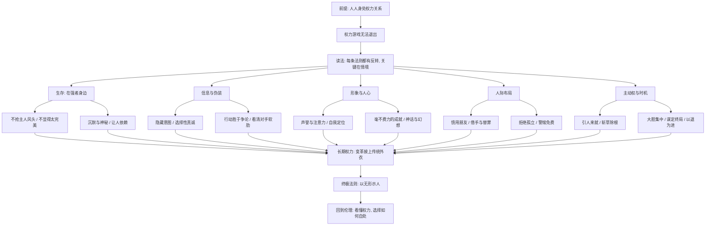

# 《权力的48条法则》深度解读系列

## 系列简介

《权力的48条法则》（The 48 Laws of Power）是美国作家罗伯特·格林于 1998 年出版的成名作，由书籍制作人尤斯特·艾尔弗斯参与策划。它从三千年的历史里挑出大量宫廷、战争、商业与骗局的故事，把人与人之间争夺影响力的规律，压缩成 48 条冷峻的“法则”。

这本书最重要的问题其实只有一个：**既然人人都身处权力关系之中，一个人怎样才能看清它、不被它吞没？** 格林的回答毫不温情——他假设世界像一座宫廷，所有人都在一边保持体面、一边暗中较量；不承认这一点的人，往往最先成为别人手里的棋子。

它因此被一些人奉为“职场与人性的操作手册”，也被另一些人斥为“最危险的书”，甚至被美国部分监狱列为禁书。正因争议巨大，它更值得被认真读：不是为了学会算计，而是为了看懂算计——知道别人可能在按哪个按钮，也知道自己在什么时候不该按。

本系列不按 48 条的原始顺序逐条罗列，而是把相关法则合并，重组为 **27 个核心问题**：先建立读懂这本书的框架，再依次拆解“在强者身边生存”“信息与伪装”“形象与人心”“人际布局”“主动权与时机”，最后落到“无形”这一终极法则，并回到伦理：我们究竟该怎样对待权力。

---

## 全书核心问题

| 层次 | 问题 |
|---|---|
| 前提问题 | 权力游戏为什么无法退出？这本书的法则该怎么读？ |
| 生存问题 | 在比自己强的人身边，怎样既不招祸又能被需要？ |
| 信息问题 | 意图、真诚、争论与对人的洞察，怎样决定谁掌握主动？ |
| 形象问题 | 声誉、姿态、奇观与神话，为什么比事实本身更有力量？ |
| 关系问题 | 朋友、敌人、替身、依附与“免费”，各自藏着什么风险？ |
| 行动问题 | 何时进攻、何时示弱、何时停手，怎样掌握主动权与时机？ |
| 终极问题 | 为什么最高的权力是“无形”？读懂之后，我们该如何自处？ |

---

## 全书知识地图



---

## 全系列目录

### 第一部分：读懂这本书

#### 01｜为什么《权力的48条法则》被称为“最危险的书”？

核心问题：一本讲权术的书，为什么同时被奉为宝典、又被列为禁书？

核心观点：格林刻意剥掉了道德外衣，把权力当作一门只讲“有效”不讲“应该”的技术来描述。这让它显得冷酷甚至危险；但它真正提供的是一副看穿权力运作的眼镜——同一套知识，可以用来操纵，也可以用来识别和防御操纵。

理解难度：★★☆☆☆

关键词：非道德、权术、马基雅维利、双刃剑、防御性阅读

---

#### 02｜为什么格林说权力游戏谁也退不出？

核心问题：为什么“我不想玩权力游戏”本身也是一种玩法？

核心观点：格林在序言中把现代社会比作宫廷：人人都依赖他人、都想要影响力，却必须表现得文明谦和。拒绝承认这场游戏的人，并没有真正退出，只是放弃了理解规则的机会。他因此主张先掌控情绪、学会耐心与间接，而不是假装自己置身事外。

理解难度：★★☆☆☆

关键词：宫廷隐喻、间接、情绪控制、耐心、假装不玩

---

#### 03｜为什么每条法则都附带一个“反转”？

核心问题：48 条法则彼此矛盾，读者到底该信哪一条？

核心观点：书中每条法则都按“违反—遵守—关键—意象—权威—反转”的结构展开，而“反转”专门说明这条法则何时失效。格林并不提供一套可以机械执行的规则，而是训练一种情境判断：沉默与曝光、神秘与坦白，取决于时机与对象。

理解难度：★★★☆☆

关键词：反转、情境判断、历史案例、法则冲突、结构

---

### 第二部分：在强者身边如何生存

#### 04｜为什么永远不要让上级黯然失色？

核心问题：为什么表现太出色，反而可能毁掉你在上级眼中的位置？

核心观点：第 1 条法则指出，身居高位者需要感到自己优越；下属的光芒一旦让他们感到不安，才华就会变成威胁。格林结合第 24 条“扮演完美的廷臣”，主张把功劳归于上级、让自己的聪明为对方所用，而不是与对方竞争。

理解难度：★★☆☆☆

关键词：第1条、第24条、上级的不安全感、廷臣、归功

---

#### 05｜为什么太完美、太特立独行的人容易被针对？

核心问题：为什么优秀与与众不同，会在同辈中招来敌意？

核心观点：第 46 条提醒，显得完美会激起嫉妒，而嫉妒往往伪装成批评与疏远；第 38 条主张“想怎么想都行，但行为要与他人一致”，因为公开挑战群体习惯会被视为冒犯。格林建议适度暴露无伤大雅的缺点，把独立的思想留在心里。

理解难度：★★★☆☆

关键词：第46条、第38条、嫉妒、从众、示缺

---

#### 06｜为什么沉默和神秘本身就是一种力量？

核心问题：为什么说得越少、出现得越少、越让人猜不透，反而越有分量？

核心观点：第 4 条“言多必失”、第 16 条“利用缺席提升敬意”和第 17 条“培养不可预测性”指向同一个机制：信息越少，别人越需要猜测与投射，你的形象就越被放大；而可预测的人，很容易被看穿和摆布。

理解难度：★★★☆☆

关键词：第4条、第16条、第17条、沉默、稀缺、不可预测

---

#### 07｜为什么让人依赖你，比让人感激你更可靠？

核心问题：为什么恩情会被遗忘，而依赖不会？

核心观点：第 11 条主张让别人离不开你，第 13 条主张求助时诉诸对方的利益而非怜悯或感激。两者背后是同一个冷峻判断：感激会随时间衰减，利益和依赖才能持续绑定关系——被需要，比被喜欢更安全。

理解难度：★★★☆☆

关键词：第11条、第13条、依赖、利益、不可替代

---

### 第三部分：信息、意图与伪装

#### 08｜为什么真正的意图不能写在脸上？

核心问题：为什么把目标说出口，往往就等于把主动权交了出去？

核心观点：第 3 条“隐藏你的意图”与第 14 条“表面是朋友，实际当间谍”讲的是信息不对称：别人一旦知道你想要什么，就能提前防备或加以利用。格林主张用“烟幕”转移视线，同时在日常交往中收集对方的信息。

理解难度：★★★☆☆

关键词：第3条、第14条、烟幕、信息不对称、情报

---

#### 09｜为什么一点真诚和慷慨，最能让人放下戒备？

核心问题：为什么一次看似吃亏的坦诚，反而能换来更大的信任？

核心观点：第 12 条指出，一次恰到好处的诚实或慷慨，会让人放下对你所有行为的怀疑；第 21 条“装傻以捉傻”则利用人们喜欢觉得自己更聪明的心理。两者都在操纵“戒备心”——人一旦认定你无害，就会停止审视你。

理解难度：★★★☆☆

关键词：第12条、第21条、选择性诚实、戒备心、示拙

---

#### 10｜为什么赢得争论，往往会输掉人心？

核心问题：为什么在嘴上赢了，事情却常常输了？

核心观点：第 9 条主张“用行动而非争论取胜”：争论即使赢了，也会让对方丢面子、积怨恨，而行动和示范直接让人看见结果。第 44 条“镜像效应”进一步说明，模仿对方的行为，比辩驳更能让对方看清自己、失去防备。

理解难度：★★★☆☆

关键词：第9条、第44条、示范、面子、镜像效应

---

#### 11｜为什么要先看清对手，再找到他的软肋？

核心问题：为什么同一种手段，用在不同人身上结果截然相反？

核心观点：第 19 条提醒“知道你在与谁打交道”，冒犯错误的人会招来长久的报复；第 33 条主张找到每个人的“拇指夹”——不安、欲望或隐秘的需要。影响他人的前提是理解他人，而人的弱点往往藏在他最在意的东西里。

理解难度：★★★★☆

关键词：第19条、第33条、识人、软肋、动机

---

### 第四部分：形象与人心

#### 12｜为什么声誉是权力的基石？

核心问题：为什么人们对你的看法，往往比你实际做了什么更重要？

核心观点：第 5 条说“声誉至关重要，要以生命捍卫”，第 6 条说“不惜一切代价吸引注意力”。格林认为声誉替你提前完成了一半的说服，而默默无闻比声名狼藉更可怕；但声誉极易被攻击，一旦出现裂缝，就会迅速崩塌。

理解难度：★★☆☆☆

关键词：第5条、第6条、声誉、注意力、曝光

---

#### 13｜为什么你如何看待自己，别人就如何对待你？

核心问题：为什么身份和姿态可以被“塑造”，而不是只能被接受？

核心观点：第 34 条主张“以自己的方式高贵”，第 25 条主张“重塑自我”，第 41 条提醒“不要踏进伟人的鞋子”。三者合起来说明：别人往往按照你呈现的样子对待你，一个人的形象不是出身给定的，而是可以主动设计、并且必须走出他人阴影的。

理解难度：★★★☆☆

关键词：第34条、第25条、第41条、自我塑造、姿态、身份

---

#### 14｜为什么成就要看起来毫不费力？

核心问题：为什么把辛苦藏起来，反而更显得强大？

核心观点：第 30 条“让成就看起来毫不费力”与第 37 条“制造引人注目的奇观”都作用于观众的感知：暴露努力会让人看到你的极限，而流畅的结果与震撼的画面则制造出“天赋”与“神奇”的印象。人们记住的是画面，而不是过程。

理解难度：★★★☆☆

关键词：第30条、第37条、轻松感、奇观、视觉符号

---

#### 15｜为什么人们总愿意追随一个“神话”？

核心问题：为什么越是模糊宏大的承诺，越能吸引追随者？

核心观点：第 27 条讲如何利用人们“想要相信”的需要打造信徒般的追随者，第 32 条主张“迎合人们的幻想”。格林指出，现实往往令人失望，而能提供希望、意义与归属感的人，就能获得超出理性的忠诚。

理解难度：★★★★☆

关键词：第27条、第32条、信仰需求、幻想、追随者

---

### 第五部分：人际布局

#### 16｜为什么朋友可能比敌人更危险？

核心问题：为什么把重任交给朋友，常常比交给昔日的对手更冒险？

核心观点：第 2 条认为，朋友容易因嫉妒和“理所应当”而背叛，而被你收服的敌人反而更有动力证明自己；第 20 条“不要对任何人做出承诺”则主张保持独立，让各方都来争取你。格林把关系看作需要清醒管理的资源，而不是情感的避风港。

理解难度：★★★☆☆

关键词：第2条、第20条、友谊、敌人、独立性

---

#### 17｜为什么权力者总让别人出力、让别人背锅？

核心问题：为什么很多成就与失误，站在台前的都不是真正的决策者？

核心观点：第 7 条“让别人替你工作，但功劳归你”与第 26 条“保持双手清白”揭示了权力的分工：功劳向上集中，脏活与风险向外转移，替罪羊和“猫爪”让决策者始终保持体面。这是书中最具争议、也最需要从防御角度理解的部分。

理解难度：★★★★☆

关键词：第7条、第26条、借力、替罪羊、功劳归属

---

#### 18｜为什么筑起高墙，反而最不安全？

核心问题：为什么越是想保护自己的人，越容易陷入危险？

核心观点：第 18 条指出，孤立会切断信息和支持，让人看不见正在逼近的威胁；权力需要流通与接触。第 10 条“远离不幸之人”则从反面提醒：接触不等于不设防，有些人的情绪和困境会像传染病一样把你拖下水。关键在于选择与谁保持连接。

理解难度：★★★☆☆

关键词：第18条、第10条、孤立、信息流、情绪传染

---

#### 19｜为什么“免费”的东西往往最贵？

核心问题：为什么贪便宜的人，常常在不知不觉中失去主动权？

核心观点：第 40 条“蔑视免费的午餐”认为，免费的东西往往附带隐性的义务、操控或欺骗；而懂得为想要的东西付出全价、并且慷慨花钱的人，才能保持独立与尊严。金钱与恩惠从来不只是交易，它们是权力关系的载体。

理解难度：★★★☆☆

关键词：第40条、免费、隐性代价、人情债、慷慨

---

### 第六部分：主动权与时机

#### 20｜为什么要让对手主动来找你？

核心问题：为什么掌握主场的人，几乎总能掌握结果？

核心观点：第 8 条“让别人来找你”、第 31 条“控制选项”和第 39 条“搅浑水以捕鱼”都在争夺同一样东西——主动权。让对方在你设定的场地、用你发的牌、在情绪失控时行动，你就能以更少的力量取得更大的效果。

理解难度：★★★★☆

关键词：第8条、第31条、第39条、主动权、诱饵、设定选项

---

#### 21｜为什么格林主张对敌人“斩草除根”？

核心问题：为什么格林认为对敌人手下留情，往往会埋下祸根？

核心观点：第 15 条“彻底粉碎你的敌人”认为，残存的敌人会伺机复仇，半途而废的胜利等于没有胜利；第 42 条“打击牧羊人，羊群就会四散”主张找到麻烦的源头。这是全书最冷酷的法则之一，也最需要放回历史与现代法治情境中重新审视。

理解难度：★★★★☆

关键词：第15条、第42条、彻底胜利、源头、复仇

---

#### 22｜为什么大胆出击，反而比小心谨慎更安全？

核心问题：为什么犹豫和分散，常常比冒险更致命？

核心观点：第 28 条“大胆行动”认为，犹豫会暴露弱点，而大胆会掩盖失误并震慑对手；第 23 条“集中你的力量”主张把资源聚焦在一个点上，而不是四处撒网。格林认为胆量和专注都是可以训练的，真正危险的是半心半意。

理解难度：★★★☆☆

关键词：第28条、第23条、胆量、专注、犹豫的代价

---

#### 23｜为什么要把计划一直想到结局？

核心问题：为什么很多人赢了开局，却输了结局？

核心观点：第 29 条“周密计划直到结局”、第 35 条“掌握时机的艺术”和第 47 条“胜利时要懂得适可而止”组成一组关于时间的法则：只有看清终点，才知道何时出手、何时等待、何时收手。被胜利冲昏头脑，和被失败吓退一样危险。

理解难度：★★★★☆

关键词：第29条、第35条、第47条、终局、时机、见好就收

---

#### 24｜为什么示弱有时是最强的反击？

核心问题：为什么投降和无视，有时比正面对抗更有力？

核心观点：第 22 条“运用投降策略”主张在处于弱势时主动退让，保存实力、等待时机、让对手放松；第 36 条“蔑视你得不到的东西”认为，无视是最好的报复，过度回应只会放大对方。退让不是软弱，而是把冲突转到对自己有利的时间和地点。

理解难度：★★★☆☆

关键词：第22条、第36条、投降策略、以退为进、无视

---

### 第七部分：长期权力与终极法则

#### 25｜为什么变革要披上传统的外衣？

核心问题：为什么急于推翻一切的改革者，往往先被推翻？

核心观点：第 45 条“宣扬变革的必要，但不要一次改革太多”认为，人们本能地依恋熟悉的形式，激进变革会引发反扑；第 43 条“攻心为上”主张赢得人心而非强迫服从。聪明的变革者会保留旧的名义和仪式，悄悄换掉内核。

理解难度：★★★★☆

关键词：第45条、第43条、渐进变革、人心、旧瓶新酒

---

#### 26｜为什么“无形”是权力的最高形态？

核心问题：为什么格林把“以无形示人”放在最后一条？

核心观点：第 48 条认为，任何固定的形态都会被对手研究、预判和攻击，而像水一样随势而变的人最难被击败。它是前 47 条的总纲：所有法则都只是形态，真正的能力是在变化中不断调整——这也是“反转”的最终意义。

理解难度：★★★★★

关键词：第48条、无形、适应性、流动、总纲

---

#### 27｜读完48条法则，我们究竟该怎样对待权力？

核心问题：看懂了权力的全部把戏之后，一个普通人该如何选择？

核心观点：48 条法则描述的是权力“如何运作”，而不是人“应该怎样活”。读完全书，读者面临的真正问题是：用它来操纵，用它来防御，还是用它来看清自己的处境后，有意识地选择不做某些事。权力的知识本身中性，选择却有代价。

理解难度：★★★★☆

关键词：伦理、防御、边界、自我选择、系列收束

---

## 推荐阅读顺序

**主线顺序（推荐）：01 → 27。**

```text
第一段｜读懂这本书（01–03）
   为什么危险 → 为什么退不出 → 怎样读反转
        ↓
第二段｜对上与自保（04–07）
   不抢风头 → 不显完美 → 沉默神秘 → 让人依赖
        ↓
第三段｜信息与形象（08–15）
   隐藏意图 → 选择性真诚 → 行动胜于争论 → 识人
   → 声誉 → 自我塑造 → 毫不费力 → 神话
        ↓
第四段｜关系与行动（16–24）
   朋友与敌人 → 借手替罪 → 拒绝孤立 → 警惕免费
   → 主动权 → 斩草除根 → 大胆集中 → 谋定终局 → 以退为进
        ↓
第五段｜终极与反思（25–27）
   渐进变革 → 以无形示人 → 如何对待权力
```

**阅读建议：**

- **想先抓住骨架**：读 01、02、03、04、12、20、26、27 八篇。
- **对职场生存感兴趣**：04、05、06、07、10、17 是核心。
- **对谈判与竞争感兴趣**：08、11、20、22、23、24 更有用。
- **想学会识别操纵、保护自己**：09、15、17、19、21 五篇最值得细读。
- **想练习批判性阅读**：重点看 01、03、21、27 四篇。

---

## 全系列状态

> 本系列共 27 篇，正文已全部完成。
