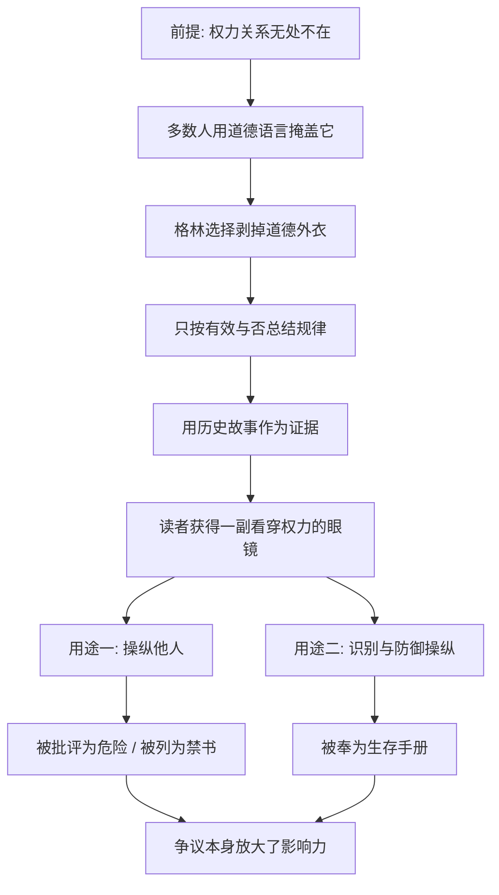

# 01｜为什么《权力的48条法则》被称为“最危险的书”？

> 一本讲权术的书，为什么同时被奉为宝典、又被列为禁书？

---

## 一、先说结论

格林写这本书时，做了一个大多数作者不敢做的选择：**把道德从权力的讨论里拿掉。**

他不问“应不应该”，只问“有没有效”。于是书里充满了欺骗、伪装、借刀杀人、斩草除根这样的建议，而且每一条都配着真实的历史故事作为“证据”。这让它显得冷酷，甚至危险。

但危险的并不是知识本身。这本书真正提供的，是一副看穿权力运作的眼镜：**同一套法则，既可以拿来操纵别人，也可以拿来识别和防御别人的操纵。** 读者最终变成什么样的人，取决于他拿这副眼镜去做什么。

---

## 二、我们先理解一个问题

大多数讲“人际关系”的书，给人的建议都差不多：真诚待人、多替别人着想、善良终有回报。

这些话没错，可生活里总有一些时刻，会让人对它们产生怀疑：

> 为什么那个最会表现的同事升得最快，而埋头干活的人一直原地踏步？
> 为什么一个人说了实话，反而被孤立？
> 为什么有些人明明没做什么，却总能把功劳揽到自己身上？

当“好人好报”的解释不够用时，人们就开始寻找另一种解释。《权力的48条法则》正好站在了这个缝隙里。它说：你之所以看不懂，是因为你一直在用道德的眼光看一场权力的游戏。

问题是：一本公开教人“隐藏意图”“利用敌人”的书，到底是在揭示真相，还是在制造更多的算计者？

---

## 三、作者到底提出了什么观点？

格林的核心立场可以概括为三点。

**第一，权力是人类生活中无法回避的力量。** 他认为，人天生讨厌感到无能为力，所以几乎所有人都在以某种方式追求影响力——只是很多人不愿承认。

**第二，权力有它自己的规律，这些规律与道德无关。** 他从三千年的历史中挑出大量案例：法国宫廷、中国战国与楚汉之争、意大利城邦、近代骗子与商人，从中归纳出 48 条“法则”。每一条都配有正面遵守的故事和反面违反的故事，告诉读者：守规则的人得到了权力，违反规则的人付出了代价。

**第三，与其假装这些规律不存在，不如把它们看清楚。** 格林在序言里明确表示，他写的是权力“如何运作”，而不是“应该如何运作”。他把自己放在马基雅维利的传统里——五百年前，马基雅维利在《君主论》里做过同样的事：不讲君主应该多么仁慈，而讲君主怎样才能保住权力。

所以，这本书的“危险”是被刻意设计出来的。**它把一件大家心照不宣的事，写成了一本明码标价的说明书。**

---

## 四、把这个观点翻译成人话

打个比方。

一本讲“常见诈骗手法”的书，里面会详细写骗子怎么冒充客服、怎么制造紧迫感、怎么一步步让人转账。

这本书危险吗？对骗子来说，它是一本教材；对普通人来说，它是一本防骗手册。**书的内容一样，用法完全不同。**

《权力的48条法则》就是一本关于“权力手法”的书。它没有告诉你哪些手法是好的、哪些是坏的，只是把它们一条条摆出来，并且展示它们为什么有效。

区别在于，诈骗书的作者通常会站在受害者一边，而格林刻意不站队。他用一种近乎欣赏的语气讲述那些冷酷的成功者，这让很多读者感到不适——**因为他不仅描述了黑暗，还没有表现出对黑暗的厌恶。**

这就是这本书让人又爱又怕的原因：它诚实得近乎冒犯。

---

## 五、为什么会这样？

为什么一本历史故事集，会引起如此两极的反应？可以这样拆开它的逻辑：

关键在 **C → D** 这一步。

在日常生活中，人们谈论权力时总是戴着道德的滤镜：我们说某人“会做人”，而不说他“善于操控”；我们说某人“情商高”，而不说他“懂得利用别人的弱点”。滤镜让权力的运作变得模糊，也让人感到安全。

格林把滤镜拿掉之后，同样的现象突然变得赤裸裸——这就是不适感的来源。

而 **F → G / H** 的分叉，决定了这本书的命运。它被一些美国监狱列为禁书，理由之一是担心它被用来操纵他人、组织帮派；与此同时，它又在企业管理者、政治顾问、娱乐明星中广为流传，被当作理解人性的读本。**两种评价都在证明同一件事：这套知识确实有力量。**

---

## 六、举一个现实生活中的例子

假设一家公司里，有两位同事在同一个月读了这本书。

**第一位同事**读完后，开始在工作中“实践”：开会时刻意少说话，营造神秘感；把下属的方案稍加修改后以自己的名义提交；和其他部门的人交往时，处处打探消息。短期内，他似乎更“有分量”了。但半年后，团队里的人开始对他保持距离，没人愿意把好点子告诉他。

**第二位同事**读完后，做的事情完全不同。她开始注意到：为什么领导总是在关键会议前“碰巧”单独找某些人聊天？为什么某个同事总在自己提出方案后立刻表示“我也一直这么想”？为什么部门合作时，风险总是落到她的头上？她没有去模仿这些手法，而是学会了在邮件里留下记录、在汇报前先和领导确认分工、不再在公开场合毫无保留地分享全部计划。

同一本书，第一位同事拿它当武器，第二位同事拿它当地图。

**这正是这本书的双刃性：它教会你看见游戏，但不替你决定怎么玩。**

---

## 七、回到书中重新理解

现在再回头看格林的写法，就能理解他为什么要这样安排。

书中每一条法则，都不是先讲道理，而是先讲故事：某位廷臣如何因为抢了国王的风头而身陷囹圄，某位将军如何因为对敌人手下留情而最终败亡。故事之后，才是格林的“解读”和“关键”。

这种写法的效果是：**读者不是在接受一个观点，而是在目睹一个后果。** 你很难反驳一个历史事实，于是就更容易接受从中提炼的“法则”。

同时，格林在每条法则的末尾都设置了“反转”，说明这条法则在什么情况下会失效。这说明他并不认为这些法则是铁律——它们更像一本观察笔记，而不是一本行为规范。

所以，把这本书当成“成功学”来读，是对它的误解；把它当成“权力的观察报告”来读，才更接近它的本意。

---

## 八、这个观点背后还有什么？

**第一，“非道德”不等于“不道德”。** 格林的立场是描述性的：他描述权力如何运作，不直接鼓吹人们去作恶。但这种区分在阅读中很容易模糊——当一本书反复展示“冷酷者获胜”时，它本身就在传递一种价值取向。

**第二，这本书的前提是一种特定的人性观。** 它假设人与人之间本质上是竞争关系，每个人都在追求自己的利益。这种假设在宫廷、战场、激烈的商业竞争中确实适用，但在家庭、友谊、合作型团队中，未必是全部真相。

**第三，它的“危险”很大程度上来自于读者的处境。** 一个在高度竞争、信任缺失的环境中挣扎的人，会觉得这本书句句是真理；一个生活在相互信任的环境中的人，则可能觉得它阴暗而偏执。**书中的世界，是不是你的世界，决定了你会怎样读它。**

**第四，它与马基雅维利、孙子、克劳塞维茨一脉相承。** 格林并不是第一个把权力当作技术来研究的人，他只是把古代的战略智慧，翻译成了现代人日常可用的语言。

---

## 九、这个观点有问题吗？

这本书的争议，主要集中在以下几个方面。

**第一，历史案例存在“选择性”。** 格林从浩如烟海的历史中挑选了支持每条法则的故事，却很少讨论那些遵守了法则却失败、违反了法则却成功的反例。这种写法有很强的说服力，但也容易让读者误以为这些法则是普遍规律。严格来说，这是一种“幸存者叙事”——被讲出来的，往往只是结果符合结论的那部分。

**第二，部分历史细节经过了戏剧化处理。** 一些历史学者和评论者指出，书中不少故事来自轶事和传说，细节未必经得起考证。格林更像一位讲故事的人，而不是一位严谨的历史学家。读者在引用这些故事时，应该把它们当作“寓言”，而非“史实”。

**第三，它对合作与信任的价值估计不足。** 现代社会的很多成就，来自长期、大规模的合作，而长期合作恰恰依赖信任和声誉。一些学者从博弈论的角度指出，在重复博弈中，欺骗和操纵的长期成本很高，诚信反而往往是更好的策略。这一点，格林在书中触及不多。

**第四，但它对权力现实的观察，确实击中了很多人回避的真相。** 办公室政治、组织内部的功劳之争、谈判中的心理博弈，这些现象真实存在。一本书敢于把它们摆上台面，本身就有价值。

**所以更准确的说法是**：这本书是一面放大镜，它把权力关系中阴暗的那一面放大了给你看。放大镜下看到的东西是真的，但它不是世界的全部。

---

## 十、今天再看这个观点

以下部分是基于格林思想的现代延伸，不是他在书中的原话。

这本书出版于 1998 年，那时互联网刚刚兴起。今天回看，它所描述的很多手法，已经从宫廷与办公室，扩展到了一个更大的舞台。

在社交媒体上，“吸引注意力”“打造形象”“制造神秘感”变成了每个普通人都可以操作的事情；在平台经济中，“让别人依赖你”“控制选项”变成了产品设计的基本逻辑；在网络舆论中，“声誉”的建立与崩塌，速度比任何宫廷都快。

也就是说，**格林描述的权力法则，并没有因为时代变化而失效，反而因为技术被放大了。** 这使得“看懂权力”变得比以往更加重要——不是为了成为操纵者，而是为了在一个处处都有人试图影响你的环境里，保持清醒。

---

## 十一、这一篇真正应该记住什么？

1. **这本书刻意剥掉了道德外衣。** 它只讨论权力如何运作，不讨论权力应该如何运作，这是它冷酷和争议的根源。
2. **同一套知识有两种用法。** 它可以被用来操纵他人，也可以被用来识别和防御操纵，关键在读者的选择。
3. **书中的故事是寓言，不是定律。** 案例经过挑选和戏剧化，适合理解规律，不适合当作普遍真理。
4. **它的人性假设并不普遍。** 在竞争性环境里它很有解释力，在合作与信任占主导的关系里则要打折扣。
5. **读这本书的正确姿势是“看懂”，而不是“照做”。** 把它当作一份权力的观察报告，而不是一本行为手册。

---

## 十二、留一个问题

> 如果一本书教会了你识别所有的操纵手法，
> 那么当你发现自己也在不知不觉中使用这些手法时，
> 你会停下来，还是告诉自己“大家都这样”？

---

那么，格林凭什么认定“大家都这样”？他是否真的相信，每个人都身处权力游戏之中，连那些声称自己“从不玩心机”的人也不例外？

下一篇，我们就来看这本书最根本的前提——**为什么格林说权力游戏谁也退不出？**
