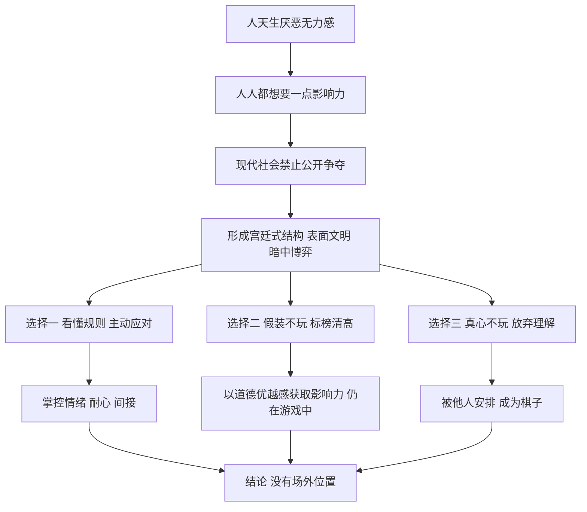

# 02｜为什么格林说权力游戏谁也退不出？

> 为什么“我不想玩权力游戏”本身也是一种玩法？

---

## 一、先说结论

格林在序言里给整本书立了一个前提：**现代社会就像一座宫廷。**

人人都依赖别人，人人都想拥有一点影响力，却又必须表现得文明、谦和、不争。在这样的环境里，没有人能真正站到场外。那些宣称“我不玩这一套”的人，并没有退出，只是换了一种玩法——有时是更隐蔽的玩法，有时则是放弃了理解规则的机会，成为别人棋盘上的棋子。

所以格林的建议不是“去争”，而是先承认游戏存在，再学会掌控情绪、保持耐心、懂得迂回。

---

## 二、我们先理解一个问题

很多人读到“权力”两个字，第一反应是：这跟我没关系。

> 我不当官，不做老板，不想往上爬，
> 我只想安安静静做好自己的事，
> 为什么还要懂什么权力游戏？

这是一种非常真诚的想法。可是仔细想想生活里的场景：分配任务时谁拿到轻松的活，家庭聚会上谁的意见算数，朋友之间谁总是决定去哪家餐馆，小区业主群里谁的声音最大……

这些场景里没有头衔，却处处有影响力的流动。

问题来了：**如果一个人真心不想参与，他能不能干脆不参与？** 格林的回答是：不能。而且，越是相信自己不参与的人，越需要读懂这件事。

---

## 三、作者到底提出了什么观点？

格林在序言里的论证，大致可以分成四步。

**第一，人天生厌恶无力感。** 格林认为，几乎没有人愿意感到自己对周围的人和事毫无影响。想要一点掌控，是人的普遍心理。

**第二，但现代社会不允许赤裸裸地争夺。** 在封建时代，权力可以靠武力直接夺取；而在宫廷里，贵族们必须保持优雅体面，表面上服从君主，私下里却从未停止较量。格林认为，今天的公司、机构乃至社交圈，都延续了这种“宫廷式”的结构：**表面上文明，暗地里博弈。**

**第三，声称不玩的人，往往在玩另一种游戏。** 格林特别指出，那些高调标榜自己“不争”“完全诚实”“毫无私心”的人，常常是在展示一种道德优越感，而道德优越感本身就是一种影响他人的方式。它让别人觉得亏欠、觉得自己不够好，从而在关系中占据上风。

**第四，与其假装不玩，不如学会玩好。** 格林列出几种基础能力：控制情绪，因为愤怒和冲动最容易暴露弱点；保持耐心，因为急于求成的人往往输掉长局；懂得间接，因为直来直去在宫廷里常常意味着树敌。他还借用罗马神话中双面神雅努斯的形象，说明一个懂权力的人要同时看向两个方向——既从过去的经验中学习，又对未来可能发生的事保持警觉。

---

## 四、把这个观点翻译成人话

打个比方。

一群人在同一张牌桌上。有人宣布：“我不打了，你们打吧。”可他并没有离开座位，面前还压着筹码，庄家照样给他发牌。

这时，他“不打”的结果是什么？是每一轮都被动弃牌，筹码一点点被别人收走。

格林说的“退不出”，就是这个意思。**你不能选择是否坐在牌桌上，你只能选择看不看得懂牌。**

还有一种人更有意思：他高声宣布“我不屑于打牌”，于是桌上其他人反而对他格外客气，觉得他清高、可信，愿意把关键的决定交给他。你看，他其实打出了一张很漂亮的牌，名字叫“我不打牌”。

格林提醒我们的，正是这两种情况：**一种是真以为自己退出了，结果只是输了；另一种是假装退出了，其实赢得更多。**

---

## 五、为什么会这样？

把格林的推理拆开，是这样一条链条：

关键在 **C → D** 这一步。

如果人与人可以公开地讨价还价，权力就是透明的，谁强谁弱一目了然，反倒不需要“游戏”。正因为文明社会要求人们把欲望藏起来，影响力的争夺才转入地下，变成了微笑、暗示、站队和人情。

而 **D → E2 / E3** 的分叉解释了为什么“退出”是一种幻觉：在一个人人相互依赖的环境里，你的每一个行为——包括沉默、推辞、不表态——都会被别人解读，并改变你在关系中的位置。**不行动也是一种行动，不表态也是一种表态。**

---

## 六、举一个现实生活中的例子

一所小学的一年级新生班，开学第一周就建起了家长群，随后要选家委会。

群里有位家长，头像是一朵莲花，签名写着“随缘”。选家委会时她说：“我比较佛系，不争不抢，大家定就好。”之后的日子里，她很少在群里说话，偶尔冒出来，也是一句“老师辛苦了”。

看起来，她完全置身事外。

但慢慢地，其他家长发现一些细节：她和班主任私下交流得不少；每逢需要志愿者的活动，她总是恰到好处地报名那些能直接和老师接触的岗位；家委会为买什么班级用品争得面红耳赤时，她一句话也不说，等吵完了才出来打圆场，“大家都是为了孩子”，于是得到了两边的好感。

一学期下来，家委会成员累得不轻、还被人抱怨“管太多”，而这位“佛系”家长却在老师和家长中都有了不错的口碑。

她有没有在博弈？按格林的眼光看，有，而且玩得相当高明：**她用“不争”的姿态规避了冲突成本，又通过低调的接触积累了影响力。**

反过来，那位真心想“只管自家孩子”、对群里一切都不回应的家长，某次班级座位调整时才发现，自己既没有渠道了解情况，也没有人愿意替他说话。

同一个家长群，三种人：主动争的、假装不争的、真的不争的。**没有一个人在游戏之外。**

---

## 七、回到书中重新理解

现在再看格林的序言，就能理解他为什么要把宫廷作为全书的底色。

他在书里讲的大量故事，都发生在君主身边：法国的王室宫廷、意大利的城邦宫廷、中国的帝王朝堂。这些地方的共同点是：**所有人都依赖一个中心，都必须表现得忠诚、得体，同时又都在悄悄地为自己争取位置。**

格林认为，这正是现代组织的原型。老板就是君主，同事就是廷臣，公司文化里那些“要有团队精神”“不要搞小圈子”的口号，就像宫廷里的礼仪一样，一边约束着争夺，一边让争夺变得更加隐蔽。

也正因为如此，格林把“情绪控制”放在如此重要的位置。在宫廷里，当众发怒、流露委屈，等于把自己的软肋交到别人手里。一个人如果总是被情绪推着走，就不可能看清局面。

所以这篇序言不是在鼓励读者去争权夺利，而是在交代一个前提：**后面 48 条法则讨论的，是一个每个人都已经身在其中的世界。**

---

## 八、这个观点背后还有什么？

**第一，这是一种“结构决定行为”的视角。** 格林并不认为人天生阴险，而是认为特定的环境——相互依赖、资源有限、禁止公开冲突——会逼出特定的行为。换一个环境，人的表现可能完全不同。

**第二，它暗含了对“道德表演”的怀疑。** 格林提醒读者，要警惕那些把善良挂在嘴边的人。这不是说善良都是假的，而是说：在权力关系中，“看起来善良”本身就有价值，所以它也会被人拿来使用。

**第三，它把“理解”和“参与”区分开了。** 承认游戏存在，不等于必须用最冷酷的方式去玩。一个人完全可以看懂规则，然后选择一种低强度、低伤害的方式参与。格林没有把这一点说得很明确，但他的逻辑允许这样的选择。

**第四，它为后面所有法则提供了合法性。** 如果游戏可以退出，那么这些法则就只是给野心家准备的；而如果谁都退不出，这些法则就变成了每个人都需要的“常识”。这是格林整本书最重要的一步修辞。

---

## 九、这个观点有问题吗？

**说服力在哪里？** 格林对“假装不玩”的观察相当敏锐。在社会心理学里，人们确实会通过展示道德品质来获得信任与地位，一些研究者把这类现象称为“美德信号”。在组织生活中，“不站队”也常常被解读为一种站队。这部分观察，很多读者都能在生活里找到印证。

**争议在哪里？** 最大的争议是：**把一切关系都看成权力关系，是不是过度了？** 亲情、友谊、志趣相投的合作中，当然存在影响力的流动，但如果把它们都解释为“博弈”，就可能忽略真实的情感与利他动机。批评者认为，这种视角一旦成为习惯，会让人对所有善意都起疑，反而损害关系。

**哪里过度简化？** 宫廷隐喻强调的是“中心化”：一个君主，一群廷臣。但现代社会的很多组织是网络状的，个人有更多的退出选项——换工作、换圈子、换城市。经济学家赫希曼提出过“退出、呼吁与忠诚”的框架：当人们对一个组织不满时，可以选择离开、发声或留下。在宫廷里，“退出”的代价极高；但在今天，很多时候退出是真实可行的。所以更准确的说法也许是：**你可以退出某一局游戏，却很难退出所有游戏。**

**其他解释是什么？** 从博弈论角度看，“佛系”未必是伪装，也可能是一种理性策略：在多数冲突中不参与，降低成本，把精力留给真正重要的事。这与格林的结论相近，但动机的解释不同——它不一定是“暗中操控”，也可能只是“选择性投入”。

**所以更准确的说法是**：格林说得对的地方在于，没有人能完全脱离影响力关系；值得商榷的地方在于，并不是每一个不争的人都在暗中算计。

---

## 十、今天再看这个观点

以下部分是基于格林思想的现代延伸，不是他在书中的原话。

今天，“宫廷”的形态比格林写书时更加多样。

在社交媒体上，每一次点赞、转发、沉默，都会被别人看见和解读。一个人即使从不发帖，他关注了谁、在谁的动态下点了赞，也会在无形中表明立场。**“不发言”在数字时代同样是一种可被观察的行为。**

在远程办公和即时通信普及之后，工作群里的回复速度、表情符号的使用、谁在大群里被提到，都成了新的“宫廷礼仪”。很多人感到的“社交疲惫”，一部分正来自这种无处不在的微妙博弈。

与此同时，“躺平”“佛系”“不内卷”一类的说法流行起来。按格林的逻辑，这些姿态本身也会被纳入游戏：有人真心退后一步，有人则把“不争”当作一种新的身份标签。看清两者的区别，比简单地赞美或嘲笑它们更有意义。

---

## 十一、这一篇真正应该记住什么？

1. **格林把现代社会看成一座宫廷。** 人人相互依赖、渴望影响力，却必须表现得文明谦和，于是争夺转入了地下。
2. **“不玩”也是一种玩法。** 你的沉默、推辞和不表态都会被别人解读，并改变你在关系中的位置。
3. **警惕高调的“不争”。** 标榜清高和绝对诚实，有时本身就是一种获取信任与影响力的策略。
4. **基础能力是情绪、耐心与间接。** 在格林看来，看懂局面的前提是不被情绪推着走，不急于求成。
5. **理解游戏不等于必须狠玩。** 你可以看懂规则，再选择一种与自己价值观相符的参与方式。

---

## 十二、留一个问题

> 回想一下你最近一次说“我无所谓，你们定”的时候，
> 那真的是无所谓，
> 还是你在用“无所谓”换取些什么？

---

如果游戏确实退不出，那么接下来就该学规则了。可一翻开这 48 条法则，读者很快会发现一件怪事：这一条说要吸引注意，那一条又说要学会缺席；这一条说少说话，那一条又说用行动证明。它们彼此打架，到底该听哪一条？

格林其实早就给出了线索，就藏在每条法则的最后一部分——**为什么每条法则都附带一个“反转”？**
