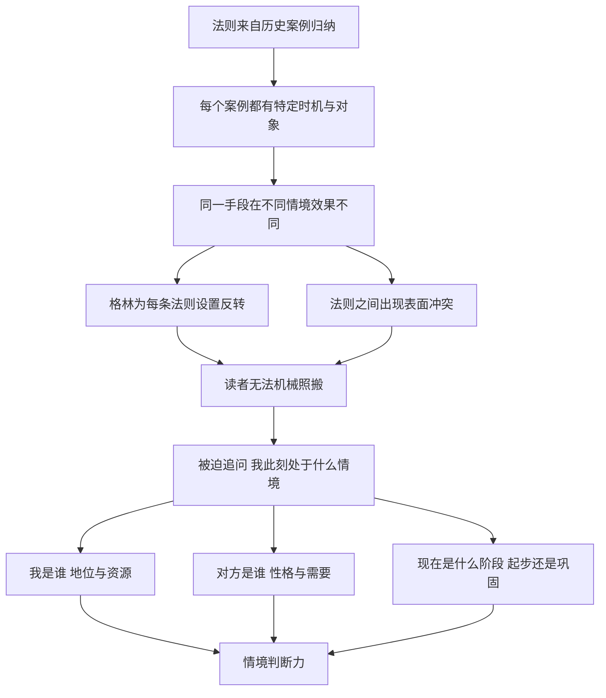

# 03｜为什么每条法则都附带一个“反转”？

> 48 条法则彼此矛盾，读者到底该信哪一条？

---

## 一、先说结论

《权力的48条法则》不是一本可以照着执行的操作手册。

格林给每条法则都安排了固定的结构：先讲违反法则的人如何付出代价，再讲遵守法则的人如何获益，然后分析背后的“权力关键”，最后用一段“反转”说明：**这条法则在什么情况下会失效，甚至会反过来伤害你。**

再加上不少法则之间本来就彼此冲突，这本书真正训练的，并不是“记住规则”，而是“判断情境”：什么时候该出现、什么时候该消失，什么时候该沉默、什么时候该开口，取决于你面对的是谁、身处什么时刻。

---

## 二、我们先理解一个问题

假设你刚读完前几条法则，满怀信心地准备在工作中实践。

第 4 条告诉你：说话永远要比必要的少。

第 6 条告诉你：不惜一切代价吸引注意。

第 16 条又告诉你：利用缺席来提升别人对你的敬重。

你一下子糊涂了：

> 我到底是该低调，还是该高调？
> 该少说话，还是该出风头？
> 该经常露面，还是该偶尔消失？

如果一本书的规则彼此打架，那它还有什么用？是作者没想清楚，还是这种“打架”本身就是他想教给我们的东西？

---

## 三、作者到底提出了什么观点？

先看这本书的“体例”。几乎每一条法则都由这样几部分组成：

| 组成部分 | 作用 |
|---|---|
| 法则 | 一句话的标题，例如“永远不要让主人黯然失色” |
| 判断 | 用几句话概括这条法则的要点 |
| 违反法则 | 一个或几个因违反这条法则而失败的历史故事 |
| 遵守法则 | 一个或几个因遵守这条法则而成功的故事 |
| 权力关键 | 格林对背后机制的分析，是每一条的核心论述 |
| 意象 | 用一个画面把法则浓缩成可记忆的形象 |
| 权威 | 引用前人的格言，例如马基雅维利、格拉西安、孙子等 |
| 反转 | 说明这条法则的例外、限度与反作用 |

这个结构本身就透露了格林的态度。

**第一，法则来自案例，而不是来自公理。** 他不是先给出一套逻辑体系再推导，而是从历史中归纳。归纳出来的规律，天然就带着适用范围。

**第二，“反转”是正式的组成部分，而不是附带的补充。** 格林用它来承认：同样的手段，换一个时机、换一个对象，效果可能完全相反。例如，关于“吸引注意”的法则，反转会提醒你曝光过度同样危险；关于“缺席”的法则，反转会提醒你刚起步时如果随便消失，别人只会把你忘掉。

**第三，法则之间的冲突是有意保留的。** 第 6 条的“吸引注意”和第 16 条的“缺席”，看似矛盾，其实对应不同的阶段：籍籍无名时需要被看见，已经有了名声之后，适度稀缺反而更有价值。第 4 条的“少说”和第 9 条的“用行动取胜，而不是靠争论”，则指向同一个方向——**话语是最容易暴露自己、也最容易激怒别人的工具。**

所以，格林真正要读者掌握的，不是每条法则本身，而是**在法则与法则之间做出选择的能力**。

---

## 四、把这个观点翻译成人话

打个比方。

一本菜谱里写着：“炖汤要小火慢炖。”另一页又写着：“炒青菜要大火快炒。”

你不会说这本菜谱自相矛盾，因为你知道：**火候取决于食材。** 真正会做饭的人，不是背下了所有菜谱，而是知道眼前这道菜该用什么火。

《权力的48条法则》也是这样。“少说话”和“要被看见”都对，但对的是不同的场合。“反转”就相当于菜谱里的小字注释：“注意，这个做法不适用于某某食材。”

还有一个更贴近生活的比方：老人常说“枪打出头鸟”，又说“酒香也怕巷子深”。这两句俗语同样矛盾，可每个人都知道它们各有用处。格林所做的，是把这类“看情况”的智慧，用历史故事一条条摊开给你看。

---

## 五、为什么会这样？

为什么一本讲规律的书，要不断提醒读者“规律会失效”？可以这样理解：

关键在 **F → G** 这一步。

如果一本书给出的规则没有例外，读者就会停止思考，直接执行。而权力关系恰恰是一个高度依赖对象的领域：同样一句恭维，对自负的人有效，对多疑的人却可能引起警觉；同样一次沉默，在谈判桌上是筹码，在求职面试里可能被当成缺乏能力。

格林通过“反转”和法则冲突，逼着读者在每次使用之前问自己三个问题：**我是谁？对方是谁？现在是什么时候？** 这三个问题，比任何一条法则都更重要。

---

## 六、举一个现实生活中的例子

小林和小周是大学同学，毕业后都听到了同一条职场建议：“要多在领导面前表现。”

**小林去了一家三十多人的初创公司。** 公司没有复杂的层级，创始人每天和大家坐在一个开放办公区里，周会上鼓励每个人发言。小林每次开会都主动汇报进展，提出自己的想法，遇到问题直接在群里找创始人讨论。几个月后，创始人觉得他积极、有想法，开始把更重要的项目交给他。

**小周进了一家有几十年历史的大型企业。** 他所在的部门有明确的汇报链条：专员、主管、经理、总监。小周同样想“多表现”，于是在一次跨部门会议上，趁总监在场，直接越过主管提出了一个改进方案，事后还给总监单独发了邮件。总监客气地回复了一句“很好”，但他的直属主管从此对他冷淡下来，好几个本该让他参与的项目，都没有再叫上他。

同一条建议，两种结局。

问题不在建议本身，而在情境。在扁平的初创公司里，“多表现”契合组织文化，领导需要主动的人；在层级森严的老牌企业里，“多表现”如果越过了层级，就会被理解为不守规矩、抢了上级的风头。

**这正是“反转”存在的意义：没有一条法则可以脱离环境单独成立。**

---

## 七、回到书中重新理解

现在回到书中，格林的写法就清楚了。

他在讲“吸引注意”时，举的多是那些从默默无闻中崛起的人物——对他们来说，最大的风险不是被批评，而是被忽视。而他在讲“缺席”时，关注的多是已经拥有地位的人——他们需要的不再是曝光，而是让自己的出现显得珍贵。

两条法则并不矛盾，它们只是站在了人生的不同位置上。

同样，书中许多“遵守法则”的成功者，放到另一个时代、面对另一个对手，也许会因为同样的行为而失败。格林在“反转”部分反复提醒的，就是这种不确定性。**他写的是权力的“语法”，而不是“台词”：语法告诉你句子可以怎样组合，但每一句具体说什么，要看你面对的是谁。**

所以，读这本书最糟糕的方式，是挑出一条喜欢的法则，然后在所有场合使用它。

---

## 八、这个观点背后还有什么？

**第一，这是一种古典的“实践智慧”传统。** 亚里士多德曾区分过“知识”和“实践智慧”：前者可以教给别人，后者只能在具体处境中锻炼。格林的体例，某种程度上就是在用大量故事代替原则，让读者积累“处境感”。

**第二，它继承了格言体写作的特点。** 书中大量引用的巴尔塔萨·格拉西安，写的就是一条条短小的处世格言，这些格言彼此之间也常有张力。格言的价值不在于构成体系，而在于在恰当的时刻被想起。

**第三，“反转”也是作者的自我保护。** 有了反转，任何一个反例都可以被解释为“这是例外情况”。这让全书的论证更有弹性，但也让它更难被证伪。这一点，读者需要心里有数。

**第四，它提醒我们，权力是关系，而不是属性。** 同一个人、同一个动作，在不同关系中意义不同。所以真正的问题从来不是“我该怎么做”，而是“在这段关系里，我这样做会被怎样理解”。

---

## 九、这个观点有问题吗？

**说服力在哪里？** 格林承认法则有边界，这一点比许多成功学书籍更诚实。组织行为学中的“权变理论”也持相似的看法：不存在一种在所有组织中都最优的管理方式，有效与否取决于环境、任务和人员。从这个角度看，格林的“反转”与学界的主流看法并不冲突。

**争议在哪里？** 问题在于，格林并没有给出一套判断“何时用哪条”的系统方法。他提供了大量案例和反转，却很少告诉读者：面对两条冲突的法则，依据什么标准来选择。于是，“看情况”既可能是智慧，也可能变成一句万能的托辞——成功了说明用对了法则，失败了说明碰上了反转。

**哪里过度简化？** 书中的反转部分通常比正文短得多。一条法则可能用了十几页讲故事，反转却只有一两段。这种篇幅上的不平衡，很容易让读者记住法则、忘记反转，实际效果是鼓励了机械照搬，而不是情境判断。

**其他解释是什么？** 心理学研究发现，人们在学习规则时，往往更容易记住生动的故事，而忽略抽象的限制条件。这意味着，即使格林本意是训练判断力，读者的实际收获也可能偏向“记住了几个管用的招数”。从这个角度看，书的结构设计和读者的真实使用之间，存在一定的落差。

**所以更准确的说法是**：格林的体例指向了正确的方向——权力依赖情境；但他给出的工具主要是故事，而不是判断标准。判断力最终还是要靠读者自己在生活中慢慢练出来。

---

## 十、今天再看这个观点

以下部分是基于格林思想的现代延伸，不是他在书中的原话。

今天的人们获取建议的方式，比格林写书时更碎片化。短视频里一句“职场一定要学会沉默”，下一条又是“不会表达的人永远没有机会”，两条都有几十万点赞。

这种信息环境，让“反转意识”变得更加重要。**任何一句脱离情境的处世建议，都只是半句话。** 缺失的另外半句，往往就是“在什么条件下”。

另一个值得注意的变化是：现代人往往同时身处多个“宫廷”——公司、家庭、社交圈、线上社区，它们的规则各不相同。一个人在初创团队里要高调，在家族聚会上要低调，在专业社区里要谨慎发言、在熟人群里又可以随意开玩笑。能在不同场合之间切换规则的人，比只会一种风格的人更从容。

---

## 十一、这一篇真正应该记住什么？

1. **每条法则都有固定体例。** 从违反、遵守到权力关键、意象、权威，最后以“反转”收尾，说明法则的边界。
2. **法则之间的冲突是有意保留的。** 吸引注意与缺席、少说与行动，分别对应不同的阶段、对象和处境。
3. **真正要练的是情境判断。** 每次使用法则前，先问：我是谁，对方是谁，现在处于什么阶段。
4. **反转常被读者忽略。** 正文篇幅远大于反转，容易让人记住招数、忘记限制，这是阅读时要主动纠正的地方。
5. **脱离情境的建议只是半句话。** 同一条建议，在扁平组织和层级组织里，效果可能截然相反。

---

## 十二、留一个问题

> 你最近一次照搬别人的成功经验却碰了壁，
> 回头看，是经验本身错了，
> 还是你没有注意到，自己所处的情境和对方完全不同？

---

带着这种“看情境”的眼光，我们终于可以进入具体的法则了。格林把整本书的第一条，留给了一个最容易被年轻人忽视、也最容易让聪明人栽跟头的处境：你身边站着一个比你地位高的人，而你恰好比他更耀眼。

这时候，才华还是好东西吗？接下来要谈的，正是**为什么永远不要让上级黯然失色？**
