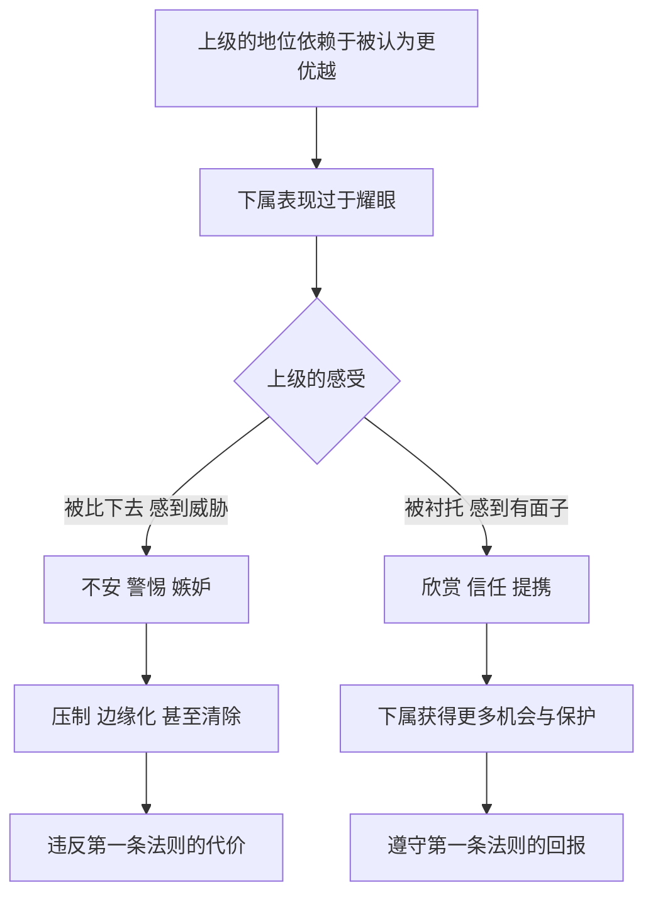

# 04｜为什么永远不要让上级黯然失色？

> 为什么表现太出色，反而可能毁掉你在上级眼中的位置？

---

## 一、先说结论

格林把“永远不要让主人黯然失色”放在全书第 1 条，这个位置本身就很说明问题。

他认为，身居高位的人最需要的，是感到自己比周围的人更优越。下属的才华如果让上级感到被比下去，才华就不再是资产，而是威胁。一个人越是锋芒毕露，越可能在不知不觉中触发上级的不安。

所以格林主张：把功劳让给上级，让自己的聪明为对方所用，而不是与对方竞争。结合第 24 条“扮演完美的廷臣”，他描绘的是一种古老的生存艺术——**在强者身边，最好的表现是让强者显得更强。**

---

## 二、我们先理解一个问题

从小到大，我们接受的教育几乎都是：好好表现，能力强就会被看见，做得好就会被奖励。

可职场里常常出现相反的情况：

> 为什么那个能力最强的下属，反而被领导边缘化？
> 为什么一份做得比领导还漂亮的方案，最后被束之高阁？
> 为什么有人一次“精彩的发言”之后，就再也没被叫进重要会议？

如果表现好就能得到回报，这些现象又该怎么解释？格林的答案很直接：**你表现得好不好，不只取决于你做了什么，还取决于你的表现让上级产生了什么感受。**

---

## 三、作者到底提出了什么观点？

格林在第 1 条的论述，可以归纳为三层。

**第一层：上级也有不安全感。** 人们习惯把上级想象成强大、自信的人。但格林认为，地位越高的人，越在意别人是否承认他的优越。这种优越感一旦被动摇，他们的反应往往不是欣赏，而是警惕甚至报复。

**第二层：危险不一定来自你的恶意。** 很多人以为只有“夺权”才会招祸，其实不然。你只是太能干、太受欢迎、太出彩，就足以让上级感到自己被遮住了光。格林特别提醒：**你无意冒犯，不等于对方不会被冒犯。**

**第三层：正确的做法是把光引向上级。** 让上级显得比实际更聪明，把自己的好点子包装成是受了对方的启发，在公开场合把功劳归于对方。格林不是要你藏起能力，而是要你改变能力的“方向”：从与上级竞争，变成为上级服务。

第 24 条“扮演完美的廷臣”把这种态度扩展成一整套处世方式：懂得察言观色，不炫耀，不抢话，赞美要含蓄，批评要间接，让自己的努力看起来轻松自然。这背后是一个悠久的传统——意大利人卡斯蒂廖内在十六世纪写下的《廷臣论》，就系统讨论过一个理想廷臣应当如何在君主身边保持优雅、得体、有分寸。

---

## 四、把这个观点翻译成人话

打个比方。

舞台上有一位主角，你是配角。你的演技也许比主角更好，但观众是来看主角的，导演和制片人也把票房压在主角身上。

如果你在每一场戏里都抢主角的戏，结果会怎样？主角会不舒服，导演会觉得你不懂规矩，下一部戏很可能就不再用你。

聪明的配角会怎么做？他会用自己的演技去“托”主角，让主角的表演显得更好。观众也许不会记住他，但主角和导演会记住他——**记住他是一个让自己更出色的人。**

这就是格林说的意思：**你的才华不是要被收起来，而是要换个用法。**

---

## 五、为什么会这样？

把第 1 条法则的逻辑拆开，大致是这样：

关键在 **B → C** 这一步：**同样出色的表现，会因为上级的感受不同而走向完全相反的结果。**

为什么上级的感受如此重要？因为在层级结构中，上级掌握着资源分配、晋升评价和信息渠道。你的能力需要通过上级才能转化为机会；而上级一旦把你视为威胁，他手中的这些资源就会变成对付你的工具。

更微妙的是，上级很少会承认自己在嫉妒下属。他们会把这种不安包装成别的理由：“这个人太自我”“不够稳重”“不懂配合”。于是，被边缘化的人往往连真正的原因都不知道。

---

## 六、举一个现实生活中的例子

小陈是一名刚来三个月的实习生，被安排参加部门的季度汇报会。会上，部门经理在总监和几个兄弟部门负责人面前，用 PPT 介绍这个季度的业绩。

讲到第八页时，小陈发现一个数据不对：经理把两个季度的增长率算反了，这个错误恰好让本季度看起来比实际表现更好。

小陈想，这是个重要错误，应该指出来。于是他举手说：“经理，不好意思，第八页的增长率好像算错了，我昨天整理数据的时候核对过，实际应该是……”

会议室安静了几秒。总监看了看经理，经理愣了一下，笑着说：“哦，是吗，会后我们再核对一下。”会议继续，但气氛明显变了。

会后，经理没有批评小陈，只是说了一句“以后有问题可以先跟我说”。但接下来的几周里，小陈发现自己再没被叫去参加任何有总监在场的会议，手上的工作也变成了大量整理表格的杂事。实习结束时，他没有拿到留用机会。

小陈做错了吗？从事实上说，他是对的；从动机上说，他也是出于负责。

但按照格林的逻辑，他的错误在于**选择了一个让上级当众丢脸的方式**。在总监和其他部门负责人面前，经理的“专业形象”受到了直接挑战，而挑战者是一个刚来三个月的实习生。

如果小陈在会前核对时就发现问题，私下提醒经理；或者会后第一时间单独发消息说“经理，我整理数据时注意到第八页可能有个小问题，您看要不要在纪要里更正一下”，结果可能完全不同：经理会避免一次尴尬，还会记住这个细心、可靠又懂分寸的实习生。

**同样是纠正错误，一种方式让上级黯然失色，另一种方式让上级更加稳妥。**

---

## 七、回到书中重新理解

现在回到书中，格林用来说明第 1 条的两个故事就很好懂了。

**违反法则的故事：尼古拉·富凯。** 富凯是路易十四早年的财政总监，富有、有品位、交游广阔。1661 年，他在自己新落成的沃子爵城堡为年轻的国王举办了一场极尽奢华的盛宴：精致的园林、盛大的演出、令人目眩的烟火。他本想借此讨好国王、巩固地位。

可结果恰恰相反。历史记录显示，宴会之后不久，富凯就被逮捕，此后在狱中度过余生。格林的解读是：这场宴会让国王感到自己被臣子的光芒压过了。一个臣子的府邸比国王的宫殿更辉煌，他的宴会比国王的宴会更令人难忘——这正是第 1 条法则所警告的情形。当然，关于富凯倒台的原因，历史学者还提到财政问题与政敌的攻击，格林的解释侧重于其中“黯然失色”的一面。

**遵守法则的故事：伽利略。** 伽利略早年常常面临资助不稳定的困境。1610 年，他用望远镜观测到木星的几颗卫星，决定把这项发现献给佛罗伦萨的美第奇家族，将它们命名为“美第奇星”。这个举动把一项科学发现，变成了对赞助人家族荣耀的颂扬。此后，他获得了美第奇宫廷的正式职位与稳定支持。

格林用这个故事说明：伽利略没有用自己的天才去衬托自己，而是用它去衬托赞助人。**他的光芒没有减少，只是朝向了主人。**

两个故事放在一起，第 1 条法则的意思就完整了：富凯让国王失色，因此失去一切；伽利略让美第奇生辉，因此得到保护。

---

## 八、这个观点背后还有什么？

**第一，权力关系中存在“形象的所有权”。** 在一个组织里，上级不只是掌握决策权，还“拥有”一部分形象：团队的成绩被看作他的成绩，团队的出色被看作他的眼光。下属公开抢夺这份形象，就等于侵犯了他的“所有权”。

**第二，场合比内容更重要。** 在小陈的例子里，问题不在“纠错”，而在“当众纠错”。第 1 条法则对公开场合尤其敏感，因为公开场合关乎面子，而面子是地位最直接的体现。

**第三，这条法则与“廷臣”传统一脉相承。** 卡斯蒂廖内在《廷臣论》中强调的分寸感，是一种把才华藏在优雅之下的艺术。格林在第 24 条中把它发展为一种全面的姿态：不显得刻意，不显得急切，让自己成为上级身边最让人舒服的人。

**第四，它隐含着一个长期视角。** 把功劳让给上级，短期看是吃亏，长期看却可能换来信任与提携。格林默认，在层级结构中，**被上级视为“自己人”，比一时的个人光彩更有价值。**

---

## 九、这个观点有问题吗？

**说服力在哪里？** 组织行为学中有大量关于“向上管理”的研究和讨论，普遍认为理解上级的需要、维护上级的威信，是下属获得支持的重要条件。心理学中也有关于“社会比较”的研究：当人们在与自己相关的领域被他人超越时，确实容易产生威胁感。格林的观察，与这些发现是相通的。

**争议在哪里？** 最大的争议在于：**这条法则是否在鼓励逢迎和压抑真相？** 如果每个下属都不敢指出上级的错误，组织就会陷入“皇帝的新衣”式的困境。一些管理学者强调“心理安全感”的重要性：团队成员敢于提出不同意见，往往是组织避免重大失误的关键。按照这种看法，一个因为下属纠错就打压下属的上级，本身才是问题所在。

**哪里过度简化？** 格林笔下的上级几乎都是自负、多疑的君主。但现实中的上级各有不同：有的真心欣赏比自己强的下属，把培养人才看作自己的成就；有的组织文化鼓励直言。在这样的环境里，过度谦让反而会让人显得缺乏能力与担当。

**其他解释是什么？** 富凯的倒台是否主要因为那场宴会，历史上存在不同解释。一些历史学者认为，路易十四和科尔贝尔早已着手调查富凯的财务问题，宴会或许只是加速了早已开始的进程。格林选择了最具戏剧性的解读，这让法则更生动，但也让因果关系显得比实际更单一。

**所以更准确的说法是**：第 1 条法则抓住了层级关系中一个真实的心理风险，但它并不意味着要放弃说真话，而是提醒你：**说真话的方式和场合，往往决定了真话能不能被听进去。**

---

## 十、今天再看这个观点

以下部分是基于格林思想的现代延伸，不是他在书中的原话。

今天的职场比宫廷更开放，但“让上级黯然失色”的风险并没有消失，只是换了形式。

在工作群里，下属在大群里直接回复“这个方案有问题”，和私下发消息说“我有个想法想跟您确认一下”，效果截然不同。群聊是新的“公开场合”，每一句话都有观众。

在社交媒体上，一些员工因为个人账号的影响力超过了公司或领导，引发了微妙的紧张。个人品牌时代，“下属比上级更有名”变得越来越常见，如何处理这种关系，是许多人面临的新问题。

同时，越来越多的组织开始倡导“向上反馈”和“开放文化”。在这样的环境里，第 1 条法则需要调整：**不是不说，而是找到对的方式说。** 先私下沟通、给上级留出修正的空间、把问题表述为共同的目标，往往比沉默或当众揭穿都更好。

---

## 十一、这一篇真正应该记住什么？

1. **上级也有不安全感。** 地位越高的人，越在意自己是否被认为更优越；下属的光芒可能被理解为威胁。
2. **无意冒犯也是冒犯。** 你只是太出色、太受瞩目，就可能在上级心中引发警惕，而对方很少会说出真正原因。
3. **改变才华的方向，而不是藏起才华。** 让能力为上级所用、把功劳引向上级，比与上级竞争更安全，也更长久。
4. **场合与方式决定结果。** 当众纠错和私下提醒，内容相同，效果可能完全相反。
5. **这条法则有边界。** 在鼓励直言的组织、面对真心惜才的上级时，过度谦让反而会让人显得缺乏担当。

---

## 十二、留一个问题

> 如果你的上级真的错了，而且这个错误会影响整个团队，
> 你愿意冒着让他难堪的风险当众指出，
> 还是会寻找一种既说出真相、又保全他面子的方式？
> 如果找不到这样的方式呢？

---

不过，让人感到被比下去的，并不只有上级。在同事、同学、同辈之间，一个人如果样样拔尖、处处与众不同，同样会引来一种更隐蔽也更难防的情绪。它很少以敌意的面目出现，却常常化身为冷淡、疏远和看似公允的挑剔。

这种情绪从哪里来，又该怎样应对？接下来我们谈谈**为什么太完美、太特立独行的人容易被针对？**
