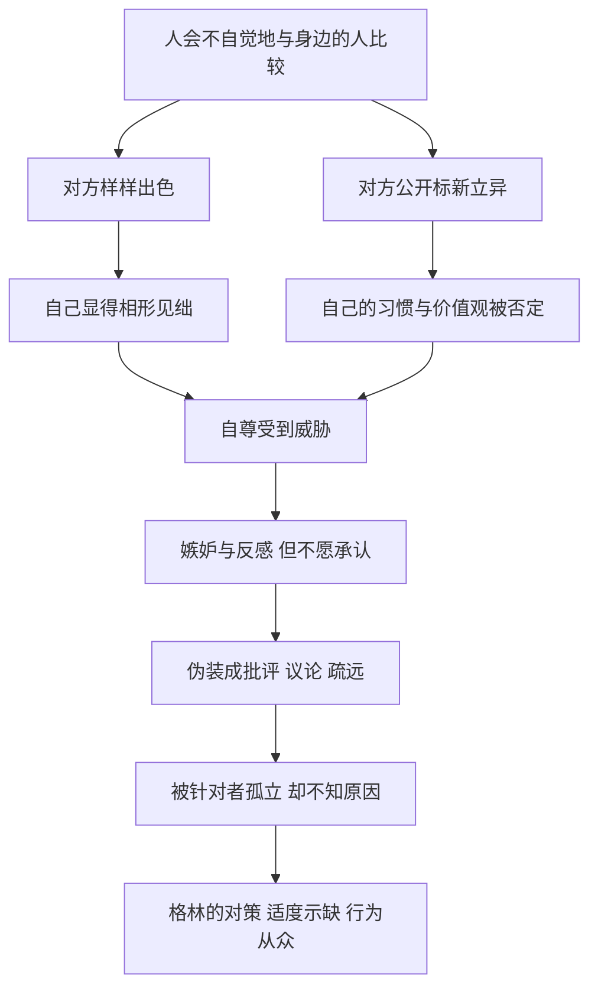

# 05｜为什么太完美、太特立独行的人容易被针对？

> 为什么优秀与与众不同，会在同辈中招来敌意？

---

## 一、先说结论

前面我们谈过，在上级面前太耀眼会带来危险。格林进一步提醒：在同辈之间，危险同样存在，而且更隐蔽。

第 46 条“永远不要显得太完美”指出，完美会激起嫉妒，而嫉妒很少以真面目出现，它更常伪装成批评、挑剔和疏远。第 38 条“想怎么想都行，但行为要与他人一致”则指出，公开挑战群体的习惯和价值观，会被看作对大家的冒犯。

格林的建议是：**适度暴露一些无伤大雅的缺点，把独立的思想留在心里，在行为上与周围的人保持一致。** 这不是要人变得平庸，而是要人不给嫉妒和排斥提供靶子。

---

## 二、我们先理解一个问题

我们通常认为，一个人越优秀，就越受欢迎；一个人越有个性，就越有魅力。

可现实中常常出现这样的情况：

> 为什么那个成绩最好、人又热心的同学，背后被议论最多？
> 为什么一个敢于说出与众不同观点的人，渐渐被圈子排斥？
> 为什么明明没有得罪任何人，却总感觉有人在暗中和自己作对？

如果优秀和个性都是好东西，为什么它们会招来敌意？格林认为，答案藏在一种人们很少公开承认的情绪里：**嫉妒。**

---

## 三、作者到底提出了什么观点？

格林在这两条法则中的核心观点，可以分成两部分。

**第一部分：完美招致嫉妒（第 46 条）。**

格林认为，嫉妒是一种极其普遍、却几乎从不被承认的情绪。人们不会说“我嫉妒他”，因为承认嫉妒就等于承认自己不如别人。于是，嫉妒会换一种面目出现：

- 挑剔对方的小毛病，“他就是运气好”“他那人其实挺虚伪”；
- 在背后议论，对他的成功做出负面解读；
- 在关键时刻不帮忙，或者悄悄设置障碍；
- 表面友好，实际疏远。

格林提醒，被嫉妒的人往往最后一个知道自己被嫉妒。因此，他建议有意识地暴露一些无伤大雅的弱点：承认自己在某些方面不擅长，把成功部分归因于运气，偶尔自嘲。这样做可以让别人觉得“他也是普通人”，从而降低嫉妒的强度。

**第二部分：特立独行招致排斥（第 38 条）。**

格林认为，任何群体都有自己的习惯、礼仪和价值观。一个人如果公开嘲弄这些东西，或者处处显示自己与众不同，群体就会觉得被冒犯——因为你的“不同”，隐含着对他们的否定。

所以他主张：**思想可以独立，行为却要与他人一致。** 你可以在心里不认同，可以和信得过的少数人分享真实想法，但在公开场合，最好遵守大家的规矩，不要把自己的独特性变成对别人的挑战。

---

## 四、把这个观点翻译成人话

打个比方。

一群人在一起爬山，大家都气喘吁吁、走走停停。有一个人却健步如飞，还边走边说：“这山也太简单了吧。”

他说的也许是事实，但其他人会怎么想？他们不会佩服他，而是觉得被冒犯：“你是在嘲笑我们吗？”

如果这个人换一种方式——偶尔停下来等等大家，擦擦汗说一句“这段坡还真有点陡”——大家会觉得他是自己人。他的体力依然最好，但**他的好不再是对别人的压迫。**

第 38 条也类似。一个人去参加朋友聚会，大家都在吃火锅聊八卦，他却坐在角落里看书，偶尔抬头说一句“你们聊的这些真没意思”。他的品味也许确实更高，但他很快就会被排除在圈子之外。

**格林的意思是：你的优秀和独特，不要让别人感到自己被比下去、被否定。**

---

## 五、为什么会这样？

为什么完美和特立独行会引发敌意？可以这样理解：

关键在 **D → E → F** 这一步。

嫉妒之所以难以应对，是因为它**几乎从不以嫉妒的形式出现**。一个人在心里感到被比下去，却无法公开说“你太优秀了，我受不了”，于是只能寻找别的出口：挑毛病、传闲话、冷处理。这些行为披着“客观评价”的外衣，让被针对的人难以反驳，甚至开始怀疑自己真的有问题。

而特立独行引发的反感，本质上也是一种自尊威胁。群体的习惯不只是习惯，它还承载着成员的身份认同。当一个人公开表示“你们这样做很愚蠢”，他否定的不只是某种行为，还有做出这种行为的每一个人。

---

## 六、举一个现实生活中的例子

某大学的一个课题组里，有一位博士三年级的师兄，姑且叫他老韩。

老韩几乎样样拔尖：已经在领域内的重要期刊上发表了好几篇论文，连续拿到国家奖学金；为人也很热心，经常帮师弟师妹改代码、看论文；导师开会时经常说“大家多向老韩学习”。

按理说，这样的师兄应该在组里很受欢迎。可一段时间之后，情况开始变化。

组里的同学聚餐，渐渐不再叫他；他在群里分享一篇文献，回应的人越来越少；背后开始出现一些议论：“他就是运气好，选了个热门方向”“他帮人改论文，其实是想显示自己厉害”“导师偏心，资源都给他了”。有一次评奖学金，有人私下说他“太会来事，懂得讨好导师”。

老韩很困惑，他自认为从没得罪过谁，反而一直在帮大家。

按照格林的逻辑，问题恰恰出在“样样拔尖”上。论文、奖学金、导师的表扬、帮助别人的能力，每一项单独看都没有问题；但当它们集中在一个人身上时，其他同学在比较中感到了压力。**“多向老韩学习”这句话，在导师嘴里是表扬，在同学耳中却是一种对比。**

那些议论，表面是在评价老韩，实际上是在修复自己受伤的自尊：把他的成功归结为运气、心机或偏心，就不必承认自己不如他。

如果老韩懂得第 46 条，他可能会有意识地做一些调整：谈起自己的论文时，多讲讲被拒稿的经历和踩过的坑；帮同学改论文时，把重点放在“我们一起讨论”，而不是“我来教你”；在导师当众表扬自己时，把功劳分一些给合作的师弟师妹。**他的能力不会因此减少，但他被嫉妒的面积会小很多。**

---

## 七、回到书中重新理解

现在回到书中，就能理解格林为什么把这两条看得如此重要。

格林在第 46 条中强调，人们对他人的优越，最容易产生的不是敬佩，而是一种隐秘的敌意；越是在同辈之间，这种敌意越强。因为你和上级之间的差距是被结构认可的，而你和同辈之间本该是平等的，你的出色就更容易被看作是对这种平等的破坏。

关于嫉妒与放逐，历史上有一个常被人提起的例子。古希腊雅典曾实行“陶片放逐法”：公民可以通过投票，把某个被认为过于有影响力的人驱逐出城邦若干年。据普鲁塔克记载，以公正著称的阿里斯提德也曾被放逐；传说一位不识字的公民请他帮忙在陶片上写下“阿里斯提德”，他问对方此人做了什么坏事，对方回答说什么也没做，只是听够了人人都称他为“公正者”。这个故事未必完全可靠，但它生动地说明：**有时让人无法忍受的，恰恰是一个人的好名声本身。**

而第 38 条关注的，是另一种风险。格林认为，那些公开嘲弄社会习俗、处处标榜自己与众不同的人，往往会被群体视为威胁，最终被边缘化。他的建议是：真正聪明的人，会把自己的独立思想藏在符合常规的外表之下，只在适当的时候、对适当的人表达。

---

## 八、这个观点背后还有什么？

**第一，嫉妒与距离有关。** 人们很少嫉妒遥远的明星或历史人物，却容易嫉妒身边的同学、同事和朋友。因为与身边的人比较，直接关系到自己的位置。这就是为什么同辈之间的嫉妒最为强烈。

**第二，“示缺”不是示弱，而是管理别人的感受。** 格林建议暴露的，是那些无伤大雅的弱点，而不是真正的致命缺陷。它的目的，是让别人在比较中不至于感到太大的落差。

**第三，“思想独立、行为从众”是一种古老的生存智慧。** 历史上许多思想家在观点上走在时代前面，在生活方式上却相当低调。这种分离，让他们既能保持独立思考，又不至于过早地与环境发生冲突。

**第四，这两条法则都在强调“别人的感受是一种客观力量”。** 你无法控制别人是否嫉妒你、是否被你冒犯，但你可以调整自己呈现出来的样子，减少触发这些情绪的机会。

---

## 九、这个观点有问题吗？

**说服力在哪里？** 社会心理学中关于“社会比较”的研究认为，人们会通过与他人比较来评估自己；当比较对象与自己相近、又在自己看重的领域明显更出色时，更容易产生威胁感与嫉妒。另有研究发现，能力很强的人如果偶尔犯点小错，反而可能显得更可亲，这被称为“出丑效应”，不过这一效应的稳定性和适用条件，学界仍有讨论。这些研究在一定程度上与格林的观察相呼应。

**争议在哪里？** 第 38 条最容易被质疑。如果每个人都在行为上从众，社会如何进步？历史上许多重要的变革，恰恰来自那些敢于公开挑战习俗的人。批评者认为，“行为从众”的建议固然能保护个人，却可能让人在该站出来的时候选择沉默。

**哪里过度简化？** 格林把同辈之间的疏远，几乎都解释为嫉妒。但现实中，一个人被疏远的原因可能很复杂：也许他确实在无意中表现出了优越感，也许他的热心被理解为控制欲，也许只是性格不合。把一切都归结为“别人嫉妒我”，有时反而会让人失去自我反省的机会。

**其他解释是什么？** 从组织行为学角度看，团队中的“明星成员”与其他成员之间的紧张，也可能来自资源分配问题：当导师或领导把更多机会给了一个人，其他人感到不公平，这种不满未必是嫉妒，而可能是对制度的合理质疑。区分“嫉妒”和“对不公的抗议”，是理解这一现象的关键。

**所以更准确的说法是**：格林指出的嫉妒机制是真实存在的，但“示缺”和“从众”是保护自己的手段，不应成为放弃原则或拒绝反省的理由。

---

## 十、今天再看这个观点

以下部分是基于格林思想的现代延伸，不是他在书中的原话。

社交媒体时代，“显得完美”变得前所未有地容易，也前所未有地危险。

一个人在朋友圈里晒出完美的旅行、完美的工作、完美的家庭，收获的点赞里，也可能夹杂着不少暗暗的比较与不快。网络上对“凡尔赛文学”的调侃，某种程度上就是公众对过度展示优越的一种反击。

与此同时，“个性”在今天被高度推崇，人们被鼓励做自己、与众不同。但在具体的群体中，第 38 条描述的压力依然存在：在一个人人都加班的团队里准时下班，在一个人人都点赞的话题下提出异议，依然可能引来侧目。

今天更值得思考的问题也许是：**在哪些场合，保持一致是一种体贴与智慧？在哪些场合，保持一致就变成了懦弱？** 这个边界，格林没有替我们划出来。

---

## 十一、这一篇真正应该记住什么？

1. **完美会激起嫉妒。** 尤其是在同辈之间，一个人样样出色，容易让周围的人在比较中感到自尊受到威胁。
2. **嫉妒很少以真面目出现。** 它往往伪装成批评、议论、挑剔和疏远，被针对的人常常最后一个知道原因。
3. **适度示缺可以降低嫉妒。** 暴露无伤大雅的弱点、分享失败的经历、把功劳分给别人，能让优秀显得不那么有压迫感。
4. **思想独立，行为从众。** 公开挑战群体习惯会被视为冒犯，独立的想法可以保留，但表达要选择场合与对象。
5. **不要把一切疏远都归因于嫉妒。** 有时别人的不满另有原因，自我反省与自我保护同样重要。

---

## 十二、留一个问题

> 如果为了不被嫉妒，你需要刻意显得不那么优秀；
> 为了不被排斥，你需要在行为上随大流，
> 那么，这样的“安全”，代价是不是太大了？
> 你会在哪里画下自己的底线？

---

格林的这两条法则，其实都在教人少暴露一点自己：少暴露完美，少暴露锋芒。顺着这个方向再往前走一步，就会碰到一个更激进的主张——不只是少暴露优点，而是干脆让别人看不透你：话少说一点，露面少一点，行为难猜一点。

这听起来像是在故弄玄虚，格林却认为其中藏着实实在在的力量。于是我们要问：**为什么沉默和神秘本身就是一种力量？**
