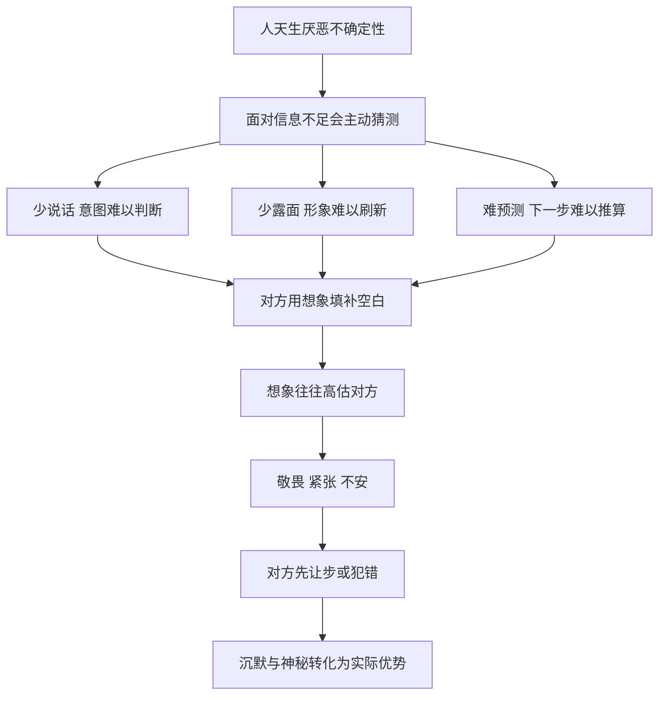

# 06｜为什么沉默和神秘本身就是一种力量？

> 为什么说得越少、出现得越少、越让人猜不透，反而越有分量？

---

## 一、先说结论

格林用三条法则讨论了同一种力量：第 4 条“说话永远比必要的少”，第 16 条“利用缺席来提升敬意”，第 17 条“培养不可预测性，让人处于悬而未决之中”。

它们背后的机制是相通的：**你给出的信息越少，别人就越需要猜测；而人在猜测时，往往会把对方想得更强大、更深不可测。** 反过来，一个话多、常在、行为可预测的人，很容易被看穿，也就容易被摆布。

沉默、缺席和不可预测，本质上都是在控制别人对你的信息量。

---

## 二、我们先理解一个问题

我们常常认为，沟通越多越好，表达越充分越好，出现得越多就越有存在感。

可生活中也有很多相反的体验：

> 为什么会议上一直在说话的人，最后反而没什么分量？
> 为什么一个很少露面的人，一出现大家就格外重视？
> 为什么谈判时，对方一沉默，我们就忍不住自己先让步？

如果表达和出现都是好事，为什么“少”有时反而比“多”更有力量？格林认为，这背后是人性中对不确定性的一种本能反应。

---

## 三、作者到底提出了什么观点？

格林的论述可以分成三个层次，对应三条法则。

**第一层：少说话（第 4 条）。**

格林认为，话说得越多，暴露的就越多：你的意图、你的弱点、你的无知，都可能在不经意间泄露出来。而且，话越多越显得普通，越容易说出后悔的话。相反，说得少的人，会让别人觉得他有所保留、深思熟虑，甚至显得更有权威。

**第二层：适度缺席（第 16 条）。**

格林认为，一个人出现得太多，价值就会被稀释。就像任何东西一样，太容易得到就不被珍惜。在你已经建立了一定的地位之后，适当地退出、减少露面，会让别人开始怀念你、重视你。**稀缺，会制造价值。**

需要注意的是，格林也强调这条法则的反转：在你还没有建立地位时，缺席只会让人把你忘掉。缺席的力量，建立在你已经被看见的基础上。

**第三层：不可预测（第 17 条）。**

格林认为，人们天生渴望掌控局面，而掌控的前提是能够预测对方的行为。一个行为高度规律的人，别人很容易摸清他的套路，从而针对性地应对。相反，一个时常出人意料的人，会让对手不得不耗费大量精力去猜测，处于紧张与被动之中。

三条法则合在一起，指向同一个核心：**控制别人能获得的关于你的信息。**

---

## 四、把这个观点翻译成人话

打个比方。

打扑克时，最难对付的是什么样的对手？不是手里牌最好的，而是你完全看不透的。

有的牌手一拿到好牌就面露喜色，拿到烂牌就唉声叹气，桌上每个人都能读懂他，他很快就会输光。而有的牌手始终面无表情、下注节奏毫无规律，你永远不知道他是在诈唬还是真有好牌。面对这样的人，你会犹豫、会退缩、会高估他。

沉默就是扑克脸，缺席就是偶尔不跟注，不可预测就是打破节奏。**它们都不是在增加你手里的牌，而是在减少对手能读到的信息。**

---

## 五、为什么会这样？

把三条法则放在一起看，它们的共同逻辑是这样的：

关键在 **D → E** 这一步：**人们在信息不足时，倾向于用想象填补空白，而想象往往会放大对方。**

为什么会放大？因为不确定本身会带来压力。当你不知道对方在想什么、会做什么时，大脑会本能地考虑最坏的可能，以免被打个措手不及。于是，沉默被理解为不满或深谋远虑，缺席被理解为忙碌或地位高，不可预测被理解为难以对付。

而这种紧张感，又会让人急于打破僵局——主动开口、主动让步、主动暴露自己。**谁先忍受不了不确定，谁就先交出了信息。**

---

## 六、举一个现实生活中的例子

老吴想在城里买一套二手房。看中一套之后，他约了卖家和中介一起面谈。

卖家报价 300 万，说完之后看着老吴，等他还价。

按照一般人的习惯，这时候会立刻回应：要么说“太贵了，能不能 280 万”，要么开始列举房子的缺点来压价。

但老吴什么也没说。他低头看了看手里的房产资料，又抬头看了看窗外，神色平静，一言不发。

沉默持续了十几秒。对卖家来说，这十几秒格外漫长。他开始揣测：是嫌贵吗？是看中了别的房子？是觉得这房子不值这个价？中介也有些坐不住，看向卖家。

最后，卖家先开口了：“当然，价格也不是不能谈，如果您诚心要，295 万也可以考虑。”

老吴还是没有立刻接话，只是点了点头，说：“我再想想。”

第二天，中介打来电话，说卖家愿意再让一点。

在这场谈判中，老吴没有提出任何要求，也没有说房子一句坏话，却让卖家两次主动降价。原因很简单：**他的沉默制造了不确定，而卖家无法忍受这种不确定。**

如果老吴一开口就说“280 万”，他就把自己的心理价位暴露了，接下来的谈判只会在 280 万和 300 万之间进行。而他的沉默，让卖家不得不自己去猜那个数字，而人在猜测时，往往会往不利于自己的方向猜。

当然，沉默也有风险：如果卖家有好几个买家在排队，老吴的沉默可能被理解为不感兴趣，房子就被别人买走了。**沉默的力量，取决于对方有多需要你。**

---

## 七、回到书中重新理解

现在回到书中，格林讲的几个故事就好理解了。

**第 4 条的违反者：科里奥兰纳斯。** 他是古罗马的一位战争英雄，战功赫赫，在民众中享有很高的威望。据古代史家记载，他在竞选执政官时，本来凭借战功很有希望当选。但他后来多次在公开场合发表傲慢的言论，流露出对平民的轻蔑。民众从敬仰转为愤怒，他不仅失去了选票，最终还被逐出罗马。格林的解读是：**他的战功为他赢得了尊敬，他的言语又把这些尊敬一点点耗光了。** 如果他少说几句，神话般的形象或许就能保持下去。

**第 4 条的遵守者：路易十四。** 格林讲到，这位法国国王在面对大臣的请求与建议时，常常只回一句“我会考虑的”。他很少当场表态，大臣们因此永远无法确定国王的真实想法，只能更加小心地揣摩和讨好。**少说话，让他始终掌握着最终解释权。**

**第 16 条的案例：米底的戴奥凯斯。** 据希罗多德记载，戴奥凯斯以公正的仲裁赢得了声望，人们纷纷找他裁决纠纷。后来他突然宣布不再担任仲裁者，社会随之陷入混乱，人们于是推举他为王。成为国王之后，他修建了宏伟的都城，把自己隐藏在层层城墙之后，臣民几乎见不到他，一切事务都通过使者传达。格林认为，正是这种“看不见”，让他在臣民心中的形象变得越来越神圣。

**第 17 条的案例：鲍比·费舍尔。** 1972 年，美国棋手费舍尔在冰岛雷克雅未克与苏联的世界冠军斯帕斯基争夺国际象棋世界冠军。比赛前后，费舍尔不断制造意外：迟到、对场地的灯光和摄像机提出抱怨、以弃权输掉一局、要求把一局比赛移到场外的小房间进行。他的行为反复无常，让对手难以把握。一向沉稳的斯帕斯基在这种混乱中逐渐失去节奏，费舍尔最终赢得了冠军。格林用这个故事说明：**不可预测本身就是一种武器，它迫使对手把精力耗费在猜测上，而不是棋盘上。**

---

## 八、这个观点背后还有什么？

**第一，信息不对称就是权力。** 这三条法则的共同点，是让自己掌握的关于对方的信息多于对方掌握的关于自己的信息。在任何博弈中，信息更多的一方通常更有优势。

**第二，沉默让别人来“投射”。** 当一个人不表态时，别人会把自己的期待、恐惧和想象投射到他身上。这让沉默者的形象变得比实际更丰满，也更有力量。

**第三，三条法则都有一个前提：你已经有一定的分量。** 一个无足轻重的人保持沉默，只会被忽视；一个刚入行的新人经常缺席，只会被遗忘；一个没有实力的人行为反复无常，只会被当作不靠谱。**神秘感是放大器，它放大的是你已经拥有的东西。**

**第四，它与前面谈过的“不显得太完美”相呼应。** 那里讲的是少暴露优点以避免嫉妒，这里讲的是少暴露信息以保持优势。两者都在提醒：自我暴露是有代价的。

---

## 九、这个观点有问题吗？

**说服力在哪里？** 在谈判研究中，沉默常被视为一种有效的策略，因为它会给对方制造压力，促使对方先让步。经济学中的“信息不对称”理论也表明，掌握更多信息的一方在交易中通常更有利。心理学中的“稀缺效应”研究则发现，难以得到的东西往往被认为更有价值。这些都与格林的观察相呼应。

**争议在哪里？** 最大的争议在于：**沉默与神秘会不会破坏信任？** 在需要长期合作的关系中，比如团队协作、亲密关系、客户服务，透明和可预测恰恰是信任的基础。一个领导如果总是让下属猜不透，下属可能会感到不安、无所适从，团队效率反而下降。

**哪里过度简化？** 格林的案例大多来自高度对抗的场合：政治斗争、宫廷权术、世界冠军赛。在这些场合，对手之间本来就是零和关系，制造不确定是合理的。但生活中更多的关系是合作性的，在合作中，清晰的沟通往往比神秘感更有价值。

**其他解释是什么？** 关于费舍尔的行为，存在不同解释。一些人认为这是他有意为之的心理战术，另一些人则认为这更多反映了他本人的性格和焦虑，未必是精心策划的策略。格林选择了“策略”的解读，这让故事更符合法则，但事实可能更复杂。同样，戴奥凯斯的故事来自希罗多德，带有相当的传说色彩，更适合当作寓言来读。

**所以更准确的说法是**：沉默与神秘在对抗性、一次性的博弈中确实是有效的工具，但在长期合作中，它们的代价可能超过收益。关键在于分清你面对的是对手，还是伙伴。

---

## 十、今天再看这个观点

以下部分是基于格林思想的现代延伸，不是他在书中的原话。

今天的社会，似乎在奖励“说得多”的人：社交媒体鼓励持续输出，职场鼓励主动表达，“存在感”成了一个流行的词。在这样的环境里，格林的三条法则显得有些逆潮流。

但仔细观察，它们依然在起作用。一些公众人物刻意减少曝光，每一次露面都成为话题；一些品牌采用“限量”“饥饿营销”，用稀缺制造渴望；一些人在网络上从不回应争议，反而让争议慢慢平息。

与此同时，过度分享的风险也在上升。一个人在网上说过的话、发过的照片，都可能在多年后被翻出来。**“说话永远比必要的少”，在数字时代有了一层新的含义：少留下可能被别人利用的痕迹。**

当然，也有另一面：在一个信息过载的时代，完全沉默的人很容易被淹没。如何在“被看见”与“不被看透”之间找到平衡，是今天每个人都要面对的问题。

---

## 十一、这一篇真正应该记住什么？

1. **信息越少，别人越需要猜测。** 而人在猜测时，往往会把对方想得更强大、更深不可测，这是沉默与神秘的力量来源。
2. **少说话可以减少暴露。** 话越多，越容易泄露意图、弱点和无知，也越容易说出后悔的话。
3. **缺席的前提是已经被看见。** 稀缺制造价值，但对一个还没有建立地位的人来说，缺席只会让人被遗忘。
4. **不可预测让对手处于被动。** 一个行为难以推算的人，会迫使对方耗费大量精力去猜测和防备。
5. **分清对手与伙伴。** 在对抗性博弈中神秘是优势，在长期合作中透明和可预测往往才是信任的基础。

---

## 十二、留一个问题

> 如果沉默能让你在谈判中占据优势，
> 那么在一段你希望长久维持的关系里，
> 你愿意让对方永远猜不透你吗？
> 被人敬畏和被人信任，你更想要哪一个？

---

沉默、缺席和神秘，让别人猜不透你；但仅仅被猜不透，还不足以让人离不开你。一个人可以神秘到让人敬畏，却依然随时可能被替换。

要真正在关系中站稳，格林给出的下一步答案出人意料地现实：别指望别人记得你的好，要让他们需要你。这就引出了**为什么让人依赖你，比让人感激你更可靠？**
