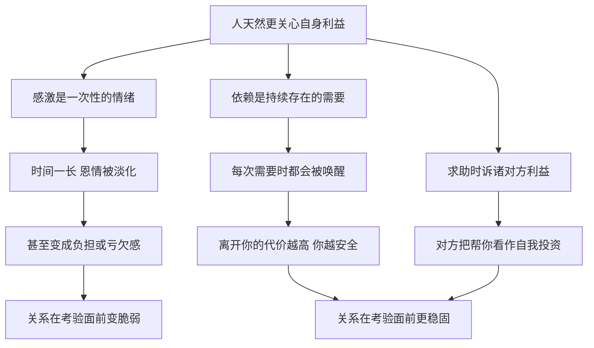

# 07｜为什么让人依赖你，比让人感激你更可靠？

> 为什么恩情会被遗忘，而依赖不会？

---

## 一、先说结论

格林在第 11 条和第 13 条里，表达的是同一个冷峻判断：**感激是一种会贬值的情绪，依赖和利益才是能持续的纽带。**

你帮过别人，对方当时很感动，可时间一长，恩情就淡了，有时甚至会变成负担；而如果对方离不开你，他就不得不一再回到你身边。同样，向别人求助时，与其诉说自己多可怜、提醒对方欠过你什么，不如告诉他：帮你，对他自己有什么好处。

一句话：**被需要，比被喜欢更安全。**

---

## 二、我们先理解一个问题

我们从小被教育要知恩图报，也习惯相信：对别人好，别人就会记得。

可生活里常有这样的场景：

> 你曾经帮过的人，在你需要时却找了各种理由推脱。
> 团队里人缘最好的人，在调整时并没有被留下。
> 你越是提醒对方“当年我怎么帮你的”，对方越是想躲开你。

如果感激真的可靠，这些事就不该频繁发生。

那么问题来了：**当一段关系真正面临考验时，把人留住的到底是情分，还是别的东西？**

---

## 三、作者到底提出了什么观点？

格林的观点可以拆成两半。

**第一半是第 11 条：让人们依赖你。** 格林认为，想保持独立和安全，就要让自己成为别人不可或缺的那一个。一个人一旦被别人需要，他的地位就不再取决于别人的好感，而取决于别人离开他之后要付出的代价。反过来，如果你把自己该教的都教会了，把能交出去的都交出去了，别人就不再需要你——这时再多的感情，也很难保住你的位置。

**第二半是第 13 条：求助时，诉诸对方的利益，而不是怜悯或感激。** 格林认为，大多数人天然更关心自己。你向对方讲述自己的苦难，只会让对方觉得你是个包袱；你提醒对方过去的恩情，则可能让他感到被要挟。真正有效的做法，是站在对方的角度，找到“帮你”和“他自己的好处”之间的连接点。

这两条合在一起，指向一个判断：**关系的稳固程度，取决于对方从这段关系里得到的，而不是你曾经给过的。**

这并不是格林的发明。五百年前，马基雅维利在《君主论》里就写过，人们往往是忘恩负义、反复无常的，靠恩惠维系的关系在危急时刻并不可靠。格林把这一判断从君主和臣民之间，延伸到了日常的每一段关系里。

---

## 四、把这个观点翻译成人话

打个比方。

一家小区门口有两家店。一家是你的老邻居开的，他人很好，逢年过节还送你点小东西；另一家是全城唯一能修你那台老式进口咖啡机的维修铺，老板脾气一般，话也不多。

一年后，老邻居的店搬走了，你会惋惜几天，然后在别的地方买东西；可如果维修铺要关门，你会着急地打听他搬去了哪里。

**前者让你感激，后者让你依赖。** 感激会随着时间淡去，依赖却会在你需要时一次次被唤醒。

再看求助。假设你想请一位忙碌的前辈帮你看一份方案。

第一种说法是：“我最近压力特别大，实在没办法了，您能不能帮帮我？”

第二种说法是：“这个方案涉及您一直关注的那个方向，里面有些数据可能对您的课题也有参考价值，想请您把把关。”

第一种说法让对方为难，第二种说法让对方看到了自己的收获。格林的意思就是：**别让对方为你付出，要让对方觉得是在为自己投资。**

---

## 五、为什么会这样？

格林的推理可以这样拆开：

关键有两处。

**第一处是 B → E。** 感激为什么会贬值？因为它记录的是过去。对方接受了你的帮助，心里就多了一份“欠你的”，而人通常并不喜欢长期背着债。时间越久，他越倾向于淡化这份债：“其实当时我自己也能搞定”“他帮我也是顺手”。你越提醒，他越想摆脱。

**第二处是 C → H。** 依赖为什么更稳？因为它指向未来。对方不是因为你曾经做过什么而留住你，而是因为他接下来还需要你。离开你的成本越高，他越会在关键时刻选择你。

第 13 条正是这个逻辑在求助场景里的应用：**不要让对方回头看账本，要让对方往前看收益。**

---

## 六、举一个现实生活中的例子

一家中型公司的技术部门里，有两位工作多年的员工。

**老周**性格有些闷，不太参加聚餐，但他是全公司唯一真正懂那套老旧核心结算系统的人。这套系统是十几年前外包团队写的，文档残缺，代码盘根错节，却承载着公司最重要的账务流程。每次系统出问题，大家第一个想到的就是他。

**小林**则是部门里公认的好人。谁搬家他去帮忙，谁的活儿干不完他主动分担，领导和同事都很喜欢他。只是他做的工作，多是些换谁都能接手的日常维护。

后来公司遭遇业绩压力，开始组织调整，要精简技术部门。

名单出来时，很多人很意外：人缘极好的小林在优化名单里，而“不太合群”的老周不仅留下了，还被单独约谈，公司希望他带一个小组，逐步完成老系统的迁移。

小林很委屈：“我帮了那么多人，关键时刻没有一个人能替我说上话。”其实不是没人同情他，而是在调整的逻辑里，决定去留的问题只有一个：**这个人走了，公司要付出多大代价？** 小林走了，大家会惋惜；老周走了，结算系统可能停摆。

这正是第 11 条的现实版本：**人情让你被喜欢，不可替代让你被保留。**

不过这个例子也有另一面。老周被留下，同时也被要求“带人迁移系统”——组织从来不愿长期依赖一个人，它会想办法把依赖拆掉。这一点，我们在后面讨论争议时还会回到。

---

## 七、回到书中重新理解

现在回头看格林在第 13 条中引用的古希腊故事，就容易理解了。

据修昔底德在《伯罗奔尼撒战争史》中的记载，公元前 5 世纪，科西拉与科林斯发生冲突，双方都派使节前往雅典，争取支持。

科西拉人面临的处境并不占理：他们过去并没有与雅典结盟，谈不上对雅典有什么恩情。于是他们没有打感情牌，而是直截了当地讲利益——科西拉拥有一支强大的海军，大战很可能迟早到来，如果雅典接纳科西拉，这支海军就会站在雅典一边；如果拒绝，它可能落入对手手中。

科林斯人则更多地诉诸道义与旧情，强调雅典不应干涉，提醒雅典过去双方的往来。

最终，雅典选择与科西拉结成防御性同盟。格林借这个故事说明：**当你请求一个强者时，打动他的不是你的委屈，也不是他欠你的情，而是他自己的利益。**

而第 11 条讲的是同一件事的另一面：科西拉之所以能开口谈利益，是因为它手里有雅典需要的东西。**你能诉诸对方的利益，前提是你对对方有用。**

---

## 八、这个观点背后还有什么？

**第一，依赖是一种权力结构。** 社会学中有一种常见的分析思路：一方对另一方的权力，很大程度上取决于另一方对他的依赖程度，以及对方有没有替代选择。格林用历史故事表达了类似的直觉——**你掌握的，是别人不容易从别处得到的东西。**

**第二，感激不是没有价值，而是不能单独依靠。** 格林并没有说人情毫无用处，而是说它不能作为关系的唯一支柱。人情可以润滑关系，依赖才能承重。

**第三，“诉诸利益”其实是一种换位思考。** 第 13 条听起来冷漠，但它要求你真正理解对方关心什么。一个只会讲自己困难的人，其实是在要求对方站到自己的立场；一个会讲对方利益的人，是先站到了对方的立场。

**第四，不可替代性需要持续维护。** 知识会过时，系统会被替换，技能会被普及。今天让人依赖的东西，明天可能不再稀缺。依赖不是一次性获得的地位，而是需要不断更新的位置。

---

## 九、这个观点有问题吗？

**它的说服力在于击中了一个真实的现象。** 组织调整、商业谈判、国际关系中，决定性的往往确实是利益与替代成本，而不是过去的情分。很多人在关键时刻才意识到这一点，格林提前把它说破了。

**但它也存在几处明显的过度简化。**

**第一，刻意制造依赖可能反噬。** 有意隐藏知识、把关键环节攥在手里的人，常常会被视为“风险点”。组织管理中有一个常见做法，就是主动识别并消除对单一个人的依赖。一个人越是故意让自己不可替代，组织越有动力去替代他。

**第二，它低估了互惠和声誉的长期作用。** 从博弈论的角度看，在反复打交道的关系里，帮助他人、积累信誉往往会带来持续的回报。心理学研究中的互惠规范也表明，人们普遍倾向于回报曾经帮助过自己的人。感激未必像格林说的那样脆弱，它只是作用得更慢、更分散。

**第三，被依赖不等于被尊重。** 一个人可能因为不可替代而被留下，却也可能因此被困在一个岗位上无法升迁——因为“他走了没人能顶上”。依赖既是护身符，也可能是枷锁。

**第四，关于科西拉的解读也存在不同理解。** 一些学者认为，雅典的决定是多重考量的结果，包括海上力量均势、对战争形势的判断等，未必只是被一场演说说服。格林把它简化成一个“利益胜过道义”的寓言，便于记忆，但并不是全部历史。

**所以更准确的说法是**：依赖与利益是关系中最硬的那部分骨架，但人情与信誉是让骨架不至于僵硬断裂的软组织。只有骨架，关系会冷；只有软组织，关系会塌。

---

## 十、今天再看这个观点

以下部分是基于格林思想的现代延伸，不是他在书中的原话。

今天，“让人依赖”早已是商业世界的基本逻辑。产品设计追求用户习惯和数据沉淀，让人换一个平台就要付出高昂的迁移成本；供应链上的关键零部件供应商，比普通供应商拥有更大的议价能力。

对个人来说，这一观点的启发不在于“藏着掖着”，而在于思考：**我身上有什么是别人不容易替代的？** 它可以是一项稀缺的技能，一段难以复制的经验，一张独特的关系网络，也可以是一种能把复杂问题讲清楚的能力。

更健康的做法，是让自己的价值随着时间不断升级，而不是靠垄断信息把自己锁在某个位置上。前者让你被需要，后者只是让你暂时无法被移走。

同时，在求助这件事上，第 13 条仍然非常实用：写合作邮件、申请资源、争取支持时，先想清楚“对方为什么要帮我”，往往比反复描述“我有多需要”更有效。

---

## 十一、这一篇真正应该记住什么？

1. **感激会贬值，依赖会延续。** 感激记录过去，依赖指向未来，关系在考验面前靠的是后者。
2. **决定去留的，是离开你的代价。** 你被保留，往往不是因为别人喜欢你，而是因为别人离不开你。
3. **求助时讲对方的利益。** 让对方觉得帮你是在为自己投资，而不是在还债或施舍。
4. **能谈利益的前提是你有价值。** 科西拉能讲利益，是因为它有雅典需要的海军。
5. **刻意垄断可能反噬。** 最稳固的不可替代，来自持续升级的能力，而不是封锁信息。

---

## 十二、留一个问题

> 回想一下你身边最稳固的几段关系，
> 维系它们的，更多是彼此需要，还是彼此感激？
> 如果有一天对方不再需要你，这段关系还会剩下什么？

---

要让别人依赖你，或者在求助时讲清对方的利益，都绕不开一个前提：你得知道自己手里有什么，同时不能让对方一眼看穿你真正想要什么。一旦对方完全知道你的底牌和目标，你手里的筹码就会大打折扣。

这就引出了下一个问题——**为什么真正的意图不能写在脸上？**
