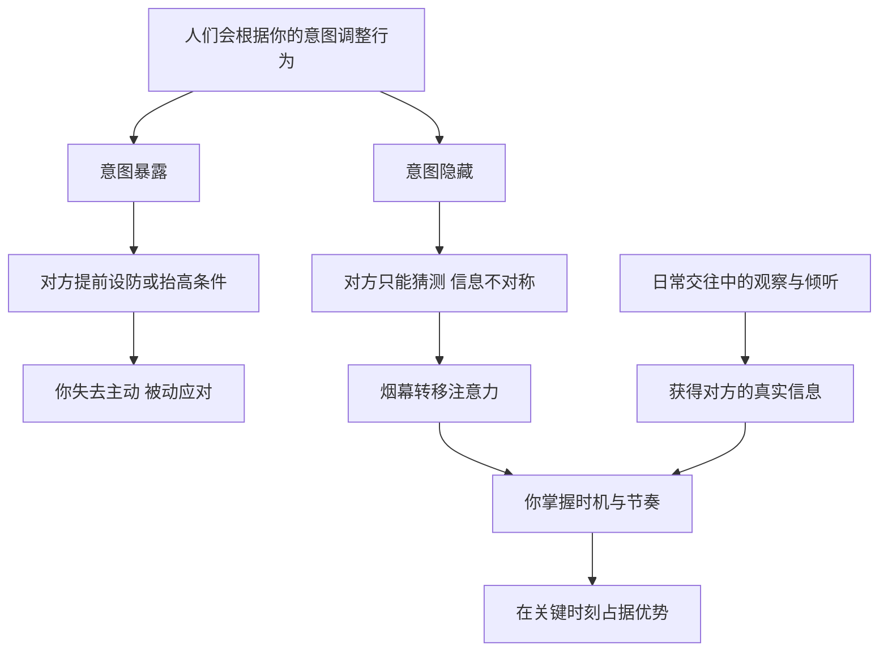

# 08｜为什么真正的意图不能写在脸上？

> 为什么把目标说出口，往往就等于把主动权交了出去？

---

## 一、先说结论

格林在第 3 条和第 14 条里讲的，是一个关于信息的问题：**别人一旦知道你真正想要什么，就能提前防备你，或者反过来利用你。**

所以他主张两件事：一是把真实意图藏起来，必要时用一个看似合理的“烟幕”转移视线；二是在日常交往中，表面上以朋友的姿态相处，实际上留心收集对方的信息。

前者是不让别人看清你，后者是让自己看清别人。两者合起来，就是在信息上占据优势——**谁知道得更多、暴露得更少，谁就掌握主动。**

---

## 二、我们先理解一个问题

很多人相信坦诚是美德：心里怎么想，嘴上就怎么说；想要什么，就直接开口。

在朋友和家人之间，这常常是对的。可在另一些场合，结果却不太一样：

> 你告诉中介“这套房我特别喜欢”，价格就再也谈不下来了。
> 你在会上提前透露了自己想争取的项目，竞争者马上开始布局。
> 你让对方知道你急着成交，对方就开始慢条斯理地拖延。

这些时候，问题不在于你说了假话，而在于你说出了**太多真话**。

那么，**为什么把目标摆在桌面上，常常会让目标变得更难实现？**

---

## 三、作者到底提出了什么观点？

**第 3 条：隐藏你的意图。** 格林认为，人们天生倾向于相信表面现象。如果你的真实目标被对方看穿，他就有时间做准备、设防线，甚至抢先一步。因此，要让别人始终猜不透你的真正目的。

格林提到的一个常用手法是“烟幕”：用一个看起来真诚、合理、甚至高尚的姿态，把注意力引向别处。比如表现出对某件事的强烈兴趣，而真正的目标在另一件事上；或者用一种温和、合作的态度，让对方放松警惕。他认为，最好的烟幕往往是那些看起来最不像伪装的东西——**真诚的面孔、高尚的姿态、平淡无奇的举动。**

**第 14 条：表面是朋友，实际当间谍。** 格林认为，了解对手是获得权力的关键，而最好的情报往往不是通过刺探得到的，而是在日常交往中自然流露的。在轻松、友好的氛围里，人们会放下戒备，说出平时不会说的话。因此，要学会在社交中观察、倾听、提问，而不是只顾着表达自己。

两条法则的共同点在于：**权力之争在很大程度上是信息之争。**

---

## 四、把这个观点翻译成人话

打牌时，如果你的牌面被对手看见了，技术再好也没用。

生活中的许多谈判和竞争，本质上也是一场牌局。你的目标、底线、急迫程度，都是你手里的牌。你把牌翻开，对方就知道该怎么出牌；你把牌扣着，对方就只能猜。

格林的意思不是让你永远说谎，而是提醒你：**说什么、何时说、说到什么程度，本身就是一种选择。**

举个日常的例子。你去一家店买东西，一进门就对店员说：“我就要这款，今天必须买到。”店员还会主动给你优惠吗？大概率不会。而如果你只是随意看看，问问几款的区别，表示“再比较一下”，店员反而更可能给出更好的条件。

同样是想买，前者把意图写在了脸上，后者没有。

至于第 14 条，可以想象这样一个人：他在饭局上很少高谈阔论，却总是笑着问你最近在忙什么、项目进展如何、团队里有什么变化。你聊得很开心，觉得他是个好听众。散场后你才意识到——**他知道了你的很多事，你却对他几乎一无所知。**

---

## 五、为什么会这样？

格林的逻辑可以这样拆开：

关键在 **A** 这个前提。

人不是静止的靶子。你的目标一旦被看见，对方就会根据它调整自己的行为：竞争者会抢先，谈判对手会抬价，反对者会提前组织力量。**意图的暴露，等于给了对方一段准备时间。**

而 **I → J** 这条线补上了另一半：光是隐藏自己还不够，还要了解对方。信息优势是双向的——你藏得越好，对方知道得越少；你看得越清，你知道得越多。两者相加，差距就会被放大。

---

## 六、举一个现实生活中的例子

一位创业者正在为公司寻找新一轮融资。

公司的产品有一定起色，但现金流很紧张。按照当前的开销，账上的钱只够再撑一个多月。

在第一次与一家投资机构见面时，他为了显得坦诚，也出于焦虑，在介绍完业务后说了一句：“说实话，我们下个月账上就没钱了，希望能尽快推进。”

投资人表面上很理解，说会加快流程。可接下来的事情变得微妙起来：尽职调查的节奏并没有加快，反而在一些细节上反复追问；到了谈条件时，对方给出的估值明显低于预期，还附加了不少苛刻条款。创业者想拒绝，却发现自己根本没有时间去找别的投资人。

**他说出的那句话，本身并没有错，却让对方清楚地知道了他的底线和时间表。** 对方不需要做任何恶意的事，只需要“慢一点”，时间就会替他们压价。

如果换一种做法：在谈判初期重点展示业务数据和增长潜力，同时与几家机构并行接触，把紧迫感留在自己心里，而不是摆在桌面上，结局很可能不同。

当然，这并不意味着要在财务上欺骗投资人——尽职调查迟早会看到真实数据。区别在于：**不主动把自己的软肋，在对方还没有问的时候，就作为开场白交出去。**

---

## 七、回到书中重新理解

格林在第 3 条中讲到了俾斯麦的一个故事。

1850 年前后，普鲁士与奥地利在德意志问题上矛盾尖锐，普鲁士国内不少人主张对奥强硬，甚至不惜一战。当时还是议会议员的俾斯麦，过去以强硬的保守立场著称。

然而，在普鲁士议会的一次演说中，俾斯麦却出人意料地为和平辩护，认为普鲁士不应轻易与奥地利开战。这番言论让很多人吃惊，却契合了当时国王和保守派高层的想法。不久之后，俾斯麦被任命为普鲁士驻法兰克福德意志邦联议会的代表，从此进入外交舞台的中心，并一步步走向权力高层。

多年以后，已成为普鲁士首相的俾斯麦，主导了对奥地利的战争，并借此确立了普鲁士在德意志的主导地位。

格林对这个故事的解读是：俾斯麦在 1850 年的和平演说，是一次精心设计的烟幕。他表现出与上层一致的立场，赢得了信任与职位；而他真正的抱负，是等到普鲁士足够强大时，再去实现。

不过需要说明的是，**关于俾斯麦当时是否在“伪装”，存在不同解释。** 一些历史学者认为，他在 1850 年的立场可能在当时是真实的，后来的转变更多是因为形势和他本人认识的变化。格林采用的是一种“意图先行”的解读，它让故事更有戏剧性，也更好地服务于法则本身。

但无论如何，这个故事揭示的机制是清楚的：**当你的公开姿态与决策者的期待一致时，你获得了进入核心的通道；而你真正的目标，则被保留到了能够实现它的那一天。**

---

## 八、这个观点背后还有什么？

**第一，隐藏意图不等于撒谎。** 格林所说的烟幕，很多时候并不需要编造事实，而是控制注意力的方向：强调某些信息、淡化另一些信息、选择合适的时机说出口。

**第二，信息不对称是许多权力关系的底层结构。** 经济学中有大量关于信息不对称的研究，说明掌握更多信息的一方，往往能在交易中获得更有利的结果。格林用宫廷和外交故事，讲出了类似的直觉。

**第三，第 14 条的核心是倾听。** 很多人在社交中急于表达自己，却很少认真听别人说了什么。格林提醒的其实是：**你说得越多，你暴露得越多；你听得越多，你知道得越多。** 这一点与前面谈过的“言多必失”一脉相承。

**第四，隐藏的对象要分清。** 对谈判对手、竞争者隐藏意图，与对合作伙伴、家人隐藏意图，性质完全不同。前者是博弈中的正常策略，后者可能侵蚀信任的根基。

---

## 九、这个观点有问题吗？

**它的说服力在于，谈判和竞争中的信息优势是真实存在的。** 无论是商务谈判还是求职议价，过早亮出底线确实常常导致更差的结果。这一点，很多人付出过代价才明白。

**但它的争议同样明显。**

**第一，长期关系中，隐藏意图会损害信任。** 从博弈论的角度看，一次性交易中隐藏信息可能有利，但在重复合作中，一旦被对方发现你一直在“放烟幕”，信任的损失往往远大于一次交易的收益。

**第二，透明有时反而是优势。** 谈判研究中有一种观点认为，在合作型谈判里，适度分享双方的真实需求，有助于找到双赢的方案，把“蛋糕做大”。一味隐藏，可能让双方都错过更好的结果。

**第三，“表面朋友、实际间谍”容易越过伦理边界。** 在日常交往中留心观察是一回事，刻意利用友谊刺探隐私、再用来对付对方，则是另一回事。后者一旦暴露，不仅失去朋友，还会严重损害声誉。

**第四，历史解读存在后见之明。** 像俾斯麦这样的故事，是从结果倒推意图，很容易把偶然与转变解读为一开始就有的计划。

**所以更准确的说法是**：在竞争性、一次性的博弈中，控制信息是必要的自我保护；在长期、合作性的关系中，适度透明往往更有价值。关键不是“永远隐藏”，而是**分清场合，决定亮牌的时机。**

---

## 十、今天再看这个观点

以下部分是基于格林思想的现代延伸，不是他在书中的原话。

在今天的信息环境里，“隐藏意图”的难度变大了。人们的行踪、观点、偏好，常常主动或被动地留在社交媒体和各种平台上。一个人在朋友圈里抱怨公司、在社交平台上透露求职意向，都可能在不经意间把自己的底牌交出去。

另一方面，“表面是朋友，实际当间谍”在商业世界里以另一种形式存在：平台通过免费服务收集用户数据，企业通过合作了解对方的业务细节。这提醒普通人，**在享受友好与便利时，也要意识到自己正在交出什么信息。**

对个人来说，更实际的启发是：在重要的谈判、面试、竞争场合，提前想清楚哪些信息该说、哪些信息该保留、什么时候说；在日常社交中，多听少说，不是为了算计别人，而是为了不被别人轻易看穿。

---

## 十一、这一篇真正应该记住什么？

1. **意图一旦暴露，对方就会调整行为。** 把目标说出口，等于给了对方准备的时间。
2. **烟幕是控制注意力，不一定是撒谎。** 强调什么、淡化什么、何时开口，本身就是策略。
3. **信息优势是双向的。** 自己暴露得少，同时对别人了解得多，差距才会拉开。
4. **过早亮出底线是谈判大忌。** 急迫感可以放在心里，不必作为开场白交出去。
5. **分清场合。** 竞争中控制信息是自保，合作与亲密关系中过度隐藏会侵蚀信任。

---

## 十二、留一个问题

> 回想你最近一次重要的谈判或争取，
> 你是不是在对方开口之前，就把自己最在意的东西说出来了？
> 如果重来一次，你会把哪句话留到更晚再说？

---

不过，格林并不是只教人隐藏。他同样注意到，一次恰到好处的坦白，有时比任何伪装都更能让对方卸下心防——人一旦认定你诚实可靠，往往就不再细看你接下来做的事。

这看似和隐藏意图相反，其实是同一枚硬币的另一面。下一篇我们就来谈——**为什么一点真诚和慷慨，最能让人放下戒备？**
