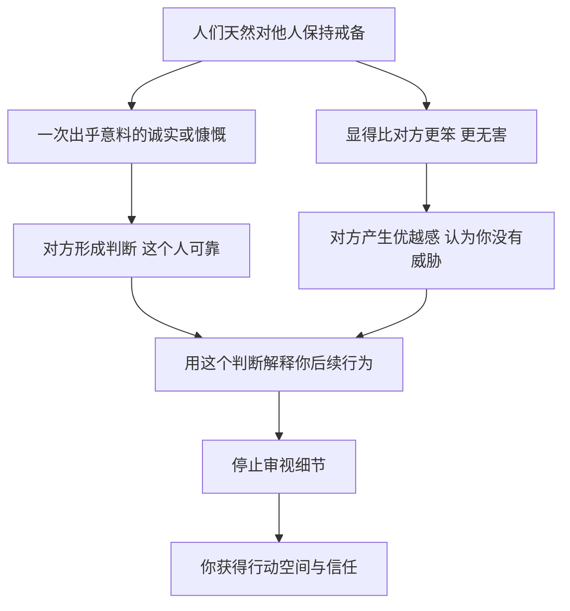

# 09｜为什么一点真诚和慷慨，最能让人放下戒备？

> 为什么一次看似吃亏的坦诚，反而能换来更大的信任？

---

## 一、先说结论

格林在第 12 条和第 21 条里，讨论的都是人的“戒备心”。

第 12 条说：**一次恰到好处的诚实或慷慨，能让人放下对你其他行为的怀疑。** 人们很难同时认为一个人既诚实又狡猾，一旦你在某件事上显得坦诚，对方往往会把这个印象扩展到你整个人身上。

第 21 条说：**装得比对方笨一点，可以让对方放松警惕。** 人们喜欢觉得自己比别人聪明，当他觉得你无害时，就不会再仔细审视你。

两条法则的核心是同一个机制：**人一旦认定你没有威胁，就会停止防备。**

---

## 二、我们先理解一个问题

我们通常认为，真诚和慷慨是纯粹的美德，是不求回报的。

可有时候，我们也会隐约感到不对劲：

> 为什么有些销售会主动说出自家产品的一个小缺点？
> 为什么某些人总是先送你一份小礼物，再提出请求？
> 为什么那个看起来有点笨、总在请教别人的同事，最后拿到了最多的资源？

如果真诚只是真诚、慷慨只是慷慨，这些现象就不会如此规律地出现。

那么，**为什么一个看似吃亏的举动，常常能换来远大于付出的信任？**

---

## 三、作者到底提出了什么观点？

**第 12 条：有选择地运用诚实与慷慨，以解除对方的武装。** 格林认为，人们对陌生人和潜在对手天然带着戒备。而打破戒备最有效的方式，不是更多的说服，而是一个出乎意料的诚实或慷慨举动。这个举动会让对方的判断发生转向：“这个人是可靠的。”一旦这个判断形成，对方就会用它来解释你后续的所有行为。

格林特别强调“有选择地”。**一次诚实，胜过一百次诚实。** 如果你总是毫无保留地坦白一切，诚实就失去了分量；如果你在关键时刻做出一次让人印象深刻的坦白，它就会成为对方心中的“证据”。

**第 21 条：装傻以捉傻，显得比对方更笨。** 格林认为，人们最不能容忍的，是被别人比下去，尤其是在智力上。如果你显得太聪明，对方就会提防你；如果你显得有些迟钝、需要请教，对方就会产生优越感，放下戒心，甚至主动透露信息。

两条法则的共同点是：**它们不直接说服对方，而是改变对方看待你的方式。**

需要强调的是，格林在书中是以一种冷静的、策略性的口吻讨论这些做法的。他关心的不是真诚本身的价值，而是真诚作为一种“姿态”所产生的效果。

---

## 四、把这个观点翻译成人话

打个比方。

你去一家餐馆点菜，服务员说：“今天的鱼不太新鲜，我建议您点别的。”你会有什么感觉？

大多数人会觉得：这个服务员很实在。接下来，他推荐什么菜，你都会更愿意相信。**他牺牲了一道菜的销售，换来了你对整张菜单的信任。**

这就是第 12 条的逻辑：一次小的诚实，买下了一大片信任。

再比如，一个人在谈判中表现得有点笨拙，频繁请教：“这个条款是什么意思？”“行业里一般是怎么做的？”对方很可能会放松下来，甚至带点居高临下地耐心解释。在这个过程中，对方不自觉地透露了很多自己的想法和底线。

这就是第 21 条的逻辑：**你让对方觉得自己更聪明，对方就不再防着你。**

---

## 五、为什么会这样？

格林的推理可以这样拆开：

关键在 **D → F** 这一步。

人的注意力是有限的，不可能对每个人的每一个举动都仔细审查。所以我们会依赖“印象”来做判断：这个人可靠，那他说的话大概就是真的；这个人狡猾，那他说的话就要打个折扣。

心理学中有一个与此相关的概念叫“光环效应”：人们在某一方面对一个人形成正面印象后，往往会把这种印象扩展到其他方面。格林讲的，正是如何主动制造这种光环。

**一次坦诚，就是一个锚点。** 对方会把这个锚点当作“证据”，去解释你之后的一切。

---

## 六、举一个现实生活中的例子

在一个二手交易平台上，有两位卖家在卖同一型号的二手手机，价格差不多。

**第一位卖家**的描述是：“九成新，功能完好，无拆无修。”图片拍得很漂亮。买家看了之后，心里却犯嘀咕：真有这么好？会不会有暗病？于是开始详细追问：电池健康度多少？有没有进过水？能不能视频验机？一来二去，买家越问越谨慎，最后还是犹豫着没下单。

**第二位卖家**的描述是：“正常使用一年多，功能都正常。有一点要说明：屏幕右下角有一道细划痕，亮屏时基本看不出来，介意的慎拍。”还附上了一张特写照片。

买家看到后，第一反应是：这个卖家挺实在，连这么小的划痕都主动说了。接下来，他反而没有追问太多其他问题，简单确认了几句，就爽快下单了。

**第二位卖家并没有做什么特别的事，只是主动暴露了一个小瑕疵。** 但这个举动改变了买家的判断方式：从“这个人可能在隐瞒什么”变成了“这个人是可靠的”。一旦形成了后一种判断，买家就不再像对待第一位卖家那样逐项审查。

这个例子既能说明真诚的力量，也能说明它可能被利用：如果一个卖家故意坦白一个无关紧要的小问题，借此掩盖一个更严重的问题，买家同样会放下戒备。**这正是第 12 条让人不安的地方——同一个动作，可以是真诚，也可以是策略。**

---

## 七、回到书中重新理解

格林在第 12 条中讲到了一个著名骗子的故事。

维克多·卢斯蒂格是 20 世纪初活跃在欧美的一位传奇骗子，自称“伯爵”，以风度翩翩、手段高明著称。

据格林的讲述，卢斯蒂格曾去找芝加哥黑帮头目阿尔·卡彭，请他投资五万美元，承诺在两个月内让这笔钱翻倍。卡彭是出了名的多疑与凶狠，但还是把钱交给了他，同时也明白地表示了如果出了问题会有什么后果。

卢斯蒂格拿到钱后，并没有去做任何投资，而是把钱原封不动地存放起来。两个月后，他带着这五万美元回到卡彭面前，满脸歉意地说：生意失败了，没能赚到钱，但他把本金原数奉还。

卡彭十分意外。在他的世界里，几乎每个人都想从他身上捞好处，而眼前这个人明明可以卷款跑路，却把钱还了回来。他被这份“诚实”打动，当场拿出五千美元送给卢斯蒂格，作为对他诚实的酬谢。

而这五千美元，正是卢斯蒂格从一开始就想要的。

格林借这个故事说明：**面对一个多疑、强大、处处设防的人，最好的策略不是欺骗他，而是用一次出人意料的诚实，让他主动卸下戒备。** 卢斯蒂格没有从卡彭那里“骗”走一分钱，却让卡彭心甘情愿地把钱送给了他。

这个故事的细节主要来自格林的讲述和流传的轶事，具体过程未必都能被严格考证，但它把第 12 条的机制表现得淋漓尽致。

---

## 八、这个观点背后还有什么？

**第一，戒备心是一种成本。** 人们对他人保持警惕，需要消耗注意力和精力。一个让人感到安全的人，实际上是在帮对方节省成本，因此更容易被接纳。

**第二，“示弱”和“示诚”都是在降低威胁感。** 第 12 条通过诚实降低威胁感，第 21 条通过显得笨拙降低威胁感。这与前面谈过的“不要让上级黯然失色”“不要显得太完美”有相通之处：**让别人觉得安全，往往比让别人觉得佩服更有用。**

**第三，稀缺让诚实更有分量。** 在一个人人都在算计的环境里，一个诚实的举动格外醒目。卢斯蒂格的诚实之所以打动卡彭，恰恰因为卡彭身边几乎没有诚实的人。

**第四，最好的伪装是真实的一部分。** 卢斯蒂格还钱是真的，二手卖家说的划痕也是真的。这些策略的厉害之处在于，它们并不需要编造，只需要**选择性地展示真实**。

---

## 九、这个观点有问题吗？

**它的说服力在于，它准确描述了人类判断中的一个真实倾向。** 光环效应、互惠心理等在心理学研究中都有大量讨论，人们确实容易根据局部印象做出整体判断。许多营销和谈判技巧也在利用这一点。

**但它也存在明显的争议和简化。**

**第一，它把真诚工具化了。** 当诚实被当作一种“投资”，它的意义就发生了变化。一旦对方意识到你的诚实是策略，信任的崩塌往往比从未信任更彻底。

**第二，它低估了长期关系中的真实信任。** 从博弈论的角度看，在长期重复的关系中，持续一致的诚实才是建立信任的可靠方式，而非一次性的“表演”。一个人偶尔诚实、经常算计，最终会被识破。

**第三，“装傻”有代价。** 在职场中，长期显得笨拙可能让你失去被重用的机会。别人放松了戒备，也可能同时降低了对你的期待。

**第四，卢斯蒂格的故事是轶事。** 它很有戏剧性，但细节来源并不严格，更适合作为寓言，而不是可以直接照搬的案例。

**第五，从防御角度看，它提供了一个很有用的提醒。** 当有人主动坦白一个小问题时，我们不必立刻怀疑他，但也不必因此放弃对其他问题的判断。**真诚值得被回应，却不应该成为停止思考的理由。**

**所以更准确的说法是**：一次坦诚确实能够降低戒备，这是人性的真实规律；但把它当作技巧来使用，风险很高，而认识它的最大价值，也许在于保护自己。

---

## 十、今天再看这个观点

以下部分是基于格林思想的现代延伸，不是他在书中的原话。

在今天的商业环境里，“选择性诚实”随处可见。一些品牌在广告中自嘲产品的小缺点，一些主播在直播中主动说出“这款不适合某类人”，一些产品评测会先讲不足再讲优点。这些做法在很多时候是真诚的，但也有不少是经过设计的信任策略。

对普通消费者来说，这意味着需要多一层意识：**当一个人主动坦白时，想一想他坦白的是不是最关键的问题。**

对个人来说，第 12 条的更健康版本是：在合作和交往中保持真实，在关键时刻敢于承认自己的不足和错误。这不是为了操纵别人，而是因为真实本身就会带来信任。区别在于，前者是把诚实当成工具，后者是把诚实当成原则。

---

## 十一、这一篇真正应该记住什么？

1. **人一旦认定你无害，就会停止防备。** 这是第 12 条和第 21 条共同利用的心理机制。
2. **一次恰到好处的诚实，胜过一百次随意的诚实。** 关键时刻的坦白会成为对方心中的证据。
3. **让对方觉得自己更聪明，他就会放松。** 装傻利用的是人们对优越感的需要。
4. **选择性展示真实，是最难识别的策略。** 它不需要编造，因此更有说服力。
5. **识破它的价值大于使用它。** 面对主动的坦白，回应真诚，但别停止判断。

---

## 十二、留一个问题

> 回想一次你对某个人突然产生信任的经历，
> 是什么让你放下了戒备？
> 如果那个举动是被设计好的，你能分辨出来吗？

---

真诚与示弱，都是在让对方不再防备你。可生活中还有一种极常见的场景，我们明明句句在理，却越说越让对方竖起防线——那就是争论。

为什么道理越讲越清楚，关系却越来越僵？下一篇我们就来谈——**为什么赢得争论，往往会输掉人心？**
