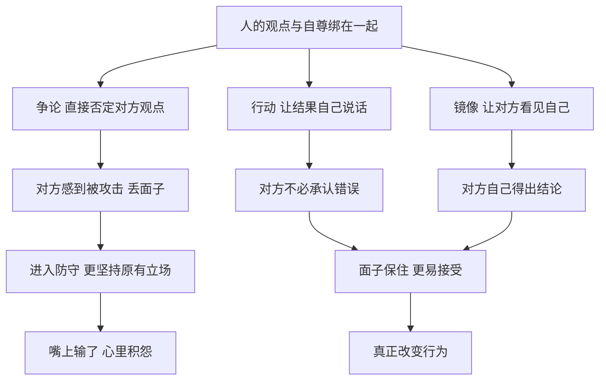

# 10｜为什么赢得争论，往往会输掉人心？

> 为什么在嘴上赢了，事情却常常输了？

---

## 一、先说结论

格林在第 9 条里说得很直接：**用行动而非争论取胜。**

争论即使赢了，也往往是一场得不偿失的胜利：对方丢了面子，心里积下怨气，表面服输，暗中却更加坚持原来的想法。而行动和示范不需要对方承认自己错了，只需要让他亲眼看到结果。

第 44 条“镜像效应”则提供了另一种思路：与其反驳对方，不如模仿对方的做法，让他从你身上看到自己的样子。

两条法则的共同点是：**改变一个人，最难的路是说服他，更容易的路是让他自己看见。**

---

## 二、我们先理解一个问题

我们从小被教育要讲道理：有理走遍天下，真理越辩越明。

可现实经验往往恰好相反：

> 你在会上逻辑严密地驳倒了同事，他却从此处处和你作对。
> 你把证据一条条摆给家人看，家人反而更固执了。
> 你在网上跟人争论了一整晚，没有一个人改变立场。

如果道理本身足够有力，这些争论为什么常常以更深的对立收场？

问题也许不在于道理是否正确，而在于**争论这种形式本身**。那么，为什么在嘴上赢了，事情却常常输了？

---

## 三、作者到底提出了什么观点？

**第 9 条：用行动而非争论取胜。** 格林认为，通过争论获得的胜利，往往是一种假胜利。原因在于，争论会触动对方的自尊。当一个人被当众证明是错的，他感受到的首先不是“我学到了新东西”，而是“我丢脸了”。于是他会怀恨在心，即使嘴上认输，行动上也不会真正配合。

格林主张，更有力的方式是**示范**：不去说服别人你的方案更好，而是做出来，让结果说话。行动不会冒犯任何人的智力，它只是摆在那里，让人自己得出结论。

格林还提醒，争论还有一个隐藏风险：你在争论中说出的话，可能会被对方抓住，成为攻击你的把柄；而你为了赢得争论所表现出的急切，也会暴露你的在意和不安。

**第 44 条：用镜像效应解除对方武装、激怒对方。** 格林认为，模仿对方的言行，会产生一种强烈的心理效果：有时让对方感到被理解、放下戒心；有时则让对方在你身上看到自己的样子，从而意识到自己的问题，甚至被这种“照镜子”搅得心神不宁。

两条法则合起来，讲的是一个判断：**直接对抗对方的观点，会激起抵抗；绕过观点，从行动和感受入手，往往更有效。**

---

## 四、把这个观点翻译成人话

打个比方。

一个厨师想说服餐馆老板换一种做法。第一种方式，是写一份长长的报告，逐条论证新做法为什么更好；第二种方式，是直接做一盘出来，请老板尝一口。

哪种方式更容易成功？大多数时候是第二种。报告会引来反驳：“你凭什么这么说？”而一盘菜只会引来一个问题：“好不好吃？”

**争论让对方进入防守状态，示范让对方进入体验状态。**

再说镜像。孩子总是打断大人说话，大人反复讲“不要打断别人”，效果不大。有一天，大人在孩子说话时也不停地打断他，孩子急了：“你能不能让我说完！”这时大人只需要说一句：“你看，被打断是不是很难受？”

**你没有和他争论，只是让他从你身上看见了自己。**

---

## 五、为什么会这样？

格林的推理可以这样拆开：

关键在 **A** 这个前提。

人的观点并不只是一个信息，它常常和身份、经验、自尊绑在一起。否定一个人的观点，在他听来很像是在否定他这个人。心理学上有一种常被讨论的现象，被称为“逆火效应”：一些研究发现，当人们的既有信念受到直接挑战时，有时不仅不会改变，反而会更加坚持。关于这种效应的普遍程度，后续研究存在争议，但“直接对抗容易激起防御”这一点，很多人都有切身体会。

而 **C** 和 **D** 两条路径的共同点在于：**它们给了对方一个台阶。** 对方不需要当众承认“我错了”，而是可以在自己的节奏里，悄悄改变看法。

---

## 六、举一个现实生活中的例子

一个家庭微信群里，妈妈转发了一篇文章：《震惊！这种常见食物吃多了致癌，很多人天天在吃》。

在外地工作的女儿看到后，觉得这明显是谣言，于是在群里回复：“妈，这个是假的，已经被辟谣了。”并附上了一个辟谣链接。

妈妈回了一句：“宁可信其有嘛，小心点总没错。”

女儿有点着急，接着发了一段长文字，从科学原理讲到研究数据，最后补了一句：“这种文章都是为了骗点击的，你们不要什么都信。”

群里安静了几分钟。然后爸爸出来说话了：“我们是没你有文化，但我们吃了几十年饭，还不知道什么能吃什么不能吃？”妈妈又补了一句：“好心提醒你们，还被说成傻子。”

一场关于食物的讨论，演变成了一场关于“你是不是嫌弃我们”的争吵。

**女儿说的每一句话可能都是对的，但她赢了道理，输了关系。** 更糟的是，父母以后可能更不愿意在群里听她的意见——每一次反驳，都会让他们想起这次“被看不起”的感受。

如果换一种方式呢？女儿可以不在群里当众反驳，而是私下和妈妈聊聊，先问她为什么担心这个；或者下次回家时，自然地做一顿饭，吃得健康又好吃，让父母自己感受到“这样吃也没问题”；再或者，找一个父母信任的医生朋友，在聊天中顺带提到这件事。

**这些方式都不需要父母承认自己错了，却更有可能真正改变他们的想法。**

---

## 七、回到书中重新理解

格林在第 9 条中讲到了米开朗基罗的一个故事。

16 世纪初，米开朗基罗在佛罗伦萨雕刻著名的大卫像。一天，佛罗伦萨的执政官皮耶罗·索德里尼前来视察。他看着这座巨大的雕像，表示很满意，但提出了一个意见：鼻子似乎太大了。

米开朗基罗知道，问题并不在鼻子，而在于索德里尼站的位置——他站在雕像下方，角度造成了视觉上的偏差。但他也知道，和一位掌权者争论艺术问题，不会有好结果。

于是他没有辩解，而是请索德里尼稍等，然后拿起凿子和一把大理石粉末，爬上脚手架。他在鼻子附近轻轻敲打，同时让手里的粉末一点点撒落下来，看起来像是在认真修改。事实上，他根本没有动雕像的鼻子。

过了一会儿，米开朗基罗停下来，问索德里尼现在觉得怎么样。索德里尼抬头看了看，满意地说：“我更喜欢了，你让它活起来了。”

这个故事最早见于瓦萨里的《艺苑名人传》，细节可能带有传记作家的润色，但格林用它说明了第 9 条的精髓：**米开朗基罗没有赢得任何争论，却保住了作品，也保住了索德里尼的面子。** 如果他当场指出“是您站的位置不对”，他可能会在道理上获胜，却会让一位掌权者难堪，而这份难堪迟早会以别的方式回到他身上。

这个故事也与前面谈过的“不要让上级黯然失色”相呼应：**在权力关系中，让对方觉得自己是对的，有时比证明自己是对的更重要。**

---

## 八、这个观点背后还有什么？

**第一，争论的对象往往不是观点，而是地位。** 很多争论表面上在讨论事实，实际上在争夺“谁更有资格说话”。一旦争论变成地位之争，事实本身就不再重要了。

**第二，行动的说服力来自“不可辩驳性”。** 语言可以被质疑，结果却很难被否认。一个做出成绩的人，不需要赢得每一场讨论。

**第三，镜像效应的本质是共情与反思。** 当你模仿对方时，有两种可能：对方感到被理解，于是放下戒心；或者对方在你身上看到自己的问题，于是开始反思。前者是拉近距离，后者是间接批评。

**第四，保留面子是一种长期投资。** 中文里“给人台阶下”，说的就是这个道理。你今天让对方保住了面子，对方明天更可能听你的意见。

---

## 九、这个观点有问题吗？

**它的说服力在于，它符合大量日常经验和部分心理学观察。** 直接反驳容易引发防御，示范和体验往往比说教更有效，这一点在家庭、职场、教育中都有大量例证。

**但它也存在一些值得注意的问题。**

**第一，有些场合必须争论。** 在科学研究、法庭辩论、公共政策讨论中，公开的论证和反驳是发现真相、维护公正的必要机制。如果每个人都回避争论，错误的观点可能长期得不到纠正。

**第二，“假装修改”带有欺骗成分。** 米开朗基罗的做法很聪明，但本质上是在糊弄对方。如果被发现，信任会受损。在需要真诚协作的关系中，这种方式未必合适。

**第三，行动并不总能替代语言。** 有些问题需要解释清楚，行动的意义才能被理解。一味“用行动说话”，也可能让人误解你的意图。

**第四，镜像效应有风险。** 模仿对方如果被察觉为嘲讽，可能会激化矛盾，而不是化解矛盾。

**第五，心理学研究结论并不统一。** 例如关于“逆火效应”，一些后续研究发现，在很多情况下，人们在面对纠正信息时，还是会或多或少地更新自己的看法。**所以问题可能不在于“讲道理没用”，而在于“以什么方式讲道理”。**

**所以更准确的说法是**：争论不是没有价值，而是要分清目的。如果目的是发现真相，争论是必要的；如果目的是改变一个具体的人，那么尊重他的面子、给他看到结果，往往比赢得辩论更有效。

---

## 十、今天再看这个观点

以下部分是基于格林思想的现代延伸，不是他在书中的原话。

在社交媒体时代，争论变得前所未有地频繁和公开。评论区、群聊、热搜话题下，每天都有无数场争论。可我们很少看到有人在网上争论之后说：“你说得对，我改变看法了。”

原因之一是，公开争论把观点和面子紧紧绑在了一起：在众目睽睽之下认错，代价太高了。

这提醒我们：**如果真的想改变一个人的想法，最好避开公开场合，选择私下交流；避开直接否定，选择先理解对方的担忧；避开长篇说教，选择让对方亲身体验。**

在工作中也是如此。与其在会上和同事争论方案优劣，不如先做一个小规模试点，让数据说话。结果出来之后，争论往往自然消失。

---

## 十一、这一篇真正应该记住什么？

1. **争论赢了，往往是假胜利。** 对方嘴上输了，心里却可能积下怨气，行动上更加抵触。
2. **观点和自尊绑在一起。** 否定一个人的观点，常常被他感受为否定他这个人。
3. **行动和示范不冒犯人。** 结果摆在那里，对方可以自己得出结论，而不必承认错误。
4. **镜像让人看见自己。** 模仿对方的做法，有时比任何反驳都更能让他意识到问题。
5. **分清目的。** 追求真相时需要争论，改变具体的人时，给面子、看结果更有效。

---

## 十二、留一个问题

> 回想一次你在争论中“赢了”的经历，
> 对方后来真的改变做法了吗？
> 如果重来一次，你会选择说服他，还是让他自己看见？

---

米开朗基罗之所以能化解危机，是因为他看懂了索德里尼：这是一位需要被尊重的掌权者，他在意的不是鼻子，而是自己的判断被认可。换一个人，同样的办法未必管用。

影响一个人，首先要读懂一个人。下一篇，我们就来谈——**为什么要先看清对手，再找到他的软肋？**
