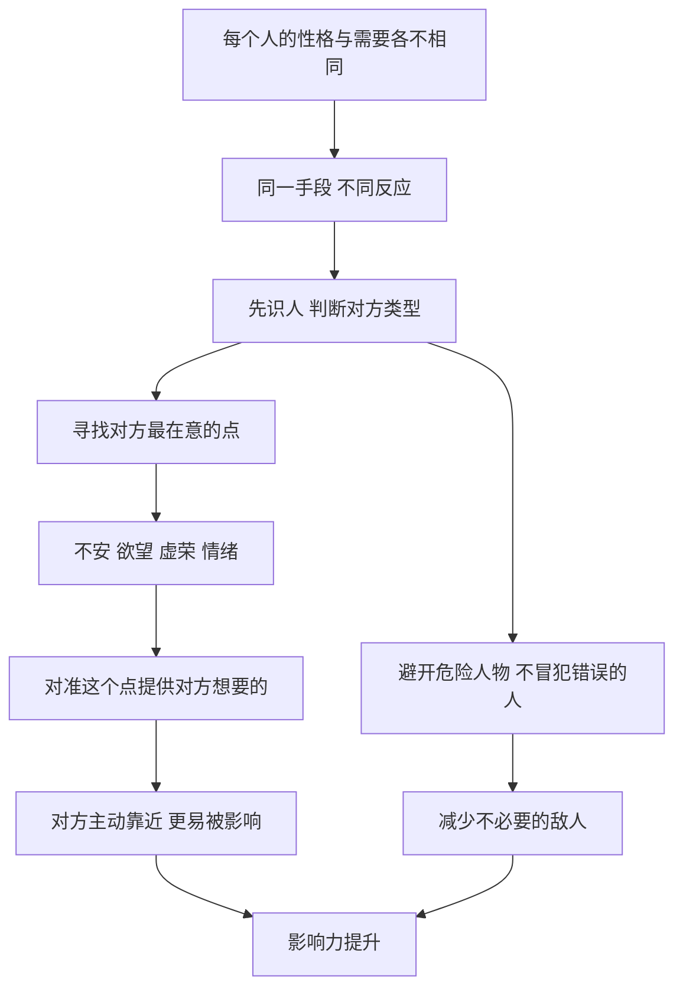

# 11｜为什么要先看清对手，再找到他的软肋？

> 为什么同一种手段，用在不同人身上结果截然相反？

---

## 一、先说结论

格林在第 19 条和第 33 条里，讲的是同一件事的两面：**影响他人的前提，是理解他人。**

第 19 条提醒：要知道你在与谁打交道，不要冒犯错误的人。有些人一旦被冒犯，会记恨很久、报复很狠；同样的玩笑、同样的拒绝，放在不同人身上，后果可能天差地别。

第 33 条主张：找到每个人的“拇指夹”——他的不安、欲望、虚荣或隐秘的需要。格林认为，每个人都有一个最在意的地方，那里既是他的动力，也是他的弱点。

一句话：**不看人就出手，是在赌运气；看清了人再出手，才是在用策略。**

---

## 二、我们先理解一个问题

很多人在人际交往中有一套“固定打法”：对谁都热情，对谁都讲道理，对谁都用同一种方式开口。

这套打法有时管用，有时却莫名其妙地失败：

> 同样一句玩笑，有的同事哈哈一笑，有的同事从此不再理你。
> 同样一个提案，有的领导看重数据，有的领导只关心会不会出风险。
> 同样的礼物，有的人很高兴，有的人却觉得你在收买他。

问题出在哪里？也许不在于方法本身，而在于**你没有先弄清楚对方是谁**。

那么，为什么同一种手段，用在不同人身上，结果会截然相反？

---

## 三、作者到底提出了什么观点？

**第 19 条：知道你在与谁打交道，不要冒犯错误的人。** 格林认为，世界上的人形形色色，你用来对付一个人的方法，可能会激怒另一个人。有些人被冒犯后会一笑了之，有些人却会记恨一生，伺机报复。因此，在出手之前，必须先判断对方的性格和反应方式。

格林在这一条中列举了几类尤其不能轻易冒犯的人，大致包括：

- **傲慢骄傲的人**：对任何轻视都极其敏感，一点冒犯就可能引发过激反应。
- **绝望不安的人**：内心缺乏安全感，容易把小事看成对自己的攻击，报复往往持续而隐蔽。
- **多疑的人**：总觉得别人在算计自己，一旦被引起疑心，就很难再信任你。
- **记仇的人**：表面不动声色，却会把伤害记在心里，等待机会报复。
- **愚钝朴实的人**：看似无害，但很难被说服，在他身上用计谋往往白费力气。

格林的意思是：**识人是一切策略的前提。** 选错了对象，再高明的手段也可能引火烧身。

**第 33 条：找到每个人的拇指夹。** “拇指夹”原本是一种刑具，格林用它比喻人身上最容易被控制的那个点。他认为，每个人都有自己的软肋：可能是不安全感，可能是对认可的渴望，可能是某种隐秘的欲望，也可能是一种无法控制的情绪。找到这个点，就能影响对方。

格林提到了一些寻找软肋的线索，例如：留意对方不经意的言行和习惯；注意外表与内心的反差——一个人刻意表现出来的特质，有时恰恰掩盖着相反的不安；关注他内心缺少什么，因为人往往会被能填补这种空缺的东西吸引。

---

## 四、把这个观点翻译成人话

打个比方。

一把钥匙只能开一把锁。你手里拿着一把钥匙，见门就插，大多数时候都打不开，有时还会把锁弄坏。

**识人，就是先看清这是一把什么样的锁；找软肋，就是找到能打开它的那把钥匙。**

比如，有两位领导，你都想向他们申请一个项目。第一位领导最在意的是在上级面前的表现，你可以强调这个项目能带来的亮点和成绩；第二位领导最怕出问题，你就应该重点说明风险如何控制、出现意外怎么兜底。

同样的项目，不同的讲法。你讲的都是真话，只是**把对方最在意的那部分放在了最前面**。

反过来，如果你拿第一种讲法去找第二位领导，他听到的只会是“这个人很激进，可能会给我惹麻烦”。

---

## 五、为什么会这样？

格林的推理可以这样拆开：

关键有两处。

**第一处是 A → B。** 人不是标准化的零件。同样一句话，在自信的人听来是玩笑，在不安的人听来是嘲讽；同样一次拒绝，在大度的人那里是正常沟通，在记仇的人那里是一次羞辱。**你以为你在对一件事做反应，其实对方是在对你这个人做反应。**

**第二处是 E → G。** 为什么软肋能影响人？因为人最在意的东西，往往也是他最难保持理性的地方。一个极度渴望认可的人，面对赞美时很难冷静；一个极度缺乏安全感的人，面对承诺时很难拒绝。**软肋之所以是软肋，就是因为它绕过了理性的防线。**

---

## 六、举一个现实生活中的例子

一家汽车 4S 店里，一位经验丰富的销售同一天接待了三位客户，看中的都是同一款中型 SUV。

**第一位客户**是一位做生意的中年男士，开着一辆不错的旧车来，衣着讲究，进门就问：“这款车有没有更高配的？”销售很快判断出，这位客户看重的是面子和身份。于是他重点介绍车的外观气场、内饰质感、顶配车型的专属功能，顺带提到“不少做企业的老板都选这款”。价格？他几乎没怎么提。

**第二位客户**是一对年轻夫妻，带着一个刚会走路的孩子。妻子一直在看后排空间，丈夫在问油耗。销售判断，他们最在意的是安全和家庭使用。于是他打开后门，演示儿童安全座椅接口，讲车身结构和碰撞测试表现，讲主动刹车等安全配置，还提到后备箱能轻松放下婴儿车。

**第三位客户**是一位刚退休的中学老师，手里拿着一张写满了参数对比的纸，问得非常细：保养一次多少钱？保值率怎么样？和另外两个品牌比，配置差在哪里？销售判断，这位客户看重的是性价比和决策的“合理性”。于是他不再强调气场和豪华，而是陪着客户一项项对比参数，算清楚几年下来的用车成本，最后拿出一份详细的配置表，让老师带回去慢慢比较。

**同一款车，三种完全不同的讲法。** 如果销售用第一种话术去说服退休老师，老师会觉得他华而不实；如果用第三种话术对待那位中年男士，男士可能会觉得“这个销售没眼光，看不起我”。

这就是第 19 条和第 33 条在日常生活中的样子：**先看清对方是谁，再找到他最在意的那个点。**

当然，这个例子也有另一面：如果销售利用年轻父母对孩子安全的焦虑，过度渲染风险、诱导他们购买不必要的高价配置，那就从“理解客户”滑向了“利用软肋”。二者的边界，往往就在于是否诚实。

---

## 七、回到书中重新理解

格林在第 33 条中讲到了黎塞留早年的一段经历。

阿尔芒·让·迪·普莱西，也就是后来的黎塞留枢机主教，年轻时只是一位地方主教，在法国宫廷中并没有什么地位。17 世纪初，法王亨利四世遇刺身亡后，年幼的路易十三继位，他的母亲玛丽·德·美第奇作为摄政太后掌握大权。

据格林的讲述，黎塞留看出了这位太后的特点：她热衷权力，爱慕虚荣，渴望被人奉承，也渴望证明自己的统治能力。黎塞留于是投其所好，以恭敬和赞美接近她，把自己塑造成她忠实而有用的支持者。他逐渐赢得了太后的信任，在她的提携下进入宫廷，获得了重要的职位。

此后的历史更加曲折。黎塞留在权力中心的地位越来越稳固，并最终得到了路易十三的倚重。后来太后与黎塞留关系破裂，试图说服国王罢免他，却在 1630 年的一场宫廷危机中失败，这一事件在历史上被称为“受骗者之日”。此后，太后失势，最终流亡国外，而黎塞留则长期主导法国政务。

格林借这个故事说明：**一个人最在意的东西——在太后这里，是虚荣和对权力的渴望——正是别人最容易影响她的地方。** 黎塞留没有与太后对抗，而是先读懂了她，再精准地满足了她的需要，由此打开了通往权力的大门。

需要说明的是，格林的讲述侧重于“利用软肋”这一面。历史上黎塞留的崛起涉及复杂的宫廷派系、宗教与政治局势，以及他本人的才干，**关于他与太后关系的演变，历史学界有更丰富的解释**，不宜简单理解为一场单纯的“奉承与利用”。

---

## 八、这个观点背后还有什么？

**第一，软肋往往藏在最在意的东西里。** 一个人最骄傲的地方、最焦虑的地方、最渴望的地方，往往是同一个地方。太后在意权力，也最容易被权力相关的奉承打动。

**第二，识人不仅用于进攻，更用于防守。** 第 19 条的重点，其实是避免犯错：知道哪些人不能惹、哪些话不能说。很多人际灾难，并不是因为手段不够高明，而是因为一开始就选错了对象。

**第三，“软肋”和“需要”只有一线之隔。** 一个人渴望认可，你真诚地认可他，这是满足需要；你假意奉承以谋私利，这是利用软肋。行为可能相似，出发点和后果却完全不同。

**第四，人也在读你。** 你在寻找别人软肋的同时，别人也在寻找你的。了解自己的软肋——你最容易被什么打动、被什么激怒——同样是这条法则的一部分。

---

## 九、这个观点有问题吗？

**它的说服力在于，它指出了一个被广泛验证的规律：因人而异才能有效沟通。** 无论是营销中的用户分层、管理中的因材施教，还是谈判中的对手分析，都建立在“先理解对方”的基础上。

**但它也存在明显的争议和简化。**

**第一，人的性格并不像分类那样固定。** 格林列举的几类危险人物，便于记忆，但现实中的人往往是复杂的、多变的。心理学中关于人格的研究也表明，人的行为在很大程度上受情境影响，把一个人简单归为某一类，容易产生误判。

**第二，“找软肋”的伦理问题。** 利用别人的不安和欲望来达到目的，本质上是一种操纵。如果被对方察觉，不仅会失去信任，还可能招来格林在第 19 条中警告的那种报复。

**第三，它忽略了真诚关系的力量。** 从组织行为学的角度看，长期的影响力往往来自真实的信任与互惠，而不仅仅是对弱点的精准把握。一个总在寻找别人软肋的人，很难建立真正的合作关系。

**第四，历史叙事存在简化。** 黎塞留的故事被讲成“看准虚荣、奉承上位”，但真实历史中的权力更替，往往是多种因素交织的结果。

**所以更准确的说法是**：识人是必要的能力，找到对方真正在意的东西，是有效沟通的基础；但“理解需要”和“利用弱点”之间的界线，决定了这项能力是建设性的，还是破坏性的。

---

## 十、今天再看这个观点

以下部分是基于格林思想的现代延伸，不是他在书中的原话。

在今天，“找到每个人的软肋”已经被技术放大到了极致。推荐算法通过分析用户的点击、停留和购买记录，精准判断每个人的兴趣、焦虑与欲望，再推送最能打动他的内容和商品。某种意义上，算法就是一个不知疲倦的“识人者”。

这提醒我们，**了解自己的软肋变得比以往更重要。** 你最容易在什么情绪下冲动消费？最容易被什么样的话术说服？最容易被什么样的言论激怒？知道这些，你才能在别人按下你的按钮时，及时察觉。

对个人来说，第 19 条和第 33 条更健康的用法是：在沟通前先想清楚“对方最在意什么”，用对方能接受的方式表达真实的内容；在冲突前先判断“这个人被冒犯后会怎样”，避免不必要的敌意。**理解他人，是为了更好地合作，而不是为了更精准地控制。**

---

## 十一、这一篇真正应该记住什么？

1. **同一种手段，不同的人反应不同。** 出手之前，先弄清楚你在与谁打交道。
2. **有些人不能轻易冒犯。** 傲慢者、不安者、多疑者、记仇者，冒犯他们的代价往往远超预期。
3. **软肋藏在最在意的东西里。** 一个人最渴望、最焦虑的地方，也是他最难保持理性的地方。
4. **理解需要与利用弱点只有一线之隔。** 差别在于是否诚实，以及是否伤害对方。
5. **先读懂自己的软肋。** 在人人都在读你的世界里，知道自己的按钮在哪里，是最好的防御。

---

## 十二、留一个问题

> 如果有人想影响你，
> 他最可能从你身上的哪个点入手？
> 是你对认可的渴望、对失败的恐惧，还是对某种东西的执念？

---

黎塞留读懂了太后，也读懂了宫廷里其他人对他的看法。在那个世界里，一个人被怎样看待，几乎决定了他能走多远。看清了别人之后，下一步要面对的，就是别人如何看清你——你的名声。

下一篇，我们从人心的另一端说起：**为什么声誉是权力的基石？**
