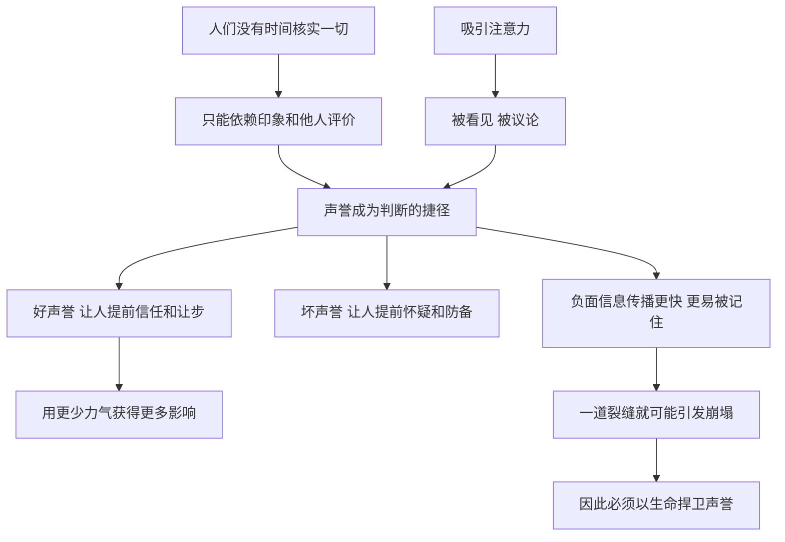

# 12｜为什么声誉是权力的基石？

> 为什么人们对你的看法，往往比你实际做了什么更重要？

---

## 一、先说结论

格林认为，**声誉是一个人最容易被低估、也最难以修复的资产。**

好的声誉会替你提前完成一半的说服：你还没开口，别人已经倾向于相信你；你还没出手，对手已经开始犹豫。反过来，一个人哪怕真有本事，如果没人知道他、没人记得他，这份本事就很难转化成影响力。

所以格林把两条法则放在一起：第 5 条说“声誉至关重要，要以生命捍卫”，第 6 条说“不惜一切代价吸引注意力”。前者讲的是守，后者讲的是攻。**先让人看见你，再让人以你希望的方式记住你。**

但这枚硬币还有另一面：声誉建立得很慢，崩塌得极快。它越是值钱，就越是对手的攻击目标。

---

## 二、我们先理解一个问题

我们从小听到的教育大多是：把事情做好，自然会有人看见。

这句话在一个信息充分、人人都有时间仔细判断的世界里是成立的。可现实世界并不是这样：

> 为什么同样水平的两个人，一个被称为“专家”，一个被看作“普通从业者”？
> 为什么一家公司一条负面新闻，就能让多年积累的口碑瞬间蒸发？
> 为什么有些人明明争议很多，却总能占据话题中心？

原因在于，**绝大多数人没有能力、也没有时间去核实你到底做了什么。** 他们只能依靠一个简化的判断：别人怎么说你、你给人留下了什么印象。

于是问题就变成了：如果别人对你的判断主要来自印象，那么印象本身是不是一种权力？

---

## 三、作者到底提出了什么观点？

格林的观点可以拆成三层。

**第一，声誉是权力的“前置条件”。** 格林认为，一个拥有强大声誉的人，可以用更少的力气达到更大的效果。别人会因为你的名声而敬畏你、信任你，甚至在你没有真正行动时就主动让步。声誉就像一支看不见的军队，替你驻守阵地。

**第二，声誉必须主动经营，并且要以某种鲜明的特质为核心。** 格林主张，一个人最好让自己以某种突出的品质被人记住，比如慷慨、诚实、精明或者冷酷。这种特质一旦深入人心，就会成为别人理解你一切行为的滤镜。

**第三，注意力是声誉的原料。** 在第 6 条里，格林走得更远：他认为默默无闻比声名狼藉更可怕。被人议论，至少意味着你存在；被人遗忘，才意味着你真正出局。所以他主张用新奇、戏剧化、甚至带点争议的方式，把自己推到人群的视线中心。

与此同时，格林也提醒：**声誉是双向的武器。** 你可以捍卫自己的声誉，也可以攻击对手的声誉。而最有效的攻击，往往不是正面对抗，而是在对方的声誉上制造一道裂缝，然后让舆论自己去撕开它。

---

## 四、把这个观点翻译成人话

打个比方。

声誉就像一个人的“信用评分”。评分高的人，借钱容易、利率低、别人愿意和他做生意；评分低的人，哪怕这次说的是真话，对方也要反复核实。

注意力则像“曝光量”。一个信用评分再高的人，如果没人知道他的存在，也不会有人找他合作。

所以格林这两条法则合起来，其实就是一句大白话：**先让人知道你，再让人信你；然后像保护命根子一样保护这份“信”。**

而它冷酷的地方在于，格林并不只让你保护自己的“评分”，他还告诉你：对手的评分，也可以被你拉低。

---

## 五、为什么会这样？

声誉为什么会有如此大的力量，又为什么如此脆弱？可以这样拆解：

这张图里有两个关键点。

**第一个是 A → C。** 人的认知资源是有限的。我们在决定信任谁、跟谁合作、怕谁的时候，很少真正调查，而是依赖“大家都说他不错”“听说这人不好惹”这样的二手信息。声誉之所以有力量，是因为它替人节省了判断成本。

**第二个是 C → I → J。** 心理学中有一种被广泛讨论的现象叫“负面偏向”：人们对坏消息的敏感度往往高于好消息，一次失信给人留下的印象，常常比十次守信更深刻。所以声誉的积累是加法，崩塌却像乘法——一个足够刺眼的负面事件，可能让之前所有的正面积累一起归零。

这就解释了格林为什么说要“以生命捍卫”：**因为声誉一旦受损，修复的成本远高于当初建立的成本。**

---

## 六、举一个现实生活中的例子

想象一家开在商圈里的网红餐厅。

它靠着好看的装修、几道出圈的招牌菜，以及社交平台上源源不断的打卡照片，迅速火了起来。每到饭点，门口排起长队，等位两小时是常态。很多人甚至不是因为饿，而是因为“大家都说好吃”“没去过就落伍了”才来的。

这时候，餐厅的声誉就在替它做生意：顾客还没尝一口，就已经预设了“这家一定不错”。

后来有一天，一段后厨视频在网上流传开来：地面积水、食材随意堆放、员工操作不规范。视频本身只有几十秒，拍的也只是某一天的某个角落。

但结果是，**几乎一夜之间，门口的长队消失了。** 评论区从“好吃到哭”变成“再也不去了”；之前的好评被翻出来嘲讽；连没去过的人也开始转发。餐厅发了道歉声明、做了整改，可客流很长时间都没能恢复。

这个例子几乎完整演示了格林的两条法则：

- 它靠**注意力**起家，排队本身就是一种吸引注意力的奇观；
- 它的生意建立在**声誉**之上，而不是每位顾客都亲自验证过的品质；
- 一道裂缝出现后，**负面信息的传播速度远远超过正面积累**，声誉的崩塌几乎不给人反应时间。

它提醒我们：越是靠声誉吃饭的人和组织，越要在看不见的地方守住底线。因为人们原谅你的速度，永远赶不上他们抛弃你的速度。

---

## 七、回到书中重新理解

格林在讲这两条法则时，反复用到了同一个人物：美国马戏大王 P.T.巴纳姆。

**在第 5 条里，巴纳姆展示的是如何攻击对手的声誉。** 根据格林的讲述，19 世纪 40 年代，巴纳姆想要收购纽约的一家博物馆，而与他竞争的是经营皮尔博物馆的一方。巴纳姆没有在出价上硬拼，而是在报纸上发起舆论攻势，质疑对手的经营和财务状况，让外界对对方失去信心，最终搅黄了对手的收购。之后，当皮尔博物馆试图用新奇表演挽回人气时，巴纳姆又用针锋相对、带有嘲讽意味的表演去消解对方的可信度。对手的名声一步步被拖垮，最终败下阵来。

格林从这个故事里提炼的是：**声誉一旦被公开质疑，对方往往越辩解越被动。** 攻击者只需要制造怀疑，而防守者却要证明清白。

**在第 6 条里，巴纳姆展示的是如何制造注意力。** 巴纳姆一生以各种宣传噱头闻名：他展出过号称年龄极高的老人、所谓的“斐济美人鱼”等真假难辨的展品，还用各种离奇的街头花招吸引路人围观。历史上对这些噱头的评价褒贬不一，其中不少带有明显的欺骗成分。但格林看重的是其中的机制：**人们对新奇和争议的好奇，本身就是一种可以被引导的力量。** 哪怕有人骂他是骗子，人们也还是会掏钱进来看个究竟。

把两个故事放在一起看，就能理解格林的逻辑：巴纳姆先用注意力让自己成为焦点，再用舆论去塑造自己和对手在公众心中的位置。**他争夺的不是某一次交易，而是人们脑中的印象。**

---

## 八、这个观点背后还有什么？

**第一，声誉的本质是“别人替你说话”。** 你亲口说自己可靠，说服力很弱；别人说你可靠，说服力就强得多。声誉之所以有力，是因为它来自第三方，看起来更客观。

**第二，格林把声誉当作可以设计的东西。** 他并不认为声誉只是“做好事的副产品”，而是主张主动选择一个核心特质去经营。这背后是一种很现代的观念：形象是可以被管理的。今天的“个人品牌”“危机公关”，本质上都是这一思路的延伸。

**第三，注意力和声誉之间存在张力。** 第 6 条鼓励你不惜代价吸引注意，第 5 条却要求你保护声誉。可很多吸引注意的手段，恰恰会损害声誉。巴纳姆的噱头让他出名，也让他长期背着“骗子”的名声。**如何在“被看见”与“被尊重”之间找到平衡，是格林没有完全回答的问题。**

**第四，声誉还是一种防御工事。** 一个声誉稳固的人，面对流言时有更多缓冲；一个毫无声誉积累的人，一次攻击就可能被定性。这也是为什么格林强调“平时就要经营”，而不是出事了再补救。

---

## 九、这个观点有问题吗？

这两条法则很有说服力，但也值得仔细推敲。

**第一，它的说服力来自一个真实的认知规律。** 人们确实依赖声誉做判断，负面信息确实传播得更快。经济学里讨论的“信号理论”也认为，在信息不对称的市场中，声誉和品牌是降低交易成本的重要机制。从这一点看，格林抓住了真问题。

**第二，“默默无闻比声名狼藉更可怕”是一种过度简化。** 这句话对表演者、商人和需要曝光的人或许成立，但对很多行业并不适用。一个医生、会计师或工程师，靠的是长期的专业信誉，而非话题度；一旦“声名狼藉”，职业生命可能直接终结。**注意力的价值取决于你所处的场域。**

**第三，攻击对手声誉的策略有很高的反噬风险。** 巴纳姆的故事发生在信息传播缓慢、真假难辨的年代。在今天，恶意中伤一旦被识破，攻击者的声誉会先一步崩塌。从重复博弈的角度看，长期参与同一个圈子的人，靠抹黑对手获利，往往会损害自己在圈子里的信任。

**第四，关于声誉的来源存在不同解释。** 格林更强调“经营”与“塑造”，而一些组织行为学研究更强调“一致性”：长期的、可预期的行为表现，才是声誉最稳固的基础。换句话说，声誉可以被包装，但包装与实质差距太大时，迟早会被一次意外戳破——就像那家网红餐厅。

**所以更准确的说法是**：声誉确实是权力的基石，但最稳的基石不是被刻意雕琢出来的，而是被长期的真实行为一点点夯实的。格林教我们看到声誉的力量，却有些低估了它对实质的依赖。

---

## 十、今天再看这个观点

以下部分是基于格林思想的现代延伸，不是他在书中的原话。

在格林写书的年代，一个人的声誉主要在熟人圈、行业圈和报纸上流转。今天，每个人都生活在一个公开的评价系统里：外卖有评分，商家有评论，个人有社交账号，一句话可能被截图保存很多年。

这带来了两个变化。

**第一，注意力变得廉价，声誉变得昂贵。** 制造热度比以往任何时候都容易，一个视频就可能让普通人一夜成名；但守住声誉却更难了，因为每一个细节都可能被放大审视。

**第二，声誉的崩塌速度被技术放大了。** 过去一件丑闻可能要几周才传开，现在几个小时就能发酵到全网。这意味着“以生命捍卫声誉”在今天首先意味着：**在没人看的时候也按有人看的标准做事。**

对于普通人来说，理解这两条法则的更大价值，也许在防御一面：当你看到一个人或一个品牌热度极高时，不妨想一想，这份热度背后有多少实质；当你看到一条针对某人的负面消息时，也不妨想一想，这是事实，还是一次有意的“声誉攻击”。

---

## 十一、这一篇真正应该记住什么？

1. **声誉替你提前完成一半的说服。** 人们没有时间核实一切，只能依赖印象和他人的评价。
2. **注意力是声誉的原料。** 不被看见，就谈不上被记住；但被看见的方式，会决定你被怎样记住。
3. **声誉积累是加法，崩塌像乘法。** 一道足够刺眼的裂缝，就可能抵消多年的正面积累。
4. **攻击声誉比捍卫声誉更容易。** 攻击者只需制造怀疑，防守者却要证明清白，这也是格林说要“以生命捍卫”的原因。
5. **最稳的声誉来自长期一致的真实行为。** 包装可以放大声誉，却不能替代实质。

---

## 十二、留一个问题

> 如果你只能让别人用一个词来记住你，
> 你希望那个词是什么？
> 而你今天做的事情，是在加固这个词，还是在悄悄给它制造裂缝？

---

声誉说到底是别人眼中的你。可别人眼中的你，又是从哪里来的？格林有一个更进一步的判断：别人怎样看你，很大程度上取决于你先怎样看自己、怎样呈现自己。

下一篇，我们就来谈这种由内而外的力量——**为什么你如何看待自己，别人就如何对待你？**
