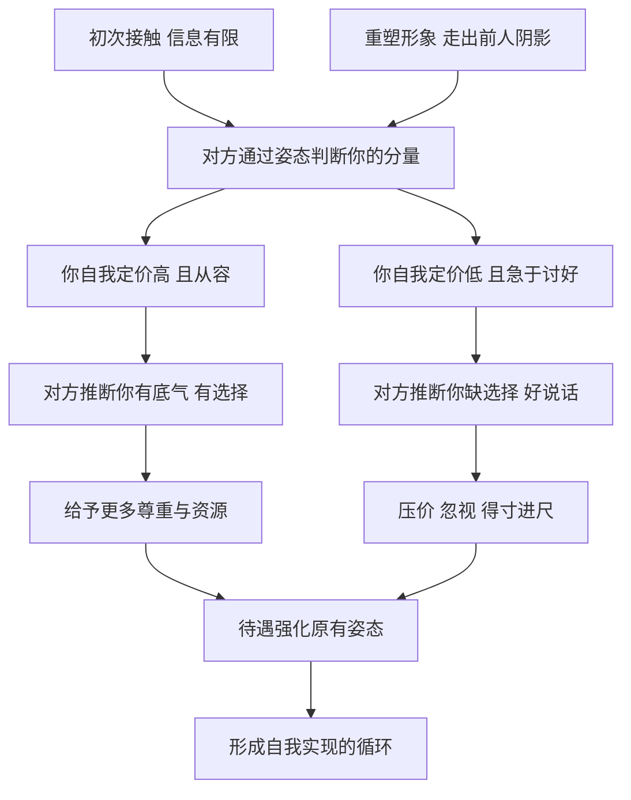

# 13｜为什么你如何看待自己，别人就如何对待你？

> 为什么身份和姿态可以被“塑造”，而不是只能被接受？

---

## 一、先说结论

格林认为，**别人对待你的方式，很大程度上是你自己“教”给他们的。**

你把自己放在什么位置，别人往往就顺着这个位置来对待你。一个人如果表现得理所当然地配得上尊重，别人常常会下意识地给予尊重；一个人如果处处自降身段、急于讨好，别人也会自然而然地把他放低。

这一篇涉及三条法则：第 34 条“以自己的方式高贵：要像国王一样行事，才会被当作国王对待”，第 25 条“重塑自我”，第 41 条“不要踏进伟人的鞋子”。合起来，它们讲的是同一件事：**形象不是出身发给你的一张身份证，而是你可以主动设计、并且必须亲手经营的作品。**

---

## 二、我们先理解一个问题

很多人都有过这样的困惑：

> 为什么能力差不多的两个人，一个总被当回事，一个总被随意打发？
> 为什么有的人一开口，大家就默认他说了算？
> 为什么越是客气、越是好说话的人，越容易被得寸进尺？

我们习惯把这些归因于外部：出身、学历、资源、运气。这些当然重要，但格林提醒我们注意一个常被忽视的变量：**你自己释放出来的信号。**

人与人初次接触时，彼此的信息都很有限。在这种情况下，对方如何判断你的“分量”？很大程度上，他是在读你的姿态：你怎样说话、怎样提要求、怎样面对拒绝、怎样看待自己的价值。

问题是：姿态真的能决定待遇吗？如果能，它又是怎样起作用的？

---

## 三、作者到底提出了什么观点？

格林的观点可以分为三层。

**第一层，姿态是一种自我实现的预言。** 在第 34 条里，格林认为，一个人对自己的定位会通过言行向外投射。你表现出自信、从容、不卑不亢，别人就会把你当作一个有分量的人；你表现出怀疑、畏缩、急于讨好，别人就会本能地低估你。他特别强调：要为自己“定价”，而且要定得高一些，因为别人通常不会主动替你抬价。

**第二层，身份可以重塑。** 在第 25 条里，格林主张不要接受社会或出身强加给你的角色，而是像演员塑造角色一样，有意识地创造一个新的自我形象。这个形象要鲜明、有记忆点，甚至带有一定的戏剧性，让人一看就记住你是谁。

**第三层，要走出他人的阴影。** 第 41 条提醒，接替一位强大前任、或者背负一个显赫名字的人，最容易被拿来比较。你做得好，功劳被归于前人的基础；做得不好，就被说成“一代不如一代”。所以格林主张，继承者必须尽早建立自己独特的风格和成就，而不是活在别人的鞋子里。

三层合起来是一个完整的逻辑：**先给自己一个高而清晰的定位，再用鲜明的形象把它演出来，并且确保这个形象属于你自己，而不是别人的影子。**

---

## 四、把这个观点翻译成人话

打个比方。

一件商品放在精品店的橱窗里，灯光打好、标价不菲，路人会觉得“这东西应该很好”；同样的商品堆在地摊上、写着“清仓甩卖”，人们就会觉得“大概不值什么钱”。

商品没变，**变的是它被呈现的方式，以及它给自己标的价。**

人也是这样。格林说的“像国王一样行事”，不是让你摆架子、耍威风，而是让你先在心里给自己一个清晰的定价，然后用言行把这个定价稳稳地传递出去。

至于“重塑自我”，就像一个人决定换一种活法：不是等别人来定义你，而是先想清楚你要成为谁，然后用一致的行为让别人慢慢接受这个版本的你。

而“不要踏进伟人的鞋子”，意思是别总穿着别人的衣服上台。穿得再合身，观众记住的也只是原来那个人。

---

## 五、为什么会这样？

姿态为什么能影响待遇？可以这样拆开它的机制：

关键在 **B → D** 这一步。

在信息不完整时，人们会用“信号”来推断对方的真实情况。一个人敢于提出较高的要求、面对拒绝不慌张，往往会被解读为“他有其他选择”“他对自己的价值有把握”。反过来，一个人主动压低自己，则会被解读为“他没什么筹码”。

更重要的是 **F → G**：待遇会反过来强化姿态。被尊重的人更自信，更自信的人又更容易被尊重；被轻视的人更畏缩，更畏缩又招来更多轻视。**起点上的一点差别，经过循环会被不断放大。**

这就是为什么格林说，你如何看待自己，别人就如何对待你——不是因为别人读懂了你的内心，而是因为你的内心通过姿态，变成了别人判断你的依据。

---

## 六、举一个现实生活中的例子

假设有两位求职者，学历相近、经验相当，面试表现也都不错，最后同时拿到了同一家公司的录用意向。

到了谈薪环节，HR 问他们：“您对薪资有什么期望？”

**第一位求职者**有些不好意思，笑着说：“我主要是看重平台和成长，薪资方面您看着给就行。”

**第二位求职者**则平静地回答：“根据我在上一份工作中负责的项目和目前的市场情况，我的期望是这个区间。当然，如果岗位的发展空间足够好，我们也可以一起商量具体结构。”

结果不难想象。第一位拿到的是这个岗位预算里偏低的数字；第二位拿到的接近他提出的区间。

但差别不止在起薪上。入职之后，第一位常常被默认“能多担点活”，加班时第一个被想到，调薪时也总排在后面，因为大家觉得“他不太计较”。第二位则被默认为一个“清楚自己价值”的人，分派任务时，上级会更注意与他的职责边界，涉及他的利益时也会更慎重。

**两个人能力相当，只是在一个关键时刻释放了不同的信号，就被放进了两条不同的轨道。**

这并不是说“开口要高价”就一定对。第二位求职者之所以有效，是因为他的定价有依据、姿态从容、留有余地，而不是虚张声势。这正是格林说的“以自己的方式高贵”：不是傲慢，而是清楚。

---

## 七、回到书中重新理解

格林在书中用了几组对照鲜明的故事。

**哥伦布是遵守第 34 条的例子。** 根据格林的讲述，哥伦布出身并不显赫，却在向西班牙王室寻求远航资助时，表现得像一个理所当然该被重视的人物。他提出的条件极高：要求获得显赫的头衔、对新发现土地的管辖权以及可观的收益分成。按常理，一个有求于人的航海者不该这样开口，但正是这种姿态让王室觉得，他对自己的事业有十足把握，最终答应了他的要求。

**法国国王路易-菲利普是违反第 34 条的例子。** 这位被称为“资产阶级国王”的君主，刻意放下王者的排场，打扮得像普通市民，在街上与人随意交谈，希望借此赢得民心。格林认为，结果恰恰相反：他既没有真正获得平民的亲近，又失去了一个国王应有的威严，最终在 1848 年的革命中被推翻。格林从中得出的结论是：**一个人主动放下自己的位置，别人未必会领情，反而可能顺势看轻他。**

**在第 25 条里，格林讲到了尤利乌斯·凯撒和乔治·桑。** 凯撒善于把自己的政治生涯变成一场场公共演出：盛大的竞技、慷慨的赏赐、戏剧化的出场，让民众把他看作一个非凡的人物。乔治·桑则是一个在男性主导的文坛中重塑身份的例子：她采用男性化的笔名，以不合常规的装扮出入社交场合，主动打造了一个鲜明而独立的公众形象。两人方式不同，但都在做一件事：**不接受别人为你预设的角色，而是亲自创造一个。**

**至于第 41 条**，格林讨论的是继承者的困境。历史上无数王储、创业家族的二代、接替传奇人物的继任者，都面临同一个问题：人们天然会拿他与前任比较。格林的建议是，要尽早用自己的风格和成就，建立一个与前任明显不同的形象，否则永远只能被当作“某某的继承人”。

---

## 八、这个观点背后还有什么？

**第一，姿态的核心是“内在的确定感”，而不是外在的排场。** 路易-菲利普的失败，不在于他穿了便服，而在于他在两种身份之间摇摆，让人看不清他到底是谁。哥伦布的成功，也不只在于要价高，而在于他对自己的要求始终坚定一致。

**第二，自我塑造是一种长期的一致性工程。** 一个形象要让人相信，需要言行长期统一。今天装作从容、明天慌乱失措，只会让人觉得你在表演。格林所说的“重塑自我”，更像是先想清楚自己要成为谁，然后一点点把自己活成那个样子。

**第三，这一组法则也与“社会角色”理论相通。** 社会学家欧文·戈夫曼曾用“拟剧”的视角讨论日常生活中的自我呈现：人们在不同场合扮演不同角色，并通过言行管理别人对自己的印象。格林的说法更功利，但讨论的是相近的现象。

**第四，走出前任的阴影，本质上是争夺“叙事权”。** 如果你的故事总被写成“前任故事的续集”，你的一切成败都会被归因到别人身上。只有建立自己的叙事，你的成就才真正属于你。

---

## 九、这个观点有问题吗？

**第一，它的说服力在于抓住了信号的作用。** 谈判研究中常被讨论的“锚定效应”表明，先提出的数字会显著影响最终结果；人们确实也常常根据自信程度来推断一个人的能力。从这个角度看，“为自己定价”的建议是有现实依据的。

**第二，但它忽视了自信与能力脱节的风险。** 姿态可以打开一扇门，却不能保证你留在门内。如果实质撑不起姿态，高定价很快会被识破，而被识破的代价往往比一开始低调更大。哥伦布后来在管理殖民地时的失败，也常被历史学者提及——他争取到了位置，却未必守得住。

**第三，“姿态决定待遇”在不同权力结构中效果不同。** 在高度等级化的环境里，一个位置不高的人摆出“国王”的姿态，可能被视为僭越，招来打压。格林在其他法则中也反复提醒不要让上级感到威胁。**两者之间的张力说明，“以自己的方式高贵”需要拿捏分寸，而不是一味抬高自己。**

**第四，它对结构性因素估计不足。** 性别、阶层、族群等因素会影响同一种姿态被如何解读。同样坚定地谈薪，不同身份的人可能收到完全不同的反馈。一些社会心理学研究讨论过这类“双重标准”。把一切都归结为个人姿态，容易让人忽视外部环境的不公平。

**所以更准确的说法是**：你的姿态确实会影响别人怎样对待你，但它是“放大器”，而不是“发动机”。它能放大你的真实价值，却不能凭空替你创造价值。

---

## 十、今天再看这个观点

以下部分是基于格林思想的现代延伸，不是他在书中的原话。

今天，“自我塑造”已经从少数权贵的特权，变成了每个普通人的日常。社交平台上的简介、职业平台上的履历、朋友圈里的只言片语，都在持续地向外界传递“我是谁”的信号。

这带来了一个新的问题：**当每个人都在塑造形象时，形象本身就变得廉价了。** 人们越来越擅长识别“人设”，也越来越警惕过度包装。于是，真正有效的自我呈现，反而回到了格林强调的那一点——一致性。说到做到、言行统一，比任何精心设计的姿态都更有说服力。

对普通人来说，这一组法则最实用的提醒或许是：**在关键时刻，别主动把自己放低。** 谈薪、谈合作、提出需求时，清楚说出你的价值和期望，并不是傲慢，而是在帮对方正确地认识你。

---

## 十一、这一篇真正应该记住什么？

1. **别人对待你的方式，很大程度上是你“教”给他们的。** 你的姿态会成为别人判断你分量的依据。
2. **要为自己定价，而且要有依据。** 别人通常不会主动替你抬价，但虚高的定价迟早会被识破。
3. **身份可以重塑。** 不必接受别人预设的角色，但新的形象需要长期一致的行为来支撑。
4. **走出前人的阴影，才能拥有自己的叙事。** 活在别人的鞋子里，成败都不完全属于你。
5. **姿态是放大器，不是发动机。** 它能放大真实价值，却不能凭空创造价值。

---

## 十二、留一个问题

> 回想最近一次你被人随意对待的场合，
> 那一刻你释放出的信号是什么？
> 如果重来一次，你会怎样重新介绍自己？

---

给自己一个高而清晰的定位，只是第一步。接下来的难题是：怎样让别人相信这个定位是真的？格林给出了一个有些反直觉的回答——越是了不起的成就，越不要让人看见你为它流了多少汗。

这就把我们带到了下一个问题：**为什么成就要看起来毫不费力？**
