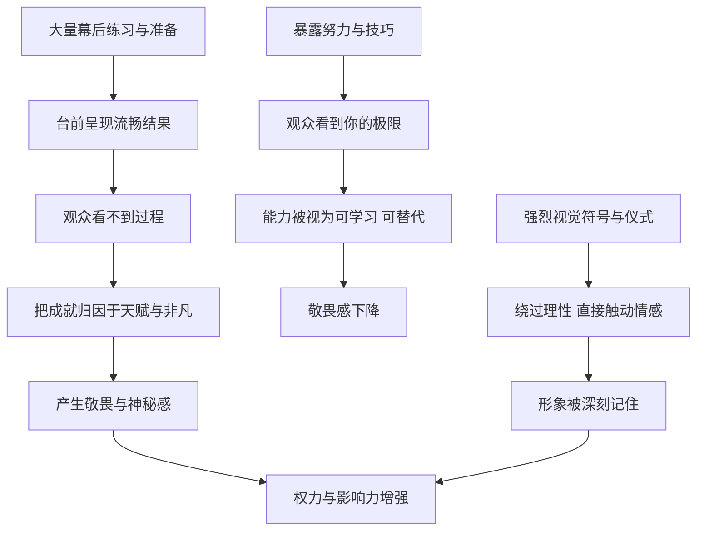

# 14｜为什么成就要看起来毫不费力？

> 为什么把辛苦藏起来，反而更显得强大？

---

## 一、先说结论

格林认为，**人们敬畏的不是努力，而是看起来不需要努力的能力。**

当你展示汗水、抱怨辛苦、把过程摊开给人看时，别人看到的不仅是你的付出，还有你的极限：原来你也会吃力，原来你也差点失败。可当一件难事被你做得行云流水，别人看到的就不再是“一个很努力的人”，而是“一个天生就会的人”。

这一篇涉及两条法则：第 30 条“让你的成就看起来毫不费力”，第 37 条“制造引人注目的奇观”。前者讲如何藏起过程，后者讲如何放大结果。两者都作用于同一个对象：**观众的感知。人们记住的是画面，而不是过程。**

---

## 二、我们先理解一个问题

我们的文化里有一种很深的“努力崇拜”：勤能补拙，天道酬勤，功夫不负有心人。

按照这个逻辑，把自己的努力展示出来，应该会赢得更多尊重才对。可生活中常常出现相反的情况：

> 为什么一个同事把加班挂在嘴边，领导却并不觉得他更能干？
> 为什么演讲者讲得越自然，听众越觉得他厉害，哪怕他背后排练了几十遍？
> 为什么魔术一旦被揭穿原理，就再也没有魔力了？

这里有一个微妙的区别：**人们欣赏努力，但追随的是神奇。** 努力让人同情和认可，神奇才让人敬畏和信服。

问题是：把努力藏起来，是不是一种欺骗？它又为什么能增加一个人的权力？

---

## 三、作者到底提出了什么观点？

格林的观点可以分成两部分。

**第一部分是第 30 条：隐藏过程。** 格林认为，你的行动应该显得自然、轻松，仿佛毫不费力。所有的练习、准备、技巧和反复试错，都应该留在幕后。他给出的理由有几层：其一，暴露努力会让人看到你的局限，削弱你的神秘感；其二，泄露你的技巧，等于把你的武器交给别人，别人学会之后就不再需要你；其三，让人觉得你的能力“浑然天成”，会激发一种近乎敬畏的情绪。

**第二部分是第 37 条：制造奇观。** 格林认为，语言容易引起争辩和怀疑，而强烈的视觉形象、象征符号和戏剧化的场面，则能绕过理性，直接作用于人的情感。一个醒目的符号、一场精心设计的仪式，比长篇大论更能让人记住你、认同你。

两者合起来，是一种完整的“形象工程”：**幕后要足够辛苦，台前要足够轻松；过程要尽量隐藏，结果要尽量放大。**

---

## 四、把这个观点翻译成人话

打个比方。

天鹅在水面上滑行时，看起来优雅从容；但在水面以下，它的脚一直在拼命划水。

格林要你做的，就是那只天鹅：**水下拼命，水上从容。**

再换一个比方。一部好电影，观众看到的是两个小时流畅的故事；而那两个小时背后，是剧本的反复修改、成百上千个镜头的拍摄和剪辑。如果电影院在放映前先把所有 NG 片段放一遍，观众的沉浸感就会被打破。

所以，“毫不费力”并不是真的不费力，而是**把费力的部分留在后台，只把最好的结果搬上舞台。** 再给这个结果配上一个让人过目不忘的画面，它就会在别人心里扎根。

---

## 五、为什么会这样？

为什么隐藏努力、制造奇观能增强权力？可以这样拆解：

这张图里有两条主线。

**第一条是 C → D。** 心理学里讨论过的“归因”问题可以帮助理解：当人们看不到一个结果背后的过程时，往往倾向于把它归因于稳定的内在特质，比如天赋、才华、非凡的能力；而当人们看到了大量的挣扎和试错，就更可能把成功归因于努力甚至运气。前一种归因带来敬畏，后一种归因带来的是“我努力一下也行”。

**第二条是 J → K → L。** 人对图像和场景的记忆，往往比对抽象论证的记忆更深。一个符号可以瞬间唤起一整套联想，而且它不需要说服谁，因为它不给人辩论的机会。格林之所以说“奇观胜于言语”，是因为语言会被反驳，画面却只会被记住。

两条线最终汇合在一起：**轻松感制造神秘，奇观制造记忆，神秘与记忆共同构成一个人的权威。**

---

## 六、举一个现实生活中的例子

想象一位短视频博主发布了一条视频：一个“一镜到底”的长镜头，从街角出发，穿过人群、走进咖啡馆、镜头一转正好对上窗外的日落，最后落在博主的笑脸上。整个过程丝滑自然，没有任何剪辑痕迹。

评论区一片惊叹：“这是怎么拍出来的？”“太有天赋了！”“随手一拍都是大片。”

**但观众不知道的是，这条几十秒的视频，背后是上百次重拍。** 有时是路人突然闯进画面，有时是镜头抖了一下，有时是日落的光线差了几分钟。博主提前踩点、写好走位、算好时间，还在后期做了细致的调色和稳定处理。

如果博主在视频开头先放一段“我拍了一百多遍，差点崩溃”的花絮，观众会怎么想？一部分人会佩服他的敬业，但那种“神来之笔”的惊艳感，很可能就消失了。

这正是格林说的两条法则在今天的样子：

- **隐藏过程**：上百次重拍被留在了硬盘里，观众只看到最完美的那一条；
- **制造奇观**：“一镜到底”本身就是一种视觉奇观，它让人记住的不是内容，而是那种“怎么做到的”震撼。

当然，今天也有很多博主会专门发布“幕后花絮”来吸引另一批观众。这说明隐藏与展示并不是绝对的，而是一种对时机和受众的选择——但几乎所有人都会先放出成品，再谈幕后。

---

## 七、回到书中重新理解

格林在书中用了几位“表演大师”来说明这两条法则。

**第一位是逃脱大师胡迪尼。** 胡迪尼以从手铐、锁链、密闭水箱等各种困境中逃脱而闻名。在观众眼里，他仿佛拥有超自然的能力。格林指出，这种“神奇”背后，是他对身体的长期训练、对锁具构造的深入研究，以及对每一个细节的反复演练。但胡迪尼从不向公众揭示这些，他让人们看到的，只有那个看似不可能完成、却被他轻松完成的结果。**过程越保密，结果就越像奇迹。**

**第二个来源是卡斯蒂廖内《廷臣论》中的概念。** 格林在这一条的“权力关键”里，直接引用了文艺复兴时期卡斯蒂廖内的说法：完美的廷臣必须以一种“漫不经心”（sprezzatura）的姿态完成一切——技巧要练到炉火纯青，展示时却要显得毫不刻意。一旦旁观者看出你在用力，神奇感就消失了；而一旦他相信这是天赋，就会反过来高估你的极限。**这说明“毫不费力”本身也是一门需要极深功力的艺术：做作的轻松，比坦率的吃力更难看。**

**第三位是路易十四。** 在第 37 条里，格林讲到这位法国国王如何为自己选择了太阳作为象征。太阳是万物的中心，光芒普照，一切围绕它运转。路易十四在宫廷芭蕾中扮演太阳神阿波罗，把太阳的图案用于宫殿装饰和各种器物之上，并用一整套繁复的宫廷礼仪，把自己的日常起居变成了一场场围绕君主展开的仪式。“太阳王”这个形象，让他不必反复申明自己的权威，因为这个符号本身就在不停地说话。

三个故事放在一起：胡迪尼和卡斯蒂廖内说明的是**如何藏**，路易十四说明的是**如何显**。一个成功的权力者，往往两样都会。

---

## 八、这个观点背后还有什么？

**第一，“毫不费力”是一种高度控制的结果。** 表面的轻松，恰恰需要背后更多的准备。这一点常被误读：格林并不是说不需要努力，而是说努力的方式和展示的方式应该分开。

**第二，隐藏技巧也是一种保护。** 如果你把自己的方法全部公开，别人学会之后，你的独特性就消失了。这与前面谈过的“让人依赖你”一脉相承：保持某种不可替代性，才能保持分量。

**第三，奇观的力量来自它绕过了理性。** 这也是它最需要警惕的地方。一个强大的符号可以凝聚人心，也可以遮蔽事实。当你被一个画面深深打动时，不妨追问一句：这个画面想让我忘记什么？

**第四，这两条法则都属于“形象政治”的范畴。** 从古代君主的仪仗、宗教的仪式，到现代政治的竞选造势、企业的发布会，人类社会一直在用奇观来塑造权威。格林只是把它从宏大叙事中剥离出来，变成了个人也能使用的方法。

---

## 九、这个观点有问题吗？

**第一，它的说服力在于准确描述了观众心理。** 人们确实更容易被流畅的结果打动，也确实会因为看到过程而降低神秘感。表演、演讲、产品发布等领域的大量实践，都在印证这一点。

**第二，但“隐藏努力”可能损害信任与合作。** 在团队里，如果一个人总是让自己的成果看起来轻而易举，别人可能会低估任务的难度，从而在资源分配、时间规划上做出错误判断。一些组织行为学的讨论也指出，适度展示工作过程，有助于建立透明度和团队信任。**对台下的观众要轻松，对台上的队友却需要坦诚。**

**第三，“天赋叙事”对个人成长未必有利。** 一些心理学研究讨论过，把成就归因于天赋而非努力的观念，可能让人在遇到困难时更容易放弃。如果一个人长期维护“我不费力”的形象，他可能会害怕暴露任何挣扎，进而回避挑战，甚至拒绝求助。

**第四，今天的观众对“奇观”越来越警惕。** 当包装过度、与实质脱节时，人们会反感“摆拍”“作秀”，并从惊叹转向嘲讽。奇观的效果在很大程度上取决于它背后有没有真实的支撑。

**所以更准确的说法是**：让成就看起来毫不费力，是一种有效的呈现策略，但它适用于面对观众的“前台”，而不适用于需要协作和成长的“后台”。把两者混为一谈，就会从从容变成虚伪。

---

## 十、今天再看这个观点

以下部分是基于格林思想的现代延伸，不是他在书中的原话。

在社交媒体时代，“毫不费力”几乎成了一种普遍的审美：看起来随手拍的精致照片、看起来即兴发挥的机智发言、看起来轻松获得的成就。每个人都在展示自己的“台前”，而把“后台”藏起来。

这带来了一种新的焦虑：当我们不断看到别人毫不费力的成功时，很容易觉得自己的挣扎是一种失败。**可我们看到的，只是别人筛选过的那一条“成片”。**

所以理解这条法则，在今天有两层意义。对呈现者来说，它提醒你：展示结果时要干净利落，不要把疲惫和抱怨当作卖点。对观看者来说，它更重要的提醒是：**别拿自己的后台，去和别人的前台比较。** 每一个“一镜到底”的背后，都可能有一百次失败的尝试。

---

## 十一、这一篇真正应该记住什么？

1. **人们敬畏的是看起来不费力的能力。** 暴露努力会暴露极限，流畅的结果则制造神秘与敬畏。
2. **“毫不费力”是高度控制的结果。** 台前越轻松，幕后往往越辛苦。
3. **奇观绕过理性，直接作用于情感。** 符号与画面比言语更容易被记住，也更难被反驳。
4. **对观众要轻松，对队友要坦诚。** 隐藏过程适合“前台”，不适合需要协作与成长的“后台”。
5. **别拿自己的后台，比别人的前台。** 你看到的轻松，往往是被筛选过的结果。

---

## 十二、留一个问题

> 你最近一次被某人“毫不费力”的表现打动，是在什么时候？
> 如果你能看到他背后的全部过程，
> 你对他的敬佩会增加，还是会减少？

---

从隐藏过程到制造奇观，格林一步步在谈同一件事：人们容易被自己愿意相信的东西打动。可如果把这件事推到极致呢？当一个形象不再只是“令人敬佩”，而是变成了能让人托付希望、甚至献出忠诚的对象，它就不再只是形象，而是一个神话。

下一篇，我们就走进格林笔下最具争议的领域之一：**为什么人们总愿意追随一个“神话”？**
