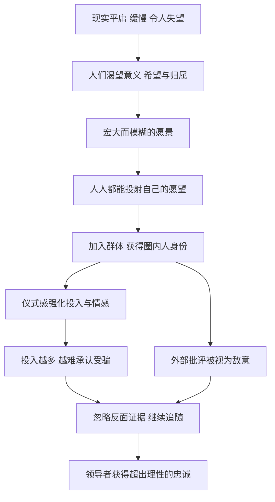

# 15｜为什么人们总愿意追随一个“神话”？

> 为什么越是模糊宏大的承诺，越能吸引追随者？

---

## 一、先说结论

格林认为，**人们追随的往往不是事实，而是希望。**

现实是平庸的、缓慢的、常常令人失望的。大多数人每天面对的是账单、琐事和看不到尽头的努力。在这种处境下，谁能提供一个关于“更好未来”的故事，谁就能获得超出理性的关注和忠诚。

这一篇涉及两条法则：第 27 条“利用人们想要相信的需要，打造信徒般的追随者”，第 32 条“迎合人们的幻想”。它们揭示的是权力中最古老、也最危险的一种机制：**当人们足够渴望相信时，证据就不再重要了。**

---

## 二、我们先理解一个问题

我们常以为，人是理性的：看到证据就相信，看不到证据就怀疑。

可生活里总有这样的现象：

> 为什么一些明显夸张的承诺，偏偏能吸引大批人追捧？
> 为什么有人在一个组织里反复失望，却依然不愿离开？
> 为什么戳破一个“神话”的人，往往不是被感谢，而是被围攻？

这些现象说明，人们相信一件事，并不总是因为它是真的，而是因为**相信它能满足某种需要**：对意义的需要，对归属的需要，对“我的生活可以不一样”的需要。

问题是：这种需要为什么如此强大？又是什么样的人，懂得如何利用它？

---

## 三、作者到底提出了什么观点？

格林的观点可以分为两部分。

**第一部分是第 32 条：迎合幻想。** 格林认为，真相往往令人不快，因为它意味着接受限制、接受平庸、接受“没有捷径”。而幻想则提供了一个出口：一夜暴富、点石成金、所有问题都能被一个神奇的方法解决。格林说，那些能够为人们编织幻想的人，往往比那些只讲事实的人拥有更大的吸引力。关键在于，**幻想不能太具体，否则就会被验证；它要足够宏大、足够模糊，让每个人都能把自己的愿望投射进去。**

**第二部分是第 27 条：打造信徒。** 格林进一步描述了如何把一时的吸引变成长期的追随。在他的描述中，这需要几个要素：一个模糊而宏大的愿景，让人愿意为之投入；一套带有仪式感的活动，让参与本身成为一种体验；一种“圈内人”与“圈外人”的区分，让追随者感到自己是特别的；以及一个“共同的敌人”，把内部的凝聚力进一步强化。

格林的描述冷静而直白，他并不掩饰这些方法的操纵性质。他想让读者看清的是：**人们追随一个神话，满足的是情感需要，而不是理性判断。** 谁掌握了这种需要，谁就掌握了一种强大的权力。

---

## 四、把这个观点翻译成人话

打个比方。

一个人站在街头对你说：“努力工作二十年，你大概能攒下一套房子的首付。”你会点头，但不会激动。

另一个人对你说：“只要跟着我，掌握一个大多数人不知道的秘密，你三年后就能财务自由，彻底告别打工的生活。”你可能半信半疑，但心里会忍不住动一下。

**第一个人讲的是事实，第二个人讲的是幻想。** 事实让人冷静，幻想让人心跳。

而第 27 条要说的是：如果第二个人不仅讲了这个故事，还邀请你加入一个“只有少数聪明人才懂”的圈子，定期举办让你热血沸腾的活动，让你觉得周围的人都和你一样在奔向那个美好未来——那么即使你迟迟没有实现目标，你也很可能舍不得离开。

因为你离开的不只是一个承诺，还有一种身份、一群同伴、一份希望。

---

## 五、为什么会这样？

人们为什么愿意追随神话？可以这样拆解：

这张图里有三个关键环节。

**第一，C → D：模糊是一种优势。** 一个具体的承诺，比如“三个月涨薪百分之二十”，很容易被检验；一个模糊的愿景，比如“掌握命运”“活出真正的自己”，则几乎无法被证伪。每个人都能从中读出自己最想要的东西，于是它能同时吸引背景完全不同的人。

**第二，F → G：投入会自我强化。** 心理学中常被讨论的“认知失调”理论可以帮助理解这一点：当一个人为某件事投入了大量时间、金钱和情感之后，承认它是错的会带来强烈的心理痛苦。为了减轻这种痛苦，人们往往选择继续相信，甚至投入更多。经济学中所说的“沉没成本”，在情感层面上发挥着同样的作用。

**第三，E → J：身份让批评变成攻击。** 当追随一个神话成为一个人身份的一部分时，外界对神话的质疑，就会被感受为对他本人的否定。于是批评不仅无法说服他，反而会让他更紧密地抱团。

这三个环节合在一起，构成了一个几乎自我封闭的系统。**神话之所以难以被打破，不是因为它有多坚固，而是因为追随者在主动维护它。**

---

## 六、举一个现实生活中的例子

想象一个以“财富自由”为主题的知识付费社群。

它的入口往往是一段极具感染力的宣传：创始人讲述自己如何从普通打工者，一步步实现了“睡后收入”和时间自由；他说，大多数人之所以穷，不是因为不努力，而是因为“认知没有打开”。只要加入社群，就能获得他多年总结的方法论，还能结识一群“同频的人”。

会员加入之后，会发现社群的运营非常用心：每天有打卡任务，每周有直播分享，定期有线下活动，大家互称“家人”；表现积极的会员会被公开表扬，还能升级为更高阶的会员；社群里反复强调“圈外的人不理解我们”“质疑的人都是思维固化的人”。

可时间一长，真正实现“财富自由”的人寥寥无几。大多数人的收入没有明显变化，有的人甚至因为听从某些建议而亏了钱。

**但奇怪的是，续费率依然不低。**

原因不难理解。对很多会员来说，他们购买的已经不只是方法，而是一种希望、一种身份和一种陪伴。离开社群，意味着承认自己花了那么多钱和时间却一无所获，意味着失去那群每天互相鼓励的“家人”，也意味着回到那个平淡而没有希望的现实。

这个社群几乎完整地运用了格林描述的要素：宏大而模糊的愿景、强烈的仪式感、圈内人的身份认同，以及对外部批评的防御。**它售卖的不是结果，而是对结果的想象。**

---

## 七、回到书中重新理解

格林在讲第 32 条时，讲了一个 16 世纪威尼斯的故事。

根据格林的讲述，当时的威尼斯共和国已经过了鼎盛时期，财政困难，贸易地位下滑，整座城市弥漫着一种对昔日荣光的怀念和对未来的焦虑。就在这时，一个名叫布拉加迪诺的人出现了。他自称掌握了点石成金的炼金术，并以一种神秘而高傲的姿态示人：挥金如土、深居简出、从不主动推销自己。

传言很快在城中流传，威尼斯的权贵们开始主动登门求见。他们提供资金、提供住所，只希望他能为共和国炼出黄金，让这座城市重振旗鼓。布拉加迪诺则一再拖延，他说炼金需要时间、需要耐心、需要合适的时机。人们等了又等，却始终没有看到黄金。

最终，他的把戏被越来越多的人怀疑。他离开了威尼斯，据记载后来在巴伐利亚被揭穿并处死。

格林从这个故事里提炼的，不是“骗子终将被揭穿”，而是另一件事：**布拉加迪诺之所以能在威尼斯风光多年，是因为威尼斯人太想要一个奇迹了。** 他没有创造需求，只是精准地迎合了一座城市最深的幻想。

至于第 27 条所说的“信徒式追随”，历史上也有类似的例子。比如 18 世纪的弗朗茨·梅斯梅尔，他提出所谓“动物磁性”理论，声称能通过某种神秘的磁流治疗疾病，并举办带有强烈仪式感的集体治疗活动，一度在巴黎上流社会风靡一时。后来，法国曾组织专门的调查委员会对此进行检验，认为所谓的疗效主要来自人们的想象和暗示。这个例子说明：**当一套说法同时提供了希望、仪式和群体归属时，它的吸引力可以远远超出它的实际效果。**

---

## 八、这个观点背后还有什么？

**第一，神话满足的是真实的需要。** 人们对意义、希望和归属的渴望并不可笑，它们是人性的一部分。问题不在于这些需要本身，而在于有人利用这些需要来获取利益。

**第二，神话与愿景之间的界线并不总是清晰。** 伟大的宗教、政治运动和企业，也都依赖某种宏大的愿景来凝聚人心。一个创业者描绘的未来，在成功之前也可能被看作“画大饼”。**区分二者的关键，也许在于：它是否允许被检验，是否允许追随者自由离开，是否真的在朝承诺的方向努力。**

**第三，追随者并不完全是被动的。** 人们有时明知某些承诺不太可信，却依然愿意参与，因为参与本身就带来了价值：陪伴、仪式、暂时的希望感。这提醒我们，理解追随行为不能只从“受骗”的角度，还要看到其中的情感交换。

**第四，格林描述的机制与社会心理学研究高度契合。** 群体认同、认知失调、从众效应、承诺升级等现象，在心理学和组织行为学中都有大量讨论。格林的贡献在于把它们放进了具体的历史故事里，让人看清这些机制如何被有意运用。

---

## 九、这个观点有问题吗？

**第一，它的说服力在于揭示了一个真实而普遍的现象。** 从古代的神秘术士到现代的各种骗局，从宗教狂热到投机泡沫，人类历史上一再出现“群体性相信”的现象。格林把这些现象背后的心理机制讲得清楚而直白，这对防御者很有价值。

**第二，但这两条法则是书中伦理争议最大的部分之一。** 格林用一种近乎操作手册的方式，描述了如何建立一个类似邪教的追随体系。对于想要操纵他人的人来说，这几乎是一份蓝图。很多批评者认为，这类内容一旦脱离“防御性阅读”的框架，就很容易造成真实的伤害。

**第三，它过度简化了追随者的动机。** 在格林的描述中，追随者几乎总是被动的、容易被操纵的。但实际上，人们加入一个群体的原因很复杂，有人是为了学习，有人是为了社交，有人只是暂时需要一个寄托。把所有追随行为都解释为“被幻想俘虏”，容易忽略人的主体性。

**第四，关于“神话”的长期效果存在不同解释。** 从短期看，迎合幻想确实能迅速聚集人气；但从长期看，承诺与现实之间的差距会不断积累，最终可能导致信任的崩塌。布拉加迪诺的结局本身就说明了这一点。而那些能够长期维持追随者的组织，往往是在某种程度上兑现了承诺，或者提供了真实的价值。

**所以更准确的说法是**：格林准确描述了人们为什么容易被神话吸引，但他没有充分讨论神话的代价。一个无法兑现的神话，最终伤害的不只是追随者，也包括编织神话的人。

---

## 十、今天再看这个观点

以下部分是基于格林思想的现代延伸，不是他在书中的原话。

今天，“神话”的生产比以往任何时候都更容易。社交媒体、短视频、线上社群，让任何人都能以极低的成本讲述一个关于财富、成功、健康或自我实现的故事，并迅速聚集一批追随者。

与此同时，人们的焦虑也在增加。当现实的上升通道变得狭窄，“捷径”的诱惑就会变得更大。这让格林描述的机制在今天有了更广阔的土壤。

对普通人来说，理解这两条法则最重要的价值在于自我防御。当你被一个承诺深深打动时，不妨问自己几个问题：**这个承诺可以被检验吗？有多少人真的实现了它？如果我想离开，会不会被视为背叛？批评者说的话，我认真听过吗？**

真正值得追随的愿景，经得起这些问题。经不起的，也许就是一个精心包装的神话。

---

## 十一、这一篇真正应该记住什么？

1. **人们追随的往往是希望，而不是事实。** 现实越令人失望，幻想的吸引力就越大。
2. **模糊是神话的优势。** 越宏大、越无法被检验的承诺，越能容纳不同人的愿望。
3. **投入会自我强化。** 投入的时间、金钱和情感越多，人们就越难承认自己错了。
4. **身份让批评变成攻击。** 当追随成为身份的一部分，外界的质疑反而会加深忠诚。
5. **分辨愿景与神话，看三点。** 它是否允许被检验，是否允许自由离开，是否在真实地兑现。

---

## 十二、留一个问题

> 在你的生活中，有没有一个你一直愿意相信、却很少认真检验的承诺？
> 如果有人拿出证据告诉你它不成立，
> 你的第一反应会是感谢，还是反驳？

---

神话能把陌生人聚成信徒，可权力场上更微妙的关系，往往发生在熟人之间。我们习惯于提防敌人，却很少提防那些最亲近的人。格林在这里又给出了一个让人不太舒服的判断：最需要小心的，有时恰恰是身边的朋友。

下一篇，我们就来谈这个关于信任的难题：**为什么朋友可能比敌人更危险？**
