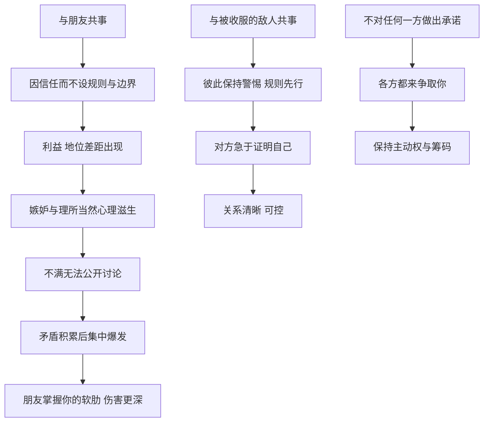

# 16｜为什么朋友可能比敌人更危险？

> 为什么把重任交给朋友，常常比交给昔日的对手更冒险？

---

## 一、先说结论

格林认为，**在权力关系中，友谊常常是最容易被高估的一种保障。**

我们天然信任朋友，因为我们了解他们、喜欢他们，也相信他们不会伤害我们。可正是这种信任，让我们在与朋友共事时放松警惕：不设边界，不讲规则，不做防备。而当利益、地位和嫉妒悄悄进入这段关系时，朋友往往是最能伤到你的人，因为他们知道你所有的弱点。

这一篇涉及两条法则：第 2 条“不要过分信赖朋友，学会利用敌人”，第 20 条“不要对任何人做出承诺”。它们共同表达了一个冷峻的观点：**关系是需要清醒管理的资源，而不是可以无条件依靠的避风港。**

---

## 二、我们先理解一个问题

“多个朋友多条路”，这是我们从小听到的处世智慧。

按照这个逻辑，把重要的事情交给朋友，应该是最稳妥的选择：知根知底，沟通顺畅，彼此照应。可生活中常常出现另一种情况：

> 为什么合伙做生意的好朋友，最后往往连朋友都做不成？
> 为什么一个人被提拔之后，最先疏远他的，常常是过去最亲近的同伴？
> 为什么有些人和昔日的对手合作，反而比和老朋友合作更顺利？

这些现象让人不得不怀疑：友谊和权力，是不是天生就难以共存？

问题是：朋友为什么会变成危险？而敌人，又为什么可能成为更好的合作者？

---

## 三、作者到底提出了什么观点？

格林的观点可以分为两部分。

**第一部分是第 2 条：慎用朋友，善用敌人。** 格林认为，朋友之所以危险，主要有几个原因：

- **朋友容易嫉妒。** 当你把朋友提拔到一个位置，或者和他共同做成一件事，他可能会觉得“凭什么你比我高”，这种嫉妒往往隐藏在友情的外衣之下。
- **朋友容易觉得理所当然。** 你给朋友的好处，他可能不会感激，而是视为友谊的正常回报；一旦得不到更多，就会心生不满。
- **朋友难以被约束。** 你很难对朋友严格要求，也很难在他犯错时公事公办，这让朋友在工作中变得难以管理。
- **朋友最了解你。** 一旦反目，他知道你所有的软肋。

相反，格林认为，一个被你收服的敌人，往往更有动力证明自己。他知道自己的位置来之不易，也知道你对他有所保留，因此会更加努力、更加谨慎。**敌意在某种程度上意味着清醒，而友谊在某种程度上意味着盲目。**

**第二部分是第 20 条：不做承诺，保持独立。** 格林认为，过早地把自己绑定在某一方身上，会让你失去主动权。一旦你明确站队，别人就不再需要争取你，你的价值也随之下降。相反，如果你保持独立、让各方都有机会，你就会成为众人争取的对象，掌握更多筹码。

两部分合起来，是一种关于“关系管理”的冷静立场：**不要让情感替你做决定，也不要过早让别人确定你属于谁。**

---

## 四、把这个观点翻译成人话

打个比方。

和陌生人签合同，大家会把每一条都写得清清楚楚：谁出多少钱，谁负责什么，出了问题怎么办。因为彼此不信任，所以规则先行。

和朋友合作呢？很多人会觉得“写合同多伤感情”“都是兄弟，还怕我坑你？”于是很多事情只靠一句口头约定。

**结果是，最需要规则的关系，反而最没有规则。** 平时风平浪静时，这没什么问题；一旦出现利益分歧，没有规则的友谊就只能靠感情硬扛，而感情往往扛不住利益的重量。

至于“不做承诺”，就像一个优秀的求职者同时拿到几家公司的邀请。只要他还没签约，每一家都会努力争取他；一旦他签了其中一家，其他公司就会转身离开，而签约的那一家，也不再需要额外讨好他。

---

## 五、为什么会这样？

朋友为什么可能比敌人更危险？可以这样拆解：

这张图里有两条对照的路径。

**第一条是朋友的路径，关键在 B → D。** 友谊让人放下防备，这在私人生活中是美好的，但在涉及权力和利益的场合，却会带来两个问题：一是缺少规则，二是缺少表达不满的正常渠道。朋友之间，很多话“不好意思说”，于是不满只能压在心里，直到某一天集中爆发。而且，友谊中常常隐含着一种“平等”的预期，一旦双方的地位或收益出现差距，这种预期就会被打破，嫉妒随之而来。

**第二条是敌人的路径，关键在 I → J。** 与昔日的对手合作，双方从一开始就保持警惕，规则和边界自然会被划清。被收服的一方知道自己需要证明价值，也知道对方不会无条件地信任他，因此反而会表现得更加可靠。

**第三条是独立的路径。** 格林认为，保持不站队，本身就是一种权力。你的“可能性”是别人争取你的理由；一旦可能性消失，筹码也就消失了。

---

## 六、举一个现实生活中的例子

想象两个大学老同学决定一起创业。

他们在大学时是室友，关系好到可以穿一条裤子。毕业几年后，一个在技术岗位上积累了经验，一个在销售岗位上积累了客户资源，两人一拍即合，决定合伙开一家公司。

创业之初，一切都很美好。两人各出了一笔钱，谁也没提股份怎么分，觉得“都是兄弟，分那么清楚干嘛”。分工也很模糊，大事小事一起商量，遇到分歧就喝顿酒聊开。

两年后，公司开始有了起色，拿到了几个大客户，也有投资人表示了兴趣。

**问题就在这时爆发了。**

投资人要求明确股权结构，两人这才发现，彼此对“谁贡献更大”的理解完全不同。做技术的觉得，产品是他一手做出来的，没有产品什么都卖不出去；做销售的觉得，客户都是他跑来的，没有客户产品再好也没用。过去被“兄弟情”掩盖的不满，一下子全部浮上水面：谁加班更多，谁拿钱更多，谁在关键决策上说了算……

几轮争吵之后，两人彻底决裂。公司陷入僵局，投资也泡了汤。更让人难受的是，他们失去的不只是一家公司，还有十几年的友情。

这个例子几乎完整演示了格林的逻辑：**正因为是朋友，才没有规则；正因为没有规则，矛盾才无法化解；正因为是朋友，决裂时的伤害才格外深。**

如果他们一开始就像陌生人一样，把股权、分工、决策机制和退出方式写清楚，也许友情不会受到那么大的冲击。

---

## 七、回到书中重新理解

格林在书中用了几个历史故事来说明这两条法则。

**第一个是拜占庭皇帝米海尔三世与巴西尔的故事，属于违反第 2 条的例子。** 根据格林的讲述，米海尔三世与出身低微的巴西尔成为好友，并一路提拔他：给他财富、给他地位，甚至让他成为共治皇帝。米海尔三世以为，朋友会永远感激自己。可巴西尔的野心随着地位的上升不断膨胀，他不再满足于做一个被恩赐的朋友。最终，巴西尔设计杀害了米海尔三世，独掌大权。格林从中得出的结论是：**你给朋友的恩惠越多，他可能越觉得这是理所应当，而不是感激。**

**第二个是宋太祖赵匡胤“杯酒释兵权”的故事，与第 2 条相关。** 赵匡胤通过陈桥兵变登上皇位，而帮助他夺取天下的，正是一批手握重兵的老部下和老朋友。他深知，既然这些人能帮他黄袍加身，也可能在将来帮别人黄袍加身。于是，据传他在一次宴席上，以推心置腹的方式劝这些将领交出兵权，换取丰厚的赏赐和安逸的生活。将领们领会了意思，纷纷请辞。格林用这个故事说明：**真正清醒的权力者，会在友情变成威胁之前，先把它安置在一个安全的位置。** 关于这一事件的具体细节，史学界存在不同看法，但它作为一个“处理功臣与旧友”的经典案例，流传甚广。

**第三个是英国女王伊丽莎白一世的故事，属于遵守第 20 条的例子。** 伊丽莎白一世终身未婚。在她统治期间，欧洲多国的王室和贵族纷纷向她求婚，希望通过联姻与英国结盟。伊丽莎白一世从不明确拒绝，也从不轻易答应，而是让各方都保持希望、都来争取她。这使得英国在复杂的欧洲局势中，始终保持着相当程度的外交灵活性。格林认为，**她的独立本身就是一种权力：只要她没有选择任何人，每个人就都需要她。**

---

## 八、这个观点背后还有什么？

**第一，格林区分了“私人友谊”和“权力关系中的友谊”。** 他并不是说友谊没有价值，而是说，当友谊与权力、利益纠缠在一起时，它的性质会发生变化。在纯粹的私人生活中，友谊可以无条件；在权力关系中，友谊需要被重新审视。

**第二，“利用敌人”的核心是利用对方的动机。** 一个被你收服的敌人，之所以可靠，并不是因为他突然变好了，而是因为他的处境决定了他需要证明自己。格林看重的，始终是利益和动机，而不是情感。

**第三，“不做承诺”与“不讲信用”是两回事。** 格林说的不做承诺，是指在关键的选择上保持灵活，不过早地把自己绑定在某一方。但这并不意味着可以随意违背已经做出的承诺。一个经常食言的人，很快会失去所有人的信任。

**第四，这两条法则都指向同一个核心：保持独立。** 无论是不依赖朋友，还是不绑定任何一方，格林的意图都是让你始终保有选择的自由。在他看来，**失去选择，就是失去权力。**

---

## 九、这个观点有问题吗？

**第一，它的说服力在于揭示了友谊在利益面前的脆弱。** 合伙创业中朋友反目、功臣与君主之间的猜忌，这些现象在历史和现实中都屡见不鲜。管理学和创业研究中，也常有人讨论“熟人合伙”带来的治理问题。格林提醒我们在友情中保留规则，这是有现实价值的。

**第二，但它对友谊的评价过于悲观。** 大量研究和经验都表明，信任是合作的基础，高度信任的团队往往沟通成本更低、效率更高。很多成功的企业正是由朋友共同创立并长期合作的。把朋友一概视为潜在威胁，可能会让人失去最重要的合作伙伴。

**第三，“利用敌人”存在很大的风险。** 被收服的敌人未必真心归顺，他可能只是在等待时机。历史上也不乏重用降将而最终被反噬的例子。格林在强调敌人“更有动力证明自己”时，对这种风险讨论得并不充分。

**第四，“不做承诺”在长期关系中可能适得其反。** 从博弈论的角度看，在重复博弈中，可信的承诺往往是建立合作的关键。一个永远不做承诺的人，也很难赢得别人的承诺。伊丽莎白一世的策略之所以奏效，与她作为女王的特殊地位和当时的国际局势密切相关，普通人未必能照搬。

**所以更准确的说法是**：格林说出了友谊在权力关系中的风险，但他给出的药方有些过猛。更可行的做法也许不是“不信任朋友”，而是“和朋友之间也讲规则”——让规则保护友情，而不是让友情代替规则。

---

## 十、今天再看这个观点

以下部分是基于格林思想的现代延伸，不是他在书中的原话。

在今天，“熟人合作”依然非常普遍：朋友合伙开店，同学一起创业，亲戚之间借钱投资。这些合作往往起步快、信任强，但也容易因为缺少规则而埋下隐患。

现代社会提供了很多工具，可以帮助我们在友情和利益之间找到平衡：合伙协议、股权设计、明确的分工与决策机制、事先约定的退出方式。**这些工具并不是对友谊的不信任，而是对友谊的保护。** 把丑话说在前面，恰恰是为了以后不必说出更难听的话。

至于“不做承诺”，在今天更适合理解为：在尚未看清局势时，不要急着站队；在关键选择上，给自己保留回旋的余地。但一旦做出了承诺，就要认真履行，因为在一个信息高度透明的社会里，失信的代价会被放大。

---

## 十一、这一篇真正应该记住什么？

1. **友谊在权力关系中容易被高估。** 信任让人放下防备，也让人忽略规则。
2. **朋友的危险来自嫉妒、理所当然和缺少边界。** 越是亲近，越难公开处理不满。
3. **被收服的敌人有时更可靠。** 因为他的处境决定了他需要证明自己，但这种可靠同样有风险。
4. **保持独立就是保持筹码。** 过早站队，会让别人不再需要争取你。
5. **让规则保护友情，而不是让友情代替规则。** 这是比“不信任朋友”更可行的做法。

---

## 十二、留一个问题

> 如果你现在要和一位好朋友合作做一件事，
> 你愿意把哪些“丑话”提前说在前面？
> 又有哪些话，你因为“怕伤感情”而一直不敢说？

---

与朋友保持清醒的距离，只是人际布局的第一步。格林接下来要讲的，是一个更让人不安的话题：权力者如何把别人变成自己的手和盾牌，让别人出力，让别人承担风险，而自己始终站在干净的地方。

下一篇，我们就来拆解这种精心设计的分工——**为什么权力者总让别人出力、让别人背锅？**
