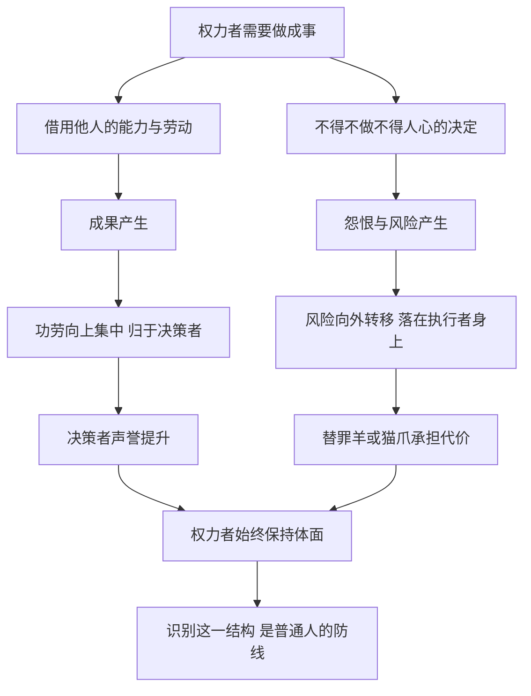

# 17｜为什么权力者总让别人出力、让别人背锅？

> 为什么很多成就与失误，站在台前的都不是真正的决策者？

---

## 一、先说结论

格林在这一组法则里，讲的是一种非常古老的权力分工：**功劳向上集中，风险向外转移。**

第 7 条说，让别人替你工作，但功劳要归你；第 26 条说，保持双手清白，脏活交给别人去做，出了事也由别人去承担。两条合在一起，就构成了一个让决策者永远“体面”的结构：成果属于他，骂名属于别人。

这是全书最具争议的部分之一。但对大多数普通人来说，它更重要的用法不是学着去做，而是**学会识别自己什么时候正在被当成“出力的人”和“背锅的人”。**

---

## 二、我们先理解一个问题

很多人在工作中都有过这样的困惑：

> 项目是我熬夜做出来的，为什么汇报时站在台上的是别人？
> 决定明明是上面拍板的，为什么出了问题，被问责的却是执行的人？
> 为什么那个位置最高的人，好像从来不会犯错？

我们习惯把这些情况归结为“运气不好”或“遇人不淑”。但如果同样的事情在不同公司、不同时代反复出现，也许它就不只是个人的倒霉，而是某种结构在起作用。

格林要回答的正是这个问题：为什么台前的人和真正做决定的人，常常不是同一个人？

---

## 三、作者到底提出了什么观点？

**第一，关于功劳：第 7 条“让别人替你工作，但功劳归你”。** 格林认为，一个人的时间和精力有限，想做成大事，就必须借用别人的智慧和劳动。关键在于，最后被人记住的名字应该是你的。他甚至冷冷地指出，历史常常只记住收获者，而不是播种者。

格林讲到了一个著名的反面故事：年轻的尼古拉·特斯拉曾在爱迪生的公司工作，为改进发电机日夜投入。按照流传的说法，特斯拉认为自己被许诺了一笔丰厚的奖金，可当成果完成后，奖金落了空，他也很快离开了。特斯拉才华横溢，却不懂得保护自己的成果和名字；在格林看来，这正是违反第 7 条的代价——**才华如果不能转化为归属于你的功劳，就只是在为别人的权力添砖加瓦。**

**第二，关于风险：第 26 条“保持双手清白”。** 格林认为，权力者不可避免要做一些不得人心的事，但他不能让这些事沾到自己身上。办法有两种：一是找“替罪羊”，让他承担错误与怨恨；二是用“猫爪”，也就是借别人的手去做危险的事——这个意象来自一则寓言：猴子让猫替它从火里取栗子，栗子归猴子，烫伤归猫。

书中最经典的故事来自马基雅维利的《君主论》。十五世纪末，切萨雷·博尔贾征服了意大利的罗马涅地区，那里盗匪横行、秩序混乱。他任命了一个以冷酷著称的部下雷米罗·德·奥尔科去治理。雷米罗用铁腕迅速恢复了秩序，但也积下了大量民怨。随后，博尔贾将雷米罗处死，把他的尸体陈放在切塞纳的广场上。民众既得到了秩序，又看到“暴政的元凶”受到了惩罚，于是对博尔贾反而心怀感激。

马基雅维利说，这一幕让民众“既满意又惊愕”。格林借这个故事说明：**残酷的事情可以做，但做这件事的手，不能是你自己的。**

---

## 四、把这个观点翻译成人话

把这两条法则翻译成日常语言，大概是这样：

- **好事要署名，坏事要外包。**
- **让别人干活不可耻，可耻的是干完活让别人记住了他而不是你。**
- **需要得罪人的时候，找一个人站在你前面。**

打个比方，这很像一场舞台剧：观众看到的是台上的演员，演员说出的台词可能让观众拍手，也可能让观众喝倒彩。而真正写剧本、决定剧情走向的人，始终坐在幕后。剧成功了，他上台谢幕；剧失败了，观众骂的是演员演得差。

格林并没有说这样做是对的，他只是说：**权力就是这样把自己保护起来的。**

---

## 五、为什么会这样？

为什么这种“台前台后”的分工会一再出现？可以用下面这张图来理解：

这里面有三个心理机制在起作用。

**第一，人们倾向于把结果归因于“最显眼的人”。** 社会心理学中有一个常被讨论的现象：人们在解释事件时，往往过度看重眼前的具体人物，而忽视背后的结构和环境。谁站在台前，谁就被当成原因。

**第二，怨恨需要一个具体的对象。** 抽象的“制度”或“决定”很难被人恨，一个具体的人却很容易。给怨恨找到一个出口，它就不会继续向上蔓延。

**第三，信息的不对称。** 执行者知道决定来自哪里，但外人不知道；而掌握解释权的，往往恰恰是决策者本人。

所以，这不是某个坏人的偶然伎俩，而是**只要存在层级和信息差，就很容易自然形成的结构。**

---

## 六、举一个现实生活中的例子

设想一家中型公司要裁员。

员工们接到通知，被一个个叫进会议室。坐在对面的是 HR，以及公司专门请来的一家“人力咨询公司”的顾问。他们语气温和、流程规范，一遍遍解释补偿方案，偶尔还会说一句“我们也很理解大家的心情”。

而做出裁员决定的老板，自始至终没有露面。

结果是什么？被裁的员工在群里骂的是 HR“冷血”，吐槽外包顾问“像背台词的机器”；有人在离职时和 HR 大吵一架，却从没见到真正拍板的人。几个月后，老板在年会上讲“公司经历了艰难的调整，感谢每一位留下来的伙伴”，台下甚至还有掌声。

这就是第 26 条在现代组织里最常见的样子：**执行者成了怨恨的承接者，决策者保住了“好老板”的形象。**

从防御的角度看，这个例子能教会我们几件事：

1. **分清“谁在说话”和“谁在决定”。** 对执行者发泄情绪，往往解决不了问题，也找错了对象。
2. **当你被安排去执行一件得罪人的事时，要问清楚授权来源，并留下书面记录。** 否则事后你很可能被说成“执行走样”。
3. **在做出成果时，让成果被看见。** 定期同步进展、在邮件里写清楚分工、在公开场合自然地提到自己负责的部分——这不是抢功，而是避免功劳被无声地“上收”。

---

## 七、回到书中重新理解

再回到特斯拉和雷米罗这两个故事，会发现它们其实是一枚硬币的两面。

特斯拉是**被拿走功劳的人**。他的问题不在于能力，而在于他把全部精力都投入到创造上，却没有保护成果归属的意识。

雷米罗是**被拿来背锅的人**。他以为自己是在为主人建功，却不知道自己从一开始就被设计成一件“用完即弃”的工具。他越成功地完成铁腕治理，就越成为完美的替罪羊。

格林讲这些故事时，站的是博尔贾和“收获者”的视角。但如果换一个视角读，它们就成了两份警示：**一个人最危险的时刻，往往是他被委以重任、却不清楚自己在整个棋局中是什么角色的时候。**

值得注意的是，格林在这两条法则的“反转”中也提醒过：功劳抢得太露骨，会招致怨恨；替罪羊用得太频繁，人们迟早会看穿，最后矛头还是会指向幕后之人。

---

## 八、这个观点背后还有什么？

**第一，这是一种关于“可见性”的权力。** 在组织里，做事和被看见做事，是两种不同的能力。很多人只练了前一种。

**第二，它与马基雅维利的“君主不应亲自做令人憎恨的事”一脉相承。** 马基雅维利建议君主把施恩的事留给自己，把惩罚的事交给别人。格林把这一建议扩展到了一切有层级的关系中。

**第三，它揭示了“责任”的流动方向。** 在健康的组织里，权力越大，责任越大；而在这两条法则描述的世界里，权力越大，责任反而越小。这恰恰是许多组织失灵的根源。

**第四，替罪羊机制有着古老的文化根源。** 许多古代社会都有将罪责象征性地转移到某个人或动物身上、再把它驱逐的仪式。一些人类学者认为，群体需要通过“找到一个该负责的人”来恢复秩序感。

---

## 九、这个观点有问题吗？

**说服力在哪里？** 它确实描述了真实存在的现象。只要看看各种组织丑闻中“临时工”“个别员工”的说法，就知道把责任推给执行层是多么普遍。格林把这种现象命名、拆解，对普通人识别它很有帮助。

**争议在哪里？** 第一，它的伦理代价极高。这两条法则本质上是把自己的利益建立在别人的损失上。第二，它的长期效果并不稳定。组织行为学中大量研究讨论过“心理安全感”与信任对团队绩效的影响：一个经常抢功、甩锅的领导者，最终会发现没人愿意为他出力、也没人愿意替他冒险。

**哪里过度简化？** 格林的案例多来自宫廷和个人英雄时代，那时信息封闭，民众很难看清幕后。今天，内部邮件、聊天记录、离职员工的讲述都可能让幕后之人曝光。替罪羊的“保质期”越来越短。

**有什么其他解释？** 从博弈论的角度看，一次性的博弈中，抢功和甩锅也许有利；但在重复博弈中，声誉会被持续记录，合作者会调整策略，“搭便车”的人会被排斥。另外，并不是所有“让别人出力”都是剥削——合理的授权、分工与署名制度，恰恰是现代协作的基础。问题不在于借力，而在于**是否公平地分配功劳与责任。**

所以，这两条法则更像是一种对权力阴暗面的准确描写，而不是一种值得追求的长期策略。

---

## 十、今天再看这个观点

以下部分是基于格林思想的现代延伸，不是他在书中的原话。

今天，“让别人出力、让别人背锅”的形式变得更隐蔽了。它不一定是一个人对另一个人的算计，而可能内嵌在制度设计里：层层外包让责任链条变长，算法决策让“是系统判断的”成为新的挡箭牌，“流程合规”让每个环节的人都可以说“我只是按规定办事”。

这意味着，普通人需要一种更精细的防御意识：

- 在合作之初就讨论清楚署名和分工，而不是事后争执；
- 对“口头承诺”保持警惕，重要的约定尽量落在文字上——特斯拉的故事之所以令人唏嘘，很大程度上就在于承诺无从追索；
- 当自己成为执行者时，意识到自己可能正站在“猫爪”的位置上；
- 当自己成为管理者时，也可以反其道而行：公开承认下属的贡献，主动为决定承担责任。长期来看，这往往能换来更稳固的忠诚。

---

## 十一、这一篇真正应该记住什么？

1. **权力常常把功劳向上集中、把风险向外转移。** 台前的人不一定是决策者。
2. **第 7 条讲功劳归属，第 26 条讲风险转嫁。** 特斯拉丢掉了功劳，雷米罗背上了骂名。
3. **执行者最容易成为替罪羊。** 越是被委以得罪人的重任，越要弄清授权来源、留下记录。
4. **保护功劳不等于抢功。** 让自己的贡献被看见，是一种正当的自我保护。
5. **这套做法短期有效，长期代价很高。** 在信息透明、重复合作的环境里，甩锅者终将失去愿意为他出力的人。

---

## 十二、留一个问题

> 回想你经历过的一次“背锅”或“被抢功”，
> 当时有没有一个时刻，你其实已经察觉到了危险，
> 却因为不好意思开口，而选择了沉默？

---

一个人之所以会被当成猫爪，常常是因为他看不到棋局的全貌；而一个权力者之所以敢于躲在幕后，是因为他相信自己不会被看穿。可如果躲得太深、隔得太远，又会发生什么？

格林接下来要讨论的，正是另一种看似安全、实则致命的姿态——**为什么筑起高墙，反而最不安全？**
