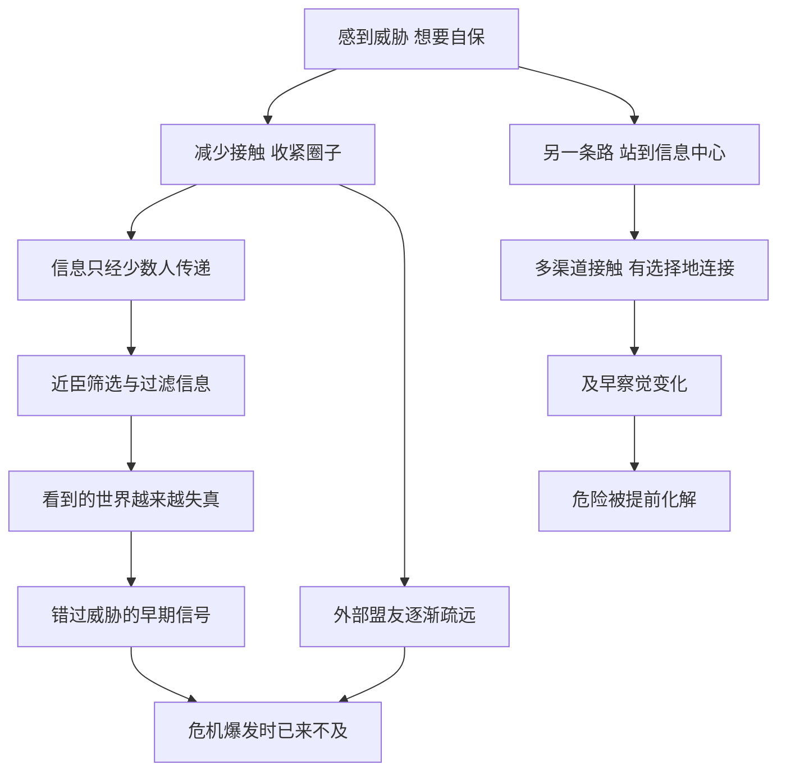

# 18｜为什么筑起高墙，反而最不安全？

> 为什么越是想保护自己的人，越容易陷入危险？

---

## 一、先说结论

人在感到威胁时，第一反应往往是把自己藏起来：减少接触、收紧圈子、只信任身边少数几个人。这看起来很安全。

格林却认为，**这恰恰是最危险的做法。** 第 18 条法则说：不要筑起堡垒保护自己，孤立很危险。高墙挡住的不只是敌人，还有信息、盟友和变化的信号；等你发现威胁时，它往往已经到了墙根下。

但格林并不是让人对所有人敞开大门。第 10 条法则“远离不幸之人”从另一面提醒：有些人的困境和情绪会像传染病一样把你拖下水。**真正的问题不是“要不要连接”，而是“与谁连接、站在什么位置上连接”。**

---

## 二、我们先理解一个问题

我们常听到这样的说法：

> “位置越高，越要少说话、少露面。”
> “圈子要小，信任的人越少越安全。”
> “外面太乱，关起门来过好自己的日子就行。”

这些说法都有一定道理。前面我们也谈过沉默与神秘的力量。可是，“少露面”和“与世隔绝”之间，只隔着一条很细的线。

一个人可以保持神秘，但不能看不见外面；可以控制别人接近自己的方式，但不能切断自己了解世界的渠道。

那么，为什么很多有权势的人，最后都败在了“看不见”上？

---

## 三、作者到底提出了什么观点？

**第一，孤立会切断信息，而信息就是权力的血液。** 格林认为，权力本质上是一种社会性的东西，它依赖于与他人的持续互动。一个人一旦把自己封闭起来，就会失去对局势的感知，别人也可以趁机在墙外密谋。

格林讲到的反面例子是秦始皇。按照史书的记载，秦始皇晚年笃信方士、追求长生，行踪越来越隐秘。他在咸阳周围修建了大量宫殿，用复道、甬道相连，让自己的行动不被外人察知；据《史记》记载，有人泄露了他的行踪，他便大加追查。这样一来，能接近他的人越来越少，信息越来越依赖少数近臣。

秦始皇在出巡途中去世后，赵高和李斯秘不发丧，伪造诏书，改立胡亥，逼死了公子扶苏。一个帝国的继承，竟然可以在一辆车里被几个人悄悄改写——**这本身就说明，最高权力者生前已经与外界隔绝到了何种程度。**

**第二，聪明的权力者会把自己放在信息流的中心。** 格林用路易十四作为正面例子。路易十四年幼时经历过贵族叛乱，深知贵族分散在各地时有多难控制。他后来把大批贵族吸引到凡尔赛宫，让他们在宫廷里生活、社交、争宠。这样做的一个效果是：国王不必走出宫廷，就处在整个王国精英关系网的正中央，谁和谁走得近、谁在抱怨什么，他都能及时感知。

秦始皇把自己藏进了宫殿深处，路易十四却把所有人都拉到了自己身边。两人都在宫殿里，**一个成了信息的孤岛，一个成了信息的枢纽。**

**第三，连接要有选择：第 10 条“远离不幸之人”。** 格林认为，有些人的不幸不是偶然，而是源于他们自身的性格与处事方式，他们会把混乱带给身边的每一个人。他讲到了十九世纪的舞蹈演员洛拉·蒙特斯：她魅力惊人，但与她亲近的男人往往遭遇厄运——一位情人在决斗中丧生，巴伐利亚国王路德维希一世因为对她的宠爱激起民愤，最终在 1848 年的动荡中退位。格林由此告诫：情绪与困境是会传染的。

---

## 四、把这个观点翻译成人话

合起来看，这两条法则说的是一件事：

- **不要躲进自己的小房间，要站在人群的交汇处。**
- **但站在交汇处，不等于谁都往怀里拉。**

打个比方：一个人的社交关系就像一栋房子的门窗。全部封死，房子会闷坏，你也看不到外面起火；全部拆掉，风雨和小偷都会进来。聪明的做法是：**多开窗、看得见外面，同时管好门，决定让谁进来。**

秦始皇封死了门窗；路易十四把自己家变成了广场；而格林对洛拉·蒙特斯的警告，则是在提醒你，有些人进门之后，会把整栋房子都点着。

---

## 五、为什么会这样？

为什么孤立会从“保护”变成“危险”？可以看下面这条链条：

这里的关键在 **C → D → E**。

当一个人只通过少数渠道获取信息时，这些渠道就拥有了巨大的权力。他们可能出于讨好而报喜不报忧，也可能出于私利而有意隐瞒。时间一长，被保护的那个人看到的，已经不是真实的世界，而是被精心剪辑过的版本。

另一方面，**孤立本身也是一种信号。** 当一个权力者长期不露面，外界会开始猜测、不安，甚至有人会试探他的底线。墙越高，墙外的人越好奇墙里发生了什么，也越敢在墙外动手脚。

至于第 10 条，背后是另一个机制：人的情绪和行为模式会在密切关系中相互影响。心理学中关于“情绪感染”的研究表明，人们会不自觉地模仿身边人的表情、语气和情绪状态。长期与一个总是陷入混乱的人纠缠，你的判断和精力也会被慢慢消耗。

---

## 六、举一个现实生活中的例子

设想一家大企业的高管，坐在总部顶楼。

刚上任时，他经常去门店和工厂转转，听一线员工抱怨，也和客户聊天。后来公司越来越大，他越来越忙，日程被会议塞满。渐渐地，他获取信息的方式变成了每周一份汇报材料：区域经理汇报给事业部，事业部汇报给副总，副总再整理成十几页的幻灯片交给他。

每一层都在“优化”信息：区域经理淡化了客户投诉，因为怕影响考核；事业部把几个区域的下滑归为“季节性波动”；副总则把最好看的几个数据放在了首页。

于是，这位高管看到的永远是“整体可控、稳中有进”。直到有一天，竞争对手的新产品已经抢走了大片市场，一线销售早在一年前就反映过客户在流失，而这些声音从来没有穿过层层汇报到达顶楼。

这正是现代组织版本的“深宫”。**高管并没有刻意把自己关起来，但层层筛选的汇报体系，替他筑起了一道看不见的墙。**

反过来，一些管理者会刻意保留“绕过层级”的渠道：定期到一线旁听、直接看原始的客户反馈、与基层员工不定期面谈。这不是不信任中层，而是不让自己只听到一种声音。

---

## 七、回到书中重新理解

回到秦始皇和路易十四，会发现格林真正关心的不是“露面多少”，而是**信息与关系如何流动**。

路易十四并非谁都见，他同样讲究距离和仪式；但他让整个精英阶层都围绕着自己运转，信息自然会流向他。秦始皇也并非完全不理政事，史书记载他勤于批阅文书；但当他把自己的行踪变成最高机密时，能接触到真实情况的人就被压缩到了极少数，最终连身后事都被这极少数人操控。

同时，格林并没有把“连接”浪漫化。洛拉·蒙特斯的故事提醒我们：站在人群中心，也意味着更容易被卷入别人的风暴。格林在第 18 条的“反转”中也承认，在某些时候，短暂地退后一步、获得思考的空间是有益的——只是不能让暂时的退避变成长期的隔绝。

所以，这两条法则放在一起读，才完整：**开放是为了看清，选择是为了自保。**

---

## 八、这个观点背后还有什么？

**第一，它与“信息过滤”问题密切相关。** 在任何层级组织中，信息向上传递时都会被简化和美化。位置越高，越需要主动对抗这种过滤。

**第二，它揭示了“安全感”与“安全”的区别。** 高墙能带来强烈的安全感，却未必带来真正的安全。很多危机，恰恰发生在人们感到最安全的时候。

**第三，第 10 条暗含一种关于“命运”的看法。** 格林倾向于认为不幸往往有其性格根源，因而会反复发生。这种看法有一定观察基础，但也容易走向对弱者的冷漠——这一点在后面会讨论。

**第四，这两条法则可以看作一种“关系网络”的思维。** 社会网络研究中常讨论：处在多个群体连接处的人，往往能更早获得新信息、更多机会。格林用宫廷故事表达了类似的直觉。

---

## 九、这个观点有问题吗？

**说服力在哪里？** 第 18 条的洞察相当有力。从古代帝王到现代企业，“被身边人蒙蔽”几乎是权力者最常见的失败方式之一。把孤立视为风险而不是保护，这个判断在组织管理中也被反复印证。

**争议在哪里？** 争议主要集中在第 10 条。“远离不幸之人”如果被机械理解，很容易变成对困境中的人的回避和冷漠：生病的朋友、失业的亲人、陷入低谷的同事，难道都应该远离吗？格林在书中强调的是那些“把不幸带给别人”的人，但这个区分在现实中并不容易做出，而且带有很强的主观判断。

**哪里过度简化？** 秦始皇晚年的问题，不能只用“孤立”来解释。史学界对秦朝迅速灭亡的原因有很多讨论：严苛的法令、繁重的徭役、继承制度的缺陷、六国旧贵族的反抗等等，都被认为是重要因素。把一切归结为一个人的隐居，是一种讲故事的简化。路易十四的凡尔赛体系也有多种解读：有学者强调它对贵族的驯服作用，也有学者认为它的实际效果被后人夸大了。

**有什么其他解释？** 组织行为学提供了更系统的解释：高层“听不到坏消息”，往往不只是因为他本人封闭，还因为组织缺乏让人安全说真话的机制。与其要求领导者“多下基层”，不如建立匿名反馈、跨层沟通和容错文化。至于情绪传染，心理学研究确实支持它的存在，但同样的研究也表明，支持性的关系可以帮助人走出困境——连接既可能传染消极，也可能传递力量。

---

## 十、今天再看这个观点

以下部分是基于格林思想的现代延伸，不是他在书中的原话。

今天，高墙有了新的形态。

它可能是算法推荐形成的“信息茧房”：你只看到自己愿意看的内容，以为世界就是这样；它可能是一个只有赞同声的小圈子：每个人都在强化你原有的判断；它也可能是一个人的“社交退缩”：以“内向”“佛系”为理由，逐渐与更广阔的人际网络失去联系。

这些墙都是舒适的，但它们同样会让人错过变化的信号。

同时，第 10 条在今天也可以被更温和地理解：不必把谁贴上“不幸之人”的标签，但可以学会识别那些持续消耗你、却拒绝改变的关系，并设定边界。**设边界不是抛弃，而是在帮助别人的同时，不让自己也沉下去。**

---

## 十一、这一篇真正应该记住什么？

1. **孤立不是保护，而是风险。** 高墙挡住敌人，也挡住了信息和盟友。
2. **权力依赖信息流。** 站在关系和信息的中心，比躲在深处更安全。
3. **只听层层汇报，就等于住进了看不见的深宫。** 要主动保留多元、直接的信息渠道。
4. **连接需要选择。** 有些关系会持续消耗你，学会设定边界。
5. **不要把一个复杂的历史结局归结为单一原因。** 格林的故事是寓言，帮助我们理解机制，而不是完整的历史解释。

---

## 十二、留一个问题

> 你现在获取重要信息的渠道有几个？
> 如果其中最信任的那一个一直在“报喜不报忧”，
> 你要过多久才会发现？

---

走出高墙，意味着要和更多的人打交道，也意味着会收到更多的邀请、帮助和好处。可是，别人递过来的东西，真的都可以放心收下吗？

有一种代价，常常藏在最让人心动的两个字后面。下一篇，我们来谈——**为什么“免费”的东西往往最贵？**
