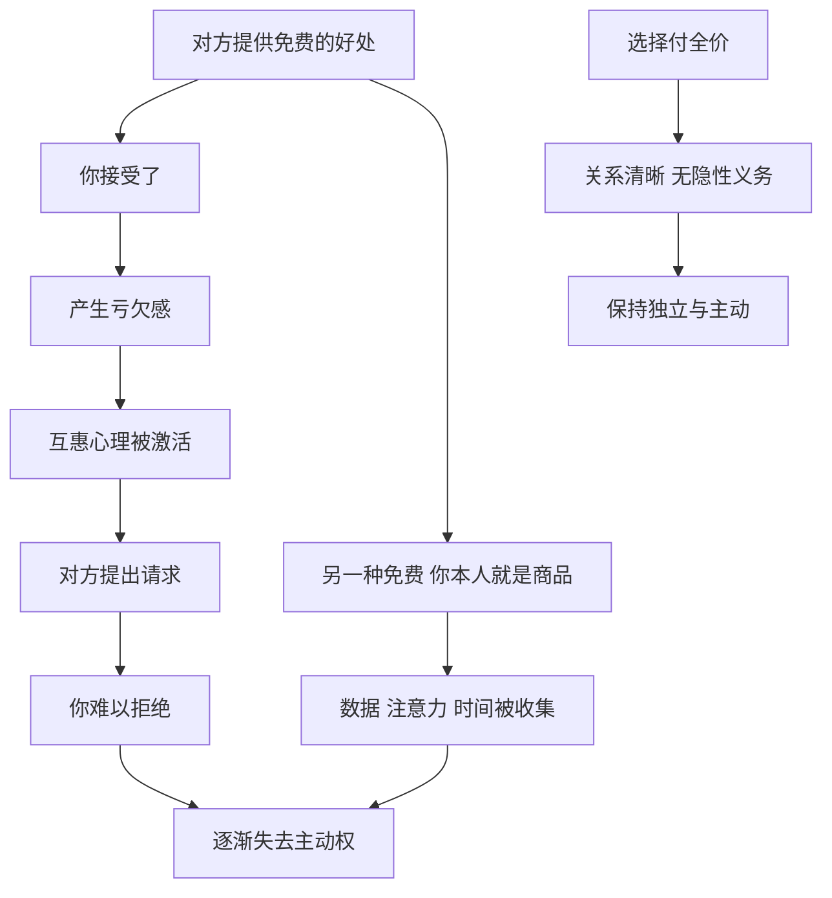

# 19｜为什么“免费”的东西往往最贵？

> 为什么贪便宜的人，常常在不知不觉中失去主动权？

---

## 一、先说结论

格林在第 40 条法则里说：**蔑视免费的午餐。**

他的理由很直接：免费的东西从来不是真正免费的，它的价格只是被藏了起来——藏在人情债里，藏在隐性的义务里，藏在别人日后的要求和操控里。一个总想占便宜的人，会在一次次“白拿”中，把自己的独立性一点点交出去。

反过来，格林认为，**懂得为想要的东西付出全价、并且在恰当的时候慷慨花钱的人，才能保持自由和尊严。** 在他看来，金钱与恩惠从来不只是交易，它们是权力关系的载体。

---

## 二、我们先理解一个问题

我们大概都有过这样的经历：

> 商场里的“免费试吃”，吃完了总觉得不买点什么不好意思；
> 朋友“免费”帮了个忙，后来他开口借钱，你很难拒绝；
> 一门“免费体验课”，上完之后被销售连环追问要不要报名。

这些时刻，我们并没有被强迫，却分明感到了一种压力。这种压力从哪里来？

更进一步：如果连一顿试吃都能让人不自在，那么更大的“免费”——一份昂贵的礼物、一次关键的提携、一个不收钱的服务——又会让人背上多少看不见的债？

---

## 三、作者到底提出了什么观点？

格林围绕第 40 条，提出了几层意思。

**第一，免费往往是诱饵。** 格林认为，那些主动送上好处的人，很多时候是在布局：先让你接受，再让你觉得亏欠，最后在你难以拒绝的时候提出真正的要求。骗子最常用的手法之一，就是先给一点甜头。

**第二，接受免费就是接受义务。** 即使对方没有恶意，人情也会在双方之间建立一种不对等的关系。接受的一方会觉得自己欠了什么，在未来的交往中不自觉地退让。这种义务无形、模糊，因而更难摆脱。

**第三，吝啬本身会损害权力。** 格林不只是在批评“占便宜”，他同样批评“舍不得花钱”。在他看来，吝啬的人会显得小气、不体面，失去别人的好感与忠诚，还会在关键时刻因小失大。

历史上常被提到的一个例子是美国石油大亨 J·保罗·盖蒂。他是当时世界上最富有的人之一，却以节俭到近乎吝啬而闻名——据广泛流传的说法，他曾在自己的豪宅里为访客安装投币电话。更令人唏嘘的是 1973 年他的孙子在意大利遭绑架，盖蒂起初拒绝支付赎金，直到孙子的一只耳朵被割下寄出，他才在讨价还价之后出了钱。这个故事常被用来说明：**一个人可以非常富有，却因为吝啬而在道义和人心上彻底失分。**

**第四，慷慨是权力的工具。** 格林认为，懂得花钱的人，能把金钱转化为声望、关系和影响力。在历史上，佛罗伦萨的美第奇家族大量资助艺术家、学者和公共建筑，他们的名字至今与文艺复兴紧密相连；罗斯柴尔德家族在十九世纪的欧洲，也常被描述为善于通过社交和款待进入上层圈子、把财富转化为社会地位。无论这些描述中有多少修饰，它们都指向同一个判断：**钱花在哪里，权力就流向哪里。**

---

## 四、把这个观点翻译成人话

把格林的意思说得直白一点：

- **别人白给你的，往往要你以别的方式还。**
- **自己花钱买的，才真正属于你，也不欠任何人。**
- **该大方的时候大方，是在买比钱更贵的东西——人心和主动权。**

打个比方：付全价买东西，就像你在店里买了一把伞，雨天打着走，谁也管不着你；而别人“免费”借你的伞，你打着它，心里总惦记着要还、要感谢，哪天他需要你帮忙，你也不好推辞。

**钱付清了，关系就干净；钱没付，关系就有了钩子。**

---

## 五、为什么会这样？

免费为什么会变成代价？可以看下面这张图：

这张图里有两条路径。

**第一条是人情路径（C → D → F）。** 心理学家罗伯特·西奥迪尼在《影响力》中把“互惠”列为最基本的影响原则之一：人们会感到有义务回报别人给予的好处，哪怕这个好处是自己并没有要求的。正因为这种心理根深蒂固，免费的赠予才成了极其有效的影响工具。

**第二条是商业路径（H → I）。** 在很多商业模式中，“免费”意味着你不是顾客，而是被出售的产品本身。你以为自己什么都没付，其实付出的是别人更想要的东西。

**第三，关于付全价（J → K → L）。** 付费让交换变得清楚：你给钱，对方给东西，彼此两清。这种清楚本身就是一种自由。

---

## 六、举一个现实生活中的例子

设想你下载了一款“完全免费”的手机 App：可以修图、记账，或者看短视频，功能丰富，没有广告，也不收会员费。

你用得很开心，直到有一天，你注意到了一些细节：

- 安装时，它要求读取通讯录、位置、相册和麦克风权限，你没多想就点了“同意”；
- 你刚和朋友聊到想买一台咖啡机，第二天就在各种页面上看到了咖啡机的推送；
- 你发现自己每天打开它的次数越来越多，一刷就是一个小时；
- 某天它开始推送“专属贷款额度”，额度恰好是你近期消费水平能承受的样子。

你为这款 App 支付了什么？一分钱都没有。但你交出了个人数据、交出了注意力、交出了隐私，还有你本来可以用来做别的事情的时间。

**你以为自己在免费使用一个产品，实际上，你就是这个产品在出售的东西。**

从格林的角度看，这恰恰是第 40 条最现代的版本：免费让你放下了戒备，而对方在你不注意的地方拿走了更值钱的东西。更重要的是，一旦你的习惯和数据都沉淀在这个平台上，你就越来越难离开——主动权悄悄转移到了对方手里。

防御的办法并不复杂：安装前看一眼权限，关掉不必要的授权；对“免费”的产品多问一句“它靠什么赚钱”；在真正重要的工具上，愿意付费换取更清晰的边界。

---

## 七、回到书中重新理解

格林在第 40 条里，其实同时反对两种人：**贪便宜的人**和**吝啬的人**。

这两种人看起来相反——一个总想白拿，一个总舍不得给——但本质上都是被金钱控制，而不是控制金钱。贪便宜的人被别人的赠予牵着走，吝啬的人被自己对损失的恐惧牵着走。

而格林推崇的，是第三种人：**知道每样东西的真实价格，愿意付清，也愿意在关键时刻大方出手。** 这样的人，既不欠别人，也能让别人愿意靠近自己。

所以，“蔑视免费的午餐”并不是说要拒绝一切好意，而是说：**要看清每一份好处背后的价格，并决定自己愿不愿意付。**

格林在“反转”中也提醒，慷慨同样可以被用作诱饵；而对手送来的“免费”，有时正是识别他意图的线索。

---

## 八、这个观点背后还有什么？

**第一，它是一种关于“独立性”的哲学。** 格林把财务上的清楚，与人格上的独立联系在一起。欠得越少，受制越少。

**第二，它揭示了礼物的双重性。** 人类学家马塞尔·莫斯在关于礼物的经典研究中指出，在许多传统社会里，礼物从来不是单向的，它包含着接受与回赠的义务，维系着社会关系，也塑造着地位高低。格林的判断与这一观察有相通之处。

**第三，慷慨与权力的关系源远流长。** 从古代君主的赏赐，到富豪的慈善捐赠，给予往往既是善意，也是建立声望与影响力的方式。

**第四，它提醒我们重新审视“省钱”。** 很多时候，为了省下一点钱，人们付出了时间、健康、机会或尊严。真正的精明，是算清总账。

---

## 九、这个观点有问题吗？

**说服力在哪里？** 第 40 条对“免费背后有代价”的洞察非常准确。无论是人情社会中的礼尚往来，还是数字经济中的数据交换，“免费”带来的隐性义务都真实存在。它能帮助人们对各种“天上掉馅饼”保持警惕。

**争议在哪里？** 第一，并非所有免费都是陷阱。朋友的无私帮助、陌生人的善意、开源软件、公共图书馆、志愿者服务——这些免费的东西构成了社会中最温暖的部分。如果把一切赠予都视为操控，人会变得多疑而孤独。第二，“付全价”的前提是有足够的钱。对于经济拮据的人来说，免费资源往往是必需品，而不是贪便宜。

**哪里过度简化？** 格林把慷慨主要看作一种权力策略，但慷慨也可以出于真诚的善意；把吝啬看作权力的敌人，但节俭在很多情况下是审慎和美德。盖蒂的故事有其复杂的背景，有关他的许多细节也经过了媒体和传记作品的反复渲染，不宜简单当作“吝啬必败”的证明——毕竟他依然建立了庞大的财富。

**有什么其他解释？** 行为经济学对“免费”有专门的研究。例如，一些学者通过实验发现，价格从“很便宜”降到“零”时，人们的选择会发生不成比例的跳跃，仿佛“免费”本身有一种特殊的吸引力，会让人忽略其他成本。这为格林的直觉提供了一个更具体的机制解释。另外，从社会交换理论看，人情往来本身就是建立长期信任的方式，适度的亏欠感并不总是坏事，它让人与人之间保持连接。

所以，第 40 条更适合被理解为一种警觉，而不是一种拒绝一切的原则。

---

## 十、今天再看这个观点

以下部分是基于格林思想的现代延伸，不是他在书中的原话。

今天，“免费”已经成为数字世界最主流的商业模式之一：免费的搜索、免费的社交、免费的内容、免费的工具。与此同时，“先免费、后收费”“先补贴、后涨价”也成为平台扩张的常见路径。

在这样的环境中，格林的提醒有了新的意义：

- **问清楚“我是用户，还是商品”。** 如果一项服务不向你收费，它很可能在向别人出售关于你的东西。
- **警惕“习惯的锁定”。** 免费让你进来，习惯让你离不开，离不开之后，价格和规则就由对方来定。
- **在人际关系中，保持一种健康的“账目意识”。** 这不是要斤斤计较，而是在接受重要帮助时心里有数，在给予时也不求对方立即回报。

同时，也不必走向另一个极端。一个完全拒绝任何免费好意、处处怕欠人情的人，同样会失去很多真诚的连接。

---

## 十一、这一篇真正应该记住什么？

1. **免费往往只是把价格藏了起来。** 代价可能是人情、义务、数据、注意力或主动权。
2. **互惠心理让接受者难以拒绝。** 这正是免费赠予成为影响工具的原因。
3. **格林同时反对贪便宜和吝啬。** 两者都是被金钱控制，而不是控制金钱。
4. **付清价格，关系才干净。** 在重要的事情上，愿意付全价是一种对独立的保护。
5. **并非所有免费都是陷阱。** 保持警觉，但不要把一切善意都看成算计。

---

## 十二、留一个问题

> 在你每天使用的东西里，
> 有哪一样是“免费”的，而你从没想过它靠什么赚钱？
> 如果明天它开始收费，你还离得开吗？

---

看清了免费背后的钩子，你会发现，很多时候，不是我们主动走向别人，而是别人精心布置好了一切，等着我们走过去。诱饵、场地、选项，全都由对方准备。

那么，能不能把这个局面反过来？格林接下来要讲的，是关于主动权最核心的一课——**为什么要让对手主动来找你？**
