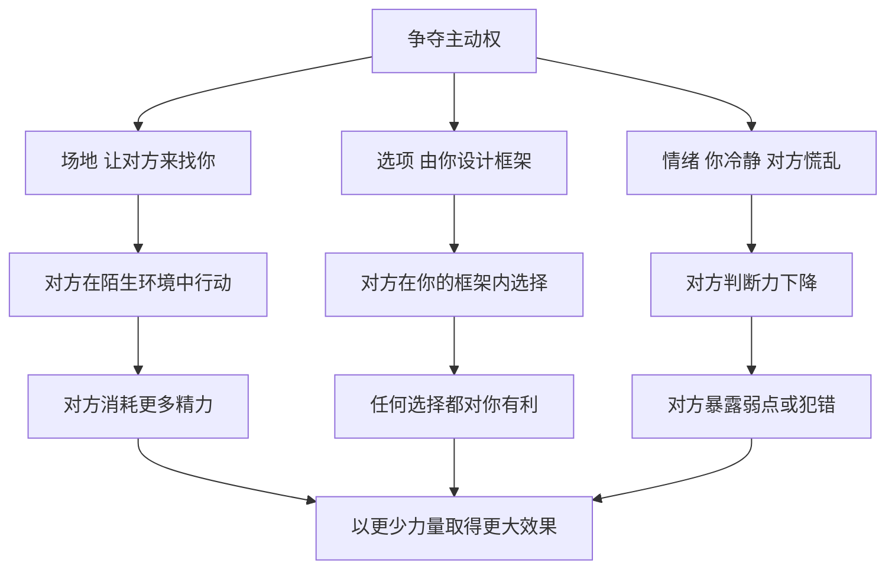

# 20｜为什么要让对手主动来找你？

> 为什么掌握主场的人，几乎总能掌握结果？

---

## 一、先说结论

在格林看来，权力较量中最宝贵的东西，不是力量本身，而是**主动权**。

第 8 条说：让别人来找你，必要时使用诱饵；第 31 条说：控制选项，让对方用你发的牌；第 39 条说：搅浑水以捕鱼，让对手在情绪失控中犯错。三条法则的共同点是：**不在对方选好的地方打仗，而是让对方走进你布置好的局。**

谁定场地、谁定议程、谁定选项，谁就已经赢了一半。

---

## 二、我们先理解一个问题

生活中，我们常常以为“主动出击”才是强者的表现：主动去谈、主动去求、主动去争。

可仔细想想，又会发现一些奇怪的现象：

> 为什么求职时，被猎头找上门的人，往往比自己投简历的人谈到更好的条件？
> 为什么吵架时，先发火的一方，常常最后落了下风？
> 为什么有些人从不强迫你做决定，你却总是按照他希望的方向选择？

表面上主动的人，未必掌握主动；表面上被动的人，也许早已布好了局。这里面到底藏着什么规律？

---

## 三、作者到底提出了什么观点？

**第一，第 8 条：让别人来找你。** 格林认为，当你主动去找对方时，你就在对方的地盘上、按照对方的节奏行动，处处受制；而当对方来找你时，主动权就回到了你手里。为此，有时需要设置“诱饵”——一个足以让对方心动、主动靠近的理由。

格林在书中讲到的一个经典故事是：法国外交家塔列朗在幕后促成了拿破仑离开厄尔巴岛。按照格林的叙述，塔列朗让拿破仑相信，只要他逃走，法国民众乃至欧洲列强都会欢迎他回归，从而诱使拿破仑冒险起事；拿破仑最终在滑铁卢被彻底击败，被流放到更远的圣赫勒拿岛——而这正是塔列朗想要的结果。需要说明的是，这一说法在历史学上并没有得到可靠证实，拿破仑返回法国的动机与时机，更多被认为与他自身的判断和当时法国的政治局势有关。**把它当作格林用来说明“诱饵”的一个寓言来读，比当作史实更合适。**

**第二，第 31 条：控制选项。** 格林认为，最高明的操控不是强迫对方，而是让对方“自己选择”——只不过所有的选项都是你事先设计好的。对方感到自己拥有自由，而你得到了想要的结果。

书中的经典故事来自俄国的伊凡雷帝。1564 年底，伊凡四世突然带着家人、侍从和财宝离开莫斯科，前往亚历山德罗夫村。不久，他送回两封信：一封指责贵族与教士背叛他、声称自己将放弃王位；另一封写给莫斯科的普通民众，说他对他们并无怨恨。

这一下，莫斯科陷入恐慌。没有沙皇，贵族担心民众暴动，民众担心贵族专权。于是，代表团赶到亚历山德罗夫村，恳求他回来。伊凡答应了，但提出了条件：他要拥有惩处“叛徒”的绝对权力，并建立直属于自己的特辖区。

**伊凡没有强迫任何人，他只是把选项摆成了“要么接受我的条件，要么面对没有沙皇的混乱”。** 贵族们“自愿”交出了权力，而随后到来的特辖制，成了俄国历史上一段血腥的恐怖时期。

**第三，第 39 条：搅浑水以捕鱼。** 格林认为，愤怒和情绪化是权力的敌人。一个冷静的人面对一个被激怒的人，几乎总能占上风。因此，聪明的人会保持自己的镇定，同时想办法扰乱对手的情绪，让他在慌乱中暴露弱点、做出错误的决定。

---

## 四、把这个观点翻译成人话

三条法则可以翻译成三句话：

- **别急着上门，让对方来找你。**
- **别跟对方争“选不选”，去决定“有哪些选项”。**
- **你越冷静，对方越慌乱，局面就越对你有利。**

打个比方：一场球赛，主队熟悉场地、有观众支持、习惯了草皮和天气；客队则要长途奔波，处处陌生。同样实力的两支队伍，主场的一方往往更容易赢。

格林所说的主动权，就是**把每一场较量都变成自己的主场**：场地是你的，规则是你定的，节奏也在你手里。

---

## 五、为什么会这样？

为什么掌握主场如此重要？可以看下面这张图：

这里有几个心理机制在起作用。

**第一，来找你的人，已经投入了成本。** 对方主动上门，就意味着他花了时间、精力，也在心理上表达了“需要”。投入越多，越不愿空手而归，也就越容易让步。

**第二，框架决定选择。** 心理学中的“框架效应”研究表明，同样的信息，以不同的方式呈现，会让人做出截然不同的决定。人们很少跳出给定的选项去思考“还有没有别的可能”。谁设定框架，谁就在很大程度上决定了结果。

**第三，情绪会压缩判断。** 人在愤怒、恐惧或焦虑时，注意力会变窄，更倾向于做出冲动的反应。保持冷静的一方，能够看到更多的可能性。

---

## 六、举一个现实生活中的例子

设想两家公司要谈一笔合作。

甲公司的负责人在一开始就做了几件看似不起眼的事：

- 他提议“欢迎来我们公司参观一下，顺便把事情谈了”，于是谈判地点定在了甲公司的会议室；
- 他主动说“议程我们这边先拟一个，您看看有没有要补充的”，于是讨论的顺序和重点由他来定；
- 他又说“合同初稿我们法务先出一版，大家在这个基础上改”，于是所有的条款都从他的版本出发。

乙公司的负责人觉得对方很热情、很专业，也省了自己的事，就欣然同意了。

谈判当天，乙方一行人在陌生的环境里，喝着对方准备的茶，看着对方的展示屏。会议按照甲方的议程推进，甲方最在意的条款排在前面、讨论得最充分；乙方关心的事项被安排在最后，时间所剩无几。合同的每一处修改，都需要乙方主动提出“我们希望改成……”，而甲方只需要回应“这个我们再考虑”。

一整天下来，乙方觉得自己据理力争、改了不少地方，但最终的合同，框架、结构和大部分条款，依然是甲方的原稿。

**这就是第 8 条和第 31 条在商业中的样子：甲方没有强迫乙方做任何事，他只是抢先定下了场地、议程和初稿。**

从防御的角度看，乙方可以做的事情也很清楚：争取在中立场地或轮流主场谈判；在议程确定前提出自己的核心关注点；尽量由自己起草初稿，或者至少在对方初稿之外，准备一份自己的条款清单作为对照。

---

## 七、回到书中重新理解

回看伊凡雷帝的故事，最值得注意的不是他的狠辣，而是他对局面的设计。

他没有在莫斯科和贵族正面冲突，而是离开了莫斯科——**把自己从棋盘上拿走，让所有人意识到棋盘离不开他。** 这是第 8 条：让别人来找你。他把选择压缩成“接受我的条件”或“陷入混乱”——这是第 31 条：控制选项。而他突然离去造成的恐慌，让贵族和民众都失去了冷静思考的余地——这又带有第 39 条“搅浑水”的味道。

三条法则在一个故事里合流，这也说明格林的法则并不是孤立的技巧，而是围绕同一个目标——主动权——展开的不同侧面。

当然，格林在“反转”中也承认，有时候必须主动出击：当时间对你不利、等待只会让对方壮大时，坐等别人上门就是坐以待毙。让对方来找你，前提是你手里真的有对方想要的东西。

---

## 八、这个观点背后还有什么？

**第一，它与兵法中的“致人而不致于人”高度相通。** 《孙子兵法》中讲，善于作战的人调动敌人，而不被敌人调动。格林的这组法则，可以看作这一古老思想在人际与商业中的延伸。

**第二，它揭示了“等待”的力量。** 很多人害怕等待，觉得等待就是被动。但真正的等待，是在自己准备充分的地方，让对方把力气用在奔向你的路上。

**第三，它提醒我们注意“默认选项”的威力。** 谁提供了默认方案，谁就提供了讨论的起点，而起点往往决定终点。

**第四，它与情绪管理紧密相关。** 前面我们谈过，格林在序言中就把控制情绪视为权力的基础。第 39 条则把这一点变成了一种进攻手段：自己不乱，同时让对手乱。

---

## 九、这个观点有问题吗？

**说服力在哪里？** 这组法则在谈判、竞争和冲突中有很强的解释力。谈判研究中常被讨论的“锚定效应”——最先提出的数字或方案会成为后续讨论的参照点——为“抢先起草”“抢先报价”提供了实证层面的支持。

**争议在哪里？** 第一，控制选项和搅浑水，都带有明显的操控性质。在长期合作关系中，如果对方事后意识到自己被“设计”了，信任会迅速瓦解。第二，伊凡雷帝的故事本身就说明了这种手段可能导致的后果：他通过控制选项获得的绝对权力，最终带来的是恐怖统治和巨大的社会创伤。

**哪里过度简化？** 格林的故事往往把复杂的历史事件归结为一个人的精妙设计。伊凡离开莫斯科的动机、当时的政治格局，学界有不同解读；塔列朗与拿破仑的故事，更是缺乏可靠史料支持。另外，“主场优势”也并非总是存在——在某些谈判中，客场一方反而可以用“需要回去请示”来争取时间和退路。

**有什么其他解释？** 谈判学中有一种被广泛讨论的思路，即“原则谈判”：不纠结于立场和控制，而是关注双方的真实利益，共同寻找更多选项，用客观标准来评判方案。从博弈论的角度看，在重复博弈中，一方长期操控框架，另一方会逐渐学会防范甚至报复，最终双方都付出更高的交易成本。**控制框架可以赢得一场谈判，却可能输掉一段关系。**

---

## 十、今天再看这个观点

以下部分是基于格林思想的现代延伸，不是他在书中的原话。

今天，“控制选项”已经被大规模地内嵌在产品设计和商业规则中。

购物网站把“推荐套餐”放在最显眼的位置；订阅服务把“自动续费”设为默认勾选；问卷和投票用选项的顺序与措辞影响你的回答。你以为自己在自由选择，其实是在别人设计好的菜单里挑选。

在网络舆论中，“搅浑水”也有了新形态：有人刻意制造对立和愤怒，让讨论陷入情绪化的争吵，真正的问题反而被淹没。

面对这些，一个普通人可以做的是：

- **先问一句“有没有不在菜单上的选项”。**
- **在别人给出框架时，意识到这是一个框架，而不是事实本身。**
- **当自己被激怒时，先停一下。** 让你愤怒，可能正是对方想要的。

---

## 十一、这一篇真正应该记住什么？

1. **主动权比力量更重要。** 谁定场地、议程和选项，谁就占了先机。
2. **让对方来找你，对方就在你的节奏里行动。** 前提是你手里有对方想要的东西。
3. **控制选项，是让对方“自由地”选择你想要的结果。** 伊凡雷帝的退位与回归，是最典型的例子。
4. **冷静是一种优势，情绪失控是一种破绽。** 不要让别人替你决定你的情绪。
5. **防御的关键在于识别框架。** 争取起草权、中立场地和自己的备选方案。

---

## 十二、留一个问题

> 回想最近一次让你“自己做出选择”的场景，
> 那些选项是谁提供的？
> 如果换一个人来设计菜单，你还会选同一个答案吗？

---

掌握主动权，可以让对手走进你的局。但局设好了、对手也来了，最后一步该怎么走？是网开一面，还是不留后路？

格林对这个问题的回答，是全书中最冷酷、也最具争议的一条——**为什么格林主张对敌人“斩草除根”？**
