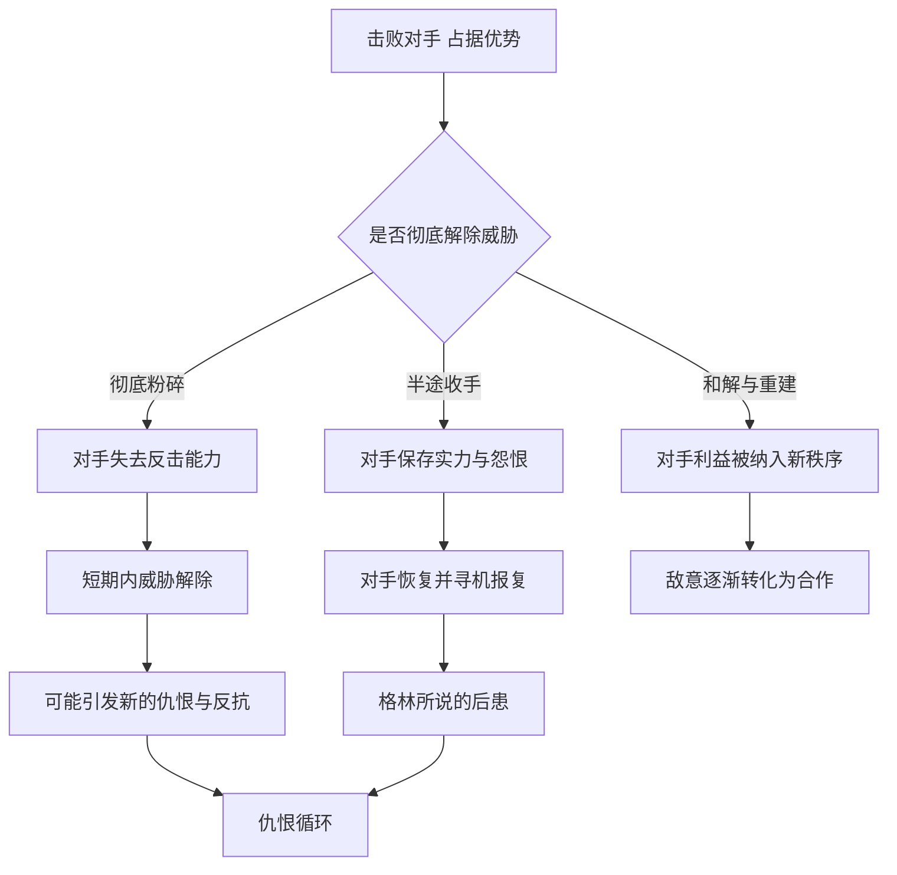

# 21｜为什么格林主张对敌人“斩草除根”？

> 为什么格林认为对敌人手下留情，往往会埋下祸根？

---

## 一、先说结论

格林在第 15 条法则里给出了一个毫不含糊的建议：**彻底粉碎你的敌人。**

他的逻辑是：一个被击败却没有被消灭的敌人，会记住失败的耻辱，等待时机卷土重来；半途而废的胜利，等于给对手留下了复仇的余地。第 42 条“打击牧羊人，羊群就会四散”则补充说：麻烦往往集中在少数核心人物身上，找准源头，比四面出击更有效。

这是全书最冷酷的法则之一。它有真实的历史教训作为支撑，但也必须被放回现代法治与人类经验中重新审视——**因为“斩草除根”本身，也常常是仇恨循环的起点。**

---

## 二、我们先理解一个问题

我们从小听到的道理，大多是“得饶人处且饶人”“冤家宜解不宜结”。宽恕被视为美德，赶尽杀绝被视为残忍。

可历史上也有另一种声音，一直在提醒人们：

> “宜将剩勇追穷寇，不可沽名学霸王。”
> “纵虎归山，必有后患。”

这两种声音都来自真实的经验。那么，面对一个已经处于劣势的对手，到底是该收手，还是该乘胜追击？格林为什么如此坚定地站在后者一边？

---

## 三、作者到底提出了什么观点？

**第一，第 15 条：彻底粉碎你的敌人。** 格林认为，敌人不会因为你的仁慈而感激你，反而会把你的收手视为软弱，或者当成喘息的机会。只要对方还有残存的力量和意志，危险就没有真正解除。他因此主张：一旦决定出手，就要让对方彻底失去反击的能力，不仅在实力上，也在意志上。

格林讲到的反面例子，正是中国读者熟悉的楚汉之争。公元前 206 年，项羽在鸿门设宴，谋士范增多次示意他除掉刘邦，甚至安排项庄舞剑、伺机行刺。但项羽犹豫不决，最终让刘邦借故脱身。范增为此愤然说出：将来夺项王天下的，必定是沛公。

几年之后，刘邦的实力不断壮大，项羽则在一次次消耗中逐渐陷入被动。公元前 202 年，项羽被困垓下，四面楚歌，最终在乌江边自刎。**鸿门宴上的一次心软，在格林看来，就是这场悲剧的起点。**

书中还提到了唐代的武则天。按照格林的叙述，她在从宫廷中逐步走向权力顶峰的过程中，对威胁自己的对手和潜在的反对者毫不留情，从而清除了几乎所有可能的挑战。关于武则天的许多具体事迹，史书记载本身就带有后世史家的立场和偏见，学界对其中不少细节存在争议；格林的叙述更接近一种戏剧化的“权力故事”，不宜当作精确的历史评价。

**第二，第 42 条：打击牧羊人，羊群就会四散。** 格林认为，一个群体中的麻烦，往往来源于少数几个核心人物——煽动者、组织者、精神领袖。与其和整个群体纠缠，不如找到这个源头。源头一旦被移除，群体就会失去方向和凝聚力。

---

## 四、把这个观点翻译成人话

把这两条法则说得通俗一点：

- **要么不动手，动手就别留后患。**
- **对手的“服软”，未必是真服，可能只是在等机会。**
- **别和一群人较劲，找到带头的那一个。**

打个比方：一场大火扑灭了明火，却留下了暗火。表面看已经安全，一阵风来，火又烧起来了，而且往往比之前更猛。格林认为，敌人就像这种暗火。

但这个比喻也暗含着它的局限：**人不是火。** 火不会记仇，也不会因为你的方式而改变态度；人会。这正是后面需要讨论的地方。

---

## 五、为什么会这样？

格林的逻辑可以用下面这张图来表示，同时也要看到另一条可能的路径：

格林的判断，主要建立在以下几个机制上。

**第一，失败会产生怨恨，而怨恨会寻找出口。** 被击败的一方往往会把失败归咎于对手，并把复仇视为恢复尊严的方式。

**第二，劣势中的对手会学习。** 失败是最好的老师。一个被放过的对手，会研究自己为什么输，并在下一次交手时有备而来。

**第三，收手会被解读为信号。** 在竞争激烈的环境中，手下留情可能被对手和旁观者理解为软弱或犹豫，从而招来更多挑战。

但图中也画出了两条格林没有充分展开的路径：**彻底粉碎可能制造新的仇恨，而和解与重建则可能打破循环。** 这两条路径，正是我们需要在后面讨论的。

---

## 六、举一个现实生活中的例子

设想某个城市里，有两家做同一类本地服务的平台，正在打一场补贴大战。

甲平台背后资金雄厚，几轮补贴下来，占据了明显优势；乙平台的用户在流失，资金链越来越紧，业内都在传它撑不过这个季度。

就在这时，甲平台的管理层觉得“大局已定”，没必要再烧钱了。他们大幅削减了补贴，把精力转向提升利润率，甚至在某些区域放松了竞争，觉得乙平台已经不足为虑。

乙平台抓住了这个喘息的机会。它收缩战线，集中资源经营几个优势区域，打磨产品体验，并在几个月后凭借改善后的数据完成了一轮新的融资。拿到钱之后，乙平台重新发起攻势，而此时甲平台的团队已经松懈，用户也因为补贴减少而心生不满。一年之后，乙平台在多个区域反超了甲平台。

这个一般化的故事，几乎就是鸿门宴在商业世界里的翻版。**甲平台并不是输在实力上，而是输在“以为对手已经不行了”的那个判断上。**

不过，从另一个角度看，甲平台的失误未必是“没有把对手赶尽杀绝”，而是它在松懈之后，失去了对市场和用户的敏感。真正的教训或许是：**不要因为暂时的优势而停止进步**，而不一定是要把对手彻底消灭。

---

## 七、回到书中重新理解

回到项羽的故事，会发现格林的解读只是其中一种角度。

项羽在鸿门宴上放过刘邦，有很多原因：他自恃实力强大，不屑于用阴谋；刘邦当时表现得极其恭顺，让他放松了戒备；项伯从中斡旋，而他顾及情面。项羽后来的失败，也不只是因为这一次心软——用人不当、失去民心、战略失误、疏远范增，同样是史家常常讨论的原因。

所以，格林讲这个故事，是在提炼一个“教训”，而不是在做完整的历史分析。**他关心的是一个具体的判断时刻：当你有能力彻底解除威胁时，犹豫可能要付出多大代价。**

格林在这条法则的“反转”中也提到，有时让敌人自行消亡、或者给对方留一个体面的退路，反而更有利——尤其是当彻底的打击会激起更大的反扑、或者让你在旁观者眼中显得过于残暴时。这说明，即使是格林本人，也没有把“斩草除根”当作绝对的铁律。

---

## 八、这个观点背后还有什么？

**第一，它来自一个“零和”的世界观。** 在格林描述的宫廷与战场中，权力是有限的，你多一分，我就少一分。在这样的世界里，敌人的存在本身就是威胁。

**第二，它与中国古代的一些谋略思想有呼应。** “除恶务尽”“打蛇不死反被咬”之类的说法，在许多文化中都能找到类似的表达，说明这一经验并非格林的独创。

**第三，第 42 条揭示了组织的脆弱性。** 高度依赖一个核心人物的群体，往往在失去他之后迅速瓦解。这一观察同样可以反过来用：一个组织如果不想被“打击牧羊人”，就需要避免把一切系于一人。

**第四，它关乎“何为胜利”的定义。** 格林把胜利定义为对手彻底失去威胁能力；而另一种定义，则是把对手转化为不再敌对的人。这两种定义，会导向完全不同的行动。

---

## 九、这个观点有问题吗？

这一节需要格外谨慎，因为这条法则的争议，远远超出了策略层面。

**说服力在哪里？** 历史上确实有大量“纵虎归山”的教训，商业竞争中也常见“对手喘过气来反超”的情况。格林提醒人们不要被短暂的优势麻痹，不要把犹豫当作仁慈，这在很多竞争情境中是有价值的。

**争议在哪里？** 第一，也是最根本的：在现代社会中，“彻底粉碎敌人”的许多手段本身就是违法和不道德的。格林引用的历史故事中，“斩草除根”往往意味着杀戮、清洗和迫害，这些做法在今天的法治框架下是完全不可接受的。

第二，“斩草除根”往往会制造新的敌人。被清除者有亲人、朋友和追随者，暴力的清洗常常埋下更深的仇恨，形成代代相传的报复循环。历史上许多长期冲突，都与这种循环有关。

**哪里过度简化？** 格林把复杂的历史结局归因于某一次“心软”，忽视了更多结构性因素。更重要的是，他几乎只讲了“放过敌人而失败”的故事，很少讨论“赶尽杀绝反而招致灭亡”或“宽恕敌人反而赢得长久和平”的例子。

**有什么其他解释？** 以下对照是本解读的延伸，并非格林的观点。

- **南非的真相与和解委员会。** 种族隔离制度结束后，南非没有选择对过去的施害者进行全面清算，而是设立了真相与和解委员会，以讲出真相、承认罪责为条件，在一定范围内给予特赦。这一做法本身也有很多争议，但它被许多人视为避免大规模报复性暴力、实现社会过渡的一种尝试。
- **二战后的马歇尔计划。** 二战结束后，美国通过马歇尔计划援助西欧重建，其中也包括曾经的敌国西德。一些历史学者常把它与一战后对德国的处理相对照：一战后的安排被不少人认为既让德国深感屈辱、又没有真正消除其复兴的可能，成为后来冲突的土壤之一；而二战后的援助与整合，则帮助形成了长期的和平与合作。关于这两段历史的因果关系，学界同样存在不同解释。
- **博弈论的视角。** 在重复博弈中，“以牙还牙”之类的策略之所以表现出色，一个重要特点是它愿意在对方合作时恢复合作。一味地惩罚和消灭，反而可能让所有人陷入持续的对抗。

这些对照说明：**格林所说的“彻底”，未必只有“消灭”这一种形式。** 让对方失去敌意，同样可以是一种彻底的胜利。

---

## 十、今天再看这个观点

以下部分是基于格林思想的现代延伸，不是他在书中的原话。

在今天的法治社会中，第 15 条最多只能在一个很有限的范围内被理解：**在合法的竞争中，不要因为暂时的优势而松懈，也不要给对方留下利用你失误的机会。** 至于伤害、打压、报复个人，不仅违法，而且会给自己带来难以承受的声誉和法律风险。

对普通人来说，这条法则更有价值的用法，或许是防御性的：

- **识别那些把你当成“要彻底清除的对手”的人。** 当有人对你采取不留余地的打击时，意识到这可能不是一次冲突，而是一种持续的策略，需要尽早寻求制度与法律的保护。
- **避免成为别人眼中的“牧羊人”式靶子。** 在团队中，如果一切都系于你一人，你就很容易成为被集中攻击的目标；培养他人、分散风险，对自己和团队都是保护。
- **在冲突中给对方留退路。** 这不是软弱，而是降低对方“拼死反扑”的动机，也是避免仇恨循环的方式。

---

## 十一、这一篇真正应该记住什么？

1. **格林认为，残存的敌人会伺机复仇。** 项羽在鸿门宴上的犹豫，是他最常被引用的反面例子。
2. **第 42 条强调找准源头。** 麻烦往往集中在少数核心人物身上。
3. **这条法则来自零和的世界观。** 在宫廷与战场中有解释力，在法治与合作的社会中大打折扣。
4. **“斩草除根”本身可能制造新的仇恨。** 和解、重建与纳入新秩序，也可以是结束冲突的方式。
5. **在现代语境中，它更适合被理解为“别因优势而松懈”，而不是“把对手赶尽杀绝”。**

---

## 十二、留一个问题

> 如果你在一次竞争中彻底赢了对手，
> 你希望他从此消失，
> 还是希望他有一天可以不再是你的对手？

---

无论是斩草除根，还是和解收场，都建立在一个前提上：你首先得有胆量出手，并且把力量用在关键的地方。很多人输掉较量，并不是因为太狠或太软，而是因为从一开始就瞻前顾后、四处分散。

格林对此的判断出人意料：谨慎，有时才是最大的冒险。下一篇，我们就来看——**为什么大胆出击，反而比小心谨慎更安全？**
