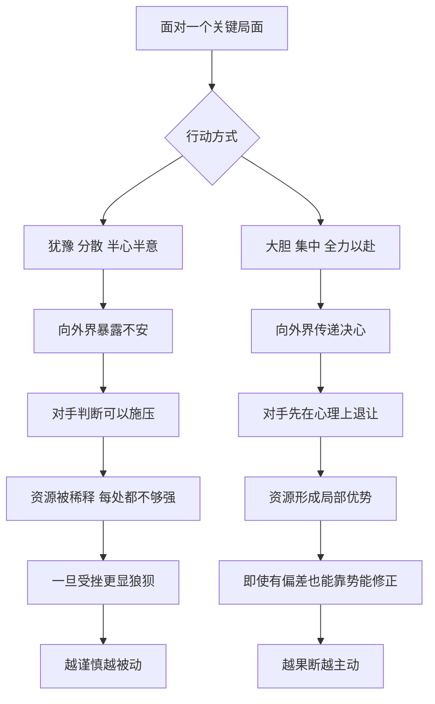

# 22｜为什么大胆出击，反而比小心谨慎更安全？

> 为什么犹豫和分散，常常比冒险更致命？

---

## 一、先说结论

我们从小听到的忠告大多是“稳一点”“别冒险”“多留几条后路”。格林却在两条法则里给出了几乎相反的建议。

第 28 条说：**大胆行动。** 犹豫会把你的不安暴露给对手，而大胆本身就能掩盖失误、震慑他人。
第 23 条说：**集中你的力量。** 把资源压在一个点上，比四处撒网更有力。

两条合起来，是一个反直觉的判断：**真正危险的往往不是冒险，而是半心半意。** 小心翼翼、面面俱到的人，看起来最安全，实际上最容易在关键时刻被人看穿、被人压过。

当然，这不是鼓励莽撞。格林说的“大胆”，是想清楚之后的全力以赴，而不是不想后果的横冲直撞。

---

## 二、我们先理解一个问题

想一想这些场景：

> 开会时你有一个好想法，犹豫了半天，结果被别人先说了出来；
> 谈判时你报了一个价，看到对方皱眉，立刻主动降了一截；
> 做一件事时你同时开了五条线，每条都做了一点，没有一条做出结果。

这些时刻有一个共同点：**我们以为自己在“控制风险”，其实是在不断地向外界发出“我没把握”的信号。**

问题就来了：谨慎明明是一种美德，为什么在权力关系里，它会变成弱点？而“集中”听起来像是把鸡蛋放进一个篮子，为什么格林反而认为这样更安全？

---

## 三、作者到底提出了什么观点？

格林的论证可以拆成三层。

**第一，犹豫是会被看见的。** 格林认为，人们对别人的胆量有一种本能的感知。一个犹豫的人，会在语气、动作、时机上露出破绽，对手从中读到的是：这个人可以被推一推。而一个果断的人，哪怕判断并不完美，也会让别人先在心里退半步。

**第二，大胆可以弥补错误，犹豫只会放大错误。** 在格林看来，一个大胆的行动即使出了偏差，也往往能靠后续的气势扭转；而一个畏缩的行动，一旦受挫，就会显得更加狼狈。他甚至认为，胆怯多半不是天性，而是习惯；大胆也可以通过练习养成。

**第三，力量分散就是力量被稀释。** 第 23 条强调，与其在很多地方都有一点存在，不如在一个地方拥有压倒性的存在。格林在讨论这条法则时，援引过罗斯柴尔德家族的例子。从一般的历史叙述看，这个家族在十九世纪把业务牢牢攥在家族内部，兄弟分驻欧洲几个金融中心，却始终以家族为核心协同行动，信息、资本和信任高度集中，外人很难渗透。格林借此说明：**集中带来的是深度，而深度带来的是不可替代。**

所以，“大胆”和“集中”其实是同一件事的两面：前者讲姿态，后者讲资源。它们都在反对一种状态——**想要什么都兼顾，结果什么都不彻底。**

---

## 四、把这个观点翻译成人话

打个比方。

两个人过一条湍急的小溪，溪中有几块石头。

第一个人每一步都犹豫，脚踩上去又缩回来，重心在两块石头之间来回摇摆。他最容易滑倒，因为**真正让人失去平衡的，恰恰是悬在半空中的那一刻。**

第二个人看准了路线，一步一步踩实。他未必比第一个人更有把握，但他的每一步都是完整的动作。

权力场里的很多事，都像过这条小溪。你可以选择不过，但一旦决定过，就要把脚踩实。**在中间犹豫，是最危险的位置。**

“集中”也一样。一盏灯照亮一整间屋子，光线是散的；同样的能量聚成一束激光，就能切开钢板。力量本身没有变，变的是它的密度。

---

## 五、为什么会这样？

为什么大胆和集中能带来安全感，而谨慎和分散反而带来风险？可以用下面这张图拆开：

关键在 **B → C1** 和 **B → D1** 这两步：**你的行动方式本身就是一种信息。**

对手看不到你心里有几成把握，只能看到你的姿态。犹豫不决的姿态，等于把底牌翻给别人看；果断的姿态，则把判断的压力推回给对方。

第二个关键在资源层面。任何人的时间、精力、资金、关系都是有限的。**分散的意思，就是在每一个战场上都处于劣势。** 你以为自己在分散风险，其实是在每个方向上都给了对手以多打少的机会。

还有一个心理机制值得注意：人们天然会追随那些看起来有方向的人。一个目标清晰、全力投入的人，更容易吸引盟友和资源；一个左顾右盼的人，连自己人都会开始犹豫。

---

## 六、举一个现实生活中的例子

一个老社区里，有一家开了十几年的小店。

老板一直觉得“东西多，客人才多”。于是店里什么都卖：零食、日用品、文具、调料、充电线、雨伞……货架塞得满满当当。可是生意一年不如一年：附近开了便利店，日用品比不过；外卖平台上零食更便宜；文具有专门的文具店。**每一样都有，每一样都不是最好的选择。**

后来，老板注意到一件事：店里只有一样东西，是老顾客会专门来买的——他老婆每天早上做的手工包子。

他做了一个很多人觉得冒险的决定：把几十种杂项商品几乎全部清掉，店面重新布置，只做包子和配套的豆浆、小菜。门头换成了一个简单的招牌，名字就叫那款包子。

一开始，一些老顾客抱怨“怎么什么都不卖了”。但几个月后，情况变了：包子的品质因为全力投入而更稳定，出品更快，排队的人越来越多，附近写字楼的人开始专门绕路过来。**这家店第一次有了自己的“名字”。**

这个例子里，“大胆”和“集中”同时起了作用：
老板敢于放弃看似稳妥的“什么都卖”，这是大胆；
把全部精力压在一个招牌上，这是集中。

当然，这个决定也有风险：如果包子并不真正受欢迎，他就会失去原本分散的收入来源。**大胆不是赌博，前提是他已经从顾客的行为里，看到了那个值得全力押注的点。**

---

## 七、回到书中重新理解

现在回到格林的原文逻辑，会发现他强调的其实不是“勇气”这种品质，而是“效果”。

格林并不关心一个人内心是否真的无所畏惧。他关心的是：**在别人眼中，你是否显得无所畏惧。** 大胆首先是一种表演，它的对象是对手和旁观者。一个内心紧张却动作果断的人，在权力场里比一个内心平静却表现迟疑的人更有分量。

同样，第 23 条的“集中”，也不只是管理学意义上的“聚焦主业”。格林把它延伸到人际关系：与其讨好很多人，不如牢牢抓住一个真正有力量的支持者；与其在很多地方浅尝辄止，不如在一个领域做到让人离不开你。这与前面讲过的“让人依赖你”一脉相承——**依赖只会发生在深度上，不会发生在广度上。**

这也解释了格林为什么把两条法则放在一起能够互相印证：没有集中，大胆就是虚张声势；没有大胆，集中就会变成固执地守着一个角落。

---

## 八、这个观点背后还有什么？

**第一，这是一种“信号理论”。** 格林虽然没有使用这个术语，但他的思路与之相通：在信息不完全的情况下，人们会根据可观察的行为推断不可观察的实力。大胆的行为之所以有效，是因为它是一种昂贵的信号——只有自认为有底气的人，才会这样做。

**第二，它与军事思想中的“集中兵力”原则相呼应。** 从古代兵法到近代战争理论，都有“在决定性的地点形成局部优势”的主张。格林把这种战场智慧搬到了日常生活里。

**第三，它背后有一种对“中间状态”的不信任。** 格林反复暗示：最糟的不是做错选择，而是不做选择。拖延和摇摆会同时消耗资源和信誉，却不带来任何结果。

**第四，大胆的对象要选对。** 书中对“大胆”的赞赏，隐含着一个前提：你面对的对手是会被气势影响的人。如果对方本身更强、更冷静，大胆就可能变成送上门去的破绽。

---

## 九、这个观点有问题吗？

这组法则的说服力是真实的，但它的边界也很明显。

**说服力在哪？** 很多人确实吃过犹豫的亏：机会窗口很短，等想清楚时已经关上了；谈判中过早退让，让对方得寸进尺；精力分散，导致每件事都做得平庸。格林把这些经验总结成一句话，很有冲击力。

**争议在哪？** 首先是幸存者偏差。书中讲的大胆者，大多是成功的那一批；那些同样大胆、却因此一败涂地的人，很少被写进故事。其次，“集中”在很多领域恰恰是风险的来源。在投资上，分散配置是基本常识；在职业发展上，过度押注一个行业，也可能在行业衰退时无路可退。

**哪里过度简化？** 格林把“谨慎”几乎等同于“胆怯”。但谨慎和犹豫是两回事：谨慎是行动前充分评估，犹豫是评估后迟迟不动。前者恰恰是大胆行动的前提。把两者混为一谈，容易让读者误以为“想得少一点就是勇敢”。

**有何其他解释？** 一些决策研究者强调“可逆性”：对于可以轻易撤回的决定，快速果断地行动往往更好；对于不可逆的重大决定，放慢速度、多方验证更为明智。按照这个思路，格林的建议更适合前一类情境，而不应被无差别地套用。

**所以更准确的说法是**：大胆和集中是在判断清楚之后的执行原则，而不是代替判断的冲动。

---

## 十、今天再看这个观点

以下部分是基于格林思想的现代延伸，不是他在书中的原话。

今天的环境，让“集中”变得既更有价值，也更有风险。

更有价值，是因为注意力极度稀缺。一个产品、一个品牌、一个人，只有在某个点上足够鲜明，才可能被记住。什么都做一点，在信息洪流里几乎等于不存在。很多小团队和个人正是靠“只做一件事，做到最好”，在巨头之间找到了生存空间。

更有风险，是因为变化太快。一个人把全部力量压在一个平台、一个技能、一个客户身上，一旦环境突变，就可能瞬间失去全部。

所以，现代版本的“集中”，或许更像是：**核心高度集中，外围保留弹性。** 在最重要的那一点上全力以赴，同时对变化保持观察，给自己留一点调整的余地。

而“大胆”在今天也有新的含义。它不一定是对别人的强势，更多时候是对自己的承诺：敢于放弃那些看似稳妥、实则平庸的选项。

---

## 十一、这一篇真正应该记住什么？

1. **犹豫本身就是一种信号。** 你的不安会被对手读到，并被用来向你施压。
2. **大胆的价值在于姿态和势能。** 果断的行动能震慑对手，也能在出现偏差时靠后续动作修正。
3. **分散就是在每个战场上都处于劣势。** 集中带来深度，深度带来不可替代。
4. **谨慎不等于犹豫。** 充分评估之后全力执行，才是格林所说的大胆。
5. **集中要选对押注的点。** 大胆不是赌博，前提是你看清了什么值得全力投入。

---

## 十二、留一个问题

> 回想你最近一次犹豫不决的事情，
> 让你迟迟不动的，究竟是信息真的不够，
> 还是你害怕一旦全力投入，就再也没有退路？

---

不过，大胆出击只解决了“怎么开始”的问题。很多人开局果断、势如破竹，却在中途迷失，甚至在胜利的那一刻埋下了失败的种子。

一次行动真正的考验，往往不在第一步，而在最后一步。下一篇，我们来看格林关于时间与终局的三条法则——**为什么要把计划一直想到结局？**
