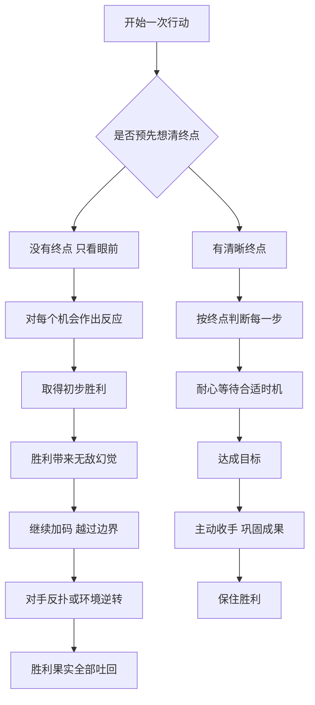

# 23｜为什么要把计划一直想到结局？

> 为什么很多人赢了开局，却输了结局？

---

## 一、先说结论

大多数人做计划，只想到“怎么开始”和“怎么赢下眼前这一步”。格林认为，这恰恰是失败最常见的来源。

他用三条法则组成了一组关于时间的判断：

第 29 条：**周密计划，直到结局。** 结局决定一切，没有想清楚终点的行动，只是在碰运气。
第 35 条：**掌握时机的艺术。** 该等待时耐心等待，该出手时迅速出手，不被别人的节奏裹挟。
第 47 条：**胜利时懂得适可而止。** 胜利最容易让人失去判断，得寸进尺往往把赢来的一切再输回去。

三条合起来，是一句话：**只有先看清终点，才知道何时出手、何时等待、何时收手。** 被胜利冲昏头脑，和被失败吓退一样危险。

---

## 二、我们先理解一个问题

生活中有一种很常见的遗憾：

> 一场争执，你占了上风，却忍不住多说了几句，把原本可以修复的关系彻底弄僵；
> 一个项目，前期推进顺利，却没想过上线之后谁来维护，结果成了烂摊子；
> 一次谈判，对方已经让步，你却继续加码，最后对方干脆掀了桌子。

这些人都不缺能力，也不缺勇气。他们缺的是一种视野：**在开始的时候，就知道自己要停在哪里。**

为什么想清楚结局这么难？为什么人们往往在最顺利的时候犯下最大的错误？

---

## 三、作者到底提出了什么观点？

**第一，结局比过程更重要。** 格林认为，大多数人的计划是模糊的，他们对眼前的机会作出反应，而不是朝一个清晰的终点推进。这样的人一旦遇到意外，就只能临时应付。而真正有权力的人，会把每一步可能的后果、可能的阻碍、可能的反应都想到底，让计划本身具有方向感。

**第二，时机是一种可以培养的能力。** 在第 35 条中，格林讲到了约瑟夫·富歇。历史上，富歇经历了法国大革命、恐怖统治、督政府、拿破仑时代，直到波旁王朝复辟，在一次又一次政权更迭中几乎总能站在最终胜利者的一边，而不少同时代的人物却相继倒台。格林借他说明：富歇的本事不在于忠诚于谁，而在于对时势的敏感——他知道什么时候该潜伏，什么时候该转向，什么时候该出手。**时机感，本质上是对“时间站在谁那边”的判断。**

**第三，胜利是最危险的时刻。** 第 47 条的反面案例中，格林讲到了波斯的居鲁士大帝。根据希罗多德等古代史家的记载，居鲁士在征讨马萨革泰人时先取得了胜利，却没有就此收手，而是继续深入，最终战死，军队溃败。关于这场战役的细节，古代文献本身有不同说法，但它作为“胜利冲昏头脑”的寓言，一直被反复引用。格林的判断是：**胜利会制造一种无敌的幻觉，而幻觉会让人越过本该停下的那条线。**

这三条法则，分别对应一次行动的三个阶段：开始前要想到结局，进行中要看准时机，胜利后要懂得停手。

---

## 四、把这个观点翻译成人话

打个比方。

下棋的新手，每一步都在想“这步能不能吃掉对方一个子”。高手想的是“这盘棋最后要怎么收官”。新手经常在中盘吃了很多子，却在残局里被将死；高手可能中途让掉几个子，却一步步把局面导向自己想要的结局。

**计划到结局，不是预测未来的每一步，而是先确定你想停在哪里。** 有了这个终点，途中的每一个选择才有了标准：这一步是在靠近终点，还是只是贪图眼前的一点好处？

至于“适可而止”，可以理解为：**赢了之后，最重要的问题不再是“还能拿多少”，而是“怎样把已经拿到的保住”。**

---

## 五、为什么会这样？

为什么人们总是赢了开局、输了结局？可以把这个过程画出来：

关键在 **C2 → C3** 这一步：**胜利本身会改变人的判断。**

心理学中有不少研究指出，成功之后，人往往会高估自己的能力，把运气和环境的功劳算到自己头上，于是更愿意冒险。赌场里有一个常见现象：赢了钱的人，比输了钱的人更容易继续下注，因为他们觉得“手气正旺”。

第二个关键在 **D → D1**：**终点提供了一把尺子。** 没有终点的人，每一次“多拿一点”都显得合理；有终点的人，会在达到目标时自然停下，因为继续前进已经不在计划里了。

第三个机制是时间。局势总在变化，今天对你有利的条件，明天可能消失。富歇式的时机感，就是在变化中判断：**现在出手，时间是帮我还是害我？**

---

## 六、举一个现实生活中的例子

下面是一个一般化的描述，在股市里并不少见。

一位散户看好一只股票，买入后运气不错，几个月里涨了百分之五十。

他当初买入时，心里其实有过一个模糊的想法：“涨个三四成就卖。”但真的涨到这里时，他改了主意。论坛里有人说还能翻倍，身边也有朋友说“现在卖太亏了”。他想：“再等等。”

股价又往上冲了一点，他更加确信自己判断正确，甚至又加了仓。

然后市场转向了。股价开始回落，他告诉自己这只是调整；跌回成本价附近时，他想“等涨回来再卖”；再往下跌时，他已经舍不得割肉了。最后，不仅之前的利润全部吐了回去，本金也亏掉了一截。

回头看，这位散户犯的错误，正好对应格林的三条法则：
他没有**计划到结局**——买入时没有明确的止盈和止损标准；
他没有**把握时机**——在情绪最热的时候加仓，在应该离场的时候观望；
他没有**适可而止**——赚了百分之五十之后，被胜利感推着越过了原本的边界。

**真正让他亏钱的，不是判断错了方向，而是没有想好在哪里下车。**

---

## 七、回到书中重新理解

现在回看格林的三条法则，会发现它们共享一个核心：**对自我情绪的控制。**

计划到结局，需要克服眼前诱惑，不被一时的机会带偏；
掌握时机，需要克服焦虑，能够在该等待时忍住不动；
适可而止，需要克服贪婪和骄傲，在最得意的时候停下。

这和格林在序言里反复强调的“掌控情绪”是一致的。在他看来，权力场里最大的敌人往往不是对手，而是自己的急躁、贪心和自满。

富歇和居鲁士，正好构成一组对照。前者的长处，是能在不同阵营之间保持清醒，从不把一时的地位当成永久的保障；后者的失败，则在于把一次胜利当成了继续扩张的理由。**一个懂得时间，一个被胜利蒙住了眼睛。**

---

## 八、这个观点背后还有什么？

**第一，它与战略思想中的“战争目的”相通。** 许多军事思想家都强调，战争必须服务于明确的政治目的；没有目的的胜利，可能反而带来更大的麻烦。格林把这种思维用在了个人和组织的每一次行动上。

**第二，它揭示了“边际递减”的规律。** 胜利之后继续加码，每多得一分收益，要付出的代价和风险往往更大。聪明的人会在收益最大、风险可控的地方停下。

**第三，“适可而止”并不等于“放弃”。** 格林的意思不是赢了就退出，而是赢了之后转入另一种模式：从进攻转向巩固，从扩张转向消化。这与前面讲过的“斩草除根”看似矛盾，其实反映了书中法则的情境性——**有时要彻底，有时要节制，关键看终局的需要。**

**第四，时机感往往来自长期观察。** 富歇式的敏锐不是天生的，而是来自对局势、对人心的长期积累。没有这种积累，所谓“等待时机”很容易变成“错过时机”。

---

## 九、这个观点有问题吗？

**说服力在哪？** 这组法则击中了一个普遍的人性弱点：人们很少为“结局”做计划，更少为“胜利之后”做计划。无论是投资、谈判、创业还是人际冲突，“不懂收手”的教训都随处可见。

**争议在哪？** 首先，现实中的“结局”往往无法完全预见。复杂系统中充满不确定性，把计划“一直想到结局”在很多情况下只是理想。过度执着于预设的终点，反而可能让人错过意料之外的机会。

其次，“适可而止”的标准很难确定。什么时候算“够了”？事后看起来很清楚，事中却常常模糊。那位散户如果在百分之五十时卖掉，而股票后来又翻了几倍，他同样会后悔。

**哪里过度简化？** 富歇的例子常被当作“时机大师”的范本，但他的生存也依赖于大量的情报网络、权谋手段乃至运气。把这一切归结为“时机感”，是一种叙事上的简化。居鲁士之死，古代文献也有不同版本，未必能单纯归结为“不懂收手”。

**有何其他解释？** 一些管理学者更强调“适应性计划”：先设定方向和底线，再根据反馈不断调整路线，而不是一次性规划到底。按照这种思路，格林的“计划到结局”，更适合理解为“先想清楚你要什么、不要什么”，而不是“把每一步都写死”。

---

## 十、今天再看这个观点

以下部分是基于格林思想的现代延伸，不是他在书中的原话。

在今天，“想清楚结局”有一个很实用的形式：**提前写下退出条件。**

投资者在买入前写下止盈和止损点；创业者在融资前想好公司最终要走向上市、被并购还是长期经营；职场人在接受一个新岗位前，想好几年后希望自己处在什么位置。这些都不是精确的预测，而是一把尺子：当情绪把人往某个方向推的时候，尺子能把人拉回来。

另一个现代延伸，是对“胜利陷阱”的警惕。企业在高速增长期最容易盲目扩张，个人在顺风时期最容易高估自己。很多失败，恰恰起源于最成功的那一段时间。

所以，格林的这组法则放在今天，或许可以翻译为：**在情绪最高涨的时候，最需要回到事先定好的规则。**

---

## 十一、这一篇真正应该记住什么？

1. **结局决定一切。** 没有终点的行动，每一步都可能被眼前的诱惑带偏。
2. **时机是对“时间站在谁那边”的判断。** 该等时要忍住，该动时要果断。
3. **胜利是最危险的时刻。** 成功会制造无敌的幻觉，让人越过本该停下的边界。
4. **适可而止不是放弃，而是转入巩固。** 赢了之后，首要问题是保住已经拿到的东西。
5. **提前定好退出条件。** 用事先的规则，对抗事中的情绪。

---

## 十二、留一个问题

> 你现在正在推进的某件事，
> 如果今天就要写下“做到什么程度就停下”，
> 你能写得出来吗？

---

想清楚终点，懂得在胜利时收手，讲的都是在占据优势时如何自处。可人生中还有另一种局面：你明显处于下风，对手更强，正面硬拼只会输得更惨。

这时候，格林给出的建议出人意料——不是咬牙坚持，而是主动低头。下一篇我们来看：**为什么示弱有时是最强的反击？**
