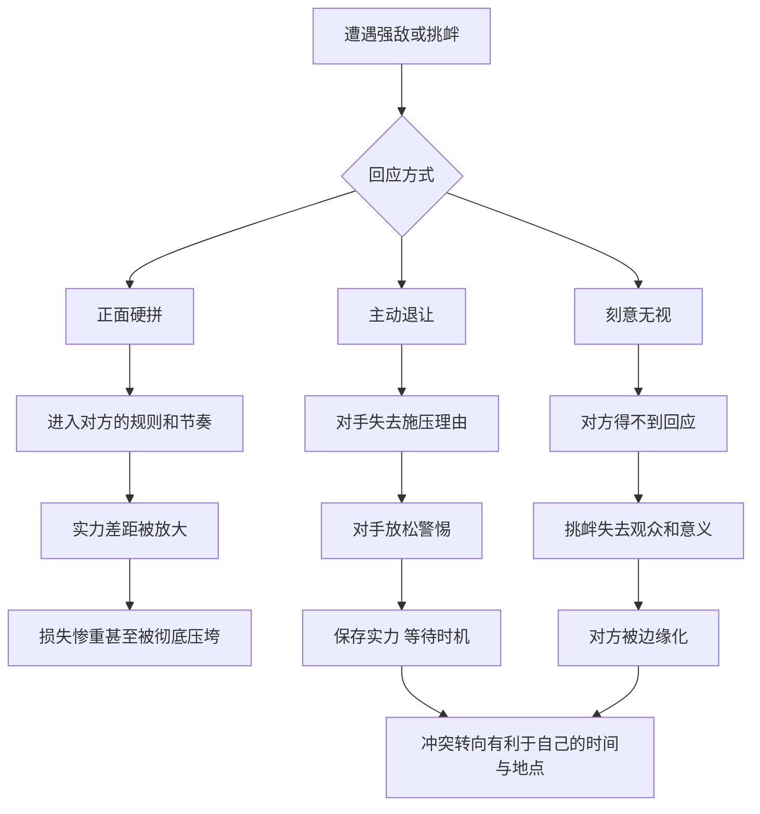

# 24｜为什么示弱有时是最强的反击？

> 为什么投降和无视，有时比正面对抗更有力？

---

## 一、先说结论

面对比自己强的对手，或者面对一场无谓的攻击，大多数人的本能反应是：顶回去。

格林却认为，很多时候，**正面对抗恰恰是弱者最糟糕的选择。** 他用两条法则提出了另一种思路：

第 22 条：**运用投降策略，化弱为强。** 当你处于弱势时，不要为了面子硬拼，而要主动退让，保存实力，让对手放松警惕，等待局势变化。
第 36 条：**蔑视你得不到的东西，无视是最好的报复。** 对小麻烦、小挑衅过度回应，只会放大它、抬高对方；最有力的回应往往是视而不见。

两条合在一起，是一个冷静的判断：**退让不是软弱，而是把冲突转移到对自己更有利的时间和地点。**

---

## 二、我们先理解一个问题

我们的文化里，“宁折不弯”常常被当作美德。一个人被逼到墙角还不低头，会被称赞有骨气；一个人选择退让，常被看作懦弱。

但换个角度想：

> 一只猫被逼到角落，拱起背、竖起毛，它看起来很勇敢，可它真的能赢吗？
> 一个人被人当众挑衅，立刻针锋相对，旁观者记住的是谁？
> 一场注定打不赢的仗，坚持到最后，除了失去一切，还剩下什么？

问题是：**在什么情况下，低头和沉默，反而比抗争更能保护自己、甚至反击对方？**

---

## 三、作者到底提出了什么观点？

**第一，弱者硬拼，只会加速失败。** 格林认为，当你明显处于弱势时，与强者正面冲突，等于把自己交给对方的规则。对方有更多资源、更大声量，你越抵抗，他越有理由彻底压垮你。

**第二，投降可以是一种主动的战术。** 格林在第 22 条中讲到了剧作家贝托尔特·布莱希特。1947 年，美国众议院非美活动调查委员会就所谓共产主义渗透好莱坞一事展开调查，布莱希特被传唤出席听证。与一些拒绝作证、公开对抗委员会并因此付出沉重代价的人不同，布莱希特表面上彬彬有礼、积极配合，回答问题时却绕来绕去、模棱两可，让委员们抓不到把柄，甚至对他颇为客气。听证结束后不久，他便离开美国，返回欧洲。**他用“配合”的外表，换来了全身而退。**

作为对照，格林在这一条里还讲了一个反面故事，出自修昔底德的《伯罗奔尼撒战争史》：雅典要求中立的米洛斯岛臣服，米洛斯人拒绝屈服，寄望于正义与外援，结果城破之后，成年男子被杀，妇孺被卖为奴隶。格林用这个故事说明：在实力悬殊时，坚持“原则”却没有任何筹码，可能换来的是毁灭——拒绝投降有时不是勇敢，而是把最后的主动权也交了出去。

**第三，无视本身是一种回应。** 第 36 条认为，人们总想纠正每一个错误、反击每一次冒犯，但过度的回应会让小事变成大事，让无足轻重的人获得关注。格林的建议是：**对于你无法改变、或不值得在意的东西，最好的态度是表现得毫不在意。** 你一旦认真回应，就承认了对方有影响你的能力。

---

## 四、把这个观点翻译成人话

打个比方。

一根竹子和一棵老树同时面对一场暴风。老树硬挺着，最后被连根拔起；竹子被吹弯到几乎贴地，风停后又直了起来。

**投降策略，就是做那根竹子。** 它不是放弃，而是在风最大的时候不和风较劲，保住根，等风过去。

至于“无视”，可以想象一个人在街上被陌生人骂了一句。他如果停下来争吵，就等于邀请更多人围观，把一件三秒钟的事变成三十分钟的闹剧；他如果继续往前走，这件事在他身后就结束了。

**你给一件事多少注意力，它就在你的生活里占多大的位置。**

---

## 五、为什么会这样？

示弱和无视为什么能起到反击的效果？可以用下面这张图拆开：

关键在 **C → C1**：**正面冲突，往往意味着接受对方设定的战场。**

强者之所以强，是因为他在某个规则下占据优势。你硬顶上去，就是在他最擅长的地方和他交手。退让则改变了局面：对方的力量打在空处，他原本准备好的攻势失去了目标。

第二个关键在 **E → E1**：**很多攻击本身就是在索取回应。** 挑衅者需要你的愤怒、你的解释、你的反击，这些都是他的“燃料”。你一旦拒绝提供，他的表演就难以为继。

第三个机制是心理上的：人们对一个已经服软的对手，往往会降低戒备，甚至生出轻视。**而轻视，正是弱者翻盘最好的掩护。**

---

## 六、举一个现实生活中的例子

一位普通博主，平时在网上分享读书笔记和生活随感，粉丝不多，但很稳定。

某天，她的一篇文章被几个账号盯上了。他们开始在每一条动态下留言，冷嘲热讽，断章取义，甚至编造她的“黑历史”。最初几天，她很难受，写了长长的澄清，一条一条回复。结果情况更糟：她每回复一次，对方就截图转发一次，围观的人越来越多，争吵愈演愈烈，她的正常内容反而没人看了。

后来，她换了一种做法：**不回应，不拉黑，照常更新。**

她不再解释，也不删评论，只是按原来的节奏发自己的内容。评论区里那些攻击还在，但没有了她的回应，就只剩下几个人的自说自话。老读者开始在下面讨论她的新文章，攻击的留言被自然地淹没。几周之后，那几个账号渐渐不再出现——**没有对手的表演，是撑不下去的。**

这里有两个细节值得注意：
她没有拉黑，因为拉黑本身也是一种“你伤到我了”的信号，还可能被对方拿来继续做文章；
她照常更新，因为她要守住的，是自己真正的阵地——内容和读者，而不是和喷子的口舌之争。

当然，这种做法有边界。如果攻击升级为造谣诽谤、人身威胁，就不再是“无视”能解决的问题，而需要借助平台规则乃至法律。**无视适用于噪音，不适用于真正的伤害。**

---

## 七、回到书中重新理解

回到书中，会发现格林讲的“投降”和“无视”，都带着一个隐藏的前提：**你要守住的东西，比一时的面子更重要。**

布莱希特在听证会上低调配合，并不是真的认同委员会，而是他清楚：和委员会正面冲突，会让他付出实实在在的代价；而他真正的战场，是他的戏剧和创作。所以他选择在一个自己不看重的战场上退让，保住了在另一个战场上继续战斗的能力。

第 36 条的“无视”也是同样的逻辑。格林提醒，过度在意某样东西，会让人显得软弱和渴求；刻意的不在意，则把对方的力量悄悄抽空。

需要注意的是，格林的“投降”从来不是真心的臣服。他明确把它描述为一种策略：外表顺从，内心保持独立，暗中积蓄力量，等待时机。**这是一种有意识的表演，而不是精神上的认输。**

---

## 八、这个观点背后还有什么？

**第一，它与东方传统中的“以柔克刚”相通。** 老子讲“天下莫柔弱于水，而攻坚强者莫之能胜”，太极讲借力打力。格林未必直接取法于此，但思路非常接近：不与强力正面相抗，而是让对方的力量落空。

**第二，它涉及对“战场”的重新选择。** 退让不是退出竞争，而是拒绝在对方选定的时间、地点、规则下竞争。这与前面讲过的“主动权”一脉相承：谁选择战场，谁就掌握了一半的胜算。

**第三，“无视”背后是一种注意力经济。** 注意力是一种资源，给谁、给多少，本身就是权力的分配。把注意力从攻击者身上撤走，就是剥夺他最想要的东西。

**第四，它要求极强的情绪控制。** 被攻击时保持沉默，被压制时主动退让，都违背人的本能。能做到这一点的人，往往比那些立刻反击的人更有力量。

---

## 九、这个观点有问题吗？

**说服力在哪？** 这两条法则指出了一个常被忽视的真相：硬拼并不总是勇敢，有时只是冲动；沉默并不总是软弱，有时是清醒的选择。很多冲突中，先冷静下来、不被情绪牵着走的人，最终处境更好。

**争议在哪？** 首先，“投降策略”可能被滥用为逃避责任的借口。有些时候，退让意味着放弃原则，默许不公。历史上不少改变世界的时刻，恰恰来自那些拒绝低头的人。其次，无视并不总是有效。对于系统性的压迫或持续升级的伤害，一味无视只会让问题恶化。

**哪里过度简化？** 布莱希特能全身而退，与他的外国人身份、离开美国的可能性等条件密切相关。那些拒绝配合的人付出了代价，但他们的坚持也在后来被许多人视为一种道义上的抵抗。把前者看成“聪明”、后者看成“愚蠢”，忽略了人们在同一处境下对价值的不同排序。米洛斯人的选择，同样可以被理解为对尊严与自由的坚持，而不只是计算上的失误。

**有何其他解释？** 一些冲突研究者会区分“策略性退让”和“原则性让步”：前者是为了保存实力、换取时间，后者则是在核心价值上的放弃。按照这种区分，格林的建议更适用于前者，而在后者上，每个人都需要自己划一条线。

---

## 十、今天再看这个观点

以下部分是基于格林思想的现代延伸，不是他在书中的原话。

在今天的网络环境里，“无视”几乎成了一项必备技能。

算法倾向于推荐冲突和情绪，争吵越激烈，传播越广。一个人一旦被卷入网络骂战，很容易发现：自己越解释，越说不清；越反击，越被放大。在这样的环境里，**不喂养冲突，本身就是一种自我保护。**

“投降策略”在职场上也有现代版本。面对一个明显更强势、却暂时无法改变的局面，与其当众顶撞，不如先接受安排、保留记录、积累能力和盟友，等待更合适的时机和渠道。这不是认怂，而是把力量留给真正重要的时刻。

但同样重要的是另一面：知道什么时候**不能**退。如果退让触及了自己的底线，或者会让别人为你的沉默承担代价，那么再“聪明”的策略，也未必值得。

---

## 十一、这一篇真正应该记住什么？

1. **弱者正面硬拼，往往是在对方的规则下作战。** 实力差距只会被放大。
2. **投降可以是一种主动策略。** 外表退让、内心独立，保存实力、等待时机。
3. **无视是对注意力的收回。** 很多挑衅本身就在索取回应，拒绝提供，它就失去了燃料。
4. **退让的前提是分清轻重。** 守住真正重要的阵地，比守住一时的面子更要紧。
5. **无视适用于噪音，不适用于真正的伤害。** 策略性退让与放弃原则，是两回事。

---

## 十二、留一个问题

> 最近一次让你忍不住想反击的事情，
> 如果你选择了不回应，
> 它在一个月后还会那么重要吗？

---

示弱与无视，讲的是在对抗中如何以退为进。可当一个人终于站到了有能力改变局面的位置上，新的难题又出现了：他想推倒旧秩序，却发现最强烈的反对，来自那些本该受益的人。

原来改变本身，也需要一种“示弱”的智慧。下一篇我们来看：**为什么变革要披上传统的外衣？**
