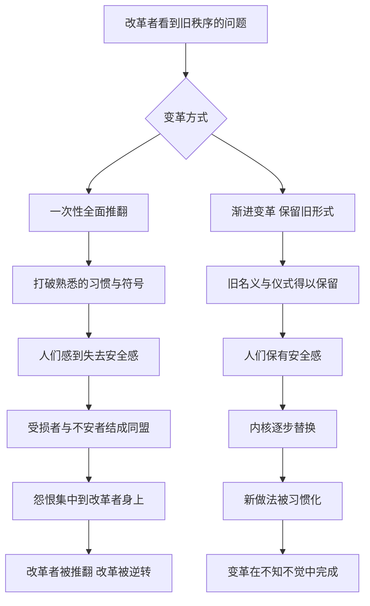

# 25｜为什么变革要披上传统的外衣？

> 为什么急于推翻一切的改革者，往往先被推翻？

---

## 一、先说结论

几乎每一个上任的新领导、每一个有抱负的改革者，都会面对同一个诱惑：旧的东西问题太多，干脆全部推倒重来。

格林认为，这是一条通往失败的捷径。他在两条法则中给出了警告：

第 45 条：**宣扬变革的必要，但不要一次改革太多。** 人们在理性上也许认同改变，但在情感上本能地依恋熟悉的形式；激进的变革会激起反扑，改革者本人往往首当其冲。
第 43 条：**攻心为上。** 强迫只能换来表面的服从和暗中的抵抗，真正持久的权力，来自赢得人心。

两条合在一起，是一个听起来有些“狡猾”的建议：**聪明的变革者会保留旧的名义、仪式和符号，悄悄换掉内核。** 让人们觉得世界还是原来的样子，其实它已经变了。

---

## 二、我们先理解一个问题

想一想你所在的环境里，有没有这样的经历：

> 一个新规定明明更合理，大家却抱怨连连，甚至怀念起那个“有问题”的旧规定；
> 一个新领导很有想法，上来就大刀阔斧，结果不到一年就灰头土脸地离开；
> 一次改版明明功能更强，用户却纷纷喊“还我旧版”。

奇怪的地方在于：人们反对的，常常不是变革的内容，而是**变革的方式和速度**。

为什么正确的改变也会遭到抵抗？一个人要推动改变，究竟该先改“事”，还是先得“人”？

---

## 三、作者到底提出了什么观点？

**第一，人对熟悉事物的依恋，远比想象的深。** 格林认为，习惯、仪式、制度这些看似表面的形式，承载着人们的安全感和身份认同。你改变的不只是一种做法，而是别人赖以理解世界的方式。哪怕新方案在理性上更好，人们在情感上也会觉得被冒犯、被剥夺。

**第二，激进改革者往往成为反扑的靶子。** 在第 45 条中，格林讲到了托马斯·克伦威尔。历史上，克伦威尔是英王亨利八世的重臣，主导了英格兰与罗马教廷的决裂，并大规模推行宗教改革、解散修道院，把大量教会财产收归王室。这些变革来得太快太猛，触动了贵族、教士和普通百姓的利益与信仰，引发了广泛的不满，其中包括大规模的民间叛乱。后来，在一系列政治失误和宫廷斗争之后，克伦威尔失去国王的信任，被以叛国等罪名处死。格林借他说明：**一个人把太多的改变压缩在太短的时间里，最终会把所有的怨恨都集中到自己身上。**

**第三，失去人心的权力终将崩塌。** 第 43 条的反面案例中，格林讲到了玛丽·安托瓦内特。在许多历史叙事中，这位法国王后被描绘为奢华、疏离、不了解民间疾苦的形象，逐渐成为民众怨恨的焦点。关于她的许多传闻后来被证明是夸大甚至虚构的，但这恰恰说明：**人心一旦失去，连谣言都会被当作真相。** 格林的判断是：统治者可以靠强制获得一时的服从，但无法靠强制获得忠诚。

所以，这两条法则说的是同一件事：**变革的成败，最终取决于人们是否愿意接受它。**

---

## 四、把这个观点翻译成人话

打个比方。

一家老字号餐馆换了新老板。新老板觉得菜单陈旧、装修老土，想要全部翻新。

一种做法是：关店三个月，重新装修，换掉所有菜品，连招牌都换成时髦的新名字。结果老顾客走进来，发现一切都陌生了，扭头就走；新顾客又不知道这家店有什么特别。

另一种做法是：招牌不换，门口那张老照片留着，几道招牌菜的名字和摆盘都保持原样，只是悄悄改进了食材和工艺；新菜一道一道加进菜单，装修分几次慢慢更新。几年之后，这家店已经焕然一新，老顾客却觉得“还是那个味道”。

**“旧瓶装新酒”，不是怕改变，而是让改变能被人接受。** 人们需要一些熟悉的东西作为扶手，才敢跨过那道门槛。

---

## 五、为什么会这样？

为什么急于推翻一切的改革者，往往先被推翻？可以用下面这张图来理解：

关键在 **C1 → C2**：**形式本身就是一种心理依靠。**

心理学中有一个常被提到的现象：人们对失去的感受，往往比对同等收益的感受更强烈。变革一旦让人觉得“失去了什么”，哪怕同时“得到了更多”，抵触情绪也会压过认同。

第二个关键在 **C3**：**激进变革会同时制造太多敌人。** 每一项改革都会触动一部分人的利益，改革得越多，被触动的人就越多。原本互不相干的群体，会因为共同的不满而联合起来。

第三个关键在 **D3 → D4**：**时间是变革最好的盟友。** 一个新做法被人习惯了，它就成了新的“传统”。渐进的变革，本质上是给人们留出适应的时间，让新东西慢慢变成旧东西。

---

## 六、举一个现实生活中的例子

一所中学来了一位新校长。

他很有教育理想，看到学校里不少做法已经过时：作息时间安排不合理，一些社团形同虚设，评优办法论资排辈、缺乏激励。上任第一个学期，他就宣布了一揽子改革：作息全面调整，原有社团全部撤销、重新申报，评优办法推倒重来，改为一套全新的量化考核。

他的每一项改革，单独看都有道理。但结果是一场集体反弹：

老教师们觉得，自己多年的经验和付出被一笔抹掉了；
家长们发现，孩子的接送时间全乱了，却没有人提前征求过意见；
社团指导老师失去了经营多年的项目，学生也失去了熟悉的活动；
新的评优办法还没有被理解，就已经被议论为“不公平”。

原本对学校现状也有不满的人，此刻反而站到了一起，开始怀念“以前挺好的”。不到一年，改革大部分被搁置，校长的威信也大受影响。

如果换一种做法呢？他也许可以先从大家普遍认可的问题入手，比如只调整一处明显不合理的作息；保留原有社团的名字和传统，引入新的活动形式；评优办法先在原有框架中加入一些新指标，而不是完全重写。**同样的目标，用更长的时间、更多的熟悉感去实现，阻力可能会小得多。**

---

## 七、回到书中重新理解

回到书中，会发现格林在这两条法则中，其实都在谈一个核心问题：**权力的合法性来自哪里？**

在格林看来，人们接受一种秩序，很多时候不是因为它合理，而是因为它熟悉、因为它看起来“一直如此”。传统之所以有力量，正在于它给人一种延续感和确定性。一个聪明的变革者，不会去正面挑战这种感受，而是借用它：用旧的语言包装新的内容，用旧的仪式承载新的秩序。

克伦威尔的教训，在于他太想一次性完成太多事，把所有的反对者都推到了自己的对立面。玛丽·安托瓦内特的教训，则在于她与民众之间失去了情感上的连接，以至于无论她做什么，都会被往最坏处解读。**一个败在“改得太急”，一个败在“失了人心”，而这两者，往往互为因果。**

这也和前面谈过的“示弱”形成了呼应：变革者不必在每一个细节上都显得强势，有时让一步、保留一点旧的东西，恰恰是为了走得更远。

---

## 八、这个观点背后还有什么？

**第一，它与保守主义政治思想有相通之处。** 一些思想家主张，社会制度是长期演化的结果，承载着许多我们未必意识到的经验，贸然推倒可能带来意想不到的后果。格林的第 45 条虽然出发点是权术，却与这种对渐进改良的偏好相呼应。

**第二，它揭示了“符号”的力量。** 名称、仪式、标志这些看似无关紧要的东西，往往比实质内容更能牵动人的情绪。保留符号，就是保留人们的情感依托。

**第三，“攻心为上”是一种成本最低的治理。** 靠强制维持的秩序，需要持续投入监督和惩罚；靠人心维持的秩序，则会由人们自觉维护。这也是格林把赢得人心视为权力高级形态的原因。

**第四，它提醒我们区分“变革的必要性”和“变革的方式”。** 格林并不反对变革，他甚至主张要大力宣扬变革的必要。他反对的，是忽视人性的变革方式。

---

## 九、这个观点有问题吗？

**说服力在哪？** 从组织变革到社会改革，无数经验都表明，忽视人的情感和习惯，再正确的改革也可能失败。格林把这一点讲得非常透彻，对于任何一个想推动改变的人，都是一记清醒剂。

**争议在哪？** 首先，“旧瓶装新酒”可能被理解为一种欺骗：让人们以为没有改变，实际上却在暗中改变一切。这在伦理上存在疑问，尤其当变革涉及公众利益时，透明和参与本身就应该是变革的一部分。其次，渐进变革并不总是可行。在危机时刻，缓慢的改良可能来不及，某些根深蒂固的问题也需要更彻底的变革。

**哪里过度简化？** 克伦威尔的倒台，与亨利八世多变的性格、宫廷派系的斗争、一次失败的王室联姻等因素都有关，不能单纯归结为“改革太多”。玛丽·安托瓦内特的命运，也深嵌在法国财政危机和整个大革命的宏大背景之中，她个人的形象只是其中一环。把复杂的历史压缩成一条法则，难免失真。

**有何其他解释？** 许多组织变革研究者强调“参与”：让受影响的人参与到变革的设计中，比隐藏变革更能减少阻力。按照这种思路，与其让人们“不知不觉”，不如让人们“知情且参与”。这与格林的思路有交集——都重视人心，但路径不同：一个靠包装，一个靠共建。

---

## 十、今天再看这个观点

以下部分是基于格林思想的现代延伸，不是他在书中的原话。

在今天的企业和产品世界里，这条法则有很多现实的影子。

很多成功的产品改版，都遵循着“保留熟悉入口，逐步替换功能”的思路：图标和主要布局不变，底层逻辑慢慢升级；新功能先作为可选项推出，等用户习惯后再成为默认。那些一夜之间彻底改头换面的改版，则常常引起用户强烈不满，最后不得不部分回退。

在组织管理中，新任管理者也越来越被建议先“倾听”再“改变”：先花时间理解现有做法背后的原因，先在小范围试点，先争取关键人物的支持，然后再推动更大的调整。

但也需要保留一份警惕：当“披上传统外衣”变成刻意隐瞒，当“攻心”变成情绪操纵，这种技巧就可能滑向另一面。**真正可持续的变革，既要尊重人心，也要尊重人们知情的权利。**

---

## 十一、这一篇真正应该记住什么？

1. **人们反对的常常不是变革本身，而是变革的速度和方式。** 熟悉的形式承载着安全感。
2. **激进改革会同时制造太多敌人。** 改革者往往成为所有不满的集中靶子。
3. **保留旧的名义，替换新的内核。** 让变革在熟悉感中被接受。
4. **强制换来服从，人心换来忠诚。** 失去人心的权力，连谣言都能击倒它。
5. **包装之外，还有参与。** 让人知情并参与，是另一条减少阻力的路。

---

## 十二、留一个问题

> 如果你要改变身边一件你认为不合理的事，
> 哪些“旧东西”值得先保留下来，
> 好让别人愿意跟你走完这段路？

---

从大胆出击到谋定终局，从示弱退让到渐进变革，我们看到格林的法则一次次在“进”与“退”、“刚”与“柔”之间切换。那么，有没有一条法则能把这些看似矛盾的建议统一起来？

格林把答案放在了全书的最后。下一篇我们来看这条终极法则——**为什么“无形”是权力的最高形态？**
