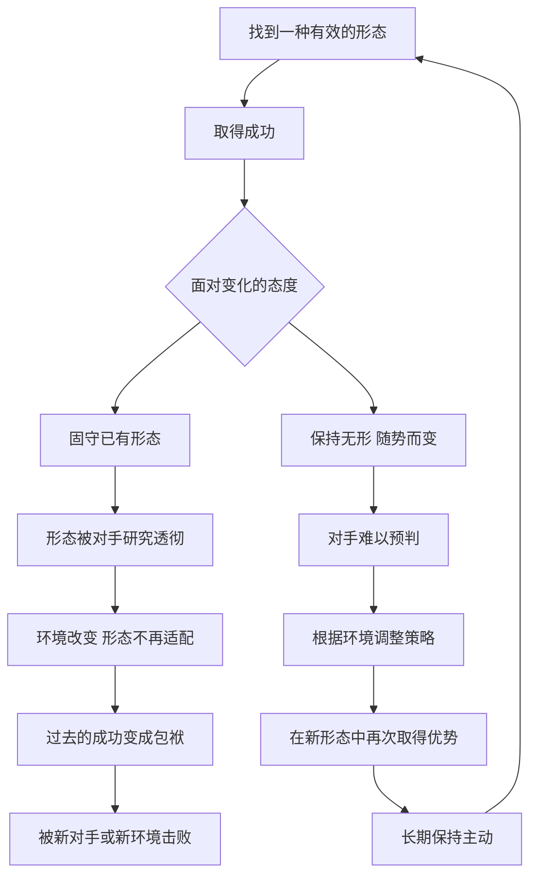

# 26｜为什么“无形”是权力的最高形态？

> 为什么格林把“以无形示人”放在最后一条？

---

## 一、先说结论

读到这里，很多读者会有一种困惑：格林的法则彼此矛盾。他一会儿说要大胆出击，一会儿说要示弱退让；一会儿说要保持神秘，一会儿又说要吸引注意；一会儿说要斩草除根，一会儿又说要适可而止。

第 48 条“以无形示人”，就是格林给这种矛盾的回答。

他认为，**任何固定的形态，都会被对手研究、预判和攻击。** 一个人、一个组织，一旦形成了固定的套路，就等于把自己的弱点公开了。而像水一样随势而变、没有固定形状的人，最难被击败。

所以，这条法则不是第 48 条技巧，而是前 47 条的总纲：**所有法则都只是“形”，真正的能力，是知道在什么时候用哪一种“形”，又在什么时候把它放下。** 这也是每条法则都附带“反转”的最终意义。

---

## 二、我们先理解一个问题

我们通常认为，成功来自坚持：找到一套有效的方法，然后反复做、做到极致。

但生活中也有很多相反的例子：

> 一位拳手靠一记重拳横扫对手，直到有人研究透了他的出拳习惯；
> 一家公司靠一款产品称霸市场，却在技术浪潮到来时被甩在身后；
> 一个人靠某种性格在职场如鱼得水，换了环境之后却处处碰壁。

它们的共同点是：**曾经让他们成功的那种“形”，最后变成了困住他们的笼子。**

问题是：坚持与变化，究竟哪一个才是长期的力量？一个人如果没有固定的“形”，他又靠什么立足？

---

## 三、作者到底提出了什么观点？

**第一，固定的形态会变成靶子。** 格林认为，权力场里的竞争，本质上是对彼此的研究。你越稳定、越可预测，对手就越容易找到应对你的办法。那些曾经所向披靡的强者，往往在形成固定模式之后，被后来者逐一破解。

**第二，历史上反复出现“僵硬败于灵活”的故事。** 格林在这条法则中，把斯巴达和雅典作了对比。历史上，斯巴达以严密的军事制度和封闭的社会结构著称，它的陆军强大，却相对抗拒变化和外部交流；雅典则更开放，善于航海、商业和变通。格林借此说明：一种强大的形态，若不能随环境调整，终会成为负担——在他的叙述中，斯巴达赢得了与雅典的战争，却在此后难以适应新的局面，逐渐走向衰落。关于这段历史的因果，历史学界有更复杂的解释，但格林看重的是其中的寓意。

**第三，无形的最高境界是“水”。** 格林在这一条中大量借用了东方兵法的思想。《孙子兵法·虚实篇》说：“夫兵形象水，水之形避高而趋下，兵之形避实而击虚；水因地而制流，兵因敌而制胜。故兵无常势，水无常形。”水没有固定的形状，却能适应任何容器，能绕过障碍，也能滴穿石头。

历史上，毛泽东在游击战思想中提出的“敌进我退，敌驻我扰，敌疲我打，敌退我追”，也常被视为这种思想的现代实践：不与强敌在对方选定的阵地上硬拼，而是保持机动、不断变化，让对手找不到可以集中打击的目标。格林在讨论这一条时也涉及了这类游击战思想。

**格林的结论是：真正的强大，不是拥有一个无懈可击的形态，而是拥有随时改变形态的能力。**

---

## 四、把这个观点翻译成人话

打个比方。

一个人用石头搭房子，房子非常坚固，风吹不倒、雨打不透。但有一天地震来了，墙体越坚硬，裂得越彻底。

另一个人搭的是帐篷。它看起来不结实，却可以随时拆掉、换个地方重新搭起来。地震来了，他收起帐篷就走。

**“无形”，就是不把自己的全部安全感押在一种形态上。** 它不是没有原则、没有能力，而是不被自己过去的成功绑住手脚。

再换个说法：前面那些法则，就像工具箱里的一件件工具。新手总想找到一把“万能钥匙”，一种方法用到底；高手则清楚，每件工具都有它的用途和边界，**真正的本事，是看清眼前的问题，然后选对工具。**

---

## 五、为什么会这样？

为什么固定的形态会被击败，而无形的人能长期立足？可以用下面这张图来理解：

关键在 **B → C**：**成功本身会制造惯性。**

一种方法成功了，人们就会自然地重复它，组织会围绕它建立流程、分配资源、培养人才，个人会把它当作自我认同的一部分。时间越长，这种形态就越难改变。**最难放弃的，往往不是失败的东西，而是曾经成功的东西。**

第二个关键在 **D1 → D2**：**外部世界在变，对手在学习。** 任何形态的优势，都建立在特定的环境和对手之上。环境一变，优势就可能消失；对手一旦研究透你，你的强项就变成了可被利用的规律。

第三个关键是 **E4 → A** 这个回路：**无形不是一次性的变化，而是一个不断循环的过程。** 找到形态、使用形态、放下形态、再找到新的形态——这才是水的状态。

---

## 六、举一个现实生活中的例子

柯达公司，是商业史上被反复讨论的一个案例。

在二十世纪的大部分时间里，柯达几乎就是“胶片”和“拍照”的代名词。它建立了从胶片、相纸到冲印服务的完整体系，这套商业模式为它带来了长期的巨大成功。

耐人寻味的是，数码相机的早期原型，正是柯达自己的工程师在上世纪七十年代研制出来的。也就是说，柯达比许多竞争者更早看到了这项技术的可能性。

但在很长一段时间里，公司没有全力推动这个方向。一个常见的解释是：数码技术会冲击它赖以生存的胶片业务——如果照片不再需要胶片和冲印，那么柯达最赚钱的那部分生意就会被自己亲手摧毁。于是，它更倾向于保护已有的模式，在数码领域的投入显得犹豫而分散。

后来的故事众所周知：数码相机迅速普及，接着智能手机把拍照变成了人人随手可做的事，胶片市场急剧萎缩。柯达在转型中步履维艰，最终在 2012 年申请破产保护。

**柯达不是没有看到变化，而是被自己最成功的那个“形”困住了。** 胶片模式曾经是它的护城河，后来却成了它的围墙。

当然，商业学者对柯达衰落的原因有不同解读：有人强调管理层的判断失误，有人强调数码产业利润结构的根本不同，还有人指出柯达其实做过不少转型尝试，只是时机和方向不够理想。但无论哪一种解释，都指向同一个教训：**当环境在变，固守曾经的成功，是最危险的选择。**

---

## 七、回到书中重新理解

回到书中，第 48 条之所以放在最后，是有深意的。

格林在前 47 条中，一次次给出看似明确的建议，又一次次在“反转”中告诉读者：这条法则在某些情况下会失效，甚至要反过来用。前面我们说过，这种结构训练的是一种情境判断。第 48 条则把这种判断提升到了最高的层面：**不要把任何一条法则当作你的“形”。**

一个人如果只会“大胆”，他就会被人利用冲动；如果只会“示弱”，他就会被人当作软弱；如果只会“神秘”，他就会被人遗忘；如果只会“强硬”，他就会激起联合的反抗。**每一种形态都有它的反面，只有不被任何一种形态固定的人，才能在它们之间自由切换。**

格林也提醒，“无形”并不意味着没有核心。水无常形，但水始终是水。一个无形的人，外在的策略可以不断变化，内在的判断力、对局势的观察和对目标的清醒，却必须始终如一。**变的是手段，不变的是眼光。**

---

## 八、这个观点背后还有什么？

**第一，它深受道家和兵家思想的影响。** 老子以水喻道，孙子以水喻兵，都强调顺势而为、以柔克刚。格林把这些东方智慧与西方的历史案例结合起来，形成了自己的“无形”概念。

**第二，它与生物进化中的“适应”思想相通。** 在变化的环境中，生存下来的往往不是最强大的物种，而是最能适应变化的物种。这句话常被误传为达尔文的原话，但它确实概括了进化论中的一个重要思路。

**第三，它是对“身份固化”的警告。** 人们容易把某种成功的方式当作“我就是这样的人”。一旦这种身份认同形成，改变就变成了对自我的否定，因此格外困难。无形，意味着不让任何一种角色定义你的全部。

**第四，它也是对全书的自我解构。** 如果连 48 条法则都只是“形”，那么读者真正要带走的，就不是这些法则本身，而是运用和超越它们的能力。

---

## 九、这个观点有问题吗？

**说服力在哪？** 在一个变化越来越快的世界里，“适应能力比固定优势更重要”几乎成了共识。无论是个人职业、企业经营还是国家竞争，都有大量因为固守旧模式而失败的例子。格林用“无形”把这一点凝练得非常有力量。

**争议在哪？** 首先，“无形”很容易滑向“没有立场”。一个人如果永远随势而变，别人就无法信任他，因为不知道他明天会站在哪里。在需要长期合作和稳定承诺的关系中，可预测性恰恰是一种美德。其次，过度追求灵活，可能导致什么都做不深。前面讲过“集中”的力量，而集中本身就需要一定程度的“固定”。

**哪里过度简化？** 斯巴达与雅典的对比，在历史学上远比“僵硬与灵活”复杂：斯巴达的衰落涉及人口、制度、外部战争等多重因素，雅典的开放也伴随着剧烈的内部动荡和战略失误。柯达的故事也不能简单归结为“固守”，它同时涉及技术周期、产业利润结构和管理决策等诸多因素。

**有何其他解释？** 一些管理学者提出“双元能力”的概念：成功的组织需要同时具备“深耕现有业务”和“探索新方向”的能力，而不是简单地选择稳定或变化。按照这个思路，“无形”不是抛弃所有的形，而是在守住一部分形的同时，保留变形的能力。

---

## 十、今天再看这个观点

以下部分是基于格林思想的现代延伸，不是他在书中的原话。

在今天，“无形”或许是最贴近时代的一条法则。

技术周期越来越短，一个行业从兴起到被颠覆，可能只需要十几年甚至更短；一项职业技能的价值，也可能在几年内大幅贬值。在这样的环境里，**把全部身份押在一种能力、一个平台、一种模式上，是一件越来越冒险的事。**

对个人来说，“无形”的现代版本，可能是持续学习的能力、跨领域迁移的能力、以及在变化中重新定义自己的勇气。对组织来说，它意味着在成功的时候就开始为下一次变化做准备，甚至愿意主动“颠覆自己”。

但无形也需要一个“锚”。没有核心价值和长期目标，灵活就会变成随波逐流。**真正的无形，是价值观稳定、策略灵活；方向清楚、路径多变。**

---

## 十一、这一篇真正应该记住什么？

1. **任何固定的形态都会被研究和破解。** 可预测，就意味着可被攻击。
2. **最难放弃的，是曾经成功的东西。** 过去的优势，可能变成今天的包袱。
3. **“无形”是前 47 条的总纲。** 所有法则都只是形，真正的能力是在它们之间自由切换。
4. **变的是手段，不变的是眼光。** 无形不是没有核心，而是不被外在形态绑住。
5. **灵活需要一个锚。** 没有稳定的价值与目标，无形就会变成无立场。

---

## 十二、留一个问题

> 你身上有没有一种曾经让你成功的方式，
> 如今已经悄悄变成了你的限制？
> 如果要放下它，你最害怕失去的是什么？

---

到这里，48 条法则已经全部走完。我们看过了在强者身边如何生存、如何运用信息与形象、如何布局人际、如何掌握时机，最后又看到格林亲手把这一切都归结为“形”，并提醒我们不要被任何一种形困住。

可是，当所有的技巧都已看清，一个更根本的问题反而浮现出来：知道了这些，我们要拿它做什么？最后一篇，我们一起回到起点来追问——**读完48条法则，我们究竟该怎样对待权力？**
