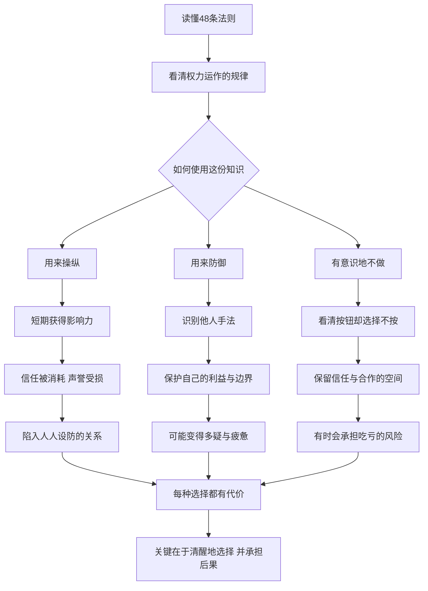

# 27｜读完48条法则，我们究竟该怎样对待权力？

> 看懂了权力的全部把戏之后，一个普通人该如何选择？

---

## 一、先说结论

48 条法则讲完了。它们描述了权力“如何运作”，却从来没有告诉我们人“应该怎样活”。

这正是格林刻意留下的空白。他把刀磨快了，递到读者手里，却不说要用它切菜还是伤人。

读完全书，每个人面对的真正问题，其实只有三种选择：

**用它来操纵**——把法则当作武器，去影响、利用甚至支配别人；
**用它来防御**——把法则当作地图，识别别人的手法，保护自己不被摆布；
**用它来有意识地不做**——看清了所有按钮在哪里，却主动选择不去按某些按钮。

**权力的知识本身是中性的，但每一种选择都有它的代价。** 这本书最终考验的，不是读者学会了多少技巧，而是读者愿意成为什么样的人。

---

## 二、我们先理解一个问题

一个人第一次读这本书，常常会经历几个阶段。

一开始是震惊：原来那么多事情背后，都有这样的逻辑。
接着是兴奋：好像拿到了一把万能钥匙，看什么都一清二楚。
然后，常常会进入一种不安：

> 如果人人都在算计，我还能相信谁？
> 如果我不用这些手法，是不是就注定吃亏？
> 如果我用了这些手法，我还是原来的我吗？

这种不安，恰恰是这本书最有价值的地方。它把一个平时被回避的问题摆到了面前：**在一个充满权力关系的世界里，看清规则之后，一个人该如何自处？**

---

## 三、作者到底提出了什么观点？

严格来说，格林在书中并没有直接回答这个问题。但从全书的结构和他在序言中的表述里，可以读出他的基本态度。

**第一，权力游戏无法退出。** 格林认为，所有人都身处权力关系之中，假装不玩也是一种玩法。拒绝理解规则的人，并没有获得道德上的纯洁，只是失去了保护自己的能力。

**第二，法则是描述，不是命令。** 格林把自己放在马基雅维利的传统中，强调他写的是权力的实际运作，而不是理想状态。每一条法则后面的“反转”说明，这些法则都有适用的条件和失效的时刻。

**第三，最终的能力是判断，而不是技巧。** 从“反转”到“无形”，格林一步步把读者从具体的手法引向更高层次的判断力：知道什么时候用、什么时候不用、什么时候反过来用。

可以说，格林给了读者一套完整的权力“语法”，却把“要说什么话”的问题，留给了读者自己。

---

## 四、把这个观点翻译成人话

打个比方。

一个人学会了开锁。

他可以用这门手艺去撬别人的门，这是操纵；
他可以用这门手艺检查自家的锁够不够牢，这是防御；
他也可以在某个深夜，站在一扇没锁好的门前，明知道自己能打开，却转身离开，这是有意识地不做。

**第三种选择，只有学会了开锁的人才能做出。** 一个根本不会开锁的人，谈不上“选择不开”；只有知道自己有能力，却依然克制，这种克制才真正属于他自己。

这也是这本书最深的悖论：**它教你看见所有的手段，却恰恰因此让“不用某些手段”成为一种真正的选择。**

---

## 五、为什么会这样？

为什么读完同一本书，人们会走向不同的方向？可以用下面这张图来理解：

关键在 **C** 这个分叉点：**知识本身不决定方向，决定方向的是使用它的人。**

第二个关键在三条路径的末端：**每一条路都有代价。** 操纵者获得了短期的影响力，却在消耗信任；防御者保护了自己，却可能陷入多疑；选择不做的人保留了真诚，却可能在某些时候吃亏。

所以真正的问题不是“哪条路没有代价”，而是：**哪一种代价，是你愿意承担的？**

---

## 六、举一个现实生活中的例子

假设一家公司的某个部门，正面临一场内部调整：一位副经理的位置空了出来，三位资深员工都有机会接任。部门里开始暗流涌动：有人私下向领导“汇报”别人的问题，有人在会议上刻意抢功，有人拉拢同事形成小圈子。

这三位员工中，有一位叫林然，她刚刚读完这本书。面对这种局面，她至少可以有三种选择。

**第一种选择：全力投入这场游戏。** 她可以运用书中的手法：隐藏自己的意图，在领导面前把功劳归于领导，收集竞争对手的弱点，在合适的时候“不经意”地透露出去。她有可能赢得这个职位。但代价是：同事们迟早会察觉到她的变化，信任会慢慢流失；而她自己，也可能习惯了用算计的眼光看待每一个人。

**第二种选择：只防御，不进攻。** 她不去主动算计别人，但会用书中的知识保护自己：关键工作留下书面记录，汇报时确保自己的贡献被看见，对那些突然示好的同事保持一份警觉，不在公开场合透露所有的想法。她未必能赢，但至少不会被人当作垫脚石。代价是：她可能会变得疲惫，总在提防，很难再像过去那样轻松地与同事相处。

**第三种选择：看清局面，有意识地选择不做某些事。** 她清楚地知道别人在做什么，也知道自己可以怎样回应。但她决定：不在背后议论同事，不抢别人的功劳，把精力放在做好自己的项目上，同时坦诚地向领导表达自己对这个职位的兴趣。她也许会错过这次机会。但她保住了自己在团队中的信誉，也保住了她想成为的那种人。

**三种选择，没有一种是“免费”的。** 林然最终选择哪一条，取决于她更看重什么：一个职位，一份安全，还是一种生活方式。而无论选哪一条，重要的是：**她是清醒地在选，而不是被局势推着走。**

---

## 七、回到书中重新理解

回到书中，会发现格林其实为这三种选择都留下了空间。

他大量讲述了操纵者如何获胜，这让很多读者以为他在鼓励第一种选择。但他同样反复强调，许多人正是因为不懂这些规律而成为受害者，这为第二种选择提供了理由。而他在每一条法则后面设置的“反转”，以及最后一条“无形”，实际上都在提醒读者：**任何法则都不是必须执行的命令。**

更值得注意的是，书中的许多失败者，并不是败在不够狡猾，而是败在失去了对自己的控制：傲慢、贪婪、冲动、急于求成。而书中那些长期立于不败之地的人，往往表现出一种惊人的克制。**从这个角度看，“有意识地不做”并不违背格林的思想，反而可能是它的最高形态。**

前面我们用过一个比喻：这本书是一副眼镜。眼镜本身不会告诉你该往哪里走，它只是让你看得更清楚。**看清之后，路还得自己选。**

---

## 八、这个观点背后还有什么？

**第一，这是一个古老的伦理问题。** 从马基雅维利开始，人们就在争论：政治和权力是否可以脱离道德来讨论？一些学者认为，马基雅维利本人并非鼓吹邪恶，而是在揭示现实，好让人们对权力保持警惕。关于他的真实意图，学界至今存在不同解释，格林的这本书也面临同样的争议。

**第二，权力不只是零和博弈。** 书中呈现的大多是“你多我少”的争夺，但现实中还有大量“共同做大”的合作。一些社会学者和组织研究者区分了“支配他人的权力”和“与他人共同行动的权力”，后者建立在信任和协作之上，同样是一种真实而强大的力量。

**第三，长期关系会改变游戏规则。** 博弈论中的研究指出，在一次性博弈中，欺骗可能有利可图；但在反复进行的重复博弈中，合作与守信往往能带来更好的长期结果，因为每个人都要考虑声誉和未来的报复。格林笔下的宫廷，多是高度紧张、充满一次性对决的环境；而现代社会中的许多关系，更接近重复博弈。

**第四，组织正在重新理解“安全”。** 组织心理学中有一个被广泛讨论的概念叫“心理安全感”，指团队成员相信自己可以坦诚发言、承认错误而不会受到惩罚。有研究认为，这种安全感与团队的学习和创新密切相关。在这样的环境里，格林式的权谋未必是最优策略，反而可能破坏团队最宝贵的东西。

---

## 九、这个观点有问题吗？

这里讨论的，既是格林的思想，也是本系列对它的整体理解。

**说服力在哪？** 格林的最大贡献，是拒绝了天真的道德说教，逼迫读者面对真实的权力关系。“看清”本身就有价值：不了解权力的人，更容易被权力伤害。

**争议在哪？** 首先，把“看清”和“使用”截然分开，可能过于理想。一个人长期用权力的眼光看世界，很难不被这种眼光改变；知识会塑造人，而不仅仅是被人使用。其次，“每种选择都有代价”的说法，容易被用来为操纵行为开脱：既然都有代价，选择算计似乎也就无可厚非了。

**哪里过度简化？** 把人的选择概括为“操纵、防御、不做”三种，本身就是一种简化。现实中的人往往在不同关系、不同时刻中混合使用这些策略：在谈判桌上防御，在家庭里真诚，在某些原则问题上寸步不让。

**有何其他解释？** 一些伦理学者会强调，真正的问题不是“用不用技巧”，而是“目的是否正当、手段是否尊重他人”。按照这种思路，同样是隐藏意图，为了保护弱者和为了欺骗他人，性质完全不同。**评判一个行为，不能只看它属于哪条法则，还要看它服务于什么。**

---

## 十、今天再看这个观点

以下部分是基于格林思想的现代延伸，不是他在书中的原话。

今天，我们比以往任何时候都生活在一个“处处有人试图影响你”的环境中：广告在研究你的欲望，平台在设计你的习惯，舆论在塑造你的情绪。格林描述的很多手法，已经被系统化、规模化地运用在我们身上。

在这样的时代，读懂权力的规律，首先是一种自我保护。它让你在面对营销话术、情绪煽动、隐性操控时，多一分清醒。

但同样重要的是，每个人也都拥有前所未有的影响他人的能力。一个普通人发出的一条消息，可能影响成千上万人。**当权力的工具变得人人可用，“有意识地不做”也就变得前所未有地重要。**

或许，今天读这本书最好的方式是：**用它来理解世界，用它来保护自己，然后用更高的标准来约束自己。**

---

## 十一、这一篇真正应该记住什么？

1. **法则描述的是“如何运作”，不是“应该怎样活”。** 格林给了语法，没有替你写句子。
2. **三种用法：操纵、防御、有意识地不做。** 每一种都有它的代价，没有免费的选择。
3. **克制只属于有能力的人。** 看清所有按钮却选择不按，才是真正的选择。
4. **权力不只是零和争夺。** 在重复博弈和长期关系中，信任与合作同样是强大的力量。
5. **清醒地选择，并承担后果。** 比选对哪条路更重要的，是知道自己为什么这样选。

---

## 十二、留一个问题

> 读完这 48 条法则，
> 有没有哪一条，是你明知道它有效，
> 却决定这辈子都不去用的？

---

## 系列收束

还记得这场阅读是怎样开始的吗？

我们最初追问的是：为什么这本书会被称为“最危险的书”？当时的回答是：它把道德从权力的讨论中拿掉，提供了一副看穿权力运作的眼镜；同一套知识，可以是武器，也可以是地图。

一路读下来，我们在强者身边学会了收敛锋芒，在信息的迷雾中学会了辨别意图，在形象与人心的舞台上看清了表演与真相，在人际布局中看到了朋友与敌人的另一面，在进退之间理解了时机与分寸，最后又被格林亲手带到“无形”面前：所有的法则，都只是形。

现在回头看，这本书真正“危险”的地方，也许并不在于它教会了人们算计，而在于它夺走了一种舒适的天真——它让我们再也无法假装看不见权力。

开篇留下的那个问题，现在可以重新问一次：当你发现自己也在不知不觉中使用这些手法时，你会停下来，还是告诉自己“大家都这样”？

读完全书，我们或许已经能够回答：“大家都这样”描述的也许是一种现实，却从来不是一个理由。**看懂游戏的人，才真正拥有不按某种方式去玩的自由。**

这本书只给了我们眼镜和地图。至于拿着它们走向哪里，成为一个怎样的人，没有任何一条法则能替你决定。

希望这一路的阅读，能帮你形成属于自己的理解——不是格林的，也不是这里的，而是你在自己的处境中，一次次清醒选择之后，慢慢长出来的那一份判断。
