# 《枪炮、病菌与钢铁》深度解读系列

## 系列简介

1492 年之后，欧洲人用枪炮、钢铁武器、马匹和传染病征服了美洲、非洲和大洋洲的大部分地区，而不是相反。为什么历史会这样展开？这是本书要回答的唯一问题。

作者贾雷德·戴蒙德给出的答案，可能是过去五十年里最反直觉、也最有争议的一个：**各民族历史的差异，来源于大陆环境的差异，而不是民族自身的生物性差异。** 不是欧洲人更聪明、更优秀，而是欧亚大陆恰好拥有更多可驯化的作物和牲畜、更有利的地理轴线，这些条件让农业、人口、病菌、文字、技术与国家率先出现。

本系列不按原书章节顺序拆解，而是重建一条「认知链条」：先讲清耶利的问题和「近因／终极因」框架，再沿「可驯化资源 → 农业 → 剩余粮食 → 人口密度 → 病菌／文字／技术／国家 → 大陆轴线」逐环拆解，最后讨论这本书最大的争议（地理决定论），并延伸到今天的不平等与 AI 时代。

这不是一本书的摘要，而是一条**因果链的逐步搭建**。读完之后，你应该能用一句话解释戴蒙德的全套逻辑，也能指出它最薄弱的环节在哪里。

---

## 全书核心问题

> **为什么是欧洲人征服了世界，而不是相反？**

戴蒙德把它具体化为新几内亚政治家耶利 1972 年问他的话：

> **「为什么你们白人制造了那么多货物（cargo），运到新几内亚来，而我们黑人却几乎没有属于自己的货物？」**

全书 20 章、跨越 13000 年，都是对这一句话的展开。

| 层次 | 问题 |
|---|---|
| 现象问题 | 为什么不同大陆的人类社会，发展速度与形态差异如此之大？ |
| 直接原因 | 为什么是欧亚人拥有枪炮、病菌、钢铁、文字与国家？ |
| 根本原因 | 为什么这些成果最早出现在欧亚，而不是别处？ |
| 评价问题 | 用「环境」解释历史，是破除种族论，还是为殖民开脱？ |

---

## 全书知识地图

```mermaid
graph TD
    Q["耶利的问题：为什么历史在不同大陆上走向不同？"] --> P["近因（直接原因）<br/>枪炮 · 病菌 · 钢铁 · 文字 · 中央集权国家"]
    P --> U["终极原因（根本原因）<br/>大陆环境的差异"]

    U --> A["可驯化的野生植物与动物分布不均"]
    A --> B["食物生产（农业+畜牧）在少数地区最早出现"]
    B --> C["粮食剩余"]
    C --> D1["人口密集 · 定居"]
    C --> D2["专职阶层：士兵/官僚/祭司/工匠"]
    D2 --> E1["国家与意识形态（盗贼统治）"]
    D2 --> E2["文字"]
    D2 --> E3["技术：枪炮与钢铁"]

    B --> F["家畜与人群密集"]
    F --> G["流行病菌：天花·麻疹·流感·鼠疫"]
    G --> P

    U --> H["大陆轴线方向"]
    H --> H1["欧亚：东西向，同纬度，传播顺畅"]
    H --> H2["非洲/美洲：南北向，跨气候带，传播受阻"]
    H1 --> I["作物·牲畜·技术·文字快速扩散与竞争"]
    H2 --> J["发展被地理阻断，孤立与停滞"]
    I --> P
```



一句话版本：

```text
环境 → 可驯化资源 → 农业 → 粮食剩余 → 人口与分工
                                    ├→ 病菌
                                    ├→ 文字
                                    ├→ 技术
                                    └→ 国家
                                             ↓
                                   枪炮·病菌·钢铁
```

---

## 全系列目录

### 第一部分：问题与框架

#### 01｜为什么是欧洲人征服了世界，而不是相反？

核心问题：为什么 1492 年之后是欧洲人跨越大洋去征服别人，而不是美洲人、非洲人或澳洲人跨越大洋来征服欧洲？

核心观点：这不是一个可以靠「谁更聪明」回答的问题。人类在大约 5 万年前还都处于相当接近的起跑线上，真正让历史分岔的，是一整套环境条件。耶利的问题之所以重要，是因为它把一个被当作「理所当然」的既成事实，重新变成了一个需要解释的谜。

理解难度：★☆☆☆☆

关键词：耶利的问题、起跑线、反直觉提问

---

#### 02｜为什么说「枪炮、病菌、钢铁」只是表象？

核心问题：既然书名叫《枪炮、病菌与钢铁》，为什么这三样东西其实不是真正的原因？

核心观点：它们是「近因」——直接决定了某场战役、某次征服的胜负。但在它们背后还有「终极因」：为什么是欧亚大陆先拥有了这些东西？戴蒙德最关键的思维方法，就是把「谁赢了」和「为什么他能赢」拆成两层因果关系来追问。

理解难度：★★☆☆☆

关键词：近因、终极因、因果链

---

#### 03｜为什么地理环境能决定一万年的历史？

核心问题：几千年的文明进程，真的能被「地理」这一个因素解释吗？

核心观点：戴蒙德主张，地理不是决定某个具体事件，而是决定了各民族**可选择的选项集合**。环境设定了起点的资源禀赋，剩下的历史是在这个约束下展开的。这是全书最宏大的主张，也是后面所有章节的论证目标。

理解难度：★★★☆☆

关键词：环境决定论、约束条件、路径依赖

---

### 第二部分：为什么是农业

#### 04｜为什么农业最早出现的地方，恰好是那几个地方？

核心问题：为什么农业不是在全球同时或随机出现，而是集中在西南亚、中国、中美洲等少数地区？

核心观点：因为农业的出现取决于当地是否有**可驯化的野生植物**。西南亚（新月沃地）恰好拥有世界上最高产、最易驯化的一批野生谷物和豆类，这不是人类选择的结果，而是运气。

理解难度：★★★☆☆

关键词：新月沃地、奠基作物、资源禀赋

---

#### 05｜农业到底是人类的进步，还是最大的陷阱？

核心问题：如果农业带来了文明，为什么农民的处境可能比采集狩猎者更差？

核心观点：戴蒙德指出，农业不是「被主动选择的」，而是采集与种植长期混合后的自然结果。它确实养活了更多人，但也带来了更差的营养、更多的劳役、更严重的疾病和更不平等的社会。个人的生活变差，群体的力量变强——这是全书最难被接受、也最深刻的一个论断。

理解难度：★★★☆☆

关键词：驯化、人口与个人幸福、选择的错觉

---

#### 06｜为什么有些植物被驯化了，有些却始终没有？

核心问题：为什么欧亚大陆的谷物成了世界主粮，而其他大陆的很多植物到今天依然是野生的？

核心观点：一个物种能否被驯化，取决于它的生长周期、繁殖方式、产量、可储存性等一整套条件。缺少任何一个条件，驯化都会失败。这解释了为什么某些地区明明有丰富植物，却没能独立发展出农业。

理解难度：★★★☆☆

关键词：可驯化性、种子与块根、独立起源

---

#### 07｜为什么大型动物几乎都在欧亚大陆被驯化？

核心问题：为什么牛、羊、猪、马都来自欧亚，而斑马、野牛、犀牛从未被驯化？

核心观点：戴蒙德提出「安娜·卡列尼娜原则」：**可驯化的大型哺乳动物需要同时满足一长串条件，缺一不可。** 生长慢、性情凶猛、不愿在圈养中繁殖、社会结构不适合，任何一条不符合，驯化就失败。世界上只有少数几种动物通过了这场残酷的筛选，而它们几乎全部集中在一小片大陆。

理解难度：★★★★☆

关键词：安娜·卡列尼娜原则、大型哺乳动物、斑马的反例

---

### 第三部分：从粮食到征服

#### 08｜为什么粮食剩余会催生阶层和国家？

核心问题：为什么从「所有人平等」的部落，会演化出国王、官僚和不平等？

核心观点：粮食可以储存和重新分配，就必然产生「谁来决定分配」的权力。剩余养活了一批不种地的人——士兵、祭司、官僚、工匠，社会从平权走向等级。戴蒙德把国家的形成称为「盗贼统治」的演变：它既剥削，也提供秩序和公共安全。

理解难度：★★★★☆

关键词：剩余粮食、分工、部落→酋邦→国家、盗贼统治

---

#### 09｜为什么是病菌，而不是枪炮，杀死了最多人？

核心问题：在欧洲人征服美洲的过程中，真正的「杀手」到底是谁？

核心观点：绝大多数美洲原住民死于欧洲人带来的传染病，而非战争。天花、麻疹、流感、鼠疫，都来自与人类长期共居的家畜。只有人口足够密集的农业社会，才能维持这些「人群病」的持续传播——所以病菌也是农业社会的产物。

理解难度：★★★☆☆

关键词：人群病、家畜起源、免疫差异、美洲人口崩溃

---

#### 10｜为什么文字只出现在少数几个社会？

核心问题：文字是人类智慧的必然产物，还是特定条件的偶然结果？

核心观点：文字不需要被反复发明——它一旦出现，就能被借用。戴蒙德指出，文字独立起源的地方屈指可数，但它借由贸易、征服和宗教传播到更广阔的地区。「需要」并不会自动创造文字，社会复杂度才是关键条件。

理解难度：★★★☆☆

关键词：独立起源、借用与传播、蓝本与借来的字母

---

#### 11｜为什么技术是「发明之母」，而不是「需要之母」？

核心问题：技术究竟是被需求「逼」出来的，还是被「发现」出来之后才产生需求的？

核心观点：戴蒙德反转了「需要是发明之母」这句俗语。很多技术发明出来时并无用途，甚至被视为玩具；真正决定技术命运的，是社会是否接纳、能否扩散、是否在竞争中被采用。技术是自我催化、不断积累的过程。

理解难度：★★★★☆

关键词：发明与需求、自我催化、技术扩散、竞争压力

---

#### 12｜为什么欧亚大陆是东西向的，这为什么至关重要？

核心问题：大陆的形状，真的能影响几千年文明？

核心观点：欧亚大陆主轴线是东西向，同一纬度带的气候、日照、季节高度相似，作物和家畜只要横向移动就能存活扩散。而非洲和美洲的主轴线是南北向，穿越不同气候带，同一物种很难传播。这个看似无聊的地理事实，极大地加速或阻碍了知识与资源的扩散。

理解难度：★★★★☆

关键词：大陆轴线、同纬度传播、生态屏障、扩散效率

---

### 第四部分：案例验证

#### 13｜卡哈马卡：168 个人如何击败 8 万人？

核心问题：1532 年皮萨罗凭什么能生擒印加皇帝阿塔瓦尔帕？

核心观点：这场战斗是全书所有论证的「浓缩演示」：钢铁刀剑与盔甲、马匹、火器、文字情报、中央集权组织——西班牙人集齐了一整套农业社会积累的成果，而印加人只有其中一部分。戴蒙德用这个案例证明，战役的胜负早在几百年前就被环境决定了。

理解难度：★★★☆☆

关键词：卡哈马卡、皮萨罗、阿塔瓦尔帕、近因的集中体现

---

#### 14｜为什么非洲和美洲的发展被地理「收割」了？

核心问题：非洲和美洲并不缺自然资源，为什么没能发展出与欧亚对等的技术与国家？

核心观点：它们缺少的不是资源，而是**扩散的条件**：南北向轴线、破碎的地形、稀缺的可驯化动物、热带疾病，都让农业、技术和国家难以跨区域积累。戴蒙德强调这不是「落后」，而是被地理结构性地限速。

理解难度：★★★★☆

关键词：扩散障碍、撒哈拉、安第斯、孤立效应

---

#### 15｜为什么中国会走向统一，而欧洲始终分裂？

核心问题：同样幅员辽阔，为什么中国长期是统一帝国，而欧洲一直是多国竞争？

核心观点：戴蒙德认为，统一的地理核心（黄河—长江流域）让中国更容易被单一政权控制，而欧洲的山脉、半岛、海峡造成天然的碎片化。他进一步提出一个反直觉推论：**分裂反而促进了欧洲的竞争与创新，统一反而可能让中国因一个决策而错失大航海。** 这是全书最有影响力、也最受争议的论断。

理解难度：★★★★★

关键词：统一与分裂、竞争与创新、大航海、反直觉推论

---

### 第五部分：争议与反思

#### 16｜「地理决定论」是一种新的种族主义吗？

核心问题：把历史差异归因于环境，会不会是在为殖民与压迫开脱？

核心观点：这是本书最大的争议。批评者认为，戴蒙德的框架过度强调环境，抹去了原住民的主体性、殖民暴力和偶然性，甚至可能暗示「谁赢就是谁该赢」。支持者则认为，恰恰相反，他的理论是用环境解释取代种族解释，本质上是反种族主义的。争议的核心不是事实，而是**解释责任**。

理解难度：★★★★★

关键词：地理决定论、反种族主义与开脱、学界批评

---

#### 17｜环境影响之外：文化、制度与偶然性到底有多重？

核心问题：如果地理是终极因，那么制度、文化和「大人物」还剩下多少位置？

核心观点：后来的研究（如《国家为什么会失败》）指出，同样地理条件下的国家可以走向完全不同的命运，制度与政治选择同样关键。戴蒙德在解释「中国为什么没产生工业革命」时过度依赖单一因果，而忽视了煤、殖民地、战争、偶然事件等因素。地理重要，但它不是唯一变量。

理解难度：★★★★★

关键词：制度论、大分流、偶然性、多因解释

---

### 第六部分：现代延伸

#### 18｜为什么世界的不平等至今难以消除？

核心问题：如果枪炮、病菌与钢铁决定了五百年前，它是否仍在决定今天的贫富差距？

核心观点：戴蒙德的环境因素通过**路径依赖**延续至今：热带疾病负担、地理隔离、殖民遗产、技术积累的正反馈，让先发优势不断自我强化。理解这层因果关系，不是为了给人贴标签，而是为了看清不平等从何而来、为何顽固。

理解难度：★★★★☆

关键词：路径依赖、正反馈、殖民遗产、全球不平等

---

#### 19｜如果地理决定过去，那它还能决定 AI 时代吗？

核心问题：在技术可以跨越地理限制的今天，戴蒙德的框架还有效吗？

核心观点：（现代延伸，非戴蒙德原文）互联网、AI、远程协作理论上抹平了部分地理约束，但算力、能源、数据、人才与制度仍在特定地点聚集，形成新的「资源禀赋」。戴蒙德式的追问依然有效：为什么某些地区能率先获得新资源？只不过这次的「可驯化作物」，可能变成了芯片、人才与制度。

理解难度：★★★★☆

关键词：AI 时代、新资源禀赋、算力与能源、地理的消亡与重生

---

#### 20｜重读戴蒙德：我们真正该记住的是什么？

核心问题：在众多批评之后，这本书还值得读吗？它留给我们最重要的遗产是什么？

核心观点：即使全书的具体论断都可以争论，它教给我们的**思维方法**依然稀缺：区分近因与终极因、拒绝用「民族优劣」解释历史、坚持追问「是什么条件让这件事成为可能」。戴蒙德不总是对的，但他示范了一种追问方式——把「理所当然」重新变成「需要解释」。

理解难度：★★★☆☆

关键词：思维方法、因果分层、反本质主义、全系列收束

---

## 推荐阅读顺序

```text
第一板块｜提出问题与框架
  01 耶利的问题
  02 近因 vs 终极因
  03 环境决定历史的边界

第二板块｜为什么是农业
  04 可驯化植物
  05 农业的陷阱
  06 植物为何没被驯化
  07 动物的驯化门槛

第三板块｜从粮食到征服
  08 剩余粮食 → 国家
  09 家畜 → 病菌
  10 文字
  11 技术
  12 大陆轴线

第四板块｜案例验证
  13 卡哈马卡
  14 非洲与美洲
  15 中国 vs 欧洲

第五板块｜争议与反思
  16 是不是种族主义
  17 文化·制度·偶然

第六板块｜现代延伸
  18 不平等为何顽固
  19 AI 时代还适用吗
  20 我们该记住什么
```

优先关系：

> 03 依赖 01、02 建立的问题意识；
> 08～12 依赖 04～07 讲清的「农业社会」；
> 13 依赖 08～12 的全部结论，是全书的「实战演示」；
> 16、17 必须建立在理解完整条因果链之后，否则批评无从谈起。

---

## 全系列内容覆盖对照

| 原书部分 | 对应文章 |
|---|---|
| 第一部分 从伊甸园到卡哈马卡 | 01、02、13 |
| 第二部分 食物生产的兴起与扩散 | 04、05、06、07、12 |
| 第三部分 从食物到枪炮、病菌与钢铁 | 08、09、10、11 |
| 第四部分 环游世界五章 | 14、15 |
| 尾声 人类史作为一门科学 | 03、17、19 |
| 学界争议（书外） | 16、17、20 |
