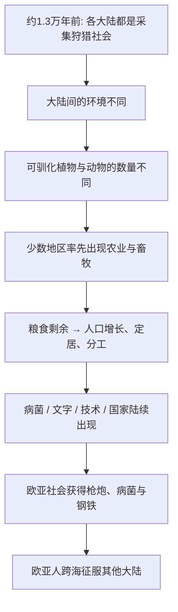

# 01｜为什么是欧洲人征服了世界，而不是相反？

> 一个被历史结果掩盖了的问题：我们今天看到的世界格局，究竟是必然，还是只是一连串偶然？

---

## 一、先说结论

戴蒙德想说的其实只有一句话：**欧洲人征服世界，不是因为他们更聪明、更优秀，而是因为他们恰好生活在一块条件特殊的大陆上。**

我们太习惯把历史的结局当成原因，看到欧洲强、非洲和美洲弱，就下意识地认为强弱是天生的。但戴蒙德提醒我们：把时间拨回到一万三千年前，所有大陆上的人都还在采集和打猎，起点相当接近。真正的分岔，是之后才发生的，而分岔的原因藏在环境里，不在人种里。

这一篇要建立的，正是整本书的问题意识：**先别急着解释答案，先要认真对待问题。**

---

## 二、我们先理解一个问题

1972 年，戴蒙德在新几内亚研究鸟类。有一天，他沿着海滩散步，遇到一位当地的政治家，名叫耶利。

两个人聊了很久。临走时，耶利问了他一个问题：

> **「为什么你们白人制造了那么多货物（cargo），运到新几内亚来，而我们黑人却几乎没有属于自己的货物？」**

耶利说的「货物」，指的是白人带来的那些东西——罐头、雨伞、火柴、药物、汽车。在新几内亚，白人的到来像一场凭空降临的魔术：一群外来者带着本地人从没见过的东西，居高临下地出现。

这不是一句抱怨，而是一个真问题。而且它一点都不幼稚。当地的白人殖民官员常给的标准回答是：「因为我们是白人，所以聪明。」耶利不接受这个解释——毕竟他就在跟一个白人学者平等对话，他不觉得自己笨。

于是问题悬在了空中：**为什么历史在不同大陆上，走向了完全不同的方向？**

戴蒙德说，正是耶利的这个问题，最终变成了《枪炮、病菌与钢铁》这本书。

---

## 三、作者到底提出了什么观点？

在一万三千年前，也就是公元前 11000 年左右，地球上所有大陆的人类，本质上都还是采集狩猎者。

非洲、欧洲、亚洲、美洲、澳洲——没有任何一个大陆已经发展出农业、城市、金属工具或文字。**大家站在同一条起跑线上。**

但一万年后，局面天差地别：欧亚大陆的人拥有金属武器、火器、马匹、文字、国家，并且跨过大洋，征服了美洲、非洲大部和大洋洲。而从欧洲人抵达的那一刻起，美洲和澳洲的原住民世界几乎被摧毁。

所以问题可以精确化为：

> **为什么是欧亚大陆的人类，率先得到了「枪炮、病菌与钢铁」？**

面对这个问题，常见的回答有两种。

第一种是**种族主义式的回答**：欧洲人天生更聪明、更有创造力。戴蒙德明确拒绝了这个答案，而且他从根本上否定了它——在他看来，各大陆人群在认知能力上并没有本质差别。

第二种是**文化式的回答**：欧洲有某种独特的文化或宗教精神，比如理性、资本主义、基督教。戴蒙德也不满意，因为这种回答等于把结果当原因，而且无法解释为什么是「这个时间点」而不是更早或更晚。

戴蒙德给出的答案是第三种：

> **各大陆历史发展的差异，来自大陆环境本身的差异，而不是人的差异。**

具体说，环境决定了三件事：**有没有可驯化的作物和牲畜、大陆的形状是否利于传播、以及由此衍生出的病菌、文字、技术与国家。** 而这一切，最终变成了征服别人的能力。

---

## 四、把这个观点翻译成人话

先想象一场游戏。

你进入一款策略游戏，规则对所有人一样，但每个玩家被随机分配到一个出生点。

- 甲玩家出生在一大片草原上，附近有可以驯化的野生小麦、能圈养的山羊和牛，地形平坦。
- 乙玩家出生在一座南北走向的狭长大陆上，中间隔着沙漠和雨林，可吃的野生植物稀少，大型动物凶猛且无法驯服。

游戏开始的时候，两个人差不多。跑一百个回合后，甲已经攒出了粮食、人口、军队和技术，乙还在为下一顿饭发愁。

**这不是因为甲更会玩，而是因为甲出生地的「资源禀赋」不一样。**

戴蒙德想说的，大致就是这个意思。他不否认人有能力差异，但他认为，**在一万年的尺度上，起点的环境差异，会被时间放大成巨大的鸿沟。**

人类的历史不是一场公平的智力竞赛，而更像一场地图不同的开局。

---

## 五、为什么会这样？

把戴蒙德开篇的逻辑整理成链条，是这样：

这条链里，**A 是整个论证的起点，也是最容易被忽略的一点。**

我们总以为「欧洲先进、其他大陆落后」自古以来就是如此。但戴蒙德反复强调：如果在一万三千年前按下暂停键，你根本看不出哪个大陆会赢。非洲是人类的发源地，新月沃地在公元前 8500 年就出现了农业，中美洲也独立发展出了玉米。起跑时，谁都不落后。

真正让人惊讶的，不是「欧亚赢了」，而是**「为什么只有欧亚赢到了最后」**。

---

## 六、举一个现实生活中的例子

想想两家创业公司。

公司 A 和公司 B 在同一个行业、同一个时间成立，创始人能力和努力程度也差不多。唯一的区别是：A 所在的城市有成熟的供应链、大量可招聘的工程师、发达的融资渠道；B 在偏远地区，什么都得自己从头建。

三年后，A 已经完成 C 轮融资、产品迭代到第五代；B 还在为招不到一个合格程序员发愁。

这时候如果有人得出结论：「A 的团队天生更优秀，B 的团队不行」——这显然是荒谬的。差异不在人，而在他们所处的**生态**。

戴蒙德的逻辑是同一个道理，只是把「城市」换成了「大陆」，把「供应链」换成了「可驯化的动物和作物」。

再举一个更贴近日常的例子：两个学生考同一场试。一个从小在有图书馆、有老师、有安静书桌的环境里长大；另一个在资源匮乏、每天要为生计分心的环境里长大。考分差异，未必说明智商差异，更可能说明**机会结构的差异**。

戴蒙德想做的，就是为整个人类史做一次这样的归因：**把「人不行」的解释，替换成「条件不同」的解释。**

---

## 七、回到书中重新理解

现在再回看耶利的问题，你会发现它其实有两层。

**表层的问题是**：为什么白人带来了货物？答案是：因为他们拥有了枪炮、病菌与钢铁。

**深层的问题是**：为什么是白人先拥有了这些东西？这才是戴蒙德真正要回答的，也是全书接下来 19 章的内容。

所以这本书的书名有点「误导性」——枪炮、病菌和钢铁其实只是**近因**，是征服发生时摆在台面上的东西。真正的原因在更深处：地理。

理解了这一层，你就抓住了全书的钥匙：**戴蒙德不是要讲一场场战役怎么打，而是要在战役之前，先解释「为什么只有一方准备好了这些武器」。**

---

## 八、这个观点背后还有什么？

这里藏着戴蒙德最重要的一个思维工具：**区分「近因」和「终极因」。**

- 近因：西班牙人有钢剑、有马、有天花，所以赢了。
- 终极因：为什么西班牙人有，印加人没有？

如果只停在近因，你得到的是一份武器清单；只有追问到终极因，你才可能理解历史的结构。这种「不断往下追问一层」的方法，比它的具体结论更有价值——它同样适用于分析商业竞争、技术变革，甚至个人命运。

另一个隐含前提是：**戴蒙德相信历史可以被「科学地」解释。** 他不认为历史只是一连串偶然和英雄事迹的堆叠，而认为在足够长的尺度上，存在可被识别的地理规律。

---

## 九、这个观点有问题吗？

有几个地方值得保持警惕。

第一，戴蒙德开篇说「一万三千年前大家都站在同一起跑线」，这个说法本身就有争议。部分考古与基因证据显示，某些地区的技术、社会复杂度差异可能更早就出现了，把起跑线定在某一刻，多少有些简化。

第二，**用「环境」解释历史，很容易被误读成宿命论。** 如果一切都是地理决定的，那人的努力、选择和反抗还有什么意义？戴蒙德本人反对这种读法，但他高度宏观的叙事确实给了这种误读很大的空间。

第三，这种解释有意无意地淡化了一个事实：**征服本身是暴力，是殖民，是屠杀。** 把结果解释为「环境使然」，在批评者看来，可能在不经意间让殖民者显得无辜。这个争议我们会在第 16 篇专门讨论。

不过，至少有一点是清楚的：**戴蒙德用一个「非种族」的解释，正面挑战了「人种决定论」。** 在这一点上，他的立场是明确的，也是这本书最大的价值之一。

---

## 十、今天再看这个观点

（以下为现代延伸，不是戴蒙德原文）

戴蒙德的问题意识在今天依然锋利，只是「货物」换了名字。

2024 年，最稀缺的「货物」可能不是罐头和汽车，而是算力、能源、数据和顶尖人才。当人们争论「为什么 AI 的突破集中出现在少数几个地区」时，那个耶利式的问题会再次浮现：**是这些地方的人更聪明吗？还是他们恰好拥有某种类似「可驯化作物」的禀赋——资本、电力、大学、自由的信息流动？**

戴蒙德的警示在这里仍然有效：**不要用结果倒推原因，不要用发达与否给人或民族贴标签。** 看到差距，第一反应应该是问「条件是怎样的」，而不是断言「他们就是不行」。

---

## 十一、这一篇真正应该记住什么？

1. **耶利的问题是整本书的起点。** 它把「欧洲为什么强」这个没人追问的既成事实，重新变成了一个谜。

2. **一万三千年前，各大陆起点相近。** 差异是之后才出现的，所以不能用人种或天赋来解释。

3. **戴蒙德的答案是环境，而不是人。** 环境决定了可驯化的资源、传播条件与由此衍生的一切能力。

4. **枪炮、病菌、钢铁只是近因。** 真正要追问的是「为什么是欧亚先拥有了它们」，这是终极因。

5. **最重要的不是结论，是方法：** 不断往下追问一层，把「理所当然」重新变成「需要解释」。

---

## 十二、留一个问题

如果枪炮、病菌和钢铁只是近因，那它们背后到底是什么？

为什么是欧亚大陆先有了这些东西——是因为那里的人更勤劳，还是因为那里的**作物和牲畜**碰巧更听话？

下一篇，我们就来拆开戴蒙德那个最关键的思维工具：**近因与终极因**，看看「直接原因」和「根本原因」究竟差在哪里。
