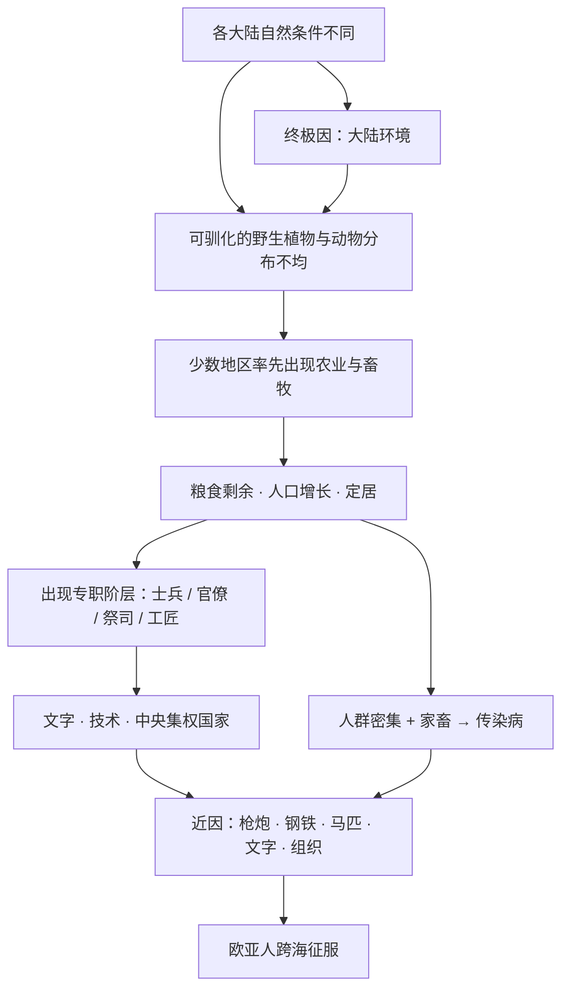

# 02｜为什么说「枪炮、病菌、钢铁」只是表象？

> 书名给了我们三样东西，但它们不是答案，而是一道谜题的开头。

---

## 一、先说结论

戴蒙德认为，枪炮、病菌和钢铁不是历史差异的原因，而是原因的结果。它们属于「近因」——直接决定了某场战役、某次征服的胜负；但在它们背后，还有一层「终极因」：为什么欧亚大陆的人先拥有了这些东西？

全书真正在做的事，就是把「谁赢了」翻译成「为什么他有资格赢」。分不清这两层，就会把结果当原因，把表象当答案。

---

## 二、我们先理解一个问题

设想一起枪击案。

侦探赶到现场，看到的是一把手枪、一个倒下的受害者、一扇开着的窗。这些都是现场事实。但侦探如果就此宣布「凶手是枪」，案子其实根本没破。真正要问的是：谁开的枪？枪从哪里来？他为什么会有枪？

历史研究常犯同样的错。

我们看到西班牙人靠钢剑、马匹、火器和天花征服了美洲，就很自然地认为：原因就是这三样。可这等于说「凶手是枪」。

所以本文真正要问的是：

> **如果枪炮、病菌、钢铁就是答案，那为什么只有欧亚人手里有这些东西？**

---

## 三、作者到底提出了什么观点？

戴蒙德在书中反复使用一对概念：**近因（proximate cause）** 和 **终极因（ultimate cause）**。他认为，几乎所有的历史事件，都可以拆成这两层。

- **近因**：直接导致结果的那个环节。1532 年的卡哈马卡，西班牙人赢了，近因是钢制刀剑与盔甲、马匹、火器，以及他们随身携带的传染病。
- **终极因**：让这些近因得以出现的、更早更深的条件。为什么西班牙人手里有钢和马，而印加人没有？

戴蒙德的态度是：近因不是错的，它只是太浅了。

如果只抓近因，我们手里顶多有一份「武器清单」，却回答不了耶利的问题——为什么这些武器出现在这一边，而不是另一边。

---

## 四、把这个观点翻译成人话

先看医疗。

一个人发烧、咳嗽、浑身酸痛。医生如果只给他退烧药，症状暂时压下去了，但病因还在。高烧是「近因」，细菌或病毒感染是「终极因」。把症状当病因，是会出人命的。

戴蒙德看历史，用的就是这套诊断思路。枪炮、病菌、钢铁是历史的「症状」；真正要弄清楚的，是让这些症状必然出现的「病因」。

再换个说法：一场比赛，A 队 3 比 0 赢了，因为他们的前锋连进三球。但如果你再问一句「为什么 A 队前锋这么强」，答案可能是 A 队有更好的青训体系、更充足的资金、更大的人才池。

**进球是近因，体系才是终极因。**

---

## 五、为什么会这样？

把戴蒙德的推理整理成链条，大致是这样：

关键在于理解这张图的**方向**。

近因（H）不是终点，而是被上游一连串条件「生产」出来的结果。每一层近因往下追问，都能找到更深的一层因。戴蒙德的方法是：顺着近因往上游走，一直走到不能再问的地方——大陆环境。

这也解释了一件事：**为什么书名叫「枪炮、病菌与钢铁」，但全书几乎没有把重点放在枪炮和钢铁上。** 因为戴蒙德真正感兴趣的不是那三样东西本身，而是它们「为什么出现在那里」。

---

## 六、举一个现实生活中的例子

想想一家突然倒闭的银行。

新闻标题通常是这样写的：「某银行因一笔巨额坏账倒闭。」这句话没错，但它只说了近因。那笔坏账，只是最后倒下的那块多米诺骨牌。

如果往下追，可能是这样一条链：

这笔贷款的风险评估长期失真 → 风控体系形同虚设 → 激励机制鼓励员工冲规模、忽视风险 → 管理层和监管都没有及时纠偏 → 整个行业在宽松环境里集体冒险。

走到这一层你才发现：**坏账不是原因，坏账是结果。** 真正的原因，在坏账发生之前很久就已经埋下了。

戴蒙德看历史，就是不愿意停在「坏账」这一层。他要问的是：为什么有些社会的「风控体系」更早成型，有些却始终没有？

---

## 七、回到书中重新理解

现在再回看卡哈马卡。

一百多个西班牙人，面对数万印加大军，却在几个小时内生擒了皇帝阿塔瓦尔帕。近因很清楚：钢制武器、盔甲、马匹、火器，以及印加人从未见过的马和枪声所带来的心理震慑。

但戴蒙德立刻追问：为什么是一百多对几万，而不是反过来？

答案逐层展开：印加人没有马，因为美洲缺乏可驯化的大型动物；印加人没有钢，因为没有走上那条冶金技术积累的路；阿塔瓦尔帕对西班牙人的到来几乎一无所知，因为印加没有文字、没有跨区域的情报网络；而整个帝国的权力高度集中在皇帝一人身上，所以皇帝一被俘，指挥系统就瘫痪了。

这些，都不是「一百多个人」能解释的。它们要追溯到几百甚至几千年前的环境条件。

**卡哈马卡不是原因，卡哈马卡是终点。**

---

## 八、这个观点背后还有什么？

这对概念背后，藏着几个没有明说的前提。

第一，它假设历史有层级分明的因果关系，而且存在一个「底层」。戴蒙德把底层放在大陆地理上。但「底层到底在哪里」，本身就是有争议的。

第二，区分近因和终极因，其实也是在区分「解释」和「归责」。说「西班牙人赢是因为有钢剑」，是在解释；说「因为欧洲人更优秀」，那就从解释滑向了归责，甚至滑向了种族主义。**把近因误当成终极因，往往正是种族主义解释的逻辑起点。**

第三，这个工具是可以随身携带的。它不只适用于历史，也适用于分析商业竞争、技术变革，甚至个人的处境：你看到的「结果」，通常都还有更深的一层「条件」。

---

## 九、这个观点有问题吗？

戴蒙德的这套区分，说服力在于它确实让问题更清楚了，而且天然地反种族主义——他不是在问「谁更优秀」，而是在问「条件如何不同」。

但争议也有。

第一个争议是：**追到哪一层才算「到底」？** 戴蒙德停在「大陆环境」，认为那就是终极因。但一些学者认为，环境之下还有偶然性、制度、文化、关键人物的选择，环境并不是唯一的底层变量。关于历史的根本驱动力，学界存在不同解释。

第二个争议是：把一切都归到终极因，会不会让近因里活生生的人消失了？批评者担心，当「征服」被解释成「环境的必然结果」，殖民者的选择、暴力和责任，就在叙事里被稀释了。

第三，也有学者提醒：近因和终极因是分析工具，不是「哪个更重要」的投票。现实中两层永远同时存在，缺一不可。

---

## 十、今天再看这个观点

（以下为现代延伸，不是戴蒙德原文）

下次当你看到一条「某某公司率先做出大模型」的新闻，可以试着用戴蒙德的眼睛看两遍。

第一遍看近因：它有钱、有人、有算力、动作快。

第二遍看终极因：它所在的地方，恰好聚集了成熟的半导体供应链、活跃的风险投资、顶尖的大学和长期的技术积累。

只看到第一遍，你可能会得出「这家公司的工程师就是天才」这种结论；看到第二遍，你才会问出真正有价值的问题：**为什么这种「禀赋」会聚集在这里，而不是别处？**

---

## 十一、这一篇真正应该记住什么？

1. **枪炮、病菌、钢铁是近因，不是终极因。** 它们解释了「谁赢了」，但没有解释「为什么他能赢」。

2. **近因是真的，但它太浅。** 停在近因，你得到的是清单；追问终极因，你才看到结构。

3. **戴蒙德的核心方法，是顺着近因往上游走。** 一直问到不能再问的地方。

4. **把近因误当终极因，就是种族主义的逻辑起点。** 它把「条件不同」偷换成「人种不同」。

5. **这对概念可以带出书本。** 分析公司、行业、个人处境时，「直接原因」和「根本原因」永远值得分开看。

---

## 十二、留一个问题

如果我们承认，一切近因背后都有一个终极因，那么接下来就有一个更大的问题：

**凭什么说「地理」就是那个最终的答案？** 几千年的文明进程，真的能被「地理」这一个因素解释吗？如果真是这样，那人类的努力、选择和反抗，又算什么？

下一篇，我们就来正面处理这个最宏大、也最危险的主张：**地理决定论**。
