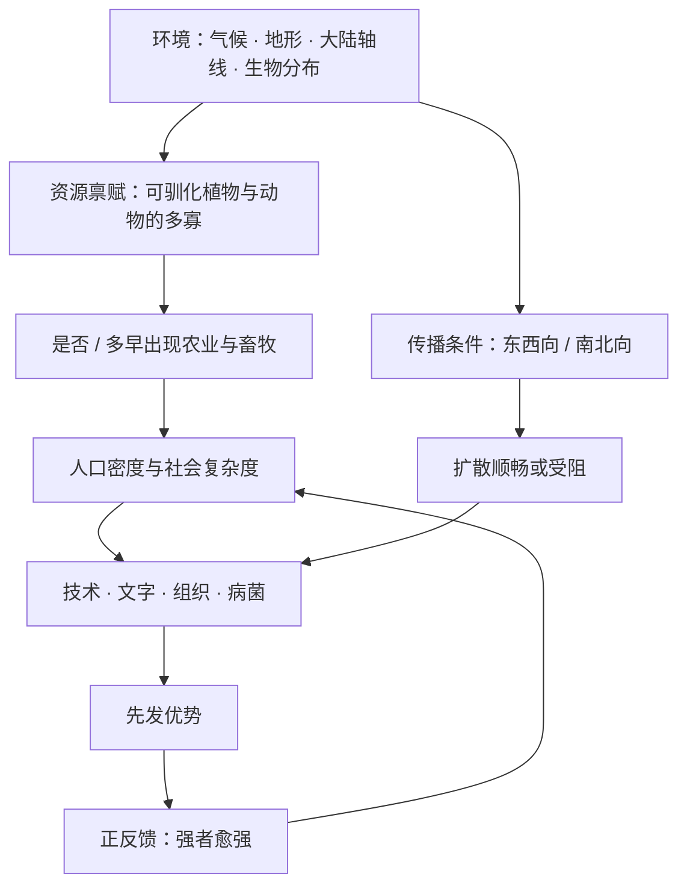

# 03｜为什么地理环境能决定一万年的历史？

> 一个让人不安的主张：几千年的文明进程，真的能被「地理」这一个因素解释吗？

---

## 一、先说结论

戴蒙德认为，地理不决定具体的历史事件，它决定的是各民族「可选择的选项集合」。环境先设定起点的资源禀赋，之后的历史——战争、王朝、发明、兴衰——都在这个约束下展开。

所以地理不是宿命，而是约束条件。它不告诉你谁会赢，它只告诉你，谁手里有哪些牌。这是全书最宏大的主张，也是后面所有论证要共同支撑的目标。

---

## 二、我们先理解一个问题

先说一个让人本能反感的推论。

如果地理能解释一万年的历史，那我们算什么？战争、改革、革命、英雄和小人物的挣扎，难道都只是布景？如果一块大陆的位置就能决定一切，那人的努力还有意义吗？

这种反感是合理的。而它恰恰暴露了一个常见的误读：**把「约束」听成了「宿命」。**

所以本文要问的是：

> **地理到底以什么方式影响历史？是「决定」每一个结果，还是只「限制」可选的范围？**

这两种说法，差别巨大。

---

## 三、作者到底提出了什么观点？

戴蒙德的主张，可以概括成一句话：**环境决定的是条件，不是结局。**

具体来说，环境通过三种方式起作用：

- 决定**有哪些资源**。一个大陆上有没有可驯化的高产谷物、有没有可驯化的大型动物，这直接决定了农业和畜牧是否可能。
- 决定**传播的成本**。大陆是东西向还是南北向，中间有没有沙漠、雨林、高山，决定了作物、技术、文字、制度能否快速扩散。
- 决定**竞争与创新的压力分布**。长期分裂竞争，还是长期统一，会影响技术与制度演进的速度和方向。

注意这三件事的共同点：它们都不是「某一次事件」，而是**长期稳定的结构性条件**。

戴蒙德并不认为公元前某年某场战争的结果是地理写好的；他认为，让某些结果「更容易发生」的土壤，是地理铺就的。

---

## 四、把这个观点翻译成人话

想象一桌牌局。

发牌的是地理。它不管你怎么打，只负责把牌发到你手里。有人拿到一对 A，有人拿到七、二杂色。

- 牌好，不等于你稳赢——你可能打得稀烂。
- 牌差，也不等于你必输——你可能技术高超，用烂牌打赢一两局。

但牌决定了你**「能打的策略空间」**。拿着七、二杂色，你没法假装自己有对 A；拿着好牌，你也不必冒险诈唬。

**地理就是这个发牌的人。它决定的不是你赢不赢，而是你能坐上哪些牌桌。**

再换一个更生活的类比：房产的「地段」。

同一个地段，你可以开餐馆、开便利店、做写字楼，但开着开着你就会发现，这个地段的客流、租金、周边配套，已经把你能做的事框定在一个范围里。地段不替你经营，但它决定了你经营的「天花板」和「成本结构」。同样努力的人，在好地段和差地段，结果可能差出很多。

---

## 五、为什么会这样？

戴蒙德这条逻辑，靠的是一种叫**路径依赖**的机制。

关键在 F 到 G 这一步。

一个社会一旦在农业、人口、技术上领先，这种领先会**自我强化**：更多人口支撑更细的分工，更细的分工催生更多技术，更多技术带来更强的军事和组织能力，而这些又能反过来掠夺资源、扩张人口。

领先本身，会变成下一轮领先的原因。

这就是正反馈，也是路径依赖：**早期一点微小的差异，会被时间不断放大。** 而起点的那点差异，往往就来自环境。

---

## 六、举一个现实生活中的例子

想想两座海边的小城。

甲城建在一个天然良港边上：水深、避风、靠近大河的入海口。乙城建在一条离海岸很远的内陆山谷里，山路崎岖。

一开始，两座城的规模、居民、努力程度都差不多。但几百年过去，差别越来越大。

甲城因为港口，自然地长出贸易、码头、仓储、金融、造船、保险；商人带来信息，信息带来教育，教育带来技术。渐渐地，甲城成了区域中心。

乙城的人同样勤劳，甚至更节俭，但每一袋货要运出去都得翻山越岭，运输成本始终压在头上。它可能靠某种特产过得不错，却很难长成贸易枢纽。

如果有人得出结论：「甲城的人更聪明、更优秀」——这显然是荒谬的。差异不在人，而在他们脚下的**地理结构**里。

---

## 七、回到书中重新理解

现在再回看戴蒙德那些看起来「很地理」的论证，就容易懂了。

他讲**大陆轴线**：欧亚大陆主要是东西向，同一纬度带的气候、日照、季节相似，作物和家畜横着走就能活；非洲和美洲的主轴是南北向，横穿不同气候带，同一物种往南往北都容易水土不服。于是欧亚的作物、技术、文字扩散得更快，而其他地方的发展更容易被地理「打断」。

他讲**可驯化资源的分布**：不是欧亚人更会种地，而是欧亚恰好有更多「听话」的物种。这也不是选择，是禀赋。

这些论证，没有一条在说「某地注定发生某件事」。它们说的都是：**哪些地方更容易长出某种条件，哪些地方更难。**

而条件会通过路径依赖，变成几千年后的差距。

---

## 八、这个观点背后还有什么？

第一，它假设历史在长尺度上有**可比较的结构**。如果历史只是纯偶然的堆叠，那么谈「地理规律」就无从谈起。戴蒙德明确相信历史可以被科学地解释，这是一个很强的立场。

第二，「约束」这个说法，其实已经很温和了。它承认人的能动性存在，只是把能动性放进了一个边界里。这是戴蒙德给自己留的余地。

第三，也是最重要的一点：**环境决定的是概率和边界，不是单个事件。**

说「地理让农业更早出现在这里」，和说「地理让这里的每个人都必须种地」，是两件完全不同的事。前者是趋势，后者才是宿命。戴蒙德坚持的是前者。

---

## 九、这个观点有问题吗？

地理作为解释，有它非常有力的地方：

- 它能解释很多「同样努力、结果不同」的现象，而不必诉诸种族或文化优劣。
- 它把时间尺度拉得足够长，长到人和民族的短期差异被平均掉。

但争议同样真实。

**制度论的挑战。** 后来的研究者（例如《国家为什么会失败》一书的作者）指出：地理条件相近的地方，可以因为制度不同而走向完全不同的命运。制度、政治选择、包容性或掠夺性的结构，可能比地理更直接地决定结果。关于到底是地理还是制度更根本，学界存在不同解释。

**偶然性的挑战。** 一些学者强调，历史中有大量偶然事件——瘟疫、气候突变、关键的战争胜负、个别人物的决策——它们的影响不容忽视，无法全部还原成地理。

**能动性的挑战。** 最尖锐的批评是：把历史差异归结为环境，容易在不知不觉中抹去人对自身命运的塑造，甚至可能被用来为殖民和压迫开脱，仿佛「谁赢就是环境注定谁赢」。

需要说明的是，戴蒙德本人在书里明确反对宿命论式的读法，他反复强调自己的意思是「条件不同」，而不是「人不行」。但批评者认为，他那种高度宏观、几乎不留缝隙的叙事方式，本身就给了宿命论很大的想象空间。这场争论，我们会留到第 16 篇专门展开。

---

## 十、今天再看这个观点

（以下为现代延伸，不是戴蒙德原文）

一个自然的问题是：在互联网、远程办公、AI 把「距离」不断抹平的今天，地理还决定一切吗？

一部分约束确实被削弱了：一封邮件可以瞬间跨过太平洋，一个开发者可以在任何地方为硅谷公司工作。

但另一部分约束反而在加强：算力、能源、数据、顶尖人才和资本，仍然高度集中在少数几个地点；而这些要素彼此吸引，形成新的正反馈。

用戴蒙德的语言说：旧的「可驯化作物」是小麦和牛羊，新的「可驯化作物」可能是芯片产能、电力、大学和制度。**地理没有消失，它只是换了载体。**

（再次提醒：这一节是基于戴蒙德思想的延伸，不是他本人的论述。）

---

## 十一、这一篇真正应该记住什么？

1. **地理决定的是条件，不是结局。** 它设定「选项集合」，而不是替你选。

2. **环境通过三条路径起作用：** 有什么资源、传播成本多高、竞争压力多大。

3. **路径依赖让早期的小差异被不断放大。** 领先会变成下一轮领先的原因。

4. **「约束」不等于「宿命」。** 牌发到你手里，但怎么打仍然由你决定。

5. **这个主张有力，也有争议。** 制度、偶然和人的能动性，都是地理解释的竞争者。

---

## 十二、留一个问题

如果地理真的是那个「终极因」，那么它一定是通过某种具体的资源发挥作用的。

那么，在所有资源里，最关键的是哪一种？为什么农业——那个让后续一切都成为可能的第一块骨牌——没有在全球各地同时出现，而偏偏集中在少数几个地方？

下一篇，我们就去追这一步：**为什么农业最早出现的地方，恰好是那几个地方？**
