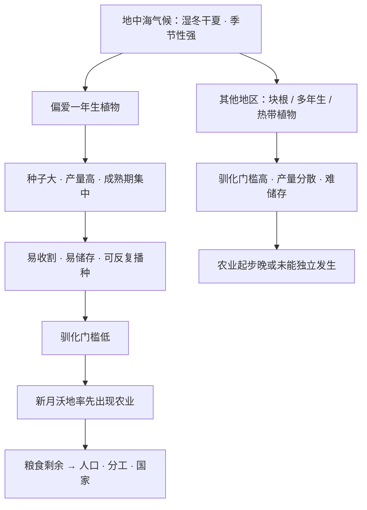

# 04｜为什么农业最早出现的地方，恰好是那几个地方？

> 农业不是在全世界的土地上同时冒出来的，它只在极少数地方独立诞生——而原因可能不在人，在植物。

---

## 一、先说结论

戴蒙德认为，一个地区能不能独立发展出农业，首先不取决于那里的人聪不聪明，而取决于**当地有没有值得驯化的野生植物**。

新月沃地（西亚一带）恰好拥有世界上最高产、最容易驯化的一批野生谷物和豆类，所以那里最早出现了农业。这不是人类选择的结果，而是运气——是「资源禀赋」的结果。

---

## 二、我们先理解一个问题

如果农业只是「人类变聪明了」「人类学会了种地」，那么它应该在世界各地差不多的时间、以差不多的方式出现。

但事实不是这样。农业只在少数几个地方独立起源，而且分布得相当集中：

- 新月沃地（西亚一带）
- 中国（黄河、长江流域）
- 中美洲
- 安第斯山区
- 后来还有北美东部、西非、新几内亚等地

更奇怪的是，有些地方植物资源看起来极其丰富——比如热带雨林——却迟迟没有发展出农业。

所以问题来了：

> **为什么农业最早出现的地方，恰好是那几个地方？是巧合，还是那里有什么特别的东西？**

---

## 三、作者到底提出了什么观点？

戴蒙德的答案是：**关键在植物本身，而不是在人。**

他认为，一个物种能不能被驯化，取决于它自身的一整套条件：生长周期多长、繁殖方式是什么、产量高不高、好不好储存、成熟后会不会自动脱落种子、是不是一年生。

而世界上「刚好满足这一整套条件」的高产作物，分布得非常不均匀。

于是出现了几个独立的农业起源中心，每个中心都有自己的「奠基作物」（founder crops）：

| 起源中心 | 代表性的奠基作物 |
|---|---|
| 新月沃地 | 小麦、大麦、豌豆、扁豆、鹰嘴豆、橄榄 |
| 中国 | 稻、粟 |
| 中美洲 | 玉米、豆类、南瓜 |
| 安第斯山区 | 马铃薯等块根作物 |

戴蒙德强调，这些中心是**各自独立**驯化出作物的，不是从别处学来的。玉米尤其说明问题：它的野生祖先驯化难度极高，中美洲人却硬生生把它培育成了主粮，这强烈说明那是本地独立发生的，而不是外来的。

---

## 四、把这个观点翻译成人话

想象一场厨艺比赛，但规则有点怪：主办方给每位选手随机发一箱食材，做什么菜全看你箱子里有什么。

- 甲选手的箱子里有面粉、鸡蛋、黄油、奶油——他随手就能做出蛋糕和面包。
- 乙选手的箱子里只有几根纤维粗糙的野菜和几块难煮的块根——他再厉害，也很难做出主食。

比赛结束后，甲做出了漂亮的主食。有人说：「看，甲厨艺就是好。」但真相是：**甲的厨艺未必更高，只是他的箱子更好。**

新月沃地就是那个「箱子特别好」的选手。

具体好在哪？地中海气候是关键。那里的冬天温和湿润，夏天炎热干旱，季节性非常强。这种气候偏爱一类植物——**一年生植物**。

一年生植物有个特点：它们会在一季之内完成生长、开花、结籽，然后把大量能量集中在种子上。这意味着：种子大、产量高、成熟期集中、容易收割，还容易储存。小麦、大麦、豌豆、扁豆，全都是这类。

相比之下，很多热带地区的主力植物是多年生的块根或树木：驯化周期长、产量分散、挖出来不好存放、繁殖也不方便。不是那里的人不努力，是「箱子」里的食材难处理。

---

## 五、为什么会这样？

把戴蒙德的推理整理成链条：

这条链的关键，全在**前三步**：气候不是直接「决定农业」，而是决定了**有一类植物更适合被驯化**，从而把某些地区的驯化门槛压得极低。

戴蒙德还特别指出，作物成为主粮，往往不是靠「单点突破」，而是靠**一整套组合**：谷物提供碳水，豆类提供蛋白质，再加纤维作物和油料作物，才能撑起一个稳定的农业体系。新月沃地的幸运之处，是它几乎一次性凑齐了这套组合。

---

## 六、举一个现实生活中的例子

想想葡萄酒产区。

世界上顶级的葡萄酒，往往出产于少数几个特定的地方——波尔多、勃艮第、托斯卡纳等。这些地方有共同点：特定的气候、特定的土壤、特定的昼夜温差和降水节奏。

现在把两个同样有天赋、同样勤奋的酿酒师，分别放到这两个地方。

- 一个在顶级产区，葡萄园天然就能结出风味浓郁的果实。他要做的，是别把事情搞砸。
- 一个在气候极端的地区，一年到头都在跟霜冻、雨水、病虫害搏斗，最后酿出的酒仍然平庸。

如果有人只看结果就说：「产区里的酿酒师更懂酒」——这显然不公平。真正决定天花板的，是他们脚下那片土地的「风土」（terroir）。

戴蒙德看农业起源，用的就是同一双眼睛。他不问「谁更勤劳」，他问「谁的土地上，长着更容易被驯化的植物」。

---

## 七、回到书中重新理解

现在再回看新月沃地，你会发现戴蒙德在那里叠了好几层幸运。

第一层，是**植物**：它拥有世界上最高产、最容易驯化的一批野生谷物和豆类。

第二层，是**气候**：地中海气候让这些一年生作物成熟期集中、产量稳定、易于储存。

第三层，是**位置**：新月沃地夹在欧亚大陆，作物和牲畜可以向东西两侧、在同一纬度带内顺畅地扩散，一地的驯化成果能迅速惠及大片地区。

这三层叠加，让新月沃地成为农业最早、最密集的起源中心之一。戴蒙德反复强调，这不是因为那里的人「更聪明」，而是因为那里的**起点条件**更优越。

---

## 八、这个观点背后还有什么？

第一，这个观点把「物种分布」当成了一种自然资源。可驯化的植物和动物，就像铁矿、良港一样，是地理位置决定的、分布极不均匀的禀赋。这和人种没有任何关系。

第二，它隐含一个更深的判断：**人类的很多「重大进步」，可能并不是主动创造的，而是在既有条件下被动获得的。** 这和第 01 篇的问题意识一脉相承。

第三，它为后一篇埋下伏笔：植物的逻辑，同样适用于动物。牛、羊、猪、马为什么都在欧亚被驯化？斑马为什么始终不行？答案和一株小麦为什么能成为主粮，本质上是同一类问题。

---

## 九、这个观点有问题吗？

戴蒙德的「植物决定论」有很强的事实支撑：植物考古的证据显示，新月沃地确实是最早的农业起源中心之一，那里的野生谷物和豆类也确实异常丰富、易于驯化。

但他把农业起源几乎完全归结为「当地有没有可驯化植物」，这个解释可能过度简化了。

一些学者认为，农业的出现还受其他因素影响：

- **气候变化的时机**：约一万多年前末次冰期结束、气候转暖，可能为农业提供了窗口。
- **人口压力**：人口增长带来的食物压力，可能迫使人们更依赖种植。
- **社会竞争**：定居、储藏和宴飨，可能让人们有动力多生产。
- **人的试错与选择**：把一切说成「运气」，可能低估了古代人类长期的观察、选择和培育。

所以关于农业为什么起源、为什么出现在那些地方，学界存在多重解释。戴蒙德提供的是其中最有名的一条，但未必是全部。

另外，独立起源中心的具体数量、年代和边界，学界至今仍有讨论，不同研究给出的图景并不完全一致。

---

## 十、今天再看这个观点

（以下为现代延伸，不是戴蒙德原文）

如果把戴蒙德的问题搬到今天，它会变成这样：

**在数字经济里，什么才是「可驯化的作物」？**

不是小麦，而可能是某种基础能力：锂矿和电池产能、先进芯片的制造能力、稳定的电力、大规模的人才池、开放的制度环境。哪个地方先凑齐了这套「组合」，哪个地方就更早长出新的产业。

而同样的规律依然成立：这些「新作物」的分布极不均匀，且一旦某地率先形成正反馈，它就会把领先优势不断放大。

戴蒙德提醒我们的那句话依然有效：**看到差距时，先别问「谁更行」，先问「谁手里有什么」。**

---

## 十一、这一篇真正应该记住什么？

1. **农业不是全球同时出现的，它只在极少数地方独立起源。** 这不是巧合。

2. **关键在植物，不在人。** 一个地区有没有可驯化的高产野生植物，决定了农业的门槛高低。

3. **新月沃地的幸运是多重的。** 高产作物、地中海气候、欧亚大陆的传播位置，层层叠加。

4. **驯化是极苛刻的筛选。** 生长周期、产量、储存、繁殖方式，缺一条都可能让驯化失败。

5. **玉米的独立驯化说明：** 起源中心是各自摸索出来的，而不是互相照搬。

---

## 十二、留一个问题

到这里，我们似乎得到了一个令人安心的结论：农业的出现在很大程度上是运气，是资源禀赋的结果。

但接下来有一个更让人不安的问题：

**如果农业带来的是文明，那为什么农民自己，可能活得比采集狩猎者更差？** 更差的营养、更重的劳役、更多的疾病——如果农业真的这么好，为什么种地的人反而更辛苦？

下一篇，我们就来拆这本书里最反直觉、也最深刻的论断：**农业的两面性。**
