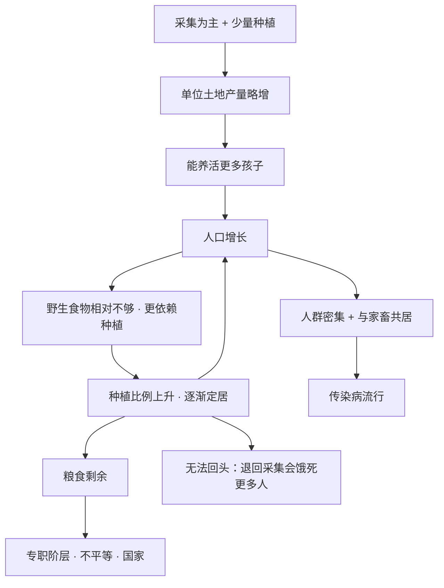

# 05｜农业到底是人类的进步，还是最大的陷阱？

> 文明建立在农业之上，但种地的人，可能活得比打猎的人更差。

---

## 一、先说结论

戴蒙德认为，农业不是人类主动「选择」的，而是采集与种植长期混合之后自然生长出来的结果。

它让人口变多、群体变强，但单个农民的生活往往更差：营养更单一、劳役更重、疾病更多、社会更不平等。**个人变差、群体变强**——这是理解农业革命最关键的一句话。

---

## 二、我们先理解一个问题

先接受一个有点反直觉的事实。

考古证据显示，早期农民的很多身体指标，反而不如他们的采集狩猎祖先：牙齿更差、身高更矮，骨骼上留下的贫血与劳损痕迹更多，传染病也更猖獗。

这就奇怪了。我们从小被教育：农业是人类最伟大的进步之一，它让人类从「野蛮」走向「文明」。可如果农业真的这么好，为什么最早种地的那批人，日子反而更难过？

问题还更深一层：

> **如果农业让个体的生活变差，那人类为什么还是走上了这条路？是一起商量好的决定，还是根本没人做过这个决定？**

---

## 三、作者到底提出了什么观点？

戴蒙德认为，农业不是一次「决策」，而是一个**长期的、几乎无意识的演化过程**。

他的逻辑可以拆成四步：

**第一，农业不是被发明的，是被「走」进去的。** 采集狩猎者本来就会采集野生谷物。渐渐地，他们在营地附近照料这些植物，撒下种子，赶走害虫。几百年、几千年之后，种植的比重越来越大，农业就出现了。没有哪个原始部落某天早上开会决定「我们要搞农业」。

**第二，人口增长会反过来强化农业。** 一旦开始种植，同样的土地能养活更多人；人多了，就更离不开种植；越依赖种植，人口又越多。这是一个自我锁定的循环。

**第三，农业养活了更多人，但每个人的生活质量未必提高。** 更多的人口被分摊到更差的食物、更重的劳动上。

**第四，农业让群体获得了力量。** 人口密集、分工细化、有剩余粮食供养士兵和官僚——这些最终变成了征服能力。

---

## 四、把这个观点翻译成人话

关键要先破除一个幻觉：**「选择」的错觉。**

我们习惯把重大历史转折想象成一次选择：站在岔路口，权衡利弊，然后决定走哪条路。但农业不是这样发生的。

更好的类比是职场里的「内卷」。

一开始，没人想每天加班。但只要有一个人开始加班，绩效标准就被抬高了；为了不掉队，第二个人也只能加班；很快，所有人都不得不加班。**每个人的选择看起来都是理性的，但合在一起，却把所有人推进了一个谁都更累的局面。**

农业的逻辑非常相似。当野生食物还够吃时，种植只是补充；当人口增长、野生食物不够了，种植就成了必须。退回去打猎？可以，但会饿死更多人。

于是，一个谁都没主动想要的结局，被一步步锁定了。

---

## 五、为什么会这样？

把戴蒙德的推理整理成链条：

这张图里最重要的是两个箭头。

第一个是 **D → E**：人口增长让野生食物变得不够，于是更依赖种植。这不是「农业让人口增长」这么简单，而是人口和农业互相推着往前走。

第二个是 **K**：**不可逆。** 一旦人口超过野生食物能承载的规模，整个社会就被锁死在了农业上。这不是因为农业更好，而是因为已经回不去了。

---

## 六、举一个现实生活中的例子

先说考古证据这条线。

有研究显示，在农业取代采集狩猎的某些地区，人群的平均身高出现了下降；农民遗骨的牙齿上，龋齿的比例显著高于采集狩猎者——原因不难理解：谷物尤其是加工后的淀粉类食物，更容易在口腔里留下糖分。此外，单一依赖少数作物还会带来营养缺乏和周期性饥荒的风险。

也就是说，**从骨骼和牙齿上，我们能直接读到「个体生活变差」的痕迹。** 这是历史记录（考古证据）显示的内容，不是推测。

再说一个现代类比：城市生活。

城市显然创造了更多财富、更多机会、更复杂的文明形态，整个人类社会的「总量」因城市而暴涨。但如果单看个体：城市人普遍睡眠更少、压力更大、慢性病更多、精神问题更突出。

没有人是「被强迫」进城的，但一旦教育、就业、医疗都集中在城市，个人就很难真正选择留下。

**总体的强大，和个体的幸福，是两回事。** 农业就是人类历史上的第一次「进城」。

---

## 七、回到书中重新理解

这里必须澄清一个重要区别，否则很容易张冠李戴。

有一个流传很广的说法——「农业是历史上最大的骗局」。这个说法主要和赫拉利在《人类简史》里的论述联系在一起。

戴蒙德在《枪炮、病菌与钢铁》里的立场，要比这句话更克制。

他确实指出：农业对个人而言常常是一笔糟糕的交易——更差的营养、更重的劳役、更多的疾病。但他并**没有**说「农业一无是处」。相反，他同时强调：正是农业，支撑起了文字、技术、国家和文明，也支撑起了后来欧亚人征服世界的能力。

换句话说，戴蒙德讲的是**两面性**：农业在个体层面是代价，在群体层面是力量。把它简单读成「戴蒙德说农业是个错误」，是对他的简化。

理解了这一点，你才会明白为什么人类明知更辛苦，还是走了下去——因为这条路通向的不是个人的舒适，而是群体的强大。

---

## 八、这个观点背后还有什么？

第一，它逼我们重新问一个根本问题：**衡量「进步」的标准到底是什么？** 是人口总量、社会复杂度、技术能力，还是个体的健康与幸福？不同的标准，会得出完全不同的结论。

第二，它揭示了一个深层规律：**群体的成功和个体的幸福，可以长期背离。** 一个社会可以在宏观上越来越强大，同时在微观上让普通人越来越疲惫。这不只发生在农业时代。

第三，它和第 08 篇（剩余粮食如何催生国家和不平等）、第 09 篇（家畜如何带来病菌）直接相连。农业不只改变了吃什么，它重新定义了人和人、人和动物的关系。

---

## 九、这个观点有问题吗？

戴蒙德这个论断，最有力的地方在于它是可以被证据检验的：骨骼、牙齿、营养状况，都能从考古遗存里读出来。这比纯粹的理论推演扎实得多。

但争议也不少。

**第一，简单说「农民更差」可能过于片面。** 一些学者指出，农业也带来了稳定性、可预期性和人口增长。采集狩猎者要面对更大的食物波动和不确定，而农业至少在好年景能提供可储存的余粮。只强调代价，容易忽略收益。

**第二，「变差」高度依赖比较的地点与时期。** 有的地区农业出现后健康状况下降明显，有的地区变化并不大，甚至没有明显恶化。笼统地说「农业让人类变差」，可能掩盖了地区差异。

**第三，存在「后见之明」的风险。** 用现代人的价值观去评判一万年前的选择，说他们掉进了「陷阱」，本身就带有立场。当时的人并不知道后面会发生什么，他们只是在当下的条件下做了反应。

**第四，也不能把采集狩猎者浪漫化。** 他们同样会面对饥荒、暴力、寄生虫和疾病，并不是什么「高贵的野蛮人」。把农业以前的世界想象成伊甸园，同样是失真。

所以更准确的说法可能是：**农业是一场巨大的交易，而不是一次单纯的进步或堕落。** 至于这笔交易划不划算，取决于你用什么尺度去衡量。

---

## 十、今天再看这个观点

（以下为现代延伸，不是戴蒙德原文）

如果农业是一个「越走越难回头」的锁定过程，那么今天，我们是否也在经历新的锁定？

一个明显的例子是**对技术的依赖**。一旦整个社会的电力、通信、金融、医疗都建立在少数几套基础设施之上，个人和社会就几乎不可能「退回去」。系统越高效，退出成本越高。这和第 05 篇讲的农业逻辑，在结构上惊人地相似：**个体理性、集体锁定、不可逆。**

另一个例子是**对增长的依赖**。现代经济一旦停止增长，债务、就业、福利就会出问题，所以增长本身变成了必须。这未必是人们主动选择的，而是被系统推着走的结果。

当然，这一切都是基于戴蒙德思想的现代延伸，不是他的原文。戴蒙德本人主要讨论的是农业起源，而不是现代社会是否也在重演同样的逻辑。

---

## 十一、这一篇真正应该记住什么？

1. **农业不是被选择的，是被走进去的。** 它是采集与种植长期混合的产物，而非一次决策。

2. **个人变差、群体变强，是农业革命的核心张力。** 它不是单纯的进步，也不是单纯的堕落。

3. **人口增长把农业锁定成不可逆。** 一旦人多了，退回采集狩猎会饿死更多人。

4. **「农业是最大骗局」主要是赫拉利的措辞。** 戴蒙德强调的是两面性，不是全盘否定。

5. **衡量进步的标准本身值得追问。** 总量、复杂度、还是个体幸福？答案不同，结论就不同。

---

## 十二、留一个问题

农业的出现，让我们从采集狩猎一步步走进了定居、剩余和不平等。但它之所以能出现，前提是当地**恰好有可以驯化的植物**。

那么一个新的问题就来了：

**为什么有些植物被驯化了，有些却到今天还是野生的？** 为什么欧亚大陆的谷物成了世界主粮，而其他大陆的很多植物，人类驯化了几千年也没成功？

下一篇，我们就来看看戴蒙德那个著名的判断：**一个物种能不能被驯化，其实是一道极其苛刻的筛选题。**
