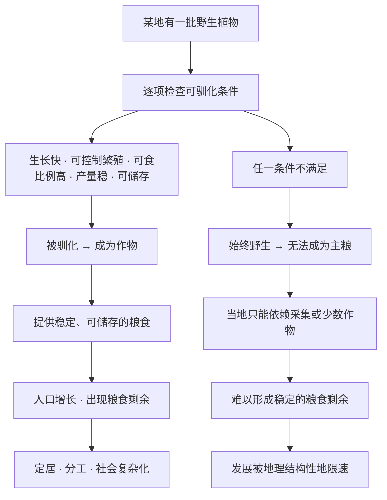

# 06｜为什么有些植物被驯化了，有些却始终没有？

> 为什么欧亚的谷物成了全世界的口粮，而其他大洲的许多植物，至今还只是荒野里的一棵树、一丛草？

---

## 一、先说结论

戴蒙德的观点是：**一个野生植物能不能被驯化，不取决于人类想不想，而取决于它自己是否具备一整套条件。**

这套条件包括：生长周期不能太长、繁殖方式要能被人类控制、可食部分占整株的比例要够高、产量要稳定、还要能长期储存。这些条件必须同时满足，缺一个，驯化就失败。

所以，新月沃地的野生谷物变成了今天的主粮，而橡树、许多块根作物和果树，几千年来始终没能被真正驯化。不是古人偷懒，也不是他们笨，而是那些植物本身「不配合」。可驯化植物的分布极不均匀，这正是农业只在少数几个地方独立起源的关键原因之一。

---

## 二、我们先理解一个问题

先来算一笔账。地球上大约有二十多万种植物，被人类长期当作食物、并且真正被驯化的，只有几百种。而支撑起今天世界人口绝大部分热量的，只来自极少数几种：小麦、水稻、玉米、土豆、大麦……

于是问题来了：**既然能吃的植物那么多，为什么人类偏偏只驯化了这么几种？**

你可能会说：因为其他的不好吃。但橡树的果实（橡子）是可以吃的，营养甚至不差；非洲有大量野生水果；很多块根植物的淀粉含量也很高。它们并不是不能吃，而是没有变成「庄稼」。

更奇怪的是，**可驯化植物的分布极不均匀**。新月沃地（今天的中东一带）拥有世界上最高产、最容易驯化的一批野生谷物和豆类；而有些地区虽然植物种类丰富，却几乎找不到一种能变成主粮的候选者。

这中间到底差了什么？这就是这一篇要解决的问题。

---

## 三、作者到底提出了什么观点？

戴蒙德认为，驯化不是人类单方面的「挑选」，而是**植物和人类互相筛选**的过程。人类当然会选择大粒、好收的植株，但更多时候，是植物的生物学特性决定了它有没有资格进入这场筛选。

他实际上是在列一张「可驯化条件清单」，一个植物要能成为作物，通常要同时满足以下几类条件：

| 条件 | 含义 | 反例 |
|---|---|---|
| 生长周期 | 从种下到收获要快，几年才回报的植物没人等得起 | 橡树结果要等很多年 |
| 繁殖方式 | 人类能控制它的繁殖，最好是自花授粉或能无性繁殖 | 高度依赖风媒、异花授粉的树种 |
| 可食比例 | 整株中有价值的部分要足够大 | 树木大部分重量在树干和叶子里 |
| 产量稳定 | 年年有收成，不能大起大落 | 橡树有大年、小年之分 |
| 可储存性 | 收获后能放很久，能积累成剩余 | 浆果、鲜果很快就腐烂 |

他在书中强调，**这些条件是「与」的关系，不是「或」的关系**。缺少任何一条，驯化都会失败——这可能就是为什么许多地区明明植物资源丰富，却始终没能独立发展出农业。

需要说明的是，「驯化」在这里是个生物学概念：人类通过一代代选育，让某种植物的形态和遗传特征发生改变，变得依赖人类、服务于人类。它和「采集」有本质区别——采集是拿走野生的，驯化是让植物为你而长。

---

## 四、把这个观点翻译成人话

你可以把驯化想象成**在家里阳台种东西**。

种小葱、生菜、小白菜很容易：撒下种子，几周就能吃，摘了还能再长。就算你完全不懂农业，也能有收成。

但如果你种一棵牛油果呢？从种子到结果，可能要等好几年，而且结出来的果子跟超市里卖的未必一样。再比如，你种一盆野生浆果灌木，它可能今年结很多、明年几乎不结，你没法指着它过日子。

如果整个社会的口粮都指望这几种「慢、飘、不好存」的植物，那么无论大家多勤劳，也攒不出稳定的粮食剩余。而没有稳定的剩余，就养不起不种地的人，也就谈不上后面那些复杂的社会结构。

反过来，小麦、水稻这类谷物就像「标准化的快消品」：一季一收，籽粒饱满，晒干后能存上好几年，还能装进仓库统一管理。**能存住的东西，才可能变成财富和权力**——这一点在第 08 篇还会展开。

所以戴蒙德的意思并不玄妙：**有些植物天生就是「适合被种」的，有些植物天生就是「不适合被种」的。** 在有现代育种技术之前，人类只能在这套生物学给定的名单里做选择。

要特别强调一点：这一篇讨论的是**驯化的难易**，不是**价值的高低**。一种植物没被驯化，不代表它没用，只代表它不符合那套「能被人类稳定管理」的条件。

---

## 五、为什么会这样？

把戴蒙德的推理整理成链条，大致是这样：

这里最关键的一点是：**植物的可驯化性，是历史展开的起点，而不是靠努力就能改变的终点。**

在没有现代育种技术的时代，人类无法「发明」一种植物变得好种。他们能做的，只是在这批植物里挑选那些天生就符合条件的。于是，一个大陆的植物名单，实际上预设了这个大陆农业的可能上限。

戴蒙德还特别提到繁殖方式，这一点很多人容易忽略：**自花授粉或能自交的植物，更容易被驯化。** 因为如果一株植物突然出现了对人类有利的变异——比如籽粒更大——自花授粉能让这个变异比较稳定地遗传下去；而异花授粉的植物，后代五花八门，好特性很快被稀释掉，人类很难把它「固定」成一个品种。

换句话说，驯化能不能成功，还取决于这个物种**有没有把「好运气」变成「稳定遗产」的能力**。

---

## 六、举一个现实生活中的例子

**橡树是戴蒙德反复提到的经典反例。**

橡子（橡树的果实）完全可以吃，很多地方的采集者都拿它当主食之一。但橡树几乎从未被驯化成主要作物，原因非常具体：

- **长得慢**：一棵橡树要好多年才进入盛产期，人类等不起。
- **产量不稳**：橡树有「大年」「小年」，收成一年好一年差，无法作为稳定口粮。
- **果实苦涩**：橡子含大量单宁，必须反复浸泡、煮泡才能去掉涩味，加工成本极高。
- **难以改良**：它世代漫长、异花授粉，人类几乎没法通过选育让它变甜、变大。

把这四条列在一起你会发现：橡树不是「不好」，而是**在每一条关键条件上都刚好不合格**。这就演示了戴蒙德所说的「缺一不可」。

与之对比，野生小麦则像一个「全能选手」：一年生、籽粒集中、成熟后容易收割、晒干就能存，而且相对容易选育出颗粒更大的品种。它被驯化，几乎是必然的。

再换一个更贴近日常的类比——**超市货架的逻辑**。能被摆上全国货架、进入千家万户的商品，往往不是最好吃的，而是**最容易标准化、最容易运输、最容易保存**的。那些特别美味但必须当天吃、放两天就坏的地方小吃，再受欢迎也走不出本地。

植物也是一样：**能被驯化的，往往不是最好吃的，而是最容易管理的。**

---

## 七、回到书中重新理解

现在再回头看戴蒙德在书中的论述，就顺了。

他其实是在反驳一个非常自然的直觉：**「哪里植物多，哪里就应该先有农业。」**

现实恰好不一定如此。有些地区植物种类极其丰富，却找不到一种同时满足「生长快、好繁殖、可食比例高、产量稳、能储存」的候选者；而新月沃地虽然物种总数未必最多，却恰好集中了小麦、大麦、豌豆、扁豆等一批「天生适合被种」的奠基作物。

所以戴蒙德说，**农业在某些地方独立起源，不是因为那里的人更聪明，而是因为那里的植物更「听话」。** 这是第 04 篇「可驯化植物分布」的进一步展开：不只是问「有没有」，更是问「合不合格」。

理解了这一层，书名里的「枪炮、病菌与钢铁」就不再像是凭空冒出来的东西——它们的地基，是一份写在植物基因里的名单。

---

## 八、这个观点背后还有什么？

这个观点至少隐含了三层东西。

**第一，时间尺度很重要。** 驯化是一个持续几千年的筛选过程，任何要求人类「耐心等待几百年」的植物，基本都会出局。戴蒙德的条件清单里，其实藏着「人类的时间偏好」这个前提：人总要吃饭，等不起。

**第二，变异来源决定改良空间。** 一个物种能不能被越种越好，取决于它有没有足够的遗传多样性可供选择。自花授粉、能无性繁殖的植物之所以容易被固定成品种，是因为它们的变异更容易被「锁住」。

**第三，这条逻辑与全书链条是连通的。** 植物能不能被驯化 → 能不能产生稳定的粮食剩余 → 能不能养活不种地的人 → 能不能出现阶层、国家、文字与技术。**植物名单上的差异，会被时间放大成文明之间的差异。**

---

## 九、这个观点有问题吗？

这个观点有说服力的一面，但也有值得商榷的地方。

**比较有说服力的是**：橡树、不少果树和块根作物的「难驯化」，确实能从生长周期、繁殖方式、产量稳定性上得到解释。这不是随口一说，而是可以逐条检验的。

**争议主要在两点。**

其一，**戴蒙德可能低估了非种子作物的驯化。** 一些研究指出，新几内亚、亚马逊等地的原住民其实驯化了不少块根、薯类和果树（如芋头、香蕉、木薯等）。用「种子作物 vs 块根作物」一刀切，可能过于简化了真实历史。

其二，**「可驯化性」未必是植物单方面的固定属性。** 有学者认为，人类的种植技术、加工方式（去毒、发酵、灌溉）本身就能改变一种植物「能不能被驯化」的难度。也就是说，条件未必是死的，人类活动也可能改写其中一部分。

关于这些问题，学界存在不同解释：戴蒙德强调「植物本身的禀赋」，另一派更强调「人与植物的共同演化」。两者未必矛盾，但侧重点确实不同。

---

## 十、今天再看这个观点

（以下为现代延伸，不是戴蒙德原文）

戴蒙德讨论的「可驯化性」，今天的对应物可能是**「可标准化性」**。

想想软件行业：为什么开源的基础软件能像小麦一样，被全世界反复复制、改进、分发？因为它「容易繁殖」——一份代码可以无限复制，修改可以精确追踪。而很多高度依赖本地经验的手艺与服务，就像野生的果树：好是好，但没法标准化，也就很难大规模扩张。

更有意思的是，**戴蒙德说的那些「硬条件」，正在被技术改写**。基因编辑、合成生物学让我们有可能去调整一种植物的生长周期、抗病性甚至口味——也就是说，人类第一次有机会主动给植物「补上」它原本缺失的条件。如果这一天真的到来，「哪里有什么可驯化植物」就不再是命定的，而会变成一项可以设计、可以选择的工程。

---

## 十一、这一篇真正应该记住什么？

1. **驯化是有门槛的，而且门槛不止一道。** 生长周期、繁殖方式、可食比例、产量、可储存性必须同时满足，缺一不可。

2. **可驯化植物的分布极不均匀。** 新月沃地恰好拥有最容易被驯化的一批作物，这是运气，不是选择。

3. **橡树是「全能不合格」的经典反例。** 慢、不稳、苦涩、难改良，让它在每一条关键条件上都不达标。

4. **繁殖方式影响改良空间。** 自花授粉的植物容易把好变异固定下来，异花授粉的植物则很难被驯化成稳定品种。

5. **植物名单决定了农业上限。** 有没有「听话」的植物，会一路影响粮食剩余、社会分工与文明走向。

---

## 十二、留一个问题

既然植物有「可驯化性」这道隐形门槛，动物是不是也一样？

为什么牛、羊、猪、马都出自欧亚，而斑马、野牛、犀牛无论人类怎么努力都驯不成？难道非洲的动物天生就「不服管」吗？

下一篇，我们就来看戴蒙德那个著名的「安娜·卡列尼娜原则」——为什么可驯化的大型动物，也是一群必须在所有条件上同时合格的「幸运儿」。
