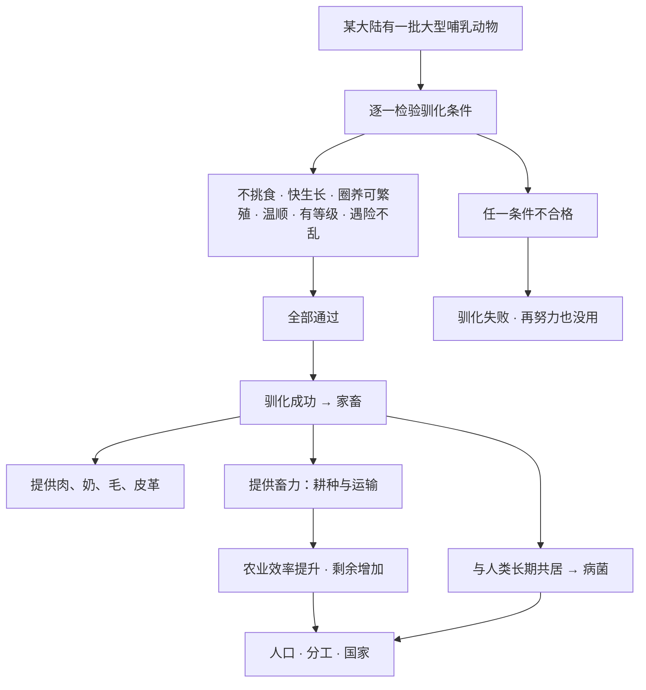

# 07｜为什么大型动物几乎都在欧亚大陆被驯化？

> 世界上有那么多大型野兽，为什么能变成家畜的只有那么几种，而且几乎都集中在欧亚？

---

## 一、先说结论

戴蒙德提出了一个著名的判断：**可驯化的大型哺乳动物，必须同时满足一长串条件——缺一不可。** 这个原则，他借托尔斯泰的话称为「安娜·卡列尼娜原则」：幸福的家庭都是相似的，不幸的家庭各有各的不幸。可驯化的动物都是一样的「合格」，不可驯化的动物则各有各的「不合格」。

条件包括：不挑食、生长速度快、能在圈养环境中繁殖、性情温顺、有等级社会结构、遇险时不会惊慌逃散。任何一条不满足，驯化就失败。

戴蒙德指出，世界上被成功驯化的大型陆生食草哺乳动物屈指可数（约 14 种，不同统计口径略有出入），其中绝大多数分布在欧亚大陆。斑马、非洲水牛、犀牛并非没人试过，而是它们在某个关键条件上「不合格」。

---

## 二、我们先理解一个问题

先看一个反直觉的事实：**在非洲，人类和大型动物共存了几十万年，却几乎没有驯化出任何一种大型哺乳动物。**

斑马成群结队地生活在草原上，论体型、论速度、论数量，都不输马。可为什么非洲人驯化了（或在欧亚被驯化的）马，却没有驯化斑马？

一个常见的解释是「非洲人不够努力」。但戴蒙德明确反对这种说法。事实上，近代欧洲殖民者曾多次认真地尝试驯化斑马，结果无一成功。问题不在人，而在斑马本身。

于是真正的问题浮现出来：

> **为什么有些动物可以被驯化，有些无论投入多少人力和时间都不行？**

而且，为什么通过这场筛选的动物，偏偏大多出现在欧亚大陆？

---

## 三、作者到底提出了什么观点？

戴蒙德的核心观点是：**驯化是一场双向筛选，动物必须「愿意」才可能成功。**

他把可驯化大型哺乳动物的条件整理成一份清单。这不是描述某一种动物，而是描述一类能在人类驯养环境下生存、繁殖、被利用的动物：

| 条件 | 含义 | 不合格的后果 |
|---|---|---|
| 不挑食 | 能接受人类提供的各种饲料 | 饲养成本过高 |
| 生长快 | 几年内能长成，回报周期短 | 投入产出不划算 |
| 能在圈养中繁殖 | 在人工环境中愿意交配、育幼 | 无法持续培育 |
| 性情温顺 | 对人类不轻易攻击 | 危险，无法管理 |
| 有等级社会 | 承认「领头者」，人可替代其位置 | 无法建立服从关系 |
| 遇险不乱 | 危险时不会惊慌奔逃 | 群体失控，无法圈养 |

他强调，这六条是**「与」的关系，不是「或」的关系**。一个动物哪怕满足了五条，只要第六条不合格，驯化依然失败。这就是「安娜·卡列尼娜原则」。

而这场严苛筛选的结果，是全世界只有一小批动物「通关」，其中绝大多数——牛、绵羊、山羊、猪、马、驴、骆驼等——都来自欧亚大陆。

---

## 四、把这个观点翻译成人话

你可以把这套条件想象成**招聘一个能长期共事的团队成员**。

你想招一个人，要求他：愿意吃公司食堂（不挑食）、上手快（生长快）、愿意长期留下来（能在圈养中繁殖）、脾气好（温顺）、能服从指挥（有等级社会）、遇到突发状况不慌（遇险不乱）。

单看每一条，好像都不难。但你要的是**同时满足全部条件**的人。于是你会发现，符合条件的人一下子少了很多——不是因为其他人「不行」，而是因为这份清单本身就很苛刻。

驯化动物也是一样。它不是「谁更强壮谁就被选中」，而是「谁能同时通过所有关卡」。**猛兽往往死在「脾气」这一关，而一些温顺的动物又可能死在「不愿在圈养中繁殖」这一关。**

再近一点的类比是**养宠物**。为什么人类养的是狗、猫，而不是狼、豹？并不是狼不强壮，而是狼在「温顺」「遇险不乱」「接受等级」这几项上不达标。狗其实是狼的一个被长期选育的分支——人类花了几千年，才把「合格的伙伴」从「不合格的野兽」里选出来。

---

## 五、为什么会这样？

戴蒙德的推理链条可以这样画出来：

这条链里最值得注意的是**「通过率极低」**这一点。

戴蒙德提醒我们：一个大陆拥有多少种大型动物，和它能驯化多少种，完全是两件事。非洲拥有世界上种类最多的大型野生哺乳动物，但真正通过筛选的却寥寥无几；欧亚大陆的动物种类未必最多，却恰好集中了牛、羊、猪、马这些「全能通关选手」。

所以驯化成功与否，不是「努力问题」，也不是「动物强不强」的问题，而是**「恰好合格」的概率问题**。而这个概率，在地理上分布得极不均匀。

---

## 六、举一个现实生活中的例子

**斑马是最有说服力的反例。**

斑马看起来完全是「非洲版的家马」：能跑、群居、食草。但戴蒙德指出，斑马在几个关键条件上集体不合格，而且每一条都足以致命：

- **咬人不松口**：斑马攻击时咬住对手就不放，造成的伤害远超一般马匹。
- **难以套缰**：它本能地闪避套索，人类很难像套马那样控制它。
- **警觉性极高**：一有危险就整体逃散，圈养管理极其困难。
- **性情不稳定**：成年斑马的攻击性和不可预测性，让它即使被抓住也难以安全驾驭。

这几条单看似乎都能「克服」，但合起来就构成了一个死结。驯化需要的是**几千年里一代代稳定繁殖和管理**，而斑马恰恰在最基础的「能被控制」这一环上就不合格。

类似地，**非洲水牛**体型堪比家牛，却以暴躁和攻击性著称，被列为非洲最危险的动物之一；**犀牛**则体型巨大、性情难测、生长缓慢。它们都不是「没被尝试过」，而是在某个环节上彻底出局。

对比之下，美洲也不是完全空白：南美洲有**羊驼和骆马**（由野生原驼驯化而来），还有**豚鼠**这样的家养动物。但戴蒙德指出，美洲可用于驯化的大型哺乳动物实在太少，而且缺少能承担耕作和运输的大型畜力——这一点，对美洲后来的发展影响深远。

---

## 七、回到书中重新理解

现在再回头看戴蒙德的论述，就能看出它为什么是全书的关键一环。

他真正想说明的是：**动物资源和植物资源一样，是「运气」，不是「能力」。**

一个社会能不能拥有家畜，直接决定了三件大事：

1. **能不能有畜力**（耕田、拉车、骑乘），这极大影响农业与运输效率；
2. **能不能有稳定的肉、奶、毛、皮革**，这影响营养与财富；
3. **能不能接触到家畜携带的病菌**，这影响免疫力的形成（第 09 篇会详细展开）。

所以，「欧亚大陆拥有更多可驯化动物」这一点，并不是一个孤立的动物学事实，而是通往「枪炮、病菌与钢铁」这条因果链上的重要一站。

戴蒙德甚至进一步指出，缺少大型家畜的社会，在运输、农业、军事上都处于结构性劣势——**不是人的问题，而是「后勤」的问题**。

---

## 八、这个观点背后还有什么？

这个观点背后，藏着一个容易被忽略的前提：**驯化是共同演化，不是单方面征服。**

我们习惯把驯化理解成「人类抓住了动物」，但戴蒙德强调，很多动物之所以能被驯化，是因为它们本身具备**可以接受人类作为「群体首领」的社会结构**。狼（→狗）、野羊、野牛都有等级群居的习性，人类只要占据「首领」的位置，进入它们的社群秩序即可。

而独居动物、没有等级结构的动物，即便温顺，也很难被「管理」——因为它们的社会里根本没有「服从」这个概念。

另一个隐含前提是：**能不能驯化，和一个大陆的「可驯化物种数量」直接相关，而这是一个概率问题。** 放到足够长的时间尺度上，物种数量多的地区，出现「全能合格者」的机会自然更大。欧亚大陆面积大、生态多样，恰好撞上了这份运气。

---

## 九、这个观点有问题吗？

这个观点很有解释力，但也一直存在争议。

**比较有说服力的是**：斑马、非洲水牛、犀牛等动物难以驯化，确实有具体的行为学依据，不是凭空断言。

**争议主要在三处。**

第一，**「没被驯化」不等于「不能被驯化」。** 有学者指出，驯化失败往往只是因为**没有反复尝试**，或者当时的技术、需求不允许，而不是动物本身绝对不行。某种意义上，狗、马也是经过极长时间、大量失败尝试才成功的。

第二，**驯化难易可能被「需求」改变。** 一种动物难驯化，但如果它带来的收益足够大，人类社会可能会投入更多资源去驯化它。换句话说，条件清单未必是完全固定、只由动物单方面决定的。

第三，**关于美洲与非洲的判断，学界存在不同解释。** 一些研究者认为，戴蒙德对某些地区「缺少可驯化动物」的结论下得过于干脆，忽略了疾病、环境变化、人口历史等其他因素。也有人认为，把家畜差异完全归因于「动物禀赋」，可能低估了社会选择与偶然性。

关于这些问题，学界并没有完全一致的答案。更稳妥的说法是：**动物禀赋是很重要的一个约束条件，但未必是唯一的解释。**

---

## 十、今天再看这个观点

（以下为现代延伸，不是戴蒙德原文）

「安娜·卡列尼娜原则」在今天有一个很贴切的对应物：**具身智能机器人为什么迟迟进不了普通家庭。**

不是因为机器人某一项能力不够强，而是因为它必须**同时**满足一长串条件：能听懂口语、能安全地在人身边移动、能操作各种形状的物体、价格可接受、能长时间续航、坏了还能修。任何一条拖后腿，产品就落不了地。

这和驯化斑马是同一种困境：**不是单点不行，而是「全都要」。** 一项技术或一个物种，只要有一条硬伤，前面所有的优点都会被抵消。

戴蒙德的框架还提示我们：**真正稀缺的从来不是「某个厉害的东西」，而是「恰好全都合格」的那个组合。** 这个洞察放到技术选型、团队组建、甚至个人的能力规划上，都依然成立。

---

## 十一、这一篇真正应该记住什么？

1. **安娜·卡列尼娜原则：可驯化动物必须同时满足一长串条件，缺一不可。** 缺任何一条，驯化都失败。

2. **驯化是双向筛选。** 不是人类单方面挑选动物，动物本身的社会结构和性情也决定了它能否被驯化。

3. **大型可驯化动物极少，且绝大多数在欧亚。** 全世界约 14 种，分布极不均匀。

4. **斑马是最有力的反例。** 咬人不松口、难套缰、遇险逃散——每一条都足以让驯化失败。

5. **家畜是通往病菌与畜力的关键一环。** 缺了它，运输、农业、军事乃至免疫力都会受限。

---

## 十二、留一个问题

植物能不能被驯化，看它的生物学条件；动物能不能被驯化，也看它的行为和性情。这些差别，最终会一路传导到农业、人口与武力。

但这里还剩下一个更根本的问题：**就算有了粮食、有了家畜，人类社会为什么不一直停在「人人平等」的小部落里？**

为什么粮食一多，就出现了国王、官僚和不平等？下一篇，我们就来看看，**剩余粮食如何一步步催生出阶层与国家**。
