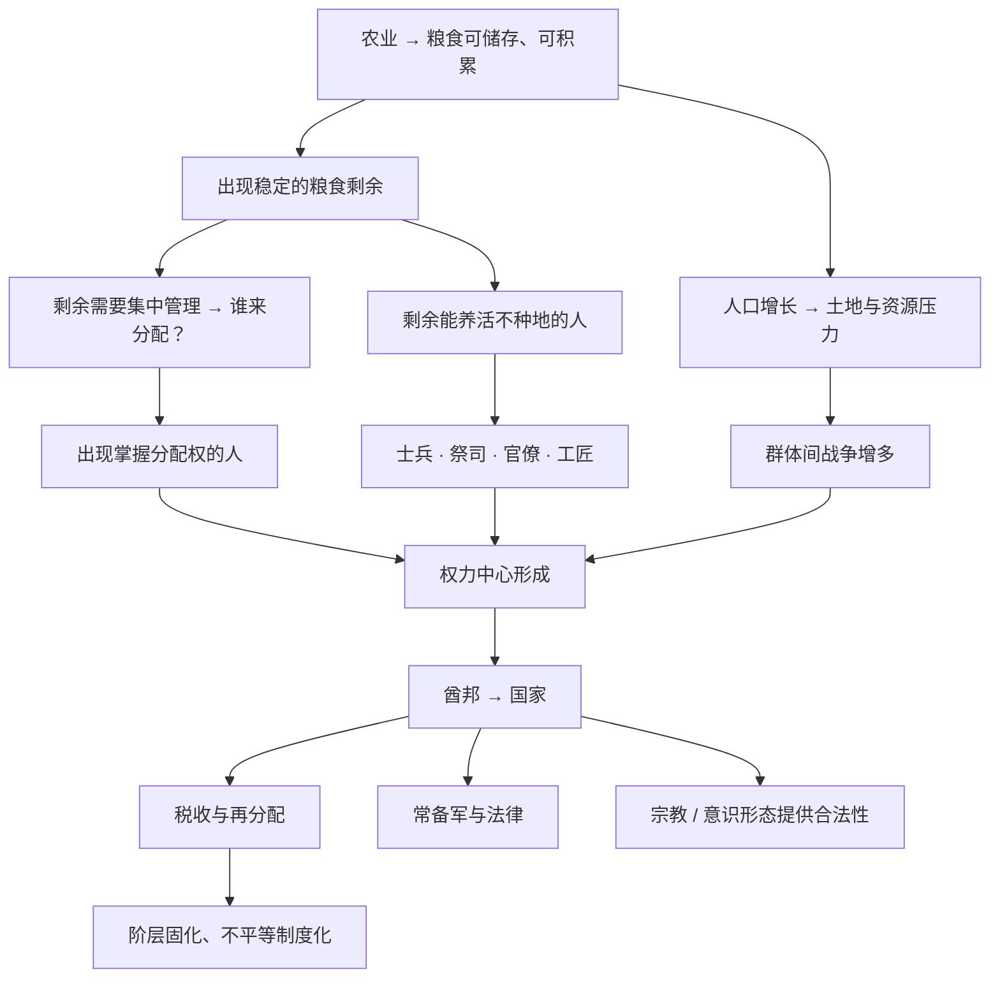

# 08｜为什么粮食剩余会催生阶层和国家？

> 从人人平等的部落，到有国王、官僚和不平等的社会，中间到底发生了什么？

---

## 一、先说结论

戴蒙德认为，只要粮食能被储存、能被重新分配，就必然出现一个问题：**谁来分配？** 掌握了分配权的人，就成了权力中心。

剩余粮食还能养活一批不种地的人——士兵、祭司、官僚、工匠。于是社会从平权走向等级：部落 → 酋邦 → 国家。戴蒙德把国家的形成称为「盗贼统治」的演变：统治者拿走一部分剩余，同时也提供秩序、法律和公共安全。

换句话说，**国家和不平等不是谁设计出来的，而是粮食剩余的一个副产品。** 它既剥削，也保护；既让人被统治，也让人获得某种安全与秩序。

---

## 二、我们先理解一个问题

采集狩猎社会有个特点：**它基本是平等的。**

原因并不浪漫——不是因为他们更高尚，而是因为**没有多少东西可以占有**。采集的果实当天就吃了，打到猎物也得尽快分掉，否则就坏了。搬家时背着全部家当也走不远。既然攒不下东西，也就没有「谁拥有得多、谁拥有得少」的问题。

但农业改变了这一切。粮食可以晒干、入库、存上几个月甚至几年。于是第一次，人类社会出现了**可以积累、可以囤藏、可以让一部分人暂时不劳动的资源**。

问题就来了：

> **当社会第一次有了「可以攒下来的东西」，为什么分配权会集中到少数人手里，而不是大家平分？**

为什么不是所有人都平等地种地、平等地分配、平等地议事？国王是怎么「长出来」的？这不是一个道德问题，而是一个结构问题。

---

## 三、作者到底提出了什么观点？

戴蒙德认为，社会从平权走向等级，走过了一条大致可以辨认的路径，可以粗略对应三个阶段：

| 阶段 | 规模 | 结构特征 | 权力形态 |
|---|---|---|---|
| 部落 / 游群 | 几十人 | 血缘关系、人人平等、无正式领袖 | 无强制权力，靠共识 |
| 酋邦 | 数百到数千人 | 出现世袭首领、初步的再分配 | 首领掌握剩余分配 |
| 国家 | 数万人以上 | 官僚、税收、常备军、宗教合法性 | 强制权力 + 意识形态 |

他强调驱动这条演化路径的，主要是三个压力：

- **人口压力**：人越来越多，靠采集和简单种植已经不够，必须更高效地组织生产。
- **战争压力**：群体之间争夺土地和资源，需要更大规模的动员和组织。
- **剩余分配**：粮食要集中、储存、再分配，就需要有人来「管」。

而戴蒙德最尖锐的一个说法是：他把国家称为**「盗贼统治」（kleptocracy）的演变**。

意思是：统治者在本质上像「盗贼」——他们拿走你生产的一部分（税收、贡赋）。但和纯粹的盗贼不同的是，他们也提供了盗贼不会提供的东西：法律、道路、治安、抵御外敌、赈济灾荒。**你被拿走了剩余，但你换来了一个更大的、更有组织的秩序。**

---

## 四、把这个观点翻译成人话

想想你住的小区。

一开始，几户人家挨着盖房，谁都不管谁，倒也自在。但人一多，问题就来了：垃圾谁来清？路灯坏了谁修？小偷来了怎么办？

于是大家商量：每家每月交一笔**物业费**，凑出一个公共资金池，然后请保安、保洁、维修工。从此，小区有了秩序，也有了「管事的人」。

但请注意两件事：

第一，**收钱的物业，本身不种地、不生产**——它靠的就是大家交上去的那部分。这就像国家里的官僚和军队，靠的是粮食剩余。

第二，**一旦有人管钱、管人、管规则，权力就产生了**。物业可以决定钱怎么花、规则怎么定。业主们虽然交的是自己的钱，却开始需要「服从管理」。

这就是戴蒙德说的那层意思：**剩余一旦被集中管理，就必然产生「管的人」和「被管的人」。** 一个平权的、没有公共资金的群体，反而更难形成权力中心；一旦有了公共资源，权力就有了落脚点。

「盗贼统治」的双面性也在这里：物业确实「抽走」了你的钱，但如果没有物业，小区可能又脏又乱又危险。**它既在剥削，也在提供秩序。** 戴蒙德说的就是这个张力。

---

## 五、为什么会这样？

把戴蒙德和后续研究的思路整理成链条，大致是这样：

这条链里有两个关键转折点。

**第一个转折是「剩余」到「权力」的转化。** 粮食本身不是权力，但「决定粮食怎么分」是权力。谁掌握仓库的钥匙，谁就掌握了别人的生计。

**第二个转折是「暴力」到「合法性」的转化。** 光靠武力统治成本太高，所以国家还需要一套说法，让被统治者觉得「这样是应该的」。宗教、血统、神圣王权，都承担过这个功能——这也是为什么戴蒙德把意识形态看作国家机器的一部分。

需要说明的是：这里的「部落 → 酋邦 → 国家」是戴蒙德用来描述一条**粗略的演化序列**，并不是说每个社会都必须一模一样地走完这三步。现实中，不同地区的形态要复杂得多。

---

## 六、举一个现实生活中的例子

回到小区物业这个类比，把它的两面看清楚。

一个几百户的小区，每月物业费可能是一笔不小的公共资金。这笔钱养活了保安、保洁、维修工、物业管理人员——**他们全都不直接「生产」粮食或商品，而是靠大家交的钱生活。** 这和国家用税收养活公务员、军人、教师，结构上是一样的。

同时，物业既做了好事，也做了「坏事」：

- 好事：装了监控、修了电梯、清了垃圾、赶走了小偷。
- 「坏事」：涨物业费、定各种规矩、业主大会开得不清不楚。

业主们常有个矛盾心态：一边嫌物业费贵、嫌物业霸道，一边又离不开它——真撤了物业，小区往往很快陷入混乱。

戴蒙德说的「盗贼统治」正是这种矛盾：**你很难只要它的保护、不要它的抽取；你很难只要秩序、不要权力。** 国家把这两样东西捆在一起卖给你。

顺手再看一个更小的例子：一个班级收班费。钱不多，但一旦有了公共经费，就出现了「谁管钱、谁决定怎么花」的问题。管钱的同学，哪怕只是买几箱矿泉水，也获得了一点别人没有的话语权。**这就是最小规模的「剩余 → 权力」。** 规模变大，就是酋邦和国家。

---

## 七、回到书中重新理解

现在再回头看戴蒙德的论述，就清楚了。

他其实是在回答一个很反直觉的问题：**为什么「不平等」不是偶然的坏运气，而是农业社会的一种「结构性必然」？**

答案藏在两个词里：**可储存** 和 **可再分配**。

- 采集社会没有多少可储存的剩余，所以权力无处扎根；
- 农业社会有了可储存的剩余，于是「集中—分配」成为可能；
- 而一旦「集中—分配」成为常态，专门的管理者、武力、意识形态就会跟着长出来。

所以国家和阶层，并不是某个人「发明」出来的，而是**剩余粮食在人口压力与战争压力下，被反复组织的结果**。

戴蒙德特别反对一种浪漫化的想象：原始部落更「纯真」、更「自由」，国家是文明堕落的产物。他的看法更冷静——**大型社会要运转，就必须有更强的组织能力，而这种组织能力往往伴随着强制。** 这不是歌颂，也不是批判，而是一种结构分析。

---

## 八、这个观点背后还有什么？

这个观点背后，至少还有三层东西。

**第一，权力需要「合法性」才稳定。** 纯靠武力的统治成本极高，所以国家几乎总会发展出一套叙事：君权神授、血统高贵、天命所归。戴蒙德把它看作国家机器的必要组成部分，而不是可有可无的装饰。

**第二，分工是双刃剑。** 剩余养活了不种地的人，让技术、文字、艺术、科学成为可能；但同样的机制也固化了阶层——有人世代种地，有人世代掌权。

**第三，这条逻辑直接连通后面的内容。** 只有出现了能调动大量人力物力的国家，才可能有常备军、有工程、有远征。**国家是把「粮食剩余」转换成「组织能力」的关键装置**——后面讲病菌、文字、技术与征服，都离不开它。

---

## 九、这个观点有问题吗？

这个框架很有解释力，但也有几处明显的争议。

**第一，剩余并不必然导致不平等。** 有学者指出，一些拥有稳定剩余的社会，依然保持了相当程度的平等与分享机制（例如部分太平洋岛屿或北美西北海岸的社群）。这说明「剩余 → 等级」不是一条自动生效的物理定律，中间还有制度、文化和选择的变量。

**第二，「部落 → 酋邦 → 国家」这条线是否普遍适用，学界存在不同看法。** 它更像一种分类框架，而不是每个社会都必须经历的固定剧本。现实中很多社会的演化路径是跳跃的、混合的、甚至是倒退的。

**第三，「盗贼统治」这个说法可能把国家过度简化了。** 一些研究者更愿意强调国家的公共品功能：它是暴力垄断者，但也是和平与合作的提供者。把国家主要描述为「盗贼」，容易忽略它确实解决了大量「没有国家时无法解决」的问题。

不过，无论怎么批评，戴蒙德至少提出了一个值得记住的问题：**不平等的根源，可能就在「谁能决定如何分配」这件小事上。**

---

## 十、今天再看这个观点

（以下为现代延伸，不是戴蒙德原文）

「剩余 → 分配权 → 权力」这条逻辑，在今天的平台经济里清晰可见。

一个电商平台或应用商店，本身不生产商品，也不写大部分应用。它做的事情，很像戴蒙德笔下的国家：**从每一笔交易里抽成（税收），同时提供一整套基础设施（支付、物流、流量、规则、纠纷仲裁）。** 商家一边抱怨抽成高，一边又离不开这个平台，因为离开它，就失去了流量和秩序。

这就是现代版的「盗贼统治」张力：**平台既抽取你，也保护你；既限制你，也可能成就你。**

换个更贴近个人的例子：你在一个公司工作，公司拿走你劳动成果的一部分，同时给你工资、社保、平台和团队。你很难「只要自由、不要组织」。**只要资源需要被集中配置，就一定会有人掌握配置权。** 戴蒙德的洞察在于：这不是道德问题，而是规模问题——人一多，组织就必然伴随权力。

---

## 十一、这一篇真正应该记住什么？

1. **粮食剩余是不平等的起点。** 采集社会没多少可占有的东西，所以平等；农业让「可储存、可分配」成为可能。

2. **谁掌握分配权，谁就有权力。** 剩余本身不是权力，「决定剩余怎么分」才是。

3. **剩余养活了不种地的人。** 士兵、祭司、官僚、工匠的出现，让社会分工和阶层同时诞生。

4. **部落 → 酋邦 → 国家，是一条粗略的组织演化线。** 驱动它的是人口压力、战争压力与剩余分配的需要。

5. **「盗贼统治」的双面性：国家既剥削，也提供秩序。** 你很难只要保护、不要抽取。

---

## 十二、留一个问题

粮食剩余带来了国家、分工和技术，也让权力集中到了少数人手里。但农业和家畜还带来了一个更隐蔽、也更致命的东西。

它不靠刀剑，不需要士兵，却能在一场征服中杀死远远多于战场的人。

下一篇，我们就来回答全书最令人不安的一个问题：**为什么是病菌，而不是枪炮，杀死了最多的人？**
