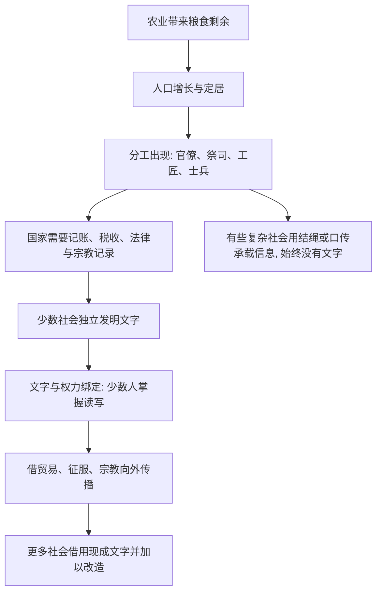

# 10｜为什么文字只出现在少数几个社会？

> 一个我们每天都在用、却极少追问的能力：文字，究竟是文明的必然产物，还是少数地方的偶然发明？

---

## 一、先说结论

戴蒙德想说的其实是：**文字不是每个社会发展到某个阶段就一定会「长」出来的东西。**

他认为，真正独立发明文字的地方屈指可数，一般认为只有苏美尔、古埃及、中国、中美洲等少数几处；但文字一旦在某个地方出现，就会被其他社会借走、改造、再传播。所以绝大多数文字系统，都是传播的结果，而不是重复发明的结果。

他更关键的一个判断是：**「需要」不会自动创造文字，社会复杂度才是关键条件。** 有需要的社会很多，能发明文字的社会很少——因为文字的出现，靠的是国家、祭司、书吏这类专职阶层，而不是某个聪明人的灵光一现。

---

## 二、我们先理解一个问题

我们从小就会写字，于是很容易觉得：文字是人类智慧的必然结果——只要有语言，迟早会有文字。

但把时间拉长，这个印象就站不住了。

人类说话的历史可能长达数万年，而文字只有短短几千年。今天世界上几千种语言里，绝大多数从来没有独立发展出自己的文字系统；很多民族第一次接触文字，是通过传教士、商人或征服者。

于是问题来了：**如果文字这么有用，为什么绝大多数社会没有自己发明它？**

反过来还有一个更奇怪的现象：有些社会明明有了庞大的国家、复杂的税收和密集的人口，却始终没有文字；而有些社会几乎原封不动地把别人的文字整套搬了过来。

这说明，文字的出现和传播，遵循的并不是「谁更需要谁就发明」的逻辑。

---

## 三、作者到底提出了什么观点？

戴蒙德把文字当作一种技术来看待，而且是一种很特殊的技术：**它几乎不需要被反复发明，只需要被借用。**

他的观点大致有三层。

第一，**独立起源的地方极少。** 一般认为，苏美尔人的楔形文字、古埃及的圣书体、中国的汉字、中美洲的玛雅文字，是在少数几个地区分别形成的。世界上其他地方的文字，大多是从这些起源地或其衍生系统传播过去的。

第二，**文字一诞生，就与国家和权力绑在一起。** 历史记录显示，早期文字大量用于记账、税收、库存清点、法律和宗教仪式，而不是我们今天理解的文学创作。换句话说，最早的「写作」，更像今天的财务和行政管理。

第三，**需求不等于发明。** 戴蒙德特别强调，一个社会再需要记录信息，也不会自动出现文字。真正起作用的，是社会是否复杂到需要一批专职人员来管理，以及它有没有机会接触到现成的「蓝本」。

他把那种可以照着模仿的现成样品称为文字的「蓝本」——就像抄作业总得先有一份别人的作业。

---

## 四、把这个观点翻译成人话

你所在的公司是怎么管报销的？

几乎不会有人要求每个部门都从零发明一套报销制度。真实情况是：财务部先做出一张表格，规定好发票怎么贴、金额怎么填、谁签字；然后这套模板被全公司借用，甚至被其他公司抄走。

第一次做的人最费劲，后来的人几乎零成本。

文字的传播，和这张报销表格的逻辑非常像。**人类不是每家都重新发明一次文字，而是一旦有人发明，别人就开始抄。** 抄的时候还会顺手改造：简化笔画、换一套符号、只取其中一部分。

所以，文字的稀缺不在于「人类不够聪明」，而在于**「第一个」极其偶然，「之后的」极其便宜。**

---

## 五、为什么会这样？

把戴蒙德的逻辑整理一下，是这样一条链：

这条链里，最容易忽略的是 **I**：结绳记事和口传记忆也能管理庞大的帝国。历史记录显示，印加帝国在没有文字的情况下，依然统治着广阔领土。这说明「需要记录」并不足以逼出文字。

而 **G** 才是文字之所以遍布世界的真正原因：它是被带过去的，不是被重新想出来的。

---

## 六、举一个现实生活中的例子

想想超市里的小票。

我们通常觉得小票是商业的附属品，但历史记录显示，人类最早的文字里，很大一部分内容就是账目、收据、库存清单和纳税记录。**文字的起点，更接近一张记账单，而不是一首诗。**

再看职场里的另一件事：公司推行一个新的管理工具或报表模板。最先做出来的人要反复试错；一旦定型，它就通过邮件、会议、跳槽的员工，传播到越来越多团队，甚至进入别的公司。

没有人会为了「我们这个部门也需要管理」而重新发明一套系统；大家做的，是找一份现成的模板，改一改就用。

文字的传播，就是这么发生的。**稀缺的从来不是需求，而是那个被抄的蓝本。**

---

## 七、回到书中重新理解

现在再回看戴蒙德的观点，就会明白他真正想反驳的是什么。

我们直觉上相信：**越需要，越会发明。** 但文字恰好是个反例——需要的强度，和是否发明，几乎没有对应关系。印加需要记录，却没发明文字；很多接触过文字的社会，直接把别人的整套系统搬了过来。

所以文字的关键变量不是「欲望」，而是两个条件：

- 社会是否复杂到需要一批专职的记录者和管理者；
- 它有没有机会接触到一个现成的文字蓝本。

这也解释了为什么文字总是跟着国家、宗教和贸易走——它们才是文字真正的传播渠道。

---

## 八、这个观点背后还有什么？

第一层隐含前提：戴蒙德把文字当作**技术**，因此它服从技术的一般规律——发明难、传播易。真正稀缺的是「第一次」。

第二层：文字从来不是中立工具，它天生与权力绑定。能读会写的，长期是少数精英；文字记录什么、忽略什么，本身就带着权力的选择。

第三层：这与前面几篇构成同一个逻辑。病菌、文字、技术、国家，都是农业社会复杂度的产物——它们不是各自独立出现的奇迹，而是同一条因果链上的不同侧面。

所以文字的故事，其实是「发明与传播」两个过程的对比：**发明是偶然，传播才是常态。**

---

## 九、这个观点有问题吗？

有几个地方值得保留态度。

第一，**「独立起源只有几处」是一个判断，而不是铁板钉钉的事实。** 例如中美洲文字与更早的符号系统之间是什么关系，学界存在不同解释；判断一套符号算不算「完整文字」，标准本身也有争议。

第二，**把文字解释为国家管理的工具，可能过度功能主义。** 历史记录显示，很多早期文字刻在神庙、墓葬和祭祀器物上。一些学者认为，文字的最初动力可能来自宗教仪式、权力展示和身份认同，而不只是经济记账。

第三，**「需要不产生文字」这个说法，容易隐含一种对无文字社会的轻视。** 结绳、口传、专门的记忆者，同样能管理庞大社会。文字不是「高级文明」的唯一标志。

第四，**接触了文字并不等于会接受文字。** 历史上不少社会见过文字，却没有采用。所以真正起作用的，是接触、社会结构与具体历史处境的组合，而不是单一条件。

戴蒙德提供的是一个有力的框架，但它解释的是「为什么文字分布如此不均」，而不是「每个社会为什么一定这样」。

---

## 十、今天再看这个观点

（以下为现代延伸，不是戴蒙德原文）

戴蒙德关于文字的讨论，在今天有了新的版本。

如果文字是一种「记录与编码」的技术，那么编程语言、数据格式、乃至各种标记语言，就是当代的「新文字」。它们同样是少数被发明、多数被借用的东西——你不会为了写一个网页而发明一门语言，你会直接用现成的。

同时，文字本身也在被稀释。语音消息、短视频、表情符号在替代一部分书写，AI 让「生成文字」的成本迅速趋近于零。于是新的问题变成了：当写不再是门槛，**「读什么、信什么、判断什么」会不会成为新的稀缺能力？**

戴蒙德的逻辑在这里依然有效：稀缺的从来不是需求，而是那个被广泛采用的蓝本，以及掌握它的少数人。

---

## 十一、这一篇真正应该记住什么？

1. **文字是少数地方独立发明、多数地方借用的技术。** 一般认为，苏美尔、古埃及、中国和中美洲等是少数独立起源地。

2. **「需要」不会自动创造文字。** 有需求的社会很多，能发明文字的社会极少，社会复杂度与专职阶层才是条件。

3. **文字最早服务于记账、税收和宗教，而不是文学。** 它天生与国家和权力绑定，由少数人掌握。

4. **传播才是文字遍布世界的真正原因。** 贸易、征服和宗教，把现成的文字蓝本带到更广阔的地区。

5. **理解文字，关键是看清「发明难、传播易」这条规律。** 真正稀缺的是第一次，而不是之后的一千次复制。

---

## 十二、留一个问题

文字被借走之后，改写了整个世界的权力格局。

但文字毕竟只是「记录」的发明。如果连文字都不是被需要逼出来的，那我们从小听到大的那句「需要是发明之母」，会不会也说反了？

为什么有些技术发明出来几十年都没人用，有些明明有用的技术却被整个社会放弃？

下一篇，我们来看戴蒙德最反直觉的一个论断：**技术是「发明之母」，而不是「需要之母」。**
